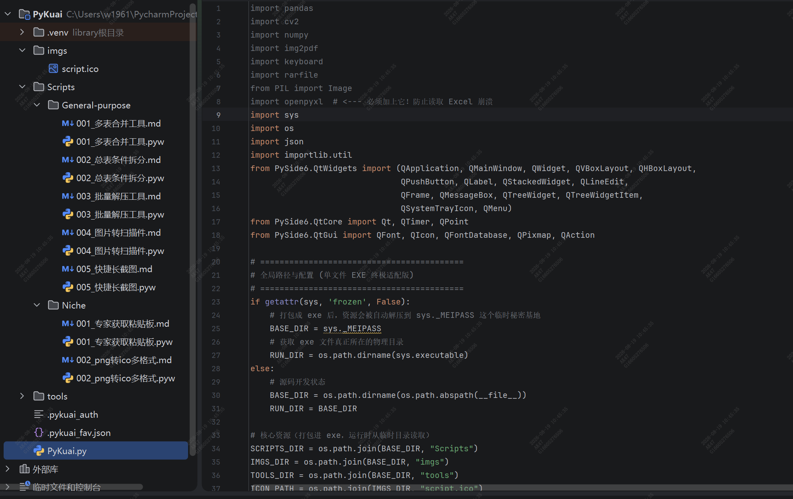
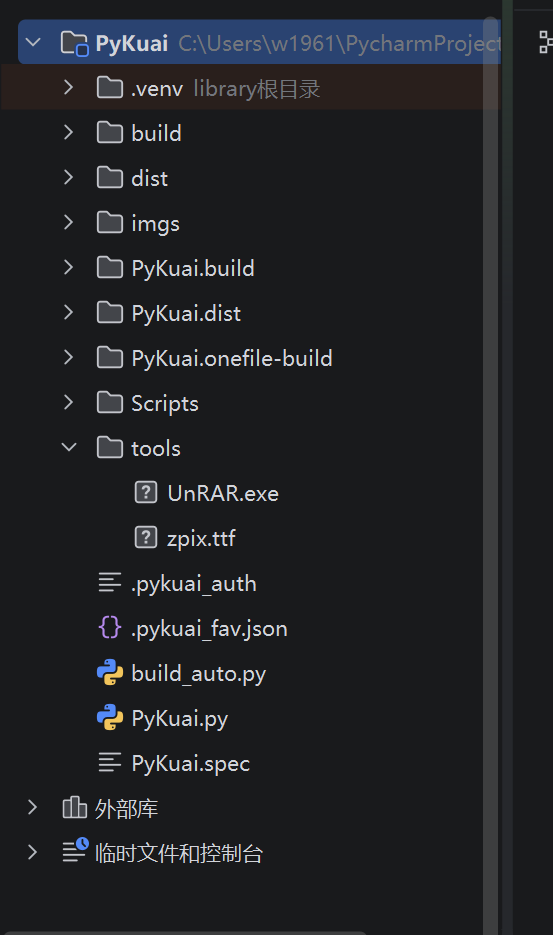

# PySide6基础打包缺少依赖怎么办

## 一、打包方式有哪些？

我在PySide6里创作我的PyKuai时候遇到一个问题，这是一个很简单的脚本启动器，就是一个框子，里面去读取脚本文件夹里的脚本，且保存一个json到电脑里，保存您的收藏。

那么Pyside6打包有很多种：
***方案一：PyInstaller（最简单快捷，新手首选）***
***方案二：Nuitka（进阶推荐，体积小、运行快、防反编译）***
***附带一个“小白神器”：Auto-py-to-exe***

我这里介绍方案一，最简单的方法，先安装一下依赖。
```cmd
pip install pyinstaller
```

这是针对我的简单的PyKuai文件目录的打包方式。



```cmd
pyinstaller -F -w -i "imgs/script.ico" --add-data "Scripts;Scripts" --add-data "tools;tools" --add-data "imgs;imgs" PyKuai.py
```

### ⚙️ 参数原理解析：

- **`-F` (或 `--onefile`)**：**单文件模式**。将所有依赖库、环境和主程序死死压缩成一个独立纯净的 `.exe` 可执行文件，方便你在任何电脑上直接运行。
    
      
    
- **`-w` (或 `--windowed`)**：**无控制台模式**。隐藏背后那个黑乎乎的命令行窗口，让它看起来是一个纯粹的现代 GUI 桌面软件。
    
      
    
- **`-i "imgs/script.ico"`**：**图标注入**。给生成的 `.exe` 披上你专属的极客外衣。
    
      
    
- **`--add-data "源路径;目标路径"`**：**资源挂载**。这一步极其关键，它会把你的外部子脚本（`Scripts`）、外部二进制工具（`tools` 里的 `UnRAR.exe`）以及图片资源（`imgs`）全部强制打包塞进最后的 `.exe` 肚子里。
    
      
    

### ⚠️ 打包前最后确认清单：

1. **环境准备**：确保你当前运行这条命令的 Python 环境里，已经安装了 `pyinstaller`，以及程序需要的所有底层库（比如 `pandas`, `PySide6`, `opencv-python`, `img2pdf`, `rarfile`, `Pillow`，特别是之前漏掉的 **`openpyxl`**）。
    
      
    
2. **强制导包**：确保在 `PyKuai.py` 的最顶部，已经写好了针对这些外部库的占位 `import` 语句，防止 PyInstaller 漏抓动态依赖。
    
      
    
3. **输出位置**：打包完成后，去根目录新生成的 **`dist`** 文件夹里找，你的最终完全体软件就躺在里面。


## 二、我之前遇到的问题

那么这里我主要还是讲怎么打包，和配置依赖时遇到的问题，曾今我使用的是不在主类里写全import比如v1.2.0版本之前，我打包是这样做的（👇这是一个随便的案例）直接在终端所在文件夹输入

```cmd
pyinstaller -F -w -i "imgs/script.ico" --add-data "Scripts;Scripts" --add-data "tools;tools" --add-data "imgs;imgs" --hidden-import pandas --hidden-import cv2 --hidden-import numpy --hidden-import img2pdf --hidden-import keyboard --hidden-import rarfile --hidden-import PIL --hidden-import openpyxl PyKuai.py
```

但是我在此遇到的问题特别多，就是我明明写入了依赖但就是缺少。后来了解到还得需要新增饱和式打包，像极了jlink打包缺少后选择全盘jre的我。在这里您可以新增一个打包脚本，来避免重复造轮子，以后直接用python脚本直接打包就行了，这就很好玩了，我将来就要在这里做到用python编译完后的文件，来编译python源代码，这就是python强大的地方之一吧。

我极其推荐将import注入到主类里面，这有助于统一的资源调度，也不至于出错，至少现在没有。

## 三、重复删除打包后生成的文件

强迫症和好的习惯。值得一说的是，我明显感觉到python不如java稳定，因为他本身就是一个脚本语言互相调用，各种依赖和各种版本之间的不兼容，以及python版本的不断更新，这期间的震荡是很频繁的，甚至语法都可能变换，且打包的时候会生成很多垃圾文件夹，下面是清理方式，这里就要涉及到动态语言和静态语言的优劣势，我不是偏袒于java。life is short，i choose python.也莫非不可。下面是各种编译后莫名其妙生成的文件夹：



打包工具在工作时会产生大量的临时缓存文件。你可以放心大胆地清理它们。
以下是你**可以全部删除**的编译生成文件：

  

### 🗑️ 放心删除（全都是打包产生的临时垃圾）

1. **`build` 文件夹**：PyInstaller 打包时产生的临时工作缓存，打完包就没用了，直接删。
    
      
    
2. **`PyKuai.spec` 文件**：PyInstaller 自动生成的配置清单，直接删（下次打包它会自动重新生成）。
    
      
    
3. **`PyKuai.build` 文件夹**：之前用 Nuitka 打包时留下的临时缓存，删！
    
      
    
4. **`PyKuai.dist` 文件夹**：之前用 Nuitka 目录模式打包输出的文件夹，删！
    
      
    
5. **`PyKuai.onefile-build` 文件夹**：之前用 Nuitka 单文件模式留下的缓存，删！
    
      
    

### 📦 关于最终的 `.exe` 成品（注意提取）

在截图中，我有看到两个与成品有关的地方：

  

- **`dist` 文件夹**：这是 PyInstaller 默认存放最终生成的 `.exe` 的地方。**你可以把里面的 `PyKuai.exe` 剪切出来放到桌面或者你想放的地方，然后把空掉的 `dist` 文件夹也删掉。**
    
      
    
- **根目录下的 `PyKuai.exe`**：如果你已经把生成的成品拿出来了，那就是这个文件，这是你最终要保留的软件实体。
    
      
    

### 🛡️ 绝对不能碰的代码与资源（你的核心资产）

为了防误删，最后再确认一下，下面这些是你的**核心源码和环境，千万别删**：

  

- `.venv`（虚拟环境目录）
    
      
    
- `Scripts`、`imgs`、`tools`（你辛辛苦苦写的卡带脚本和资源）
    
      
    
- `PyKuai.py`、`build_auto.py`（主程序源码）
    
      
    
- `.pykuai_auth`、`.pykuai_fav.json`（你软件生成的配置和收藏夹数据）
    
      
    

**总结行动：**

框选 `build`、`PyKuai.build`、`PyKuai.dist`、`PyKuai.onefile-build`、`PyKuai.spec`，直接按下 `Shift + Delete` 彻底粉碎它们。拿走属于你的 `.exe`，你的世界就清静了！