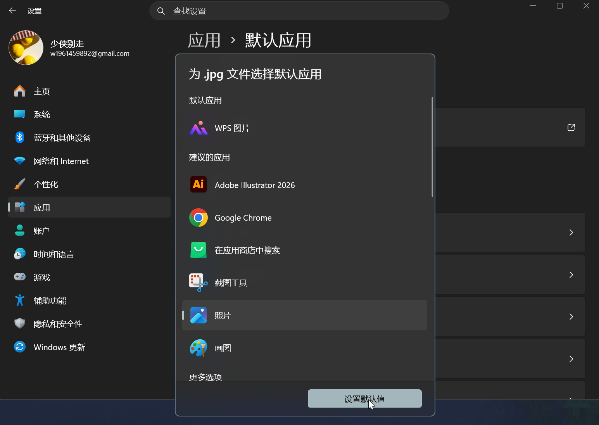
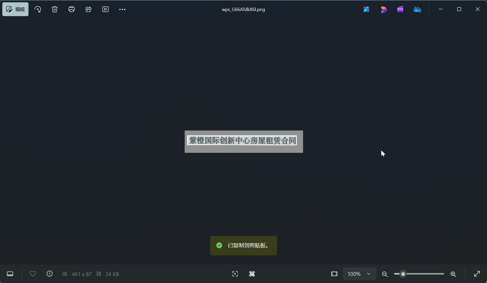

# WPS图片扫描文本要充vip有什么好的替代？

wps安装时会将图片的打开绑定为wps图片，然后在你选中文字的时候，就会弹出恶心的
vip充值界面，那么其实微软本身是具有扫描文字复制的免费功能的，下面将介绍步骤：

## 一、设置默认

常见的图片格式为：
- JPG / JPEG
    
      
    
- PNG
    
      
    
- GIF
    
      
    
- WebP
    
      
    
- SVG
    
      
    
- BMP

在设置中先选择后缀然后设置图片为默认值。

中下右边有一个扫描文本的按钮，点击他就可以复制粘贴啦。

wps有其很多优点，全面的功能，好用的多文件一窗口功能，甚至很多超越了老大哥office，但是他的缺点也很明显，过渡的广告，臃肿的启动，强制付费都让人爱不起来。
我想技术需要分享，我们不应该以垄断封闭来维持自己，而是不断地分享不断地进步，不断创新出顶尖的技术来推动技术的发展。