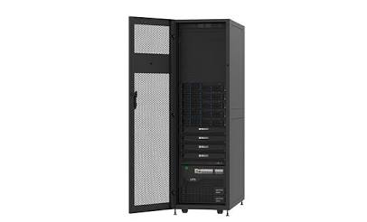

# 什么是服务器？服务器就是一台电脑吗？

## 什么是服务器？

简单来说，服务器（Server）就是一台**专门为你或其他程序提供“服务”的高性能电脑**。

  

它和你平时用来写代码或打游戏的电脑（比如外星人或带 RTX 4060 显卡的笔记本）在基本原理上是一样的，都有 CPU、内存、硬盘和主板。但服务器的使命不同，它是为了**7×24小时不间断运行**、处理海量网络请求、保障数据安全而设计的。

  

在计算机世界里，当我们谈论“服务器”时，通常指代两个层面的意思：

  

### 1. 硬件层面的服务器（实体机器）

这就是放在大型数据中心（机房）里的铁盒子。它们通常没有屏幕、没有鼠标键盘，长得像一个个扁平的抽屉（机架式服务器），或者是一个个刀片。开发者通常是通过 SSH 协议，远程连接到上面的 Linux（比如 Ubuntu）系统来进行敲代码和部署。

  

### 2. 软件层面的服务器（运行的程序）

在开发中，“服务器”经常指代那些**在后台默默运行并等待请求的软件**。比如：

  

- **Web 服务器**：一个跑起来的 Spring Boot 项目或 Node.js 服务。
    
      
    
- **数据库服务器**：一个一直在运行的 MySQL 或 Redis 实例，等待着被查询。
    
      
    
- **文件服务器**：专门用来存储和提供图片、PDF、Excel 等文件下载的服务。
    
      
    

## 它是怎么工作的？

服务器的核心工作逻辑是经典的“客户端-服务器”（Client-Server）模型。

  

你可以把这个过程想象成去餐厅吃饭：

  

1. **客户端（顾客 / Client）**：发起请求的一方。它可以是你用 Java Swing 写的桌面端工具、手机上的 App，或是电脑上的浏览器。客户端负责向服务器“点单”（发送网络请求）。
    
      
    
2. **服务器（后厨 / Server）**：接收请求并处理的一方。当请求到达时，后端的代码逻辑开始运转——比如进行数据比对、查询数据库、生成 PDF 报表等，最后把处理好的结果（数据或文件）像“上菜”一样返回给客户端。
    
      
    

你可以通过下面这个交互式图谱，放大探索数据是如何在客户端和服务器之间流转的：

  

简而言之，**客户端负责“展现和交互”，服务器负责“计算和存储”**。如果没有服务器，我们手机里的各种 App、玩的多人在线游戏、以及每天访问的网站，都会因为失去数据源而变成毫无用处的空壳。

## 服务器就是一台电脑吗？

**在底层逻辑上是完全正确的！**

本质上，所谓的“服务器（Server）”，不过就是一台**连着网、24小时开机、运行着特定程序用来响应别人请求（Serve）的电脑**罢了。你平时用的台式机、笔记本，只要装上相应的软件（比如 Tomcat、Nginx），再插上一根网线，它就是一台服务器。

但是，一台家里的电脑和真正的“云端服务器”之间，隔着几个现实世界的技术鸿沟。这就引出了你问的第二个问题：**这和域名有什么关系？**

我们可以把整个网络世界想象成一座巨大的城市，来拆解这两者的关系：

### 1. 你的电脑（服务器） = 一栋房子

如果你的电脑是服务器，那么它在网络世界里必须有一个确切的坐标，别人才能找上门。这个坐标就是 **IP 地址**（比如 192.168.x.x 或 114.55.x.x）。

* **云端服务器的优势：** 阿里云、腾讯云卖给你的服务器，拥有一个**固定不变的公网 IP**（就像是买了一套拥有独立门牌号的临街商铺）。无论谁，只要输入这个 IP，就能直接访问到这台机器。

* **家里电脑的劣势：** 家里的宽带，运营商（电信/联通）通常只会给你分配一个**动态的局域网 IP**（就像是你住在某个小区的某栋某单元，没有直接对外的独立门牌号）。而且为了节省资源，这个 IP 每天都在变。今天你的电脑是这个地址，明天路由器一重启，地址就变了。

### 2. 域名（Domain Name） = 招牌 / 导航搜的店名

虽然 IP 地址是准确的坐标（比如 114.55.205.12），但人类的脑子根本记不住一堆数字。

所以我们发明了**域名**（比如 [baidu.com](https://l.facebook.com/l.php?u=http%3A%2F%2Fbaidu.com%2F%3Ffbclid%3DIwcGRvZgVleHRuA2FlbQIxMABicmlkETF0aEI0NmsyUlRPTkFwNUpic3J0YwZhcHBfaWQQMjIyMDM5MTc4ODIwMDg5MgABHlLvszNiYEXhbMJKWpkfvChNAqbC9rSE4sFWbTTKe2_n1hA4NFZn6rXZix01_aem_-2CA_cAbkNb7WprTWAUg9A&h=AUDmscHKfJydKmsMcSsWrq4fPLiF_B81PjjLBt3TlL0wwFkFolfEwtrYY3YbIXGum5HWq-gXnMLz0zPlVUKGm7eg8_4cPAahqGcAk0Mdu800dgRc3ZWSevnWPlwavserbG79tJYrliRG6DAs&__tn__=-UK-R&c[0]=AUADG-W_bVMYKLiu4juVk352wxZt83U1fhmsFSX7FXpQ5eK1s5VUH-kBcg6hNHf9UT-kixBHfehaaMKPfd_NncW3df7cx-YwBHJgRFyeb8Fy3Nf8oIx53P91Vri7TM2ll43_gluvQzCInNBdBStslcvx-XjLZvI_A0eRvGolzWXFYh0z) 或 [github.com](https://github.com/?fbclid=IwcGRvZgVleHRuA2FlbQIxMABicmlkETF0aEI0NmsyUlRPTkFwNUpic3J0YwZhcHBfaWQQMjIyMDM5MTc4ODIwMDg5MgABHuT8E4fs57LiNgxmuqR6urdLDPPeWeXf-JcNN5r8hu5-2XnEWFCMNRPmUtSH_aem_ddxeV6Rt6y613Yxg9aC3Kg)），它就像是店面的招牌。

当我们在浏览器输入域名时，会发生如下过程：

1. 浏览器去问网络里的“电话局”（DNS 解析服务器）：“请问 [baidu.com](https://l.facebook.com/l.php?u=http%3A%2F%2Fbaidu.com%2F%3Ffbclid%3DIwcGRvZgVleHRuA2FlbQIxMABicmlkETF0aEI0NmsyUlRPTkFwNUpic3J0YwZhcHBfaWQQMjIyMDM5MTc4ODIwMDg5MgABHmf8HxEAZ0KnQAgUsTXkvHbkyyfe34VYrrAiMzPGt7DekuRRhFBrc_ynSI0c_aem_DYLGp6z8CLGvTjLM-_6yHQ&h=AUDmscHKfJydKmsMcSsWrq4fPLiF_B81PjjLBt3TlL0wwFkFolfEwtrYY3YbIXGum5HWq-gXnMLz0zPlVUKGm7eg8_4cPAahqGcAk0Mdu800dgRc3ZWSevnWPlwavserbG79tJYrliRG6DAs&__tn__=-UK-R&c[0]=AUADG-W_bVMYKLiu4juVk352wxZt83U1fhmsFSX7FXpQ5eK1s5VUH-kBcg6hNHf9UT-kixBHfehaaMKPfd_NncW3df7cx-YwBHJgRFyeb8Fy3Nf8oIx53P91Vri7TM2ll43_gluvQzCInNBdBStslcvx-XjLZvI_A0eRvGolzWXFYh0z) 这个招牌对应的门牌号（IP 地址）是多少？”

2. 电话局查到后返回：“它的坐标是 114.55.205.12。”

3. 你的浏览器再顺着这个 IP 找过去，获取网页。

### 3. 家用电脑面临的核心矛盾

现在，我们把这三者连起来。如果你想把家里的电脑当服务器，并且绑定一个你自己买的域名（比如 [shaoxia.com](https://l.facebook.com/l.php?u=http%3A%2F%2Fshaoxia.com%2F%3Ffbclid%3DIwcGRvZgVleHRuA2FlbQIxMABicmlkETF0aEI0NmsyUlRPTkFwNUpic3J0YwZhcHBfaWQQMjIyMDM5MTc4ODIwMDg5MgABHitIE4IEcQBS-BkJdNwVViH2cV-xDwyaNwVzqhOEn67NEOPehqc3dlAg4lKm_aem_m5CP4VcL6_Vx_VFeSb8dOw&h=AUCLb42YNbJ9VQy4gY9Otu-eyxinOFlyCUQq6mb81t7hyfI9G5oQiihYzDaOMl4znawy4zGQtRLCDug-CxBBVDs23_lJJwygIRFIZAUjv8EevmkrXF1Nm1lEqLqnUm1j7GJgiggDAVYWQrIA&__tn__=-UK-R&c[0]=AUADG-W_bVMYKLiu4juVk352wxZt83U1fhmsFSX7FXpQ5eK1s5VUH-kBcg6hNHf9UT-kixBHfehaaMKPfd_NncW3df7cx-YwBHJgRFyeb8Fy3Nf8oIx53P91Vri7TM2ll43_gluvQzCInNBdBStslcvx-XjLZvI_A0eRvGolzWXFYh0z)），你会遇到一个致命问题：

由于你家宽带的 **IP 是每天都在变的**，你在域名的后台把 [shaoxia.com](https://l.facebook.com/l.php?u=http%3A%2F%2Fshaoxia.com%2F%3Ffbclid%3DIwcGRvZgVleHRuA2FlbQIxMABicmlkETF0aEI0NmsyUlRPTkFwNUpic3J0YwZhcHBfaWQQMjIyMDM5MTc4ODIwMDg5MgABHmf8HxEAZ0KnQAgUsTXkvHbkyyfe34VYrrAiMzPGt7DekuRRhFBrc_ynSI0c_aem_DYLGp6z8CLGvTjLM-_6yHQ&h=AUCLb42YNbJ9VQy4gY9Otu-eyxinOFlyCUQq6mb81t7hyfI9G5oQiihYzDaOMl4znawy4zGQtRLCDug-CxBBVDs23_lJJwygIRFIZAUjv8EevmkrXF1Nm1lEqLqnUm1j7GJgiggDAVYWQrIA&__tn__=-UK-R&c[0]=AUADG-W_bVMYKLiu4juVk352wxZt83U1fhmsFSX7FXpQ5eK1s5VUH-kBcg6hNHf9UT-kixBHfehaaMKPfd_NncW3df7cx-YwBHJgRFyeb8Fy3Nf8oIx53P91Vri7TM2ll43_gluvQzCInNBdBStslcvx-XjLZvI_A0eRvGolzWXFYh0z) 指向了今天的 IP，明天你家路由器一换 IP，别人再访问 [shaoxia.com](http://shaoxia.com/?fbclid=IwcGRvZgVleHRuA2FlbQIxMABicmlkETF0aEI0NmsyUlRPTkFwNUpic3J0YwZhcHBfaWQQMjIyMDM5MTc4ODIwMDg5MgABHmf8HxEAZ0KnQAgUsTXkvHbkyyfe34VYrrAiMzPGt7DekuRRhFBrc_ynSI0c_aem_DYLGp6z8CLGvTjLM-_6yHQ) 就会直接扑空，显示“无法连接”。

此外，哪怕你的 IP 碰巧没变，国内的运营商为了安全和备案规定，也会**物理封杀家用宽带的 80 和 443 端口**（这是网页访问的默认通道）。这就好比你虽然开了店，但城管把你的正门给焊死了。

### 极客是怎么解决这个问题的？

如果少侠真的想把家里的闲置电脑变成外网能访问的服务器，并绑上域名，通常需要使用以下两种技术：

* **DDNS（动态域名解析）：** 写个脚本在电脑里时刻监控，一旦发现家里的 IP 变了，立刻自动去修改域名的指向记录，保证域名永远指向最新的那个家。

* **内网穿透（如 FRP / Ngrok）：** 既然家里的正门（80端口）被封了，那就在外面租一台极其便宜、带固定公网 IP 的极小服务器作为“中转站”。家里的电脑主动连上中转站挖一条地道，外人访问中转站的域名时，数据通过地道传到你家里的电脑上进行处理。

所以，你买的电脑确实可以做服务器，而域名就是为了让别人不用背那一长串随时会变的数字，能优雅地找到你家电脑的“招牌”。