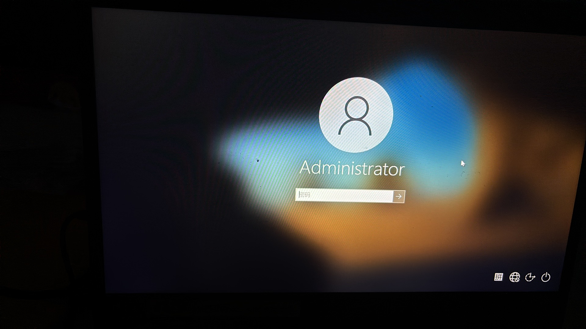
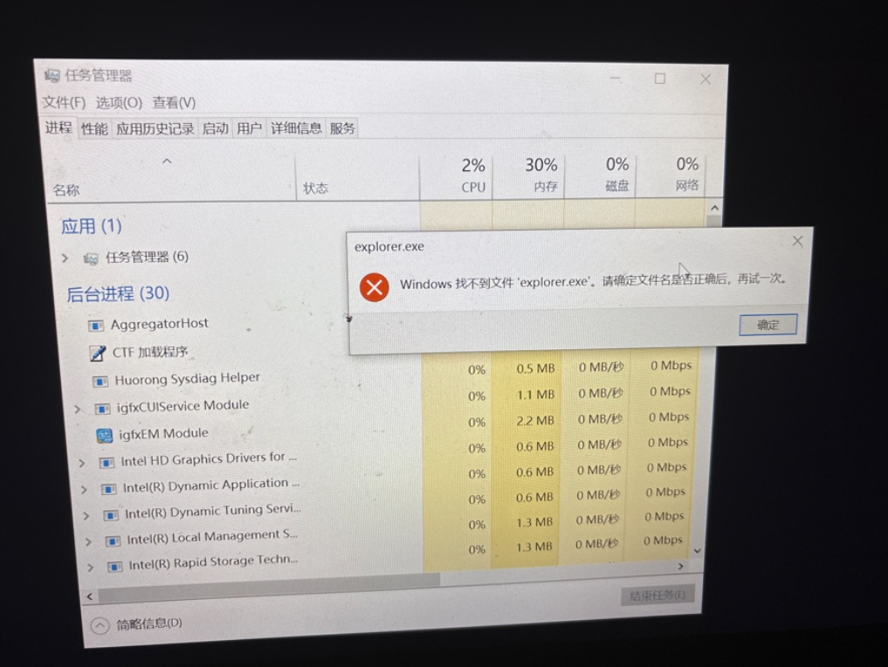

# 修理输入密码后黑屏微软电脑的方法

故事起源于老哥的电脑坏了，让我去修复，那么情况就是开机重启的时候输入密码界面是完好的，就是进去后呢，桌面拉不起来。下面是示例图。

这是典型的 Windows 桌面环境（`explorer.exe`）加载失败或显卡驱动卡死导致的“黑屏带鼠标指针”问题。系统本身已经成功登录，只是未能正常渲染出桌面和任务栏。

  

**1.尝试重置显卡驱动：**快捷键操作。

同时按下键盘上的 `Win + Ctrl + Shift + B` 键。通过这个操作可以强制重启显卡驱动。**验证方法：** 此时你会听到系统发出一声轻响，屏幕会短暂黑屏闪烁。如果桌面随后恢复显示，说明是显卡驱动加载异常。

  >这个方法我失败了，显卡加载没有异常。

**2.打开任务管理器：**若重置显卡无效。

同时按下键盘上的 `Ctrl + Shift + Esc` 键。如果没有任何反应，请尝试按下 `Ctrl + Alt + Delete` 键，然后在出现的蓝色画面中点击“任务管理器”。**验证方法：** 如果任务管理器窗口能够正常弹出，说明系统核心仍在正常运行，仅仅是桌面进程卡住了。

  >确认是桌面进程卡住了。

**3.手动启动桌面进程：**恢复桌面显示。

在任务管理器界面中，点击左上角的“文件”选项卡，选择“运行新任务”（如果是较新的 Windows 11 系统，直接点击顶部的“运行新任务”按钮）。在弹出的输入框中输入 `explorer.exe`，然后点击“确定”。**验证方法：** 稍等片刻，底部的任务栏、桌面背景以及桌面上的应用图标应该会自动重新加载出来，此时电脑恢复正常使用。
>我去搜索这个但是报错了。

错误提示表明系统核心进程 `explorer.exe` 丢失、损坏或系统的环境变量路径出现了严重错误。这通常是由异常关机、系统更新中断或杀毒软件误杀导致的。

  

数据安全提醒

如果文件是因硬盘物理坏道导致丢失，后续操作中请勿对 C 盘进行大量文件拷贝或覆盖，以免加重硬盘损伤。

  

**1.尝试使用完整路径运行：**排查路径变量故障。

在任务管理器的“文件” -> “运行新任务”窗口中，输入完整路径：`C:\Windows\explorer.exe`，然后点击“确定”。**验证方法：** 如果桌面成功加载，说明文件本身完好，仅仅是系统的环境变量设置出错；如果依然报错“找不到文件”，请继续下一步。

>还是失败了。
  

**2.打开管理员命令提示符：**准备修复文件。

再次点击“文件” -> “运行新任务”，在输入框中输入 `cmd`。**务必勾选下方的“以系统管理权限创建此任务”复选框**，然后点击“确定”。**验证方法：** 屏幕上会弹出一个黑色的命令提示符（CMD）窗口，且窗口标题栏应带有“管理员”字样。

  

**3.运行 SFC 扫描修复：**耗时约 5-15 分钟。

在黑色的命令提示符窗口中，输入以下命令并按下回车键：

`sfc /scannow`

系统将自动扫描并尝试从系统缓存中替换丢失或损坏的系统文件。**验证方法：** 等待进度条达到 100%。如果提示“成功修复”，请在黑框中输入 `shutdown /r /t 0` 回车以重启电脑，观察是否能正常显示桌面。

  >到这一步修复完成后就成功了。

**4.调用系统还原：**回滚系统状态。

如果 SFC 扫描无法修复文件，请在命令提示符窗口中输入 `rstrui.exe` 并回车。**验证方法：** 这将调出系统的“系统还原”界面。按照向导选择一个电脑出现故障前的日期点进行还原，还原后电脑会自动重启并尝试恢复正常状态。