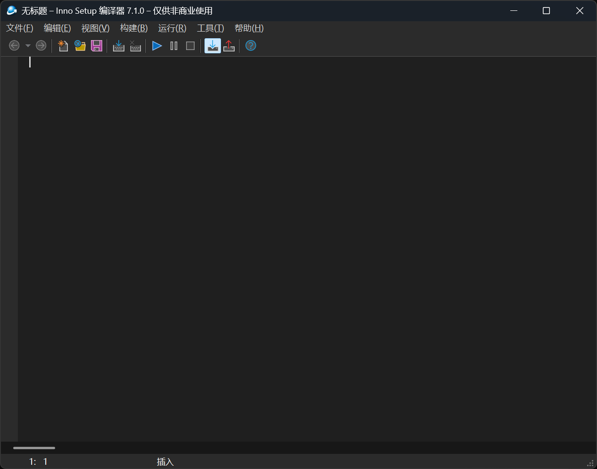
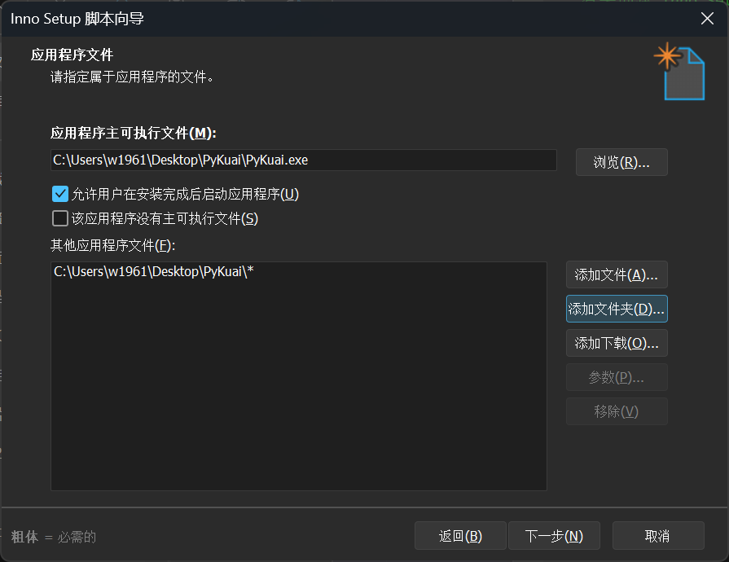
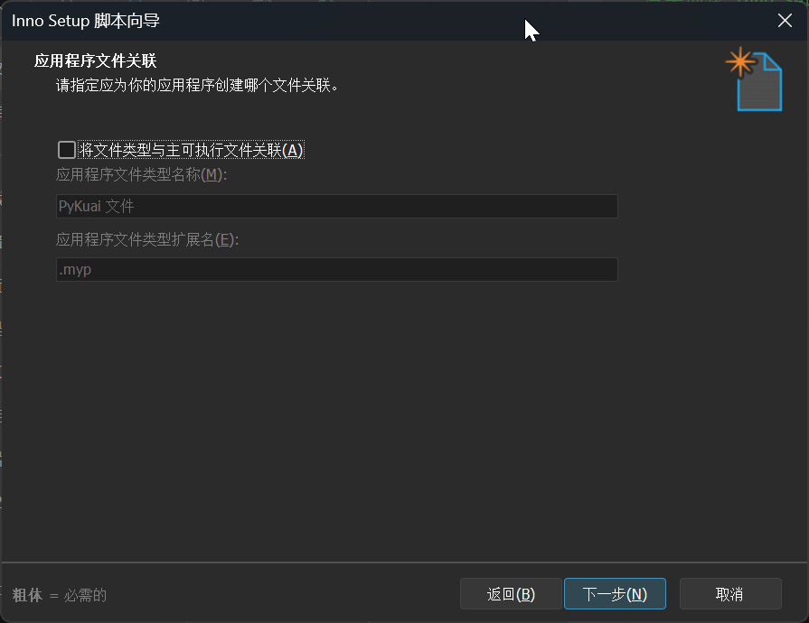
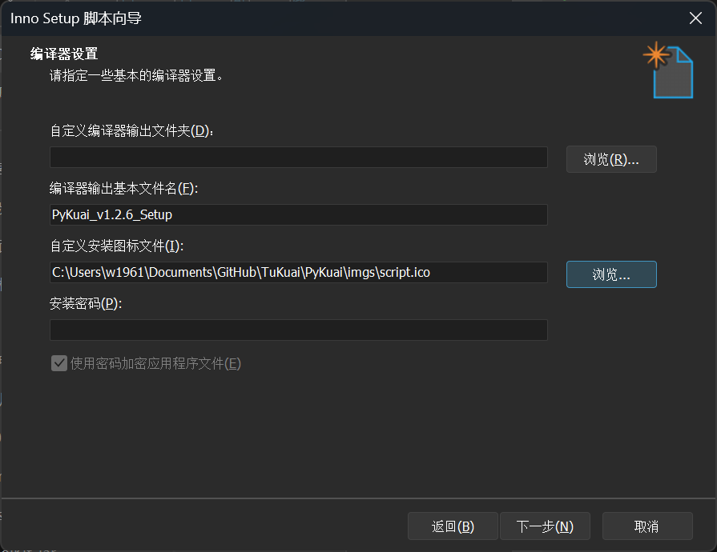

# 如何用Inno Setup封装PySide6？

那么java我们用package辅助wix进行打包安装，PySide6我建议用inno Setup进行安装打包操作，同样的是先在IDE里面编译成多文件，签名，然后利用工具进行封装安装包的操作，首先得站在巨人的肩膀上，下载Inno Setup 编译器 ，因为我英文不好，所以我下载的是中文版本。

那么从头开始，我们先进行一个转换打包的命令在IDE里面。
```IDE单文件打包命令
pyinstaller -F -w -i "imgs/script.ico" --add-data "Scripts;Scripts" --add-data "tools;tools" --add-data "imgs;imgs" PyKuai.py

```
那么我们先检查一下`-F` (单文件模式)，将其替换为 `-D` (目录模式，默认其实也是目录模式)。
```IDE文件夹打包
pyinstaller -y -w -D -i "imgs/script.ico" --add-data "Scripts;Scripts" --add-data "tools;tools" --add-data "imgs;imgs" PyKuai.py
```
仔细看这里加 `-y`（全称是 `--noconfirm`）主要是为了在反复测试打包时，**自动覆盖之前生成的旧文件夹，不再让你手动确认**。那么稍微等一等，项目目录下就多了一个dist文件夹，里面就是多文件目录了。我直接给他复制到桌面进行一个操作。下一步打开编辑器，如下图。解释一下，他的可视化操作实际上是编写一个inno看的懂的机器脚本，然后编辑器帮您进行操作。

直接文件新建下一步，填写软件信息。我跳过许多简单的自定义内容，只展示需要修改的内容。如下图，因为是目录文件，然后选选择主启动exe，然后添加文件夹，选择整个pykuai文件夹。这里您可以直接把PyKuai.exe签名一下，不签白不签嘛。

下面这个关联，暂时用不到，因为我的软件不需要关联文件，直接取消下一步即可。


下面弹出的也是直接下一步，注册表啥的一些直接用默认比较好，除非您的软件有需要导入注册表的操作，语言选择简体中文，当然英文也可以。直到这个页面。


那么这里您需要选择安装包的名称比如命名为*PyKuai_v1.2.6_Setup*
图标最好也选一个和您软件一样的ico即可。然后弹出的窗口是样式啊什么的，看您喜欢了。然后一路点击到下一步，保存一个脚本名称到桌面，比如我命名为*pykuai1.2.6.iss*然后同时间编译就行了，编译完成后，您就可以在桌面上发现一个Output文件夹，里面就是软件的安装文件啦！下一次您可以再次使用这个脚本直接编译啦，当然如果版本变动或者细节变动，您也可以重新选择新建一个脚本丢给编译器即可！软件目录下有卸载方式，当然也可以使用控制面板进行卸载。

