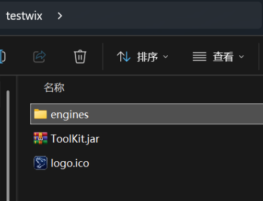
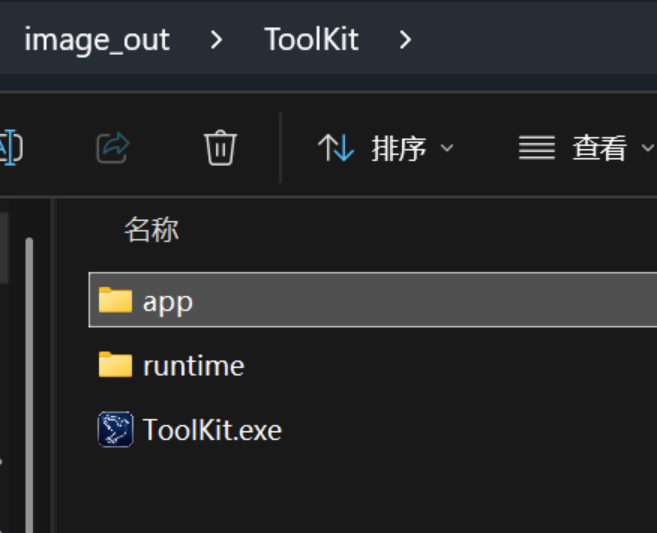

# 怎么用wix封装java软件为msi和同步签名？

软件的最终不是单一文件，因为单一文件不管是python还是java最终都是实现一个自解压的壳子，比如我的BlackHole经常被火绒查杀，报错最经典的就是pythonshell，其实和rar达成exe自解压命令启动jar是同一个意思，此种软件的形式是极其容易被查杀的，没有作者，没有安装，一键启动，像极了病毒，这不怪安全软件，所以软件的最终形态都是安装和快捷方式启动，此种方式是有原因的，第一软件会启动的很快，因为他不会进行一个预加载的过程，软件的一切已经在电脑运行时运行了，第二就是他的可追溯性，用户体验的是完整的生命，不是一不小心删除了快捷方式软件就从此消失了，试想在桌面放置一个软件虽然足够绿色，但是如果一个用户有洁癖，他得把你的软件放到一个盘符里，再搞一个一摸一样的快捷方式，这是非常不好的，而且随着微软安全的不断更新，虽然是魔高一尺，道高一丈，这对长期的维护来说虽然有效，但是想做成一套产品，不说适配所有的系统，仅仅就x64的windows桌面端而言，安装绝对是最成熟最稳定的，最安全的一套方案了。那么本文将提供wix工具针对windows桌面端软件的安装教程，摒除一切黑科技，走科班与当今最成熟的体系与方法。

首先还是要站在巨人的肩膀上，下载最稳定的wix314成熟版本 安装完后要配置一下环境变量 在 Windows 搜索“编辑系统环境变量” -> “环境变量” -> 双击系统变量中的 `Path` -> 点击“新建”，将 WiX 的可执行目录（默认一般为 `C:\Program Files (x86)\WiX Toolset v3.14\bin`）添加进去，保存后重新打开终端测试。
那么要配合jpackage这个命令进行，这是jdk的一个工具，理论来说如果您的电脑配置了环境变量就不需要打开IDE，直接在终端输入即可。

那么配置好了环境变量后呢，我们就可以对我们的软件进行打包了，软件都有一个启动类，比如说我的toolkit软件就有一个启动类叫做MainLauncher，那么您打开您的目录，src/main/java/shaoxia/MainLauncher，软件很智能，但是只能智能到java目录下了，也就是说我的主启动类是shaoxia/MainLauncher，首先我先去桌面上新建一个叫testwix的文件夹，然后把我的胖jar工件ToolKit.jar放到里面，顺带用上我的ico图标也就是logo.ico，然后带上我的engines，也就是我的openssh内置服务，这也突出了一个安装的好处，以前我们用自解压临时目录，特别难找目录下文件，用可怕的正则去用户电脑目录里搜索ssh，现在我们直接在代码里面写好，然后当把项目生成为一个免安装的独立运行目录的时候给他塞进去，这样，一个内置服务就好了！



好了，那么现在开始打包了。

```IDE
jpackage --type app-image --name ToolKit --app-version 1.9.6 --input "C:\Users\w1961\Desktop\testwix" --main-jar ToolKit.jar --main-class shaoxia.MainLauncher --dest "C:\Users\w1961\Desktop\image_out" --icon "C:\Users\w1961\Desktop\testwix\logo.ico"
```

这行 `jpackage` 命令的意思是：**使用 JDK 自带的打包工具，将你的 Java 项目生成一个免安装的独立运行目录（App Image）**。

  

为了让你一目了然，我们可以把这段代码拆解开来看看每个参数的具体含义：

  

- **`jpackage`**：JDK 14 及以上版本自带的官方桌面程序打包工具。
    
      
    
- **`--type app-image`**：指定打包类型为“应用镜像目录”（也就是生成一个可以直接双击运行、包含完整环境的文件夹，而不是直接生成安装包）。
    
      
    
- **`--name ToolKit`**：设定生成程序的名称。（这一步决定了最后的软件名称和快捷方式名称，一定要尤为关注一下。）
    
      
    
- **`--app-version 1.9.6`**：设定当前程序的版本号为 `1.9.6`。
    
      
    
- **`--input "C:\Users\w1961\Desktop\testwix"`**：指定输入文件夹，告诉打包工具去哪里寻找你的 `ToolKit.jar` 以及内置的 `engines` 等素材。
    
      
    
- **`--main-jar ToolKit.jar`**：指定主程序的 JAR 包文件名。
    
      
    
- **`--main-class shaoxia.MainLauncher`**：指定程序的启动入口类（即 `main` 函数所在的类）。
    
      
    
- **`--dest "C:\Users\w1961\Desktop\image_out"`**：指定输出文件夹，打包好的最终文件夹会存放在桌面的 `image_out` 目录下。
    
      
    
- **`--icon "C:\Users\w1961\Desktop\testwix\logo.ico"`**：为生成的程序指定一个自定义的 `.ico` 图标。



那么完成后桌面会多一个image_out的文件夹，里面就是ToolKit文件夹里的文件，您的app里面就是刚刚放进去的engines内置文件，所以子目录您也得注意一下，是app/engines,当在代码里编写绝对路径的时候也要注意这个细节，为什么要这样做，因为我接下来要给ToolKit.exe签名，不知道如何签名可以去我的另一篇文章查看，那么这里会踩一个小坑，大概率会报错Access is denied，错误是因为 `ToolKit.exe` 在编译生成时被 Windows 的某些底层文件缓存或安全扫描服务短暂加锁了。我们可以通过先复制一份临时文件、对其签名、再替换回去的方式来绕过这个文件占用锁定。

这个时候复制粘贴是不行的，需要强行将锁住的文件另存为一个新文件，假设文件在我刚刚应用镜像目录里面也就是C:\Users\w1961\Desktop\image_out\ToolKit\ToolKit.exe
这个文件，我们通过管理员命令
```cmd
copy "C:\Users\w1961\Desktop\image_out\ToolKit\ToolKit.exe" "C:\Users\w1961\Desktop\ToolKit_temp.exe"
```
这时候你的桌面就会多一个ToolKit_temp.exe，这个时候再改名，然后签名，然后替换进去就行了。
```cmd
"C:\Program Files (x86)\Windows Kits\10\bin\10.0.26100.0\x64\signtool.exe" sign /f "C:\Users\w1961\Desktop\tukuai.pfx" /p "574185" /tr "http://timestamp.digicert.com" /td sha256 /fd sha256 "C:\Users\w1961\Desktop\ToolKit.exe"

```
输入上面的代码对桌面的运行文件进行签名，然后替换。那么现在进行打包，准备好软件图标ico，因为我把ico在编译时放到了wixtest里面，那么app里面确实是有一个ico的，这是很不好的重复，那么这个时候您就可以把app里面的ico放到桌面上，输入以下代码。
```IDE
jpackage --type msi --app-image "C:\Users\w1961\Desktop\image_out\ToolKit" --name ToolKit --app-version 1.9.6 --dest "C:\Users\w1961\Desktop" --icon "C:\Users\w1961\Desktop\logo.ico" --win-dir-chooser --win-shortcut --win-menu
```

这行指令的意思是：**使用 `jpackage` 工具，将你刚才生成的免安装目录（App Image）直接封装并打包成一个标准的 Windows `.msi` 安装包。**

  

让我们同样把这段命令拆解开来看看每个参数的含义：

  

- **`jpackage`**：JDK 自带的桌面应用打包工具。
    
      
    
- **`--type msi`**：指定最终打包输出的文件格式为 Windows 的 `.msi` 安装包。
    
      
    
- **`--app-image "C:\Users\w1961\Desktop\image_out\ToolKit"`**：告诉打包工具，直接拿桌面上已经生成好的 `ToolKit` 运行目录作为打包的素材源。
    
      
    
- **`--name ToolKit`**：指定安装包在系统中显示的软件名称。（这里的名称最终还是根据第一次打包的独立运行目录决定的。）
    
      
    
- **`--app-version 1.9.6`**：指定安装包的版本号为 `1.9.6`。
    
      
    
- **`--dest "C:\Users\w1961\Desktop"`**：指定最终生成的 `.msi` 安装文件输出保存到你的桌面上。
    
      
    
- **`--icon "C:\Users\w1961\Desktop\logo.ico"`**：为这个安装包及安装后的程序指定自定义的图标。
    
      
    
- **`--win-dir-chooser`**：在安装向导中弹出一个步骤，允许用户自己选择安装到哪个盘（例如 D 盘）。
    
      
    
- **`--win-shortcut`**：安装完成后，自动在桌面上创建带有你自定义图标的 `.exe` 快捷方式。
    
      
    
- **`--win-menu`**：在 Windows 的“开始”菜单中也自动添加程序的快捷启动方式。

```
"C:\Program Files (x86)\Windows Kits\10\bin\10.0.26100.0\x64\signtool.exe" sign /f "C:\Users\w1961\Desktop\tukuai.pfx" /p "574185" /tr "http://timestamp.digicert.com" /td sha256 /fd sha256 "C:\Users\w1961\Desktop\ToolKit-1.9.6.msi"
```


那么还没有结束，到这里您还要给安装包也签个名，这样就很完美了。如果想要删除直接点击msi卸载即可，如果不小心删除了msi，也可以从命令面板进行卸载。

那么这里要补充一个很重要的踩坑点，当你第一次编译的时候比如我的openssh服务，他是在目录下的，但是当他被打包成可执行文件目录时候他就因为打包指令被放到app目录里面了，所以在编译代码的时候要考虑到这一点，如果要调用工具，目录下app文件下调用，或者您可以手动删除然后在目录下放一个这种脱裤子的方法再穿上......。

```java
// ✨ 核心修改：动态获取便携版 SSH 引擎的绝对路径
String enginePath = System.getProperty("user.dir")
        + File.separator + "engines"
        + File.separator + "openssh"
        + File.separator + "ssh.exe";
```
只要改成
```java
String enginePath = System.getProperty("user.dir")
        + File.separator + "app"
        + File.separator + "engines"
        + File.separator + "openssh"
        + File.separator + "ssh.exe";
```
