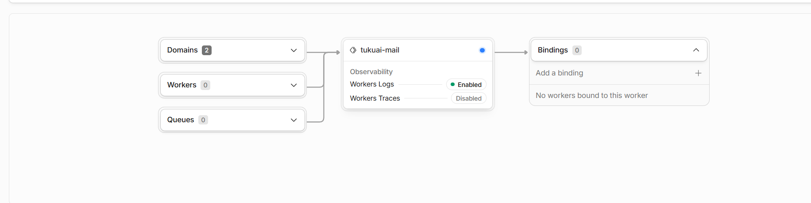

# 无服务架构Serverless Architecture

有了域名就可以解锁新的东西，叫cloudflare works，我随喊随到的机器人。


这就相当于给你的 `tukuai-mail` 后端服务开了**两扇门（两个通道）**，它们最终通向的是同一个房间（执行同一段代码）。

  

它的具体运作流程是这样的：

  

**1. 流量入口 (Domains：2个)**

外部的网络请求想访问你的 API，可以通过这两条并行的通道进来：

  

- **默认通道：** `tukuai-mail.w1961459892.workers.dev`。这是 Cloudflare 在你创建项目时自动分配的测试子域名。（没啥用）
    
      
    
- **自定义通道：** `api.xn--udsye.art`。这正是你手动绑定上去的专属域名。
    
      
    

**2. 核心处理 (tukuai-mail Worker)**

不管用户的请求是访问默认的 `.dev` 网址，还是访问你自定义的 `.art` 网址，Cloudflare 都会将这两股流量汇聚到中间这个节点。你的服务器脚本被唤醒，就是写在下面的（work.js）开始处理这些请求（比如发送邮件、处理表单等），然后将结果返回。

  

**3. 外部资源关联 (Bindings)**（没关联）

流程图的最右侧指向了 Bindings（绑定）。如果你的脚本在运行中还需要去读写 Cloudflare 内部的数据库（D1）或键值对存储（KV），这里就会显示相应的连接。目前显示为 0，说明当前代码是独立运行的，没有挂载额外的云存储资源。

  

**保留这两个通道的好处：**

在实际开发中，通常会把**默认分配的域名**作为日常修改代码、打草稿时的**测试入口**；而把**自定义域名**作为正式上线的**生产环境入口**，嵌到前端项目里去。而且，Cloudflare 默认的 `workers.dev` 域名在某些地区偶尔会遇到网络访问不稳定的情况，绑定自己的域名能让接口调用更加稳定可靠。


那么我有了自己的域名，并且将解析入口交给了Cloudflare，现在我可以打开一个更厉害的功能，叫做 **Cloudflare Workers & Pages**


要理清它们的关系，我们可以把 **Resend** 想象成一个“全球快递公司的转运中心”，而 **Cloudflare Workers** 就是你雇佣的一个“智能跑腿机器人”。

  

下面我为你详细拆解你需要从 Resend 拿什么，以及这两个服务在代码层面是如何串联起来的：

  

### 一、你去 Resend 是去“拿”什么东西？

你去 Resend 注册账号并设置，核心就是为了拿两样东西：

  

1. **API Key（通信密钥，最核心！）：**
    
    这是一串长长的字符（比如类似于 `re_123456789abcdef...`）。这就是跑腿机器人（Worker）去 Resend 寄信时的“通行证”。没有它，Resend 的服务器根本不认识你的 Worker，会直接拒绝发信请求。
    
      
    
2. **验证通过的发件人身份（Verified Domain）：**
    
    你需要向 Resend 证明你拥有一特定的域名。配置好之后，你才能以类似 `hello@你的域名.com` 的身份发邮件。如果不验证，邮件极有可能直接进垃圾箱。
    
      
    

### 二、它们是怎么“串联”在一起的？（具体流程）

它们之间的串联，**完全是靠代码里的一次 HTTP 请求（HTTP Request）来完成的**。

  

在你的 Cloudflare Worker（也就是 `tukuai-mail` 这个项目）的后台代码里，其实发生着下面这个流程：

  

**第 1 步：藏好“钥匙”（配置环境变量）**（我没藏）

你从 Resend 拿到了那串 API Key，但你不能直接把它写死在明文代码里（不安全）。你会在 Cloudflare Worker 的控制台（Overview -> Edit code）里，新建一个加密的环境变量（Secrets），比如叫 `RESEND_API_KEY`，把字符串填进去。

  

**第 2 步：接收前端指令（触发 Worker）**

你的个人网站前端向 `api.xn--udsye.art` 发送一个请求（比如用户填了留言表单：“你好，我对你的项目感兴趣”）。Cloudflare Worker 瞬间被唤醒，接住了这个请求。

  

**第 3 步：组装包裹并发起请求（核心串联环节）**

你的 Worker 会用 JavaScript 代码，向 Resend 的官方服务器发起一个标准的 `POST` 请求。这个请求头里，就带着刚刚那把钥匙。：

  ``` work.js
  export default {

  async fetch(request, env, ctx) {

    // 处理跨域预检请求

    if (request.method === 'OPTIONS') {

      return new Response(null, {

        headers: {

          'Access-Control-Allow-Origin': '*',

          'Access-Control-Allow-Methods': 'POST, OPTIONS',

          'Access-Control-Allow-Headers': 'Content-Type',

        }

      });

    }

  

    if (request.method !== 'POST') {

      return new Response('Method Not Allowed', { status: 405 });

    }

  

    try {

      const { message } = await request.json();

  

      // 调用 Resend 官方 API

      const res = await fetch('https://api.resend.com/emails', {

        method: 'POST',

        headers: {

          'Content-Type': 'application/json',

          // 👇 将这里的 YOUR_RESEND_API_KEY 替换成你刚刚复制的以 re_ 开头的密钥

          'Authorization': `Bearer YOUR_RESEND_API_KEY`

        },

        body: JSON.stringify({

          from: 'TuKuai OS <admin@xn--udsye.art>', // 你的专属发件邮箱

          to: 'w1961459892@gamil.com',            // 你的接收邮箱

          subject: 'TuKuai OS - 收到新的前端留言',

          text: `土块，有人在前端小人那给你留言了：\n\n${message}`

        })

      });

  

      if (res.ok) {

        return new Response(JSON.stringify({ success: true }), {

          headers: { 'Access-Control-Allow-Origin': '*', 'Content-Type': 'application/json' }

        });

      } else {

        const errorText = await res.text();

        return new Response(JSON.stringify({ success: false, error: errorText }), {

          status: res.status,

          headers: { 'Access-Control-Allow-Origin': '*', 'Content-Type': 'application/json' }

        });

      }

    } catch (err) {

      return new Response(JSON.stringify({ success: false, error: err.message }), {

        status: 500,

        headers: { 'Access-Control-Allow-Origin': '*', 'Content-Type': 'application/json' }

      });

    }

  }

};
  ```


**第 4 步：Resend 负责投递**

Resend 的服务器接收到了这个带 `Authorization` 头部的 HTTP 请求，核对 API Key 正确无误后，就会接管剩下的苦力活——与全球各大的邮件服务商（Gmail、QQ、网易等）进行底层 SMTP 协议的交互，把这封信安全送达你的邮箱。

  

**总结一下：**

它们之间的串联，**不需要安装任何复杂的软件或建立长连接**。纯粹是你写在 Cloudflare Worker 里的一段 JavaScript 代码，拿着从 Resend 申请来的 API Key，发起了一次网络 API 调用（API Call）。就这么简单、轻量且高效！

---

**Vercel 也是无服务器架构（Serverless Architecture）的典型代表！**

  

无论是我们之前用过的 Vercel，还是你现在跑在 Cloudflare 上的 Workers，它们本质上都在做同一类事情——**让你“只写核心业务代码，而把所有的服务器运维全部丢给云厂商”**。

  

不过，它们在底层实现和针对的场景上还是有一点点小区别的：

  

- **Vercel 的无服务器（Serverless / Edge Functions）：**
    
      
    - 它最擅长的是**托管前端网页**（比如用 React、Vue、Next.js 写的静态或动态网站）。
        
          
        
    - 同时，它也允许你在项目里放一个 `/api` 文件夹（写 Node.js 或 Python），当前端请求这个接口时，Vercel 就会在幕后按需启动一个无服务器函数来处理它。
        
          
        
- **Cloudflare Workers 的无服务器（Edge Workers）：**
    
      
    - 它更加轻量纯粹，主要针对的就是这种**纯 API 后端脚本、转发、拦截或重定向**。
        
          
        
    - 它的节点直接部署在 Cloudflare 全球两百多个城市的边缘服务器上，响应速度往往比传统集中式机房更快。
        
          
        

所以，之前在 Vercel 上搞留言板、现在在 Cloudflare 上搞 `tukuai-mail` 邮件转发，**玩的其实都是同一套现代无服务器（Serverless）的技术栈**——不用买云主机，不用配 Linux 环境，写完代码往云上一推，就能直接对外提供服务了。


---


```html
const workerUrl = 'https://api.xn--udsye.art'; // 这就是你 Cloudflare 的自定义域名通道！

const response = await fetch(workerUrl, {
    method: 'POST',
    headers: { 'Content-Type': 'application/json' },
    body: JSON.stringify({ message: mailContent.value })
});
```

**它们怎么串起来的？**

- **前端（HTML/Vue）：** 负责在页面上弹出一个好看的毛玻璃输入框，收集少侠想说的话，然后向 `[https://api.xn--udsye.art](https://api.xn--udsye.art)` 发起一次 `POST` 请求。
    
- **后端（Cloudflare Worker）：** 也就是我们前面讨论的那段 JavaScript 脚本。它刚好守候在 `api.xn--udsye.art` 这个域名后面，接住前端发来的留言，再转交给 Resend 投递到你的邮箱。