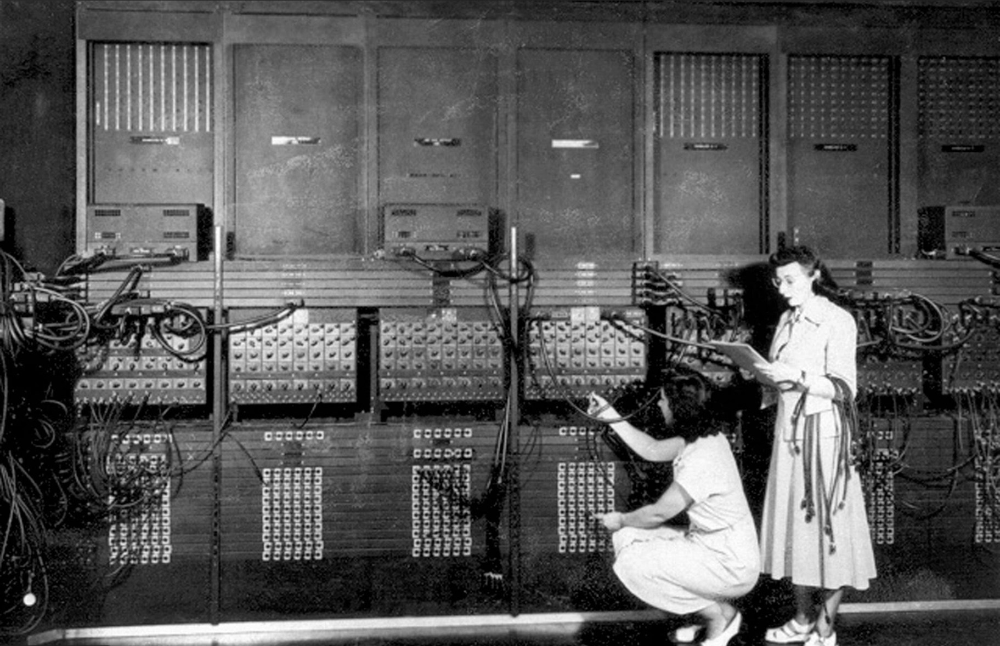

# 计算机与编程语言的发展史是什么？

计算机与编程语言的发展史，本质上是一部人类不断向上攀爬的“抽象阶梯”。

  

每一次技术的跃迁，都是为了让我们离底层的硅片、电子和物理开关远一点，离人类的自然思维、逻辑与创造力近一点。这段历史可以分为两条交织的主线：**硬件的微缩与算力爆炸**，以及**语言的抽象与范式革命**。

  

## 计算机硬件的演进：从巨兽到尘埃

硬件的发展严格遵循着更小、更快、更便宜的物理定律（特别是后期的摩尔定律）。

  

- **第一代：电子管时代（1940s - 1950s）**
    
    代表作是 1946 年诞生的 ENIAC。它使用了 1.8 万个电子管，重达 30 吨，占地 170 平方米。这时的计算机没有操作系统，所谓的“输入”其实是打孔纸带，甚至是由操作员手动插拔无数根物理线缆来改变电路逻辑。
    
      
    
- **第二代：晶体管时代（1950s - 1960s）**
    
    肖克利等人发明的晶体管取代了脆弱、耗电、极易烧毁的电子管。计算机的体积大幅缩小，可靠性成倍提升。此时诞生了早期的操作系统和批处理系统，硬件与软件开始出现真正的分工。
    
      
    
- **第三代：集成电路时代（1960s - 1970s）**
    
    工程师们成功将成百上千个晶体管蚀刻在一块极小的硅片上。这一时期，IBM 推出了具有划时代意义的 System/360 大型机，它确立了“系列机”和“向下兼容”的概念，让软件资产得以在不同型号的硬件上继承。
    
      
    
- **第四代：微处理器时代（1970s 至今）**
    
    当整个中央处理器（CPU）被集成到一块小小的芯片上时，个人计算机（PC）的时代宣告降临。从 Apple II 到 IBM PC，再到后来的智能手机以及如今主导 AI 计算的巨型 GPU 集群，全都是微处理器架构不断逼近物理极限（纳米制程）的产物。
    
      
    

## 编程语言的进化史：寻找表达的自由

如果说硬件决定了计算的物理极限，那么编程语言则决定了人类思考的边界。语言的发展史，就是一步步从“机器怎么想”向“人怎么想”妥协的过程。

  

机器语言与汇编：带着镣铐跳舞

1940s

最初的代码是纯粹的 **0 和 1**，直接操控 CPU 寄存器和内存地址。随后发明的汇编语言（Assembly）仅仅是用简短的英文助记符（如 ADD, MOV）代替了二进制串，程序员依然需要在大脑中模拟 CPU 的物理执行过程，极其痛苦且无法跨平台。

  

早期高级语言：摆脱硬件束缚

1950s

**Fortran（1957）** 为科学计算而生，**LISP（1958）** 开启了函数式编程和早期 AI 的探索，而 **COBOL（1959）** 则主宰了商业与金融领域。这些语言首次让程序员可以用类似数学公式或英语句子的方式写代码，随后由“编译器（Compiler）”翻译成机器码。

  

C 语言的诞生：现代系统的基石

1972

Dennis Ritchie 在贝尔实验室发明了 C 语言。它完美平衡了“高级语言的抽象表达”与“低级语言的内存掌控力”。C 语言不仅重写了 Unix 操作系统，更成为了此后五十年所有主流操作系统的绝对底层。

  

面向对象浪潮：C++ 与现实映射

1980s

随着软件规模呈指数级膨胀，面向过程的 C 语言在管理几百万行代码时捉襟见肘。Bjarne Stroustrup 在 C 的基础上加入了“类与对象”，诞生了 **C++**。面向对象编程（OOP）让代码可以像现实世界中的事物一样被封装、继承和多态化，大幅提升了大型工程的可维护性。

  

互联网与虚拟机：Java 与脚本的崛起

1990s

万维网的爆发需要一种能在任何机器上运行的语言。**Java（1995）** 凭借 JVM（Java虚拟机）实现了“一次编写，到处运行”（Write once, run anywhere），并凭借强大的生态统治了企业级后端。同年，**JavaScript** 诞生，让死板的网页拥有了灵魂；而 **Python** 则以极简的语法哲学开始默默蛰伏，等待未来数据科学的爆发。

  

并发、安全与所有权：Go 与 Rust

2010s 至今

摩尔定律放缓，单核主频遭遇瓶颈，多核并发时代到来。Google 推出的 **Go** 语言以其极简的协程（Goroutine）优雅地解决了高并发问题；而 Mozilla 孕育的 **Rust** 则通过革命性的“所有权（Ownership）”机制，在不牺牲 C/C++ 性能的前提下，从编译期彻底消灭了内存泄漏和并发数据竞争，正在重塑底层系统开发。

  

站在今天，当我们能够用自然语言（LLM Prompt）直接向机器下达复杂的逻辑指令，甚至让 AI 自行编写 UI 组件和底层脚本时，这并不是魔法，而仅仅是这座名为“抽象”的阶梯上，最新、也最震撼的一级台阶。