# 我的艺术

> **✒️ TuKuai (GallantTarry)**

我常称自己为艺术家，那必然有一些作品，我想艺术逃离不开自由，爱情和离别。下面的一些绘画大部分出现在我的学生时代。我想那时候我确实有点迷茫，但我却不知道自己在迷茫什么？我明明拥有令人羡慕的爱情，但是我却还想去爱其他人，我明明拥有着绝对的自由，但我好像不自由，我明明一直想要离开家庭，为什么会对家乡的一草一木深深的怀念，也许我确实是一个矛盾的人，有时候我也不明白自己想要什么。

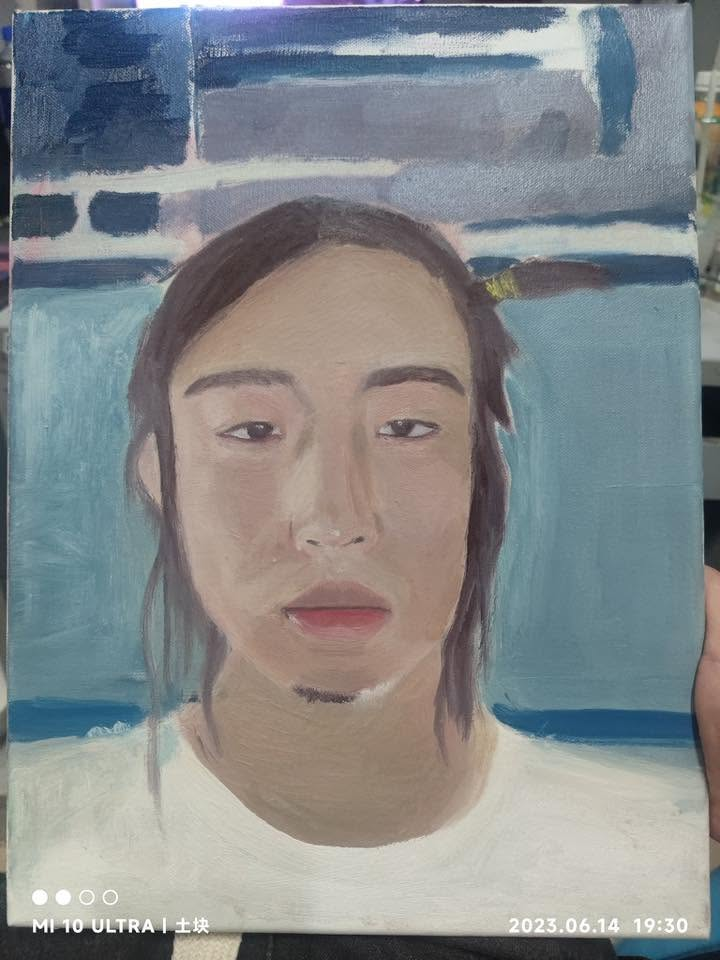
我想记录一下我长发时候的样子，啧，我还是觉得我扎辫子的时候挺美的。
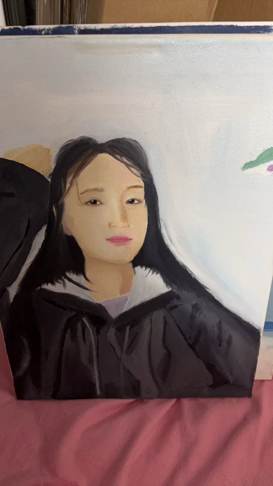
我特别想画出她灵动的头发，但是好像失败了。
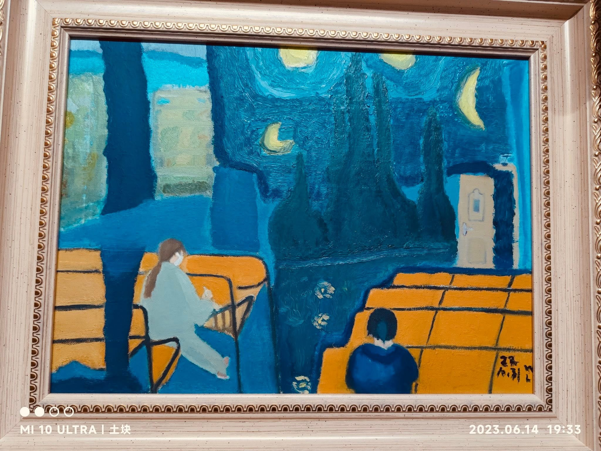
我常说有一个女孩长得像“范冰冰”，我爱死她了。但是好像被她拉黑了，挺难受的。
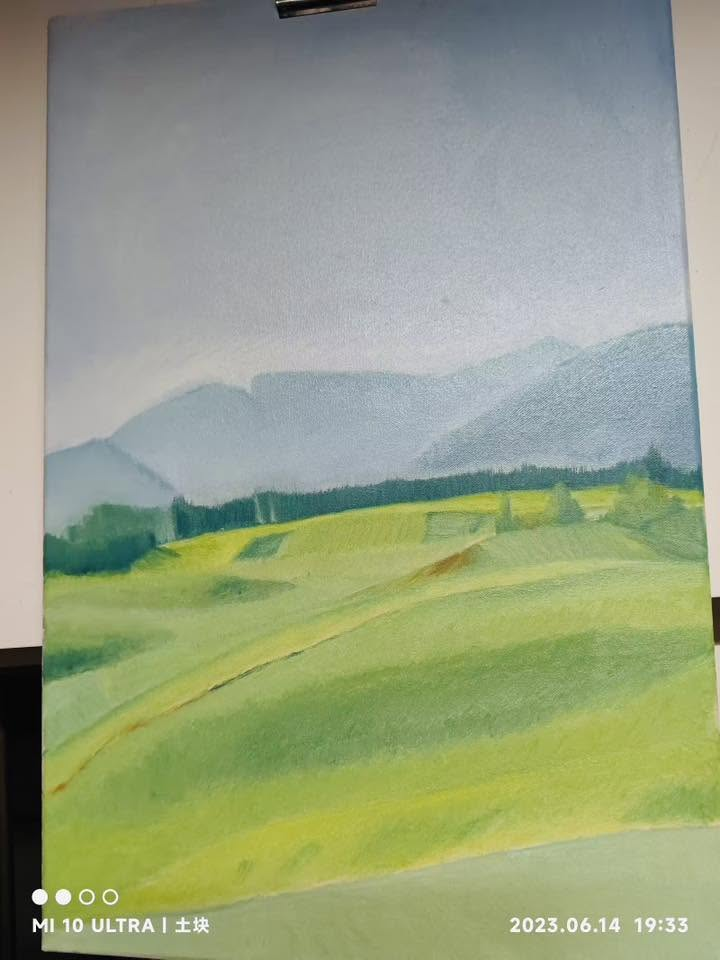
还蛮有空间感的，但是技法还是青涩，不过确实有点美丽。
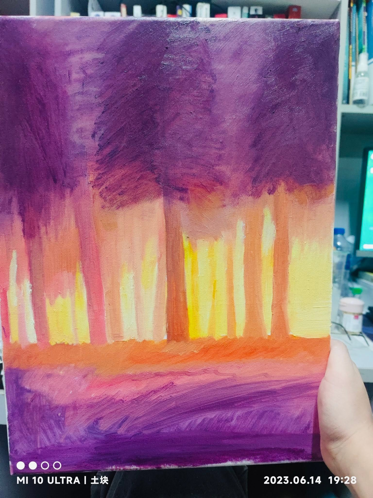
我觉得即使再不会画，能调用色彩就是成功的画作了。
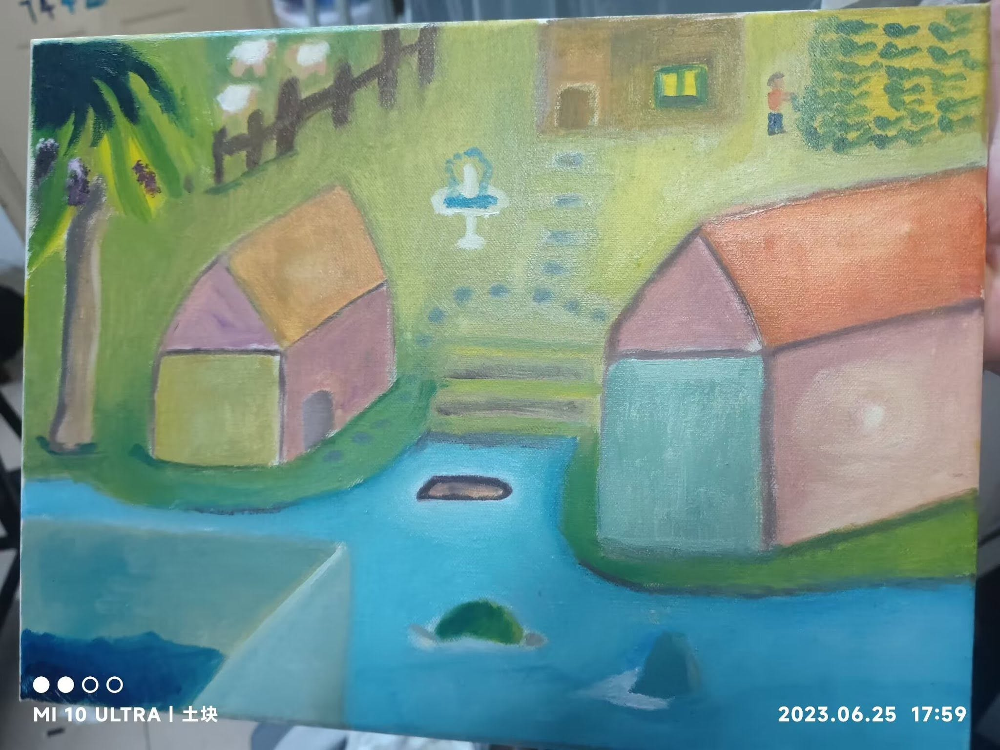
当年我还是很童真的不是吗？
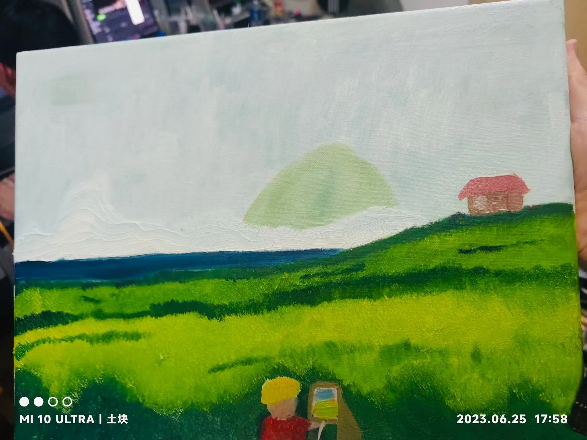
好像有点孤独。
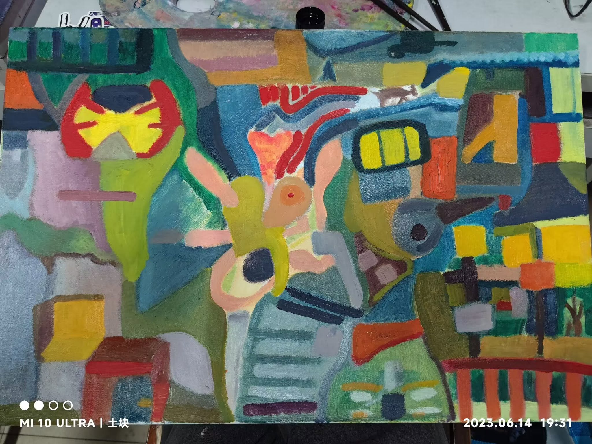
根本不知道在画什么，我只是想把当时毕业时的内心画出来，我感觉挺成功的。
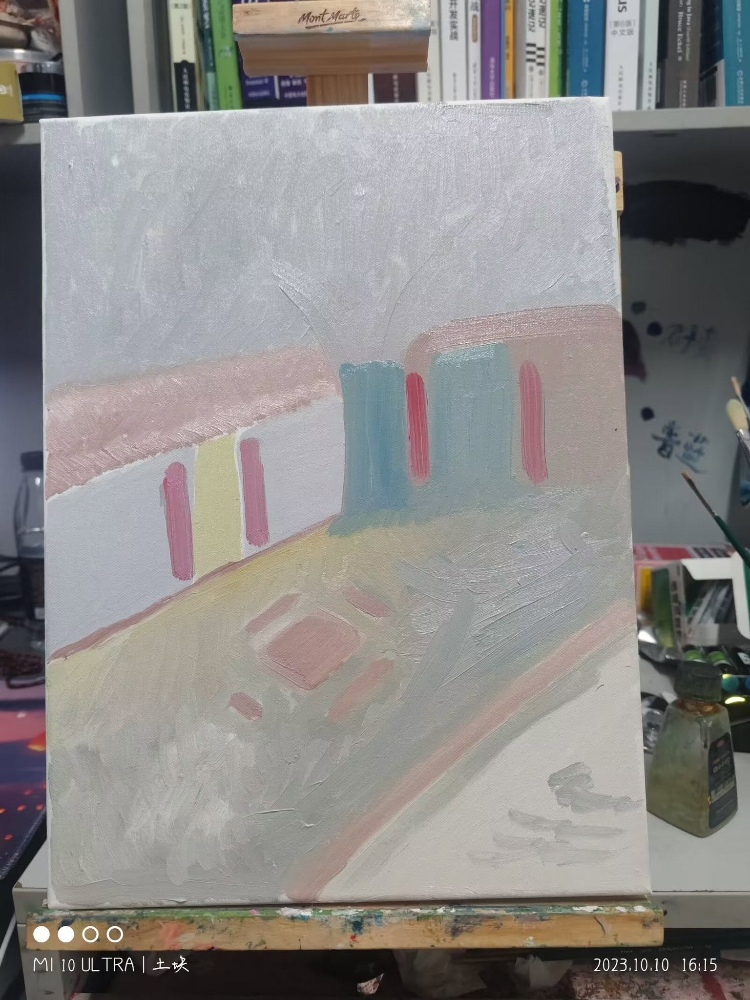
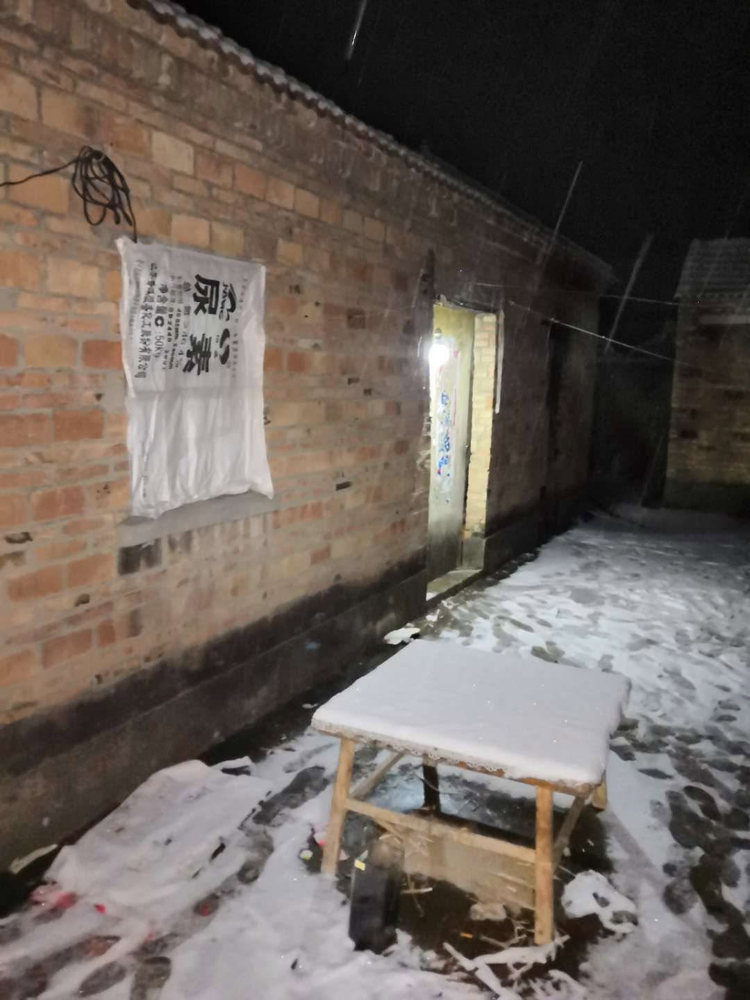
为了纪念我的太太，我跟她不常见面，她离开于一个冬天，刚过完年，她就走了。
当年她说她又梦见了掌管她寿命的“神仙”说她还能再活10年，但是我们刚离开，就得赶回去给她安排葬礼了。说实话，我确实没有心痛，我只是在思考，也许人老了，离开是好事。也许有一天我也会睡在那一片泥土里，匆忙的离开，匆忙的回去。我不明白我们都在忙什么，忙到和最亲的人反目成仇，忙到和土地失去了联系，忙到连头都回不了，忙到视而不见。
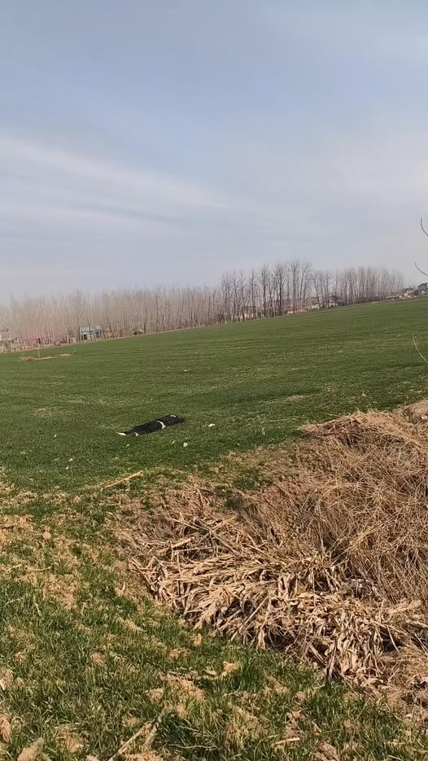
《我爱这土地》      艾青       （1938年11月17日）  

假如我是一只鸟，  
我也应该用嘶哑的喉咙歌唱：  
  
这被暴风雨所打击着的土地，  
这永远汹涌着我们的悲愤的河流，  
这无止息地吹刮着的激怒的风，  
和那来自林间的无比温柔的黎明……  
  
——然后我死了，  
连羽毛也腐烂在土地里面。  
  
为什么我的眼里常含泪水？  
因为我对这土地爱得深沉……  
