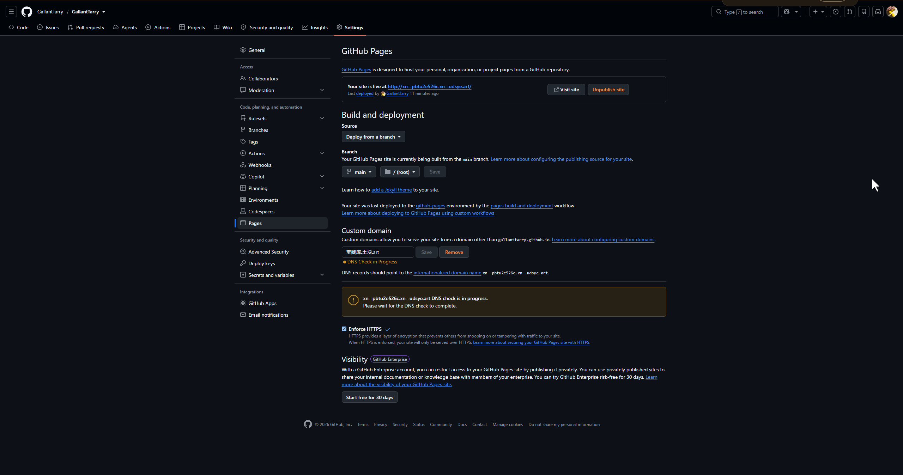
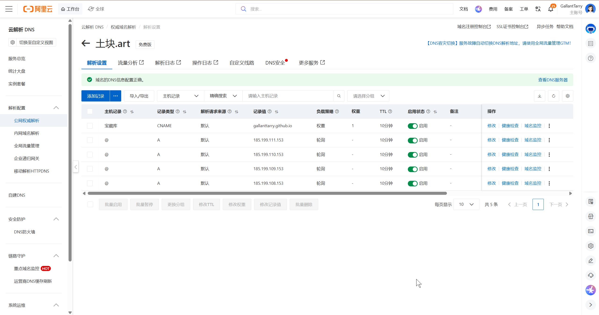

# DNS 解析技术怎么用于更改域名？

### 一、 核心原理解析

**1. Punycode 转换（域名的“底层真名”）**

全球的域名系统（DNS）和底层网络协议诞生于英语国家，在根逻辑上**完全不认识中文字符**，只支持英文字母、数字和连字符（ASCII码）。

为了让世界各地的人能使用母语域名，国际标准组织制定了 Punycode 协议。当你在浏览器输入 `土块.art` 时，浏览器会自动将中文字符翻译成机器能读懂的 `xn--3bqr68b.art` 并发送请求。

在向 GitHub 或阿里云这种只认机器底层逻辑的服务器下达指令时，我们必须跳过浏览器的伪装，直接提交这串 `xn--` 开头的底层真名。

  

**2. 那 4 个 185.199.x.x 的 IP 地址是什么？**

`185.199.108.153`、`109.153`、`110.153`、`111.153` 是 **GitHub Pages 官方专属的 Anycast（任播）服务器 IP 地址池**。

  

- **为什么有 4 个**：这是为了高可用性（容灾机制）。如果某台服务器在维护或遭受攻击宕机，DNS 解析会瞬间将用户的请求引流到另外三台正常的服务器上，确保你的系统永不掉线。
    
      
    
- **作用**：在阿里云配置这四条 A 记录，就相当于给全网的访客发了一份路观图：只要有人寻找 `土块.art`，立刻将他们引导到 GitHub 的这四台服务器上去拉取你的前端代码。
    
      
    

### 二、 中文域名绑定 GitHub Pages 全流程复盘

**1. 购买域名与解除系统锁定**

  

- 在阿里云或腾讯云挑选并购买心仪的域名后缀（如 `土块.art`）。
    
      
    
- 提交个人身份证件完成工信部要求的**实名认证**。未实名状态下，域名会被锁定（ServerHold），无法进行任何解析操作。
    
      
    

**2. 获取 Punycode 机器码**

  

- 使用在线 Punycode 转换工具，输入中文域名 `土块.art`。
    
      
    
- 获取并复制转换后的底层机器码：`xn--udsye.art`。
    
      
    

**3. 突破 GitHub 全局安全验证（现代新规）**

  

- 为防止恶意冒用域名，GitHub 会要求验证域名所有权。
    
      
    
- 在 GitHub Pages 绑定域名时如果触发验证，复制官方提供的验证码。
    
      
    
- 回到阿里云域名解析台，添加一条 **TXT 记录**，将 GitHub 给的主机名和记录值填入。
    
      
    
- 在 GitHub 点击 Verify，向系统证明“这个域名确实是我买的”。
    
      
    

**4. 仓库挂载域名（发通行证）**

  

- 进入存放代码的 `TuKuai` 仓库，点击 **Settings -> Pages**。
    
      
    
- 在 **Custom domain** 框中，**严格填入转码后的 `xn--udsye.art`**，点击 Save。
    
      
    
- 此操作会自动在你的代码仓库根目录生成一个无后缀的 `CNAME` 文件，作为域名绑定的永久凭证。
    
      
    

**5. 阿里云配置 DNS 解析（修桥引流）**

回到阿里云的“域名解析”控制台，点击“添加记录”，布下 5 条解析阵法：

  

- **绑定主域名**：添加 4 条 **A 记录**，主机记录填 `@`，记录值分别填入那 4 个 GitHub 官方 IP。这保证了访客直接输入 `土块.art` 能够直达。
    
      
    
- **绑定 www 域名**：添加 1 条 **CNAME 记录**，主机记录填 `www`，记录值填入你的初始地址 `gallanttarry.github.io`。这保证了访客输入 `www.土块.art` 也能精准跳转。
    
      
    

**6. 开启 SSL 加密（点亮安全绿锁）**

  

- 解析配置完成后，等待 10 - 15 分钟让全球 DNS 节点同步数据。
    
      
    
- 回到 GitHub 的 Pages 设置页面。
    
      
    
- 在 Custom domain 下方，勾选 **Enforce HTTPS**。此时 GitHub 已为你免费签发了安全证书，红色“不安全”警报彻底消除。
    
      
    

现在你的“TUKUAI OS”已经有了一个极其体面的官方门面。接下来，你想先解决复古游戏的独立存档问题，还是深入研究一下刚刚那个会“隐身多线程”的 Web Worker 动画机制？

建立 `宝藏库.土块.art` 这个二级域名的操作非常简单，只需要在阿里云和 GitHub 两边分别做一个配置即可。

  

1. **在阿里云添加解析记录**
    
    在你的截图界面中，点击左上角蓝色的 **添加记录** 按钮，按照以下参数精确填写：
    
      
    - **记录类型**：下拉选择 `CNAME`
        
          
        
    - **主机记录**：直接填写中文 `宝藏库`（阿里云后台会自动识别并处理前缀的中文）
        
          
        
    - **记录值**：填写你的 GitHub 基础地址 `gallanttarry.github.io`
        
          
        
    - 点击**确定**保存。
        
          
        
2. **获取二级域名的底层真名（Punycode）**
    
    打开你之前使用的 Punycode 转换工具。这次需要把完整的二级域名 **`宝藏库.土块.art`** 输入进去进行转换。
    
    转换出来的结果会包含两段转码，格式类似于 `xn--pbtu2e526c.xn--udsye.art`。把这串完整的代码复制下来。
    
      
    
3. **在 GitHub 仓库挂载域名**
    
      
    - 打开你要绑定这个域名的独立 GitHub 仓库（例如 `GallantTarry` 项目）。
        
          
        
    - 点击仓库顶部的 **Settings**，然后在左侧菜单点击 **Pages**。
        
          
        
    - 下拉找到 **Custom domain** 输入框。
        
          
        
    - 将第2步获取的完整 Punycode 机器码填进去，点击 **Save**。
        
          
        

等待大约 5 到 15 分钟的全球 DNS 同步时间，最后在 GitHub Pages 设置页把底部的 **Enforce HTTPS** 勾选上。你的数字庄园就成功开辟出了“宝藏库”这个专属的独立空间了！

简单来说：**A 记录（那 4 个 IP）只能用来绑定“裸域名”（也就是没有前缀的主域名，如 `土块.art`），而 CNAME 记录（`gallanttarry.github.io`）是专门用来绑定“带前缀的子域名”（如 `www.土块.art` 或 `宝藏库.土块.art`）的。**

  

背后的技术原因主要有两点：

  

1. **DNS 协议的硬性规定（Apex 域名限制）：**
    
    在互联网的 DNS 根服务器规则中，顶级域名的根节点（Apex，即 `@` 记录）**绝对不允许**直接指向一个域名（CNAME），它必须指向纯数字的服务器物理 IP 地址（A 记录）。这就是为什么主域名 `土块.art` 必须老老实实填写那 4 个 GitHub 的 IP。
    
      
    
2. **CNAME 的魔力与别名机制：**
    
    而当你要加前缀（比如 `宝藏库` 或 `www`）时，它在 DNS 协议中属于子域名。子域名允许使用 **CNAME（别名记录）**。它的作用就是告诉阿里云：“把这个前缀请求直接转发给 `gallanttarry.github.io` 去处理。”因为 GitHub 官方服务器集群的 IP 可能会在后台动态轮换，用 CNAME 指向官方域名可以让 GitHub 帮你自动维护底层的 IP 变动，你再也不用手动去改 IP 了。
    
      
    

所以：

  

- **主域名 (`土块.art`)**：必须用 4 个 IP（A 记录）。
    
      
    
- **二级域名 (`宝藏库.土块.art`)**：必须用 `gallanttarry.github.io`（CNAME 记录）。
    
      
    
