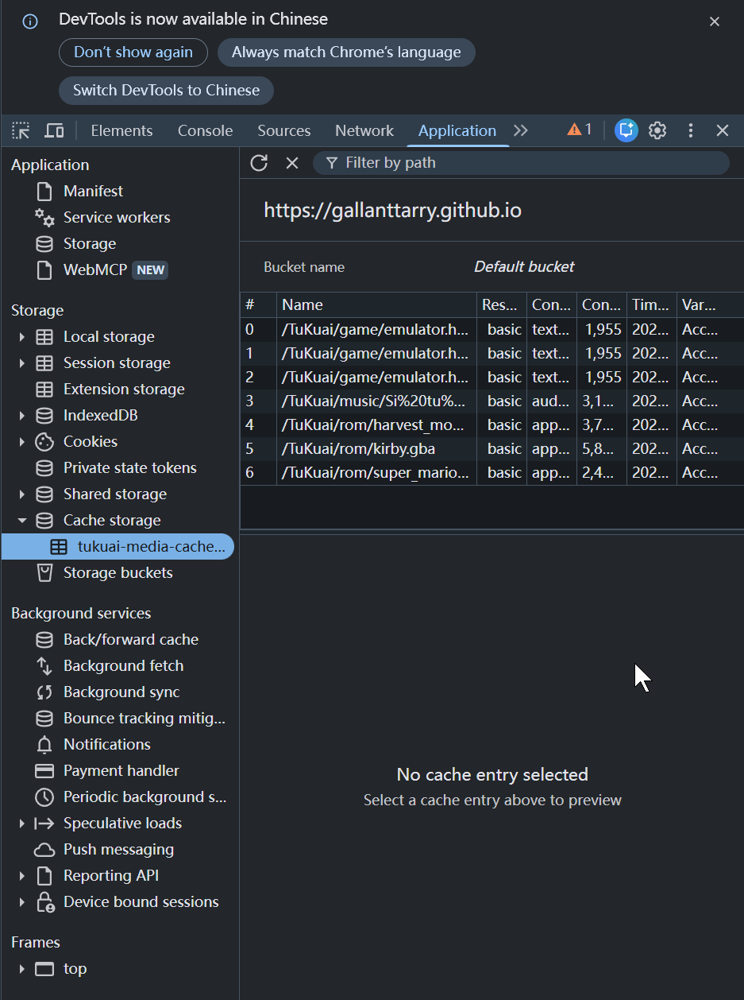

# Service Worker (服务工作线程)  
  
想要实现“按需缓存”（不点不下载，点过一次后永久保存在本地，下次秒开断网也能玩），最完美的纯前端解决方案就是引入 **Service Worker (服务工作线程)**。  
  
    
你可以把它理解为你网页里的一个“本地代理保安”。当用户点击某首音乐或某个游戏时，网页发出下载请求，保安会先拦截下来：  
  
    
1. **第一次点击**：保安发现本地没有，放行去网络下载。下载回来的同时，保安偷偷复印一份锁在浏览器的 `Cache Storage` 里，然后再给用户播放。  
            
      
2. **第二次点击（或下次打开网页）**：保安发现本地已经有复印件了，直接掐断网络请求，把本地的文件瞬间甩给用户。  
            
      
  
只需两步，即可在你的项目中加入这个黑科技：  
  
    
### 第一步：在根目录创建一个 `sw.js` 文件  
  
在你的 `index.html` 同级目录下，新建一个文本文件，命名为 `sw.js`，然后把下面这段代码原封不动地粘贴进去：  
  
    
JavaScript  
  
```  
// 缓存库的名称（你可以随时修改版本号来强制刷新缓存）  
const CACHE_NAME = 'tukuai-media-cache-v1';  
  
// 我们只拦截并缓存包含这些关键词的路径（音乐和游戏ROM）  
const CACHE_URL_KEYWORDS = ['/music/', '/rom/', '/game/'];  
  
// 1. 安装阶段：立即接管当前网页  
self.addEventListener('install', event => {  
    self.skipWaiting();    console.log('[Service Worker] 安装成功，已准备好按需缓存。');  
});  
  
self.addEventListener('activate', event => {  
    event.waitUntil(self.clients.claim());});  
  
// 2. 拦截请求的核心逻辑  
self.addEventListener('fetch', event => {  
    const url = event.request.url;  
    // 检查这个请求是不是音乐或者游戏 ROM    const isMediaOrRom = CACHE_URL_KEYWORDS.some(keyword => url.includes(keyword));  
    if (isMediaOrRom) {        event.respondWith(            caches.open(CACHE_NAME).then(async (cache) => {                // 步骤 A：去浏览器的本地金库里找找看有没有这个文件  
                const cachedResponse = await cache.match(event.request);                                if (cachedResponse) {  
                    console.log('[按需缓存] 命中本地文件，秒开！不需要网络下载 🚀:', url);  
                    return cachedResponse;                }  
                // 步骤 B：本地没有，走网络下载  
                console.log('[按需缓存] 第一次加载，正在从网络下载并存入本地 ⬇️:', url);  
                try {                    const networkResponse = await fetch(event.request);                    // 确保请求成功才缓存 (状态码 200)                    if (networkResponse && networkResponse.status === 200) {                        // 克隆一份数据存入本地缓存，原件返回给页面播放/运行  
                        cache.put(event.request, networkResponse.clone());                    }                    return networkResponse;                } catch (error) {                    console.error('[按需缓存] 网络请求失败:', error);  
                    throw error;                }            })        );    }    // 如果不是音乐和游戏，就不做任何拦截，走正常的网络请求  
});  
```  
  
### 第二步：在你的 `index.html` 中注册它  
  
回到你的 `index.html`，在 `</body>` 标签闭合之前，加上这段注册脚本，让网页一启动就唤醒这个保安：  
  
    
HTML  
  
```  
<script>  
    // 检查浏览器是否支持 Service Worker    if ('serviceWorker' in navigator) {        window.addEventListener('load', () => {            // 注册我们刚才写的 sw.js            navigator.serviceWorker.register('./sw.js')                .then(registration => {                    console.log('保安(ServiceWorker)已就位，作用域为: ', registration.scope);  
                })                .catch(error => {                    console.log('保安(ServiceWorker)注册失败: ', error);  
                });        });    }</script>  
</body>  
</html>  
```  
  
### 为什么这样做完美契合你的需求？  
  
1. **绝对的按需加载**：只要你的 `<audio>` 标签保持 `preload="none"`，用户不点播放，`sw.js` 就绝不会去乱下载音乐。只有当用户按下播放键或开始游戏的瞬间，拦截机制才会触发。  
            
      
2. **断网也能嗨**：大体积的 `xxx.mp3` 或 `xxx.gba` 被下载后，会被存放在浏览器自带的 **Cache Storage** 中（它比 localStorage 强大得多，存几百MB甚至几GB都不是问题）。  
            
      
3. **如何验证是否成功？**  
            
- 在电脑浏览器打开你的网页。  
                    
          
- 按 `F12` 打开开发者工具，点击顶部的 **"Application" (应用)** 标签页。  
                    
          
- 在左侧找到 **"Cache Storage" (缓存空间)**。  
                    
          
- 点一首歌或开一个游戏，你会惊奇地发现，对应的 MP3 或 GBA 文件瞬间出现在了这里！下次你甚至可以把电脑断网，刷新页面，游戏和这首歌依然能正常秒开。  
  
  
  
  
  
那么其实上面只是给您展示了下载音乐缓存和游戏缓存的技术，其实他完全可以完全离线访问。  
  
要想实现“用户以前登录过，哪怕现在完全没网，再次输入网址也能成功打开并完整浏览整个网页”，目前写的 sw.js 还需要做一点小小的升级。因为现在的 sw.js 只拦截了 /music/、/rom/ 和 /game/（即音乐和游戏）。如果完全断网，用户虽然能听缓存过的歌，但网页最核心的 index.html 主页面、Vue 框架、CSS 样式、头像图标 如果没有提前离线缓存，浏览器在断网时去请求它们就会直接报错“无法访问此网站（ERR_INTERNET_DISCONNECTED）”。  所以，要达成这个终极目标，你需要让“保安”在用户第一次联网时，把网页的骨架（静态资源）也一起强行打包带走。

```
// =========================================================  
// 1. 定义双缓存池与版本号  
// =========================================================  
// 核心金库：存放网页骨架。每次你修改了 index.html 或静态资源，就把 v1 改成 v2, v3...const CORE_CACHE_NAME = 'tukuai-core-v1';  
// 媒体金库：存放按需加载的大文件。  
const MEDIA_CACHE_NAME = 'tukuai-media-v1';  
  
// 你需要离线秒开的“核心物资清单”（严格核对你的文件路径）  
const CORE_ASSETS = [  
    './',                  // 根路径  
    './index.html',        // 主网页  
    './js/tailwindcss.js', // Tailwind  
    './js/vue.global.js',  // Vue  
    './font/Silkscreen-Regular.ttf', // 英文字体  
    './font/Silkscreen-Bold.ttf',    // 英文粗体  
    './font/zpix.ttf',               // 中文像素字体  
    './imgs/favicon.png',  
    './imgs/favicon.ico',  
    './imgs/applefavicon.png',  
    './imgs/bg.avif',      // 随机背景图（把所有的都写上）  
    './imgs/bg1.jpg',  
    './imgs/bg2.jpg',  
    './imgs/bg3.jpg',  
    './imgs/bg4.jpg',  
    './imgs/music-cover.png' // 灵动岛封面  
];  
  
// 按需缓存的关键词拦截  
const CACHE_URL_KEYWORDS = ['/music/', '/rom/', '/game/'];  
  
// =========================================================  
// 2. 安装阶段：预缓存核心物资 (Install)// =========================================================  
self.addEventListener('install', event => {  
    // 强制立即接管，不等待旧版本 SW 退出  
    self.skipWaiting();  
  
    // waitUntil 确保把核心物资全部下载并塞进金库后，安装才算完成  
    event.waitUntil(  
        caches.open(CORE_CACHE_NAME).then(cache => {  
            console.log('[Service Worker] ⚙️ 正在预缓存核心框架物资...');  
            return cache.addAll(CORE_ASSETS);  
        }).catch(err => {  
            console.error('[Service Worker] ❌ 预缓存失败，请检查 CORE_ASSETS 中的文件路径是否完全正确:', err);  
        })  
    );  
});  
  
// =========================================================  
// 3. 激活阶段：清理旧版本垃圾 (Activate)// =========================================================  
self.addEventListener('activate', event => {  
    // 宣誓主权，立刻控制所有打开的页面  
    event.waitUntil(self.clients.claim());  
  
    event.waitUntil(  
        caches.keys().then(cacheNames => {  
            return Promise.all(  
                cacheNames.map(cacheName => {  
                    // 如果发现名字不匹配当前版本的缓存，直接销毁，释放用户空间  
                    if (cacheName !== CORE_CACHE_NAME && cacheName !== MEDIA_CACHE_NAME) {  
                        console.log('[Service Worker] 🗑️ 删除过期的旧金库:', cacheName);  
                        return caches.delete(cacheName);  
                    }  
                })  
            );  
        })  
    );  
});  
  
// =========================================================  
// 4. 拦截请求：调度交通 (Fetch)// =========================================================  
self.addEventListener('fetch', event => {  
    const url = event.request.url;  
  
    // 只拦截 GET 请求，其他请求（如 POST）直接放行  
    if (event.request.method !== 'GET') return;  
  
    const isMediaOrRom = CACHE_URL_KEYWORDS.some(keyword => url.includes(keyword));  
  
    if (isMediaOrRom) {  
        // -----------------------------------------------------  
        // 策略 A：大文件按需加载（缓存优先，没有再下载）  
        // -----------------------------------------------------  
        event.respondWith(  
            caches.open(MEDIA_CACHE_NAME).then(async (cache) => {  
                const cachedResponse = await cache.match(event.request);  
                if (cachedResponse) {  
                    console.log('[按需缓存] 命中本地大文件 🚀:', url);  
                    return cachedResponse;  
                }  
  
                console.log('[按需缓存] 下载并存入本地 ⬇️:', url);  
                try {  
                    const networkResponse = await fetch(event.request);  
                    // 确保请求成功再缓存  
                    if (networkResponse && networkResponse.status === 200) {  
                        cache.put(event.request, networkResponse.clone());  
                    }  
                    return networkResponse;  
                } catch (error) {  
                    console.error('[按需缓存] 媒体请求断网失败:', error);  
                }  
            })  
        );  
    } else {  
        // -----------------------------------------------------  
        // 策略 B：核心框架及其他文件（缓存优先，离线保底）  
        // -----------------------------------------------------  
        event.respondWith(  
            caches.match(event.request).then(cachedResponse => {  
                // 1. 如果金库里有，直接给用户（实现断网秒开）  
                if (cachedResponse) {  
                    return cachedResponse;  
                }  
  
                // 2. 金库里没有，尝试去网上现拉  
                return fetch(event.request).then(networkResponse => {  
                    // 如果拉取失败，或者不是同源的安全请求（比如不蒜子的统计跨域），直接返回，不瞎缓存  
                    if (!networkResponse || networkResponse.status !== 200 || networkResponse.type !== 'basic') {  
                        return networkResponse;  
                    }  
  
                    // 把新发现的好东西也悄悄塞进核心金库里  
                    const responseToCache = networkResponse.clone();  
                    caches.open(CORE_CACHE_NAME).then(cache => {  
                        cache.put(event.request, responseToCache);  
                    });  
  
                    return networkResponse;  
                }).catch(() => {  
                    console.log('[Service Worker] 🌐 完全断网且本地无缓存:', url);  
                    // 在这里，如果是断网状态，所有在 CORE_ASSETS 里的文件早就命中返回了。  
                    // 走到这里的，通常是没缓存的外链，比如不蒜子统计脚本。断了就断了，不影响主体页面运行。  
                });  
            })  
        );  
    }  
});
```

这是我的网页的更新，做一个参考，实际上是告诉这个技术很成熟，对于听音乐玩游戏非常关键。