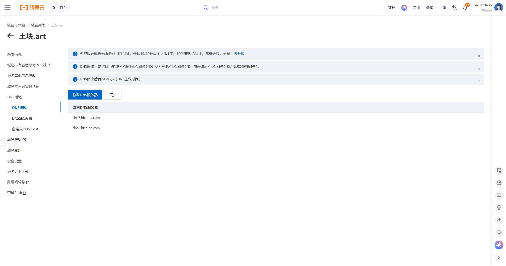

# 为什么需要cloudflare？

咱们用一句最通俗的大白话来定性：**“买域名的阿里云解析”和“转到 Cloudflare 的解析”，虽然干的活儿一样（都是 DNS 解析），但它们背后的“幕后老板”和“服务器基建”完全不是一个次元的。**

  

为了彻底帮你解开这个心结，我们抛开枯燥的专业术语，用个武林门派的比喻来拆解：

  

### 1. 默认的解析地址（阿里云解析）到底行不行？

**答：默认当然行！如果你只给海外用户看，或者不介意国内偶尔卡顿，用阿里云默认的解析完全没有任何毛病。**

  

- **它的原理：** 阿里云的 DNS 解析系统（比如你刚才看到的 `dns7.hichina.com`），是一个尽职尽责的“路标指示牌”。
    
      
    
- **当国内访客访问 `土块.art` 时：** 阿里云的路标会指引他：“去 GitHub 的海外服务器（185.199.x.x）找网页。”
    
      
    
- **它的短板：** 路标虽然指对了，但**从中国大陆到 GitHub 海外机房的那条“长途网路”是拥堵不堪的**。阿里云只是个指路保安，它自己手里没有海外加速服务器，帮不了你疏通国际长途的堵车。所以，默认解析能通，但速度全凭运气。
    
      
    

### 2. 为什么非要换成 Cloudflare 的解析？

因为把 DNS 托管权交给 Cloudflare，不仅是换了个“指路保安”，更重要的是**顺便换了一套极其庞大的全球加速快递网络（CDN）**。

  

- **当国内访客访问时：**
    
      
    - 因为你把 DNS 交给了 Cloudflare，并且点亮了“小黄云”，Cloudflare 的 DNS 就不再傻乎乎地把访客直接引到遥远的 GitHub 了。
        
          
        
    - 它会施展障眼法：**让访客就近连接 Cloudflare 在中国大陆周边（如香港、日韩、东南亚）甚至内地的边缘缓存节点。**
        
          
        
    - 你的网页文件（HTML、CSS、JS）早就被 Cloudflare 缓存到这些节点上了，由节点直接把内容“吐”给访客。
        
          
        
- **结果：** 访客的流量只在“家门口”的节点转了一圈就拿到了网页，**完美避开了中间拥堵的国际长途海底光缆**。
    
      
    

### 总结对比

|**解析方式**|**谁来指路 (DNS)**|**谁来提供服务器 (CDN)**|**国内访问体验**|
|---|---|---|---|
|**阿里云默认解析**|阿里云 (`hichina.com`)|纯 GitHub 海外源站|直连海外，经常卡顿、断连|
|**Cloudflare 解析 + 小黄云**|Cloudflare (`ns.cloudflare.com`)|Cloudflare 全球边缘加速节点|边缘节点缓存，免费且明显提速|

所以，默认解析**不是不行，而是不够快**。如果你希望国内访客能顺畅打开你的 TUKUAI OS，把 DNS 迁到 Cloudflare 并且打开那朵小黄云，就是目前不花一分钱、不用做繁琐备案的最强外挂！

