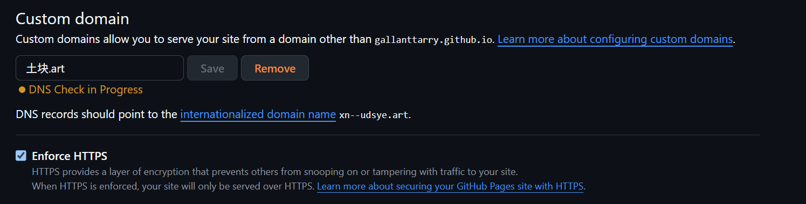
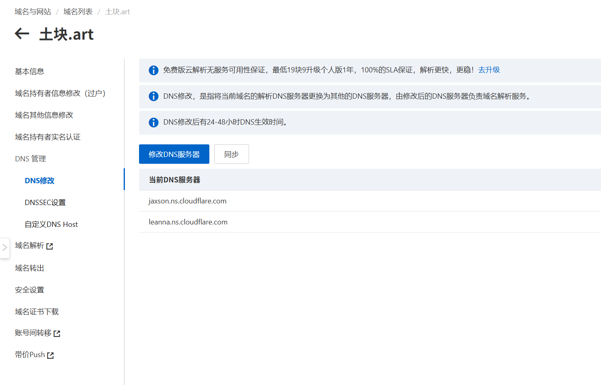

# 如何部署域名？

那么比如我的主网址https://gallanttarry.github.io/TuKuai/
先拆分他是github.io托管的。gallanttarry是他的二级域名，我的所有项目都被放在
这个二级域名里
那么非常的不好看，甚至可以看到他的项目TuKuai。且服务器在太平洋对面，
且不说大数据存储，就连访问都比较困难。所以急需Cloudflare的CDN全球加速服务来提高速度，这又需要自己的域名才可以。所以拥有一个域名是很重要的。

那么怎么让他变得简单呢？1.要去买一个域名，推荐到阿里云购买一个域名，自己喜欢即可。这里直接略过了购买方面，直接到最难的部署方面。那么先打开控制台，点击域名和网站，再点击全部域名，就是您购买过的域名。

先点击‘解析’，在里面为您购买的主域名配置好解析记录，当你购买域名后，你就可以绑定为你的域名名称@ 记录类型为A，然后依次输入四个 GitHub 的官方服务器 IP：

- 185.199.108.153

- 185.199.109.153

- 185.199.110.153

- 185.199.111.153

这时候您就可以去你的github主项目page去设置你的域名了。

这里还需要用工具获取底层机器码

- 使用在线 Punycode 转换工具，输入中文域名 `土块.art`。
    
      
    
- 获取并复制转换后的底层机器码：`xn--udsye.art`。
    

 在 **Custom domain** 框中，严格填入转码后的 `xn--udsye.art`，点击 Save。
    
      
    
- 此操作会自动在你的代码仓库根目录生成一个无后缀的 `CNAME` 文件，作为域名绑定的永久凭证。

一般是瞬间成功的，然后记得把HTTPS安全协议勾上，那么就可以以土块.art访问我的网页啦。
那么这里还要给一些补充，一个是重定向，一个是二级域名。

重定向的意思是，万维网www，很多人喜欢输入这个，其实域名可能不包含这个，这时候，您就需要用重定向www.土块.art来跳转到土块.art这个域名。下面是类型介绍。

## 1. CNAME 与 A 记录的核心区别

A 记录（Address Record）和 **CNAME 记录（Canonical Name Record）**是 DNS（域名系统）中最常用的两种记录类型，它们的主要区别在于**解析的目标不同**：

  

- **A 记录**：将域名直接指向一个明确的 **IPv4 地址**（例如 `192.0.2.1`）。它是最基础的解析方式，常用于根域名（如 `example.com`）。
    
      
    
- **CNAME 记录**：将一个域名（别名）指向**另一个域名**，而不是直接指向 IP。当目标域名的 IP 地址发生变化时，CNAME 记录会自动跟随，无需手动修改。它通常用于子域名（如将 `www.example.com` 指向 `username.github.io`）。
    
      
    

### 核心对比表

| **记录类型**     | **解析目标**                      | **典型应用场景**              | **特点与限制**                                       |
| ------------ | ----------------------------- | ----------------------- | ----------------------------------------------- |
| **A 记录**     | IPv4 地址（如 `192.0.2.1`）        | 根域名 (`example.com`)     | 目标必须是静态 IP，IP 变更时需同步修改 DNS。                     |
| **CNAME 记录** | 另一个域名（如 `username.github.io`） | 子域名 (`www.example.com`) | 不能与根域名的其他记录（如 MX 记录）冲突；传统 DNS 规范中根域名不能设置 CNAME。 |

## 2. GitHub Pages 对 CNAME 的要求与配置规范

如果你想为你的 GitHub Pages 部署自定义域名，GitHub 有着明确的要求和配置步骤：

  

### 仓库根目录必须包含 `CNAME` 文件（这个部署完后会自动加入）

- **文件内容**：文件中只需纯文本写入你的自定义域名（例如 `blog.example.com` 或 `example.com`），**不要**加 `http://`、`https://` 或末尾斜杠。比如：xn--9myv52d.xn--udsye.art翻译过来就是野生.土块.art
    
      
    
- **存放位置**：必须放在部署分支（如 `main` 或 `gh-pages`）的**根目录下**。如果使用 Hexo、Hugo 等静态生成器，通常需要将其放在 `source/` 目录下，以便编译后自动同步到根目录。
    
      
    

好介绍完了直接上图解释

那么这一条的意思就是重定向啦，将www.土块.art 重新定向到土块.art上就行了。难点是二级域名:

这里我添加名称为野生，跳转的地址为土块.art，也就是我的github域名

那么这里他其实定向的就是 野生.土块.art，因为我的githubpage的机制就是主域名只有一个，因为A已经绑定了4个ip，所以就相当于二级域名已经生成了，您再去另一个项目里绑定一下。

野生.土块.art，**再勾选上 HTTPS 安全协议**，那么就成功了。当别人点击你的另一个项目，也就跳转到野生.土块.art了。

那么到这里才会用到Cloudflare，不去阿里云先部署cloudflare可能会报错，所以要先去阿里云配置完，再去cloudflare搞，这里就要用到管理了，点击阿里云的管理按钮，然后在DNS管理按钮选择DNS修改，同时去cloudflare将你的土块.art输入进去，您会收到2个免费的服务器地址填入查询的NS地址，先去DNS解析里面修改为Cloudflare的解析地址。然后将刚刚配置的云解析系统分配的NS地址映射过去就可以了。

这个原理就相当于你将服务整体换成了cloudflare，那么为什么要这样做，这就要回到我们之前的目的了。阿里云并没有免费的 CDN 全球加速（最核心原因），当然还有很多原因在下面：
	

根本原因在于：**Cloudflare 提供了极其强大的免费企业级功能**（在开发者圈子里被称为“赛博菩萨”）。把解析交给它，主要是为了“白嫖”以下四大核心优势：

  

### 1. 免费的 CDN 全球加速（最核心原因）

如果你的网站放在 GitHub Pages 上，它的物理服务器在国外。国内用户直接访问时，经常会遇到加载极慢、甚至被 DNS 污染导致打不开的情况。

  

- 换成 Cloudflare 后，只要你开启了“小云朵”（代理状态开启），Cloudflare 就会变成你网站的“前置缓存”。
    
      
    
- 访客不再直接跨洋去连接 GitHub，而是连接到离访客最近的 Cloudflare 节点。这能大幅提升静态网页（HTML/CSS/图片）的加载速度。
    
      
    

### 2. 隐藏真实 IP 与安全防护（DDoS 防御）

如果你用的是自己的云服务器，直接把域名解析过去（A 记录），任何人都可以在终端里 `ping` 出你的服务器真实 IP。一旦被黑客盯上，很容易遭受攻击。

  

- 只要经过 Cloudflare 的代理，外界看到的永远是 Cloudflare 的海量节点 IP，你的真实服务器被完美隐藏在了幕后。
    
      
    
- 当有异常流量或恶意机器人攻击时，Cloudflare 会自动弹出拦截页面（也就是大家常遇到的“验证你是真人”的 5 秒盾），帮你挡住攻击。
    
      
    

### 3. 免费且全自动的 HTTPS (SSL) 证书

为了让网址前显示安全的小锁头（HTTPS），通常需要去申请 SSL 证书，而且很多免费证书每 3 个月或 1 年就要手动续期一次，非常繁琐。

  

- Cloudflare 提供了一键开启的 SSL 加密。只要流量经过它，它就会自动给你的域名套上 HTTPS 证书，并且永久自动续期，完全不需要你写代码或配置服务器。
    
      
    

### 4. 解析速度快且生效极速

Cloudflare 拥有全球最快的公有 DNS 基础设施之一。你在它后台修改一条解析记录，全球生效速度通常是以**秒**为单位的，而传统的域名注册商可能需要十分钟甚至更久。

  

**总结来说：**

你把解析换成 Cloudflare，相当于给你的域名请了一个**免费的超级保安兼快递员**。它不仅帮你的 GitHub Pages 加速分发文件，还能顺手帮你抵挡恶意攻击、自动配置加密证书。这就是为什么大多数人买完域名后，第一件事就是把 NS 改到 Cloudflare 的原因。

上面是ai生成的但是有一件事情不对，对于部署到githubpage的前端项目，先去购买的地方部署，再在page里修改域名，再打开https，再全面迁移云解析系统分配的NS地址，也就是A啊CNAME，那一块可以避免github报错的bug，因为：

**如果先迁到 Cloudflare（踩坑路线）：** 如果您一上来就把 NS 换到了 Cloudflare，并且开启了 Cloudflare 的“小云朵”（CDN 代理开启）。此时，Cloudflare 会把真实的解析记录隐藏起来，对外只展示 Cloudflare 自己的节点 IP。 **结果：** GitHub 去查 DNS 时，一看返回的是 Cloudflare 的 IP，而不是 GitHub 的 IP，就会判定“这个域名没有指向我！”，从而报错，拒绝为您绑定域名，也拒绝签发 HTTPS 证书。这是很容易出错的！即使暂时关闭了代理，成功率也不大，我不知道为什么，这只能说是我的实战经验结果倒推吧。

那么之前说的，请用谷歌浏览器登录~这句话就可以删除了，是不是很酷？快去试试吧！