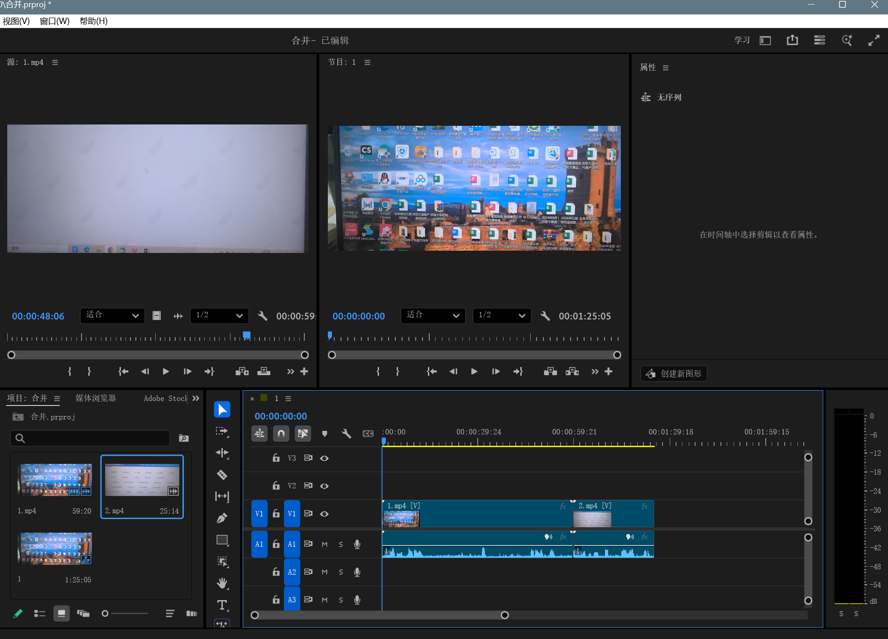

# Pr怎么合并视频？

先新建然后选择你需要合并的两个视频文件。

  

**第 1 步：把视频拉进软件**

把你要拼接的两个视频，直接用鼠标拖进 PR 左下角的空白处。

  

**第 2 步：让它们排好队**

  

1. 先把**第一个视频**拖到右边的长条区域（时间轴）。
    
      
    
2. 再把**第二个视频**拖下来，**紧挨着**放在第一个视频的屁股后面。
    
    _(注意：靠近时会有吸铁石一样的效果自动贴紧，确保中间没有缝隙。)_
    
      
    

**第 3 步：保存成一个新视频**

  

1. 按键盘快捷键 **Ctrl + M**（苹果电脑按 Cmd + M）。
    
      
    
2. 在弹出的界面上，格式选择 **H.264**（这就是最常用的 MP4 格式）。
    
      
    
3. 点击右下角的“导出”。
    
      
    

等进度条跑完，你的电脑里就会多出一个已经拼好的完整视频了！