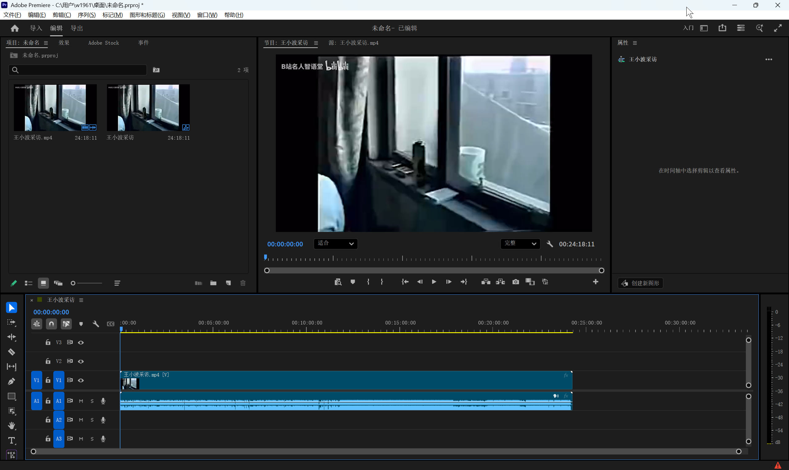
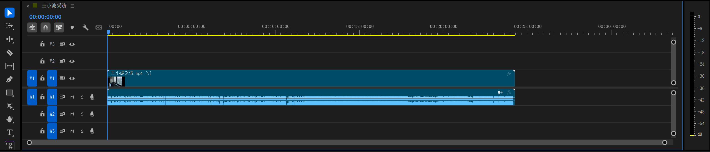

# Pr按钮都有啥用？

整个 PR 正处于一个完全初始化的“空项目”状态。

  

理解 PR 的底层逻辑，其实可以把它完全等同于开发软件时使用的 IDE（比如 IDEA 或 VS Code）。PR 剪辑的核心是“非破坏性编辑”。你在里面做的所有切割、拼接、加滤镜，都不会真正修改你硬盘里原本的那个视频文件，它本质上只是在写一套“组装图纸”。

  

结合你截图里的几个主要空白区域，整个标准的操作流程可以按照这四步走：

  

### 1. 引入资源（左上方：项目面板）

- **当前状态：** 截图左上角提示着“添加媒体”。
    
      
    
- **操作逻辑：** 这里相当于项目的资源管理器。你需要把将要用到的原始视频、音频、图片等素材，双击空白处全部导入进来。这就像是在开发前把依赖库和静态资源加载到工作区里。
    
      
    

### 2. 初始化主干（下半部分：时间线）

- **当前状态：** 截图下方占了很大一块面积的黑色区域，写着“将媒体拖放到此处以创建序列”。
    
      
    
- **操作逻辑：** “序列”（Sequence）就是你要导出的最终视频的载体，类似于程序里的 `main` 主入口。没有序列，所有的素材就只是仓库里的散件。
    
      
    
- **快速操作：** 最简单的建构方式，就是把你导入在左上角的原视频，鼠标左键按住，直接拖拽到底部的这块黑色区域松开。PR 会自动读取原始素材的分辨率（比如 1080p）和帧率，帮你初始化好这个剪辑的“运行环境”。
    
      
    

### 3. 拼装与调试（下半部分：时间线）

- **操作逻辑：** 序列建立好之后，底部面板就会出现长长的视频轨道（V1、V2...）和音频轨道（A1、A2...）。
    
      
    
- **图层覆盖：** 这是一个典型的堆叠结构，逻辑很像前端里的 `z-index`。放在上面轨道（比如 V2）的视频或图片，会直接遮挡住下方轨道（V1）的画面。你后续的裁切、拼接、或者加去水印的遮罩，都是在这个时间轴上来回微调。
    
      
    

### 4. 实时预览（正上方：节目监视器）

- **当前状态：** 截图正上方目前是一片黑屏。
    
      
    
- **操作逻辑：** 这就是热更新预览窗口。下方的“时间线”里只要有素材，且你的播放指针停在那一秒，这个窗口就会实时渲染并显示出那一秒的最终画面。你在这里看到什么样，最后导出来的视频就是什么样。
    
      
    

当所有拼装在时间线上完成后，最后一步就是“打包编译”——按下快捷键 `Ctrl + M`（或者点击左上角“导出”），PR 就会根据时间线上的排布指令，渲染出一个全新的 `.mp4` 视频文件。

  

----
TIP:为什么会出现“两个源视频”？

仔细看你第一张图左上角的项目面板，那两个缩略图右下角的小图标是不一样的。

- **左边的图标（带个小胶片和音轨）：** 这是你真正的原始视频文件 `王小波采访.mp4`。
    
- **右边的图标（带几条横线和播放头）：** 这叫 **序列（Sequence）**。
    

当你把一个视频直接拖进下方空空如也的时间线时，PR 为了省事，会自动帮你创建一个跟原视频分辨率、帧率完全一模一样的“序列”，并且**默认用原视频的名字给这个序列命名**。

用咱们熟悉的开发逻辑来类比：左边那个 `.mp4` 是你的静态资源文件（或者底层依赖），右边那个序列则是你 `new` 出来的 `Main` 主程序实例。你接下来所有的切割、加特效，都是在这个主程序（序列）里运行的，你的原始文件好好的躺在仓库里，毫发无损。这属于 PR 的正常自动化操作，不是 Bug。

  

这是 PR 最核心的工作台——**时间轴（Timeline）面板** 的轨道控制区。这些密密麻麻的按钮决定了你在剪辑时，到底在对哪些素材“动刀子”。

  

我们可以把这些按钮按使用频率分为三大类来理解：

  

### 1. 轨道基础控制（眼睛、锁头与字母）

这些图标就挨在 `V1`（视频轨道）和 `A1`（音频轨道）的旁边，控制着单条轨道的整体状态：

  

- **小锁头（切换轨道锁定）：** 类似于文件系统里的“只读模式”。点一下锁上后，这条轨道会出现斜线纹理，你无法再对它进行任何切割、移动或删除。这通常用于保护已经剪好定型的底层素材，防止误操作。
    
      
    
- **眼睛图标（仅限视频轨道）：** 控制图层的“可见性”。关掉它，该层的所有画面就会在预览窗口里消失。做去水印或者加特效时，经常用来反复开关，对比“修改前/修改后”的效果。
    
      
    
- **M 和 S（仅限音频轨道）：** `M` 代表 Mute（静音），点亮后这条轨道变成哑巴；`S` 代表 Solo（独奏），点亮后整个软件**只会播放**这条轨道的声音，其他所有音轨自动静音。单独挑某个人说话的声音或者听杂音时非常常用。
    
      
    

### 2. 全局剪辑开关（左上角的一排小图标）

这几个图标控制着你鼠标操作时的全局逻辑，非常关键：

  - **序列嵌套（将序列作为嵌套或单个剪辑插入和覆盖）：** 默认开启（变成蓝色）。如果你把一个序列拖进另一个序列的时间轴里，它会作为一个整体的嵌套剪辑（Nest）被打包。这类似于在软件开发中把一段独立逻辑封装成了一个子函数，在主轨道里只显示为一个整体块。**当按钮熄灭（关闭）时：** 把序列拖进去之后，PR 会自动把它“解包”，把里面所有的子视频、音频原封不动地全部铺开在时间轴上。平时如果只是处理单视频剪辑，保持默认即可。
    
      
    
- **磁铁图标（在时间轴中吸附）：** 默认开启（变成蓝色）。这是个极其好用的辅助功能，开启后，当你拖动一段视频靠近另一段视频的边缘，或者靠近播放指针时，它们会自动“吸附”对齐。这能保证你的两段视频无缝衔接，中间绝不会漏掉一两帧导致黑屏闪烁。
    
      
    
- **链条图标（链接的选择）：** 决定了画面和声音是否“强绑定”。在你的截图里它是开启状态，所以当你点击画面时，底下跟着的录音也会一起亮起白框（被同时选中）。如果你想单独把原声删掉换成背景音乐，就需要先关掉这个链条。
    
      
    

### 3. 轨道目标指示（蓝色的 V1/A1 方块）

- **高亮的蓝色区块：** 这代表了你当前“正在操作的目标层”。比如你按下快捷键 `Ctrl + V` 粘贴一段视频时，系统就是根据哪个轨道的 `V` 亮着蓝色，就把视频粘贴在哪一层。点击它们可以来回切换目标轨道。这两个英文字母其实就是最基础的英文缩写：

- **V** 代表 **Video（视频）**。V1、V2、V3 对应的就是视频画面的第一层、第二层、第三层。
    
- **A** 代表 **Audio（音频）**。A1、A2、A3 对应的就是声音的第一层、第二层、第三层。
    

关于你说的“亮着就粘贴入”的逻辑，确实如此。不过如果你仔细看截图，会发现小锁头（🔒）的**左边**和**右边**，各有一组高亮的 V1 和 A1。它们的分工稍微有一点点不同，这也是很多新手容易晕的地方：

- **锁头右边这组（轨道目标）：** 专门管 **快捷键复制粘贴 (Ctrl+C / Ctrl+V)**。假设你把右边的 V1 点灭，点亮了 V2（变蓝），此时你按 Ctrl+V 粘贴一段视频，它就会精准落在 V2 轨道上。
    
- **锁头最左边这组（源修补）：** 专门管 **从外部或源面板插入素材**。比如你从左上角的资源仓库里双击了一段新素材，然后按快捷键把它“插入”到时间轴，最左边的蓝色方块停在几轨，这段新素材就会落进几轨。
    

总结来说，这些蓝色亮块就是 PR 里的“当前激活层指示灯”。
    
      
    

左边这个是 PR 的“工具面板”（Tools Panel）。

  

可以把它理解为你的“鼠标状态切换器”。它决定了你的鼠标在底部时间轴里点击视频时，到底会执行什么动作。

  

你截图里高亮成蓝色的那个，就是剪辑最核心的工具。我来给你挑几个日常必须要认识的介绍一下（按从上到下的顺序）：

  

- **选择工具（最顶部的箭头，快捷键 `V`）：** 这是默认的、也是使用频率最高的工具。它的作用是**选中**视频、**拖动**位置、或者拉长缩短视频边缘。你在添加特效、调整面板时，鼠标必须在这个状态。
    
      
    
- **剃刀工具（亮蓝色的刀片，快捷键 `C`）：** 也就是你当前选中的这个。顾名思义，它是用来**切开视频**的。选中它之后，你的鼠标就变成了一把刀，在时间轴的视频条上点哪里，视频就会从哪里断成两截。通常用来把不要的废片切出来删掉。
    
      
    
- **钢笔工具（钢笔图标，快捷键 `P`）：** 用来在时间轴上给声音或者画面打关键帧（比如做声音渐渐变小的效果），或者手动绘制不规则的蒙版形状。
    
      
    
- **抓手工具（小手图标，快捷键 `H`）：** 当你的时间轴轨道放大得很长、屏幕装不下时，可以用它按住左键拖拽，来回滑动查看时间线。
    
      
    
- **文字工具（字母 T，快捷键 `T`）：** 点击它，然后再去右上角的视频预览画面上点一下，就可以直接在视频上打字加字幕了。
    
      
    

**💡 避坑指南：**

新手最常犯的错误，就是用“剃刀”（蓝色状态）切完视频后，忘了切回最上面的“箭头”，结果鼠标下意识一点，又把视频不小心切碎了。

所以一定要养成肌肉记忆：**不管用了什么工具，用完马上按快捷键 `V` 切回顶部箭头！**