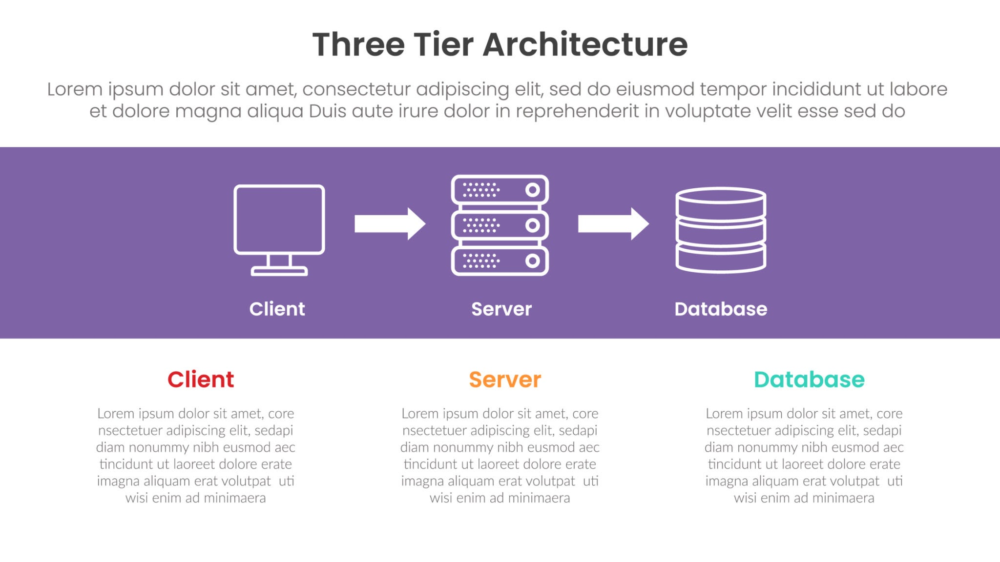

# 什么是三层架构？

在软件工程的江湖中，构建一个健壮的后端系统，就如同建立一个底蕴深厚的武林门派。如果把代码全部堆砌在一起，系统就会像一座没有横梁支撑的危楼，稍有风吹草动便会轰然倒塌。为了让系统稳固、易于扩展，前辈们总结出了一套经典的内功心法——**三层架构（Three-Tier Architecture）**。

今天，我们就来深度剖析一下，这套历久弥新的架构在后端开发中究竟扮演着怎样不可或缺的角色。

## 一、 拨云见日：什么是三层架构？

在后端开发中，三层架构是一种将整个业务应用划分为三个独立层次的软件设计模式。这三层分别是：**表示层（Presentation Layer）**、**业务逻辑层（Business Logic Layer，简称 BLL）**以及**数据访问层（Data Access Layer，简称 DAL）**。

它们各司其职，又紧密协作：

1. **表示层（Controller / UI 层）—— 门派的迎客堂**
    
    - **职责**：负责接收外部的请求（如前端网页、移动端 App 发来的 HTTP 请求），进行简单的参数校验，然后将任务分发给下一层。处理完成后，它再将结果封装成特定格式（如 JSON）返回给调用方。
        
    - **特点**：极其轻薄，不包含任何复杂的业务计算。它只关心“别人进来了要什么”以及“最后给别人什么”。
        
2. **业务逻辑层（Service 层）—— 门派的核心内功**
    
    - **职责**：承上启下，是整个系统的大脑。所有核心的业务规则、计算逻辑、流程编排都在这里完成。它接收表示层传来的指令，经过严密的逻辑判断后，向数据层下达操作指令。
        
    - **特点**：最为厚重。它是系统中最具价值的部分，也是需求变更时修改最频繁的地方。
        
3. **数据访问层（DAO 层 / Mapper 层）—— 门派的藏经阁**
    
    - **职责**：专职负责与底层数据库（如 MySQL、PostgreSQL、Redis 等）打交道。它提供增删改查（CRUD）的接口，将数据库中的数据转化为业务逻辑层能看懂的“对象”。
        
    - **特点**：绝对纯粹。它不关心业务逻辑，只负责执行 SQL 语句或操作缓存，是纯粹的数据搬运工。
        

## 二、 中流砥柱：三层架构在后端中的核心作用

少侠可能会问，把代码都写在一个文件里不是跑得更快、写得更爽吗？为何要费力分层？三层架构在后端中的核心作用，主要体现在以下几个方面：

### 1. 极致的“解耦”（高内聚，低耦合）

如果代码不分层，一旦数据库从 MySQL 换成 Oracle，或者前端接口格式从 XML 变成 JSON，你可能需要把整个项目的代码翻个底朝天。三层架构通过接口将各层隔离，每一层只和相邻的层通信。改动数据层，不会影响业务层；改动表示层，也不会波及底层数据。这种“解耦”让系统具备了极强的抗风险能力。

### 2. 大幅提升代码的“可维护性”与“复用性”

在日常开发中，同一个业务逻辑往往会被多处调用。例如“校验用户权限”这个逻辑，如果不分层，你可能要在几十个接口里各写一遍。有了三层架构，你只需在 Service 层写一次，所有的 Controller（无论是 Web 端还是移动端）都可以直接调用这个服务。

当出现 Bug 时，分层架构也能帮你快速定位：

- 接口报 400 参数错误？去 Controller 层找。
    
- 订单金额算错了？去 Service 层找。
    
- 数据没有存入数据库？去 DAO 层排查。
    

### 3. 支撑团队的高效协同开发

在大型项目中，开发团队往往有几十上百人。三层架构制定了明确的契约（接口）。架构师定好各层的接口后，开发人员可以**并行作业**。有人专门写底层 SQL，有人专门堆砌复杂的业务逻辑，大家互不干扰，大大缩短了开发周期，最后完美拼装。

### 4. 建立天然的安全屏障

安全是后端开发的生命线。三层架构严格限制了跨层访问，外部请求绝对无法直接触碰数据库。Controller 层会过滤掉恶意参数，防止基础的注入攻击；Service 层会进行严格的业务权限校验，确保越权访问被拦截。即使某一个接口被攻破，攻击者也必须突破层层防线才能拿到核心数据。

## 三、 实战推演：一次请求的奇妙之旅

为了让少侠有更直观的感受，我们以“用户注册”这个常见的场景为例，看看三层架构是如何精密运转的：

|**所处层次**|**执行动作与职责**|**隐喻**|
|---|---|---|
|**表示层 (Controller)**|接收用户名和密码。检查用户名是否为空，密码长度是否满足要求。如果格式错误，直接返回 `{"error": "参数有误"}`。格式正确则调用 Service 层。|迎门弟子查验拜帖格式，不合格直接拒之门外。|
|**业务逻辑层 (Service)**|调用 DAO 层查询该用户名是否已被注册；如果未被注册，使用加密算法（如 BCrypt）对密码进行加盐哈希；构造完整的用户信息对象，再次调用 DAO 层进行保存。|核心长老审核资质，废除其原有武功（密码加密），赐予入门信物。|
|**数据访问层 (DAO)**|接收 Service 层传来的查询或保存指令，生成对应的 `SELECT` 或 `INSERT` 语句，连接数据库执行，并返回成功或失败的结果。|掌门大弟子拿着钥匙去藏经阁（数据库）录入新弟子名册。|

整个过程行云流水，职责泾渭分明。Controller 不懂加密算法，Service 不懂 SQL 语句，DAO 不懂 HTTP 协议，但它们组合在一起，就形成了一个坚不可摧的系统。

## 四、 结语：从三层架构到万物互联

三层架构并不是技术的终点，而是后端工程化思维的起点。

随着互联网的发展，项目规模越来越庞大，我们后来又在三层架构的基础上演进出了**DDD（领域驱动设计）**、**微服务架构（Microservices）**甚至**Serverless架构**。但万变不离其宗，无论架构如何演进，其核心思想永远是“**关注点分离**”与“**职责单一**”。

掌握了三层架构，你就掌握了后端系统设计的底层逻辑。