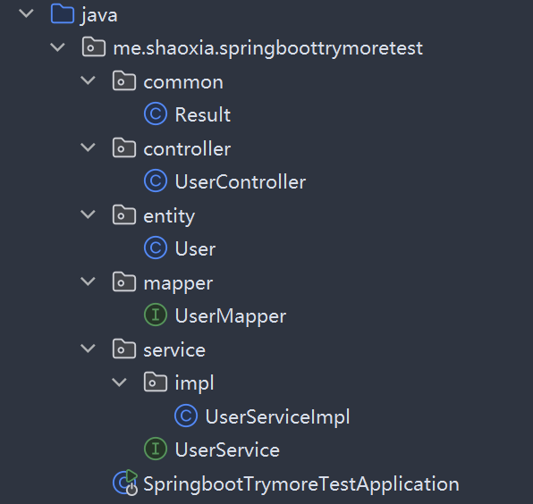

# 如何用Idea初建springboot项目？

### 1.基本配置

1.推荐基本组合
2.me.tukuai
3.Java 21  
4.Springboot3.5.16
5.MP3.5.5
6.application.yaml
7.MySQL Server 8.4

[点击下载 MySQL 8.4.11 可视化版](https://github.com/GallantTarry/Obsidian-Vault/releases/download/v1.0.0/mysql-8.4.11-winx64.rar)密码574185一路点到底，默认用户名为root，设置密码即可 默认路径cd C:\Program Files\MySQL\MySQL Server 8.4\binmysql -uroot -p 输入密码即可继续操作

拓展插件
- 1.lombok
- 2.springboot devtools
- 3.spring configuration processor
- 4.spring web
- 5.mysql driver
- 6.mybatis framework


这六个依赖（组件）是 Java 后端开发中，特别是使用 Spring Boot 搭建主流 Web 项目时极其经典的基础组合。它们各自有着明确的分工，旨在极大程度地简化开发流程。

以下是它们的核心作用和应用场景：

#### 1. Lombok

- **核心作用**：**消除 Java 的样板（冗余）代码。**
    
- **详细说明**：在传统的 Java 开发中，我们需要为每个实体类（Entity/Bean）手写大量的 `getter`、`setter`、`toString()`、无参/全参构造方法等。Lombok 允许你通过简单的注解（例如 `@Data` 或 `@AllArgsConstructor`），在**代码编译阶段**自动生成这些方法。这让你的 Java 类变得极其清爽，易于阅读和维护。
    

#### 2. Spring Boot DevTools (开发者工具)

- **核心作用**：**提升开发效率，提供“热部署”功能。**
    
- **详细说明**：在开发阶段，每次修改完代码手动重启项目非常耗时。DevTools 会监控你项目代码的变化，当你保存修改（触发编译）后，它会自动且极快地重启应用（因为它只重新加载你修改的业务代码，不重新加载底层的第三方库）。它极大地缩短了“修改代码 -> 查看效果”的反馈循环。
    

#### 3. Spring Configuration Processor (配置处理器)

- **核心作用**：**为自定义配置文件提供 IDE 智能提示。**
    
- **详细说明**：在 Spring Boot 中，我们经常将 `application.yml` 或 `application.properties` 中的自定义配置项绑定到 Java 类上（使用 `@ConfigurationProperties`）。引入这个依赖后，它会在编译时生成配置的元数据文件。这样，你在配置文件中手写自定义属性时，你的开发工具（如 IDEA）就能像提示系统自带配置一样，给你**自动补全和校验提示**，防止拼写错误。
    

#### 4. Spring Web

- **核心作用**：**构建 Web 应用和 RESTful API 的核心骨架。**
    
- **详细说明**：这是开发后端接口绝对必不可少的依赖。它引入了 Spring MVC 框架，让你能用 `@RestController`、`@GetMapping` 等注解轻松编写处理 HTTP 请求的接口。此外，它默认**内嵌了 Tomcat 服务器**，这意味着你的项目可以直接打包成一个 Jar 包运行，无需再繁琐地部署到外部的独立 Tomcat 中。
    

#### 5. MySQL Driver (MySQL 驱动)

- **核心作用**：**充当 Java 语言与 MySQL 数据库之间的“翻译官”。**
    
- **详细说明**：Java 语言本身并不知道如何直接跟 MySQL 数据库进行网络通信，必须依靠各大数据库厂商提供的 JDBC 驱动实现。MySQL Driver 就是官方提供的连接库，有了它，你的 Spring Boot 应用程序才能成功与 MySQL 建立网络连接并发送指令。
    

#### 6. MyBatis Framework

- **核心作用**：**简化数据库交互的半自动 ORM（对象关系映射）框架。**
    
- **详细说明**：如果不使用框架，用 Java 原生的 JDBC 去操作数据库，需要写大量开启连接、拼接 SQL、手动组装结果集的繁琐代码。MyBatis 可以让你把 SQL 语句集中写在 XML 文件或注解中，它会自动帮你把传入的 Java 对象拆解成 SQL 参数，再把数据库查出来的结果集（ResultSet）自动封装成 Java 对象。它既消除了大量重复性代码，又保留了开发者亲手编写和优化复杂 SQL 的能力。那么用这个依赖就是让你使用MP去换掉他，虽然MP在多表联查会显得很弱势，在做超大型项目会力不从心，但在你没有深入研究量子物理学之前，宏观物理学框架够您学到下辈子了。
    

**💡 通俗的场景总结：**

如果把你正在搭建的后端项目比作一家**现代餐厅**：

- **Spring Web** 是门店的接待台和前厅服务员，专门负责接收客人的点单（处理 HTTP 请求）。
    
- **MySQL Driver** 是通往食材仓库的专属公路（建立数据库网络连接）。
    
- **MyBatis** 是餐厅里经验丰富的搬运工，负责顺着公路去仓库，精准地把食材拿出来交给你（执行 SQL 并返回数据对象）。
    
- **Lombok** 是后厨的自动切菜机，帮你省去了最枯燥的备菜工作（消除冗余代码）。
    
- **DevTools** 和 **Configuration Processor** 则是配给餐厅老板（你）的对讲机和高级管理面板，让你的开店和调试过程变得丝滑无比。


#### 7.不能直接在原依赖上“附加”使用，而是需要“替换”装备。

如果你想在项目中使用 MyBatis-Plus，你需要把 Spring Boot 初始化时引入的 `mybatis-spring-boot-starter` 依赖**移除或替换**为 `mybatis-plus-boot-starter`。


打开你项目的 `pom.xml` 文件：

**第一步：删掉（或注释掉）这套旧装备**

XML

```
<dependency>
    <groupId>org.mybatis.spring.boot</groupId>
    <artifactId>mybatis-spring-boot-starter</artifactId>
    <version>xxx</version>
</dependency>
```

**第二步：换上新装备**

XML

```
<dependency>
    <groupId>com.baomidou</groupId>
    <artifactId>mybatis-plus-boot-starter</artifactId>
    <version>3.5.5</version>
 </dependency>
```

换好这套装备，刷新一下 Maven，你开发常规后端接口的速度绝对能翻一倍！


注意：现在的springboot创建时已经不能提供您3.xxx版本了，那么您要手动去maven修改他的版本号为3.5.16。

```

<parent>  
    <groupId>org.springframework.boot</groupId>  
    <artifactId>spring-boot-starter-parent</artifactId>  
    <version>3.5.16</version>  
    <relativePath/> <!-- lookup parent from repository -->  
</parent>

```

---
#### 8.复制粘贴生成基础框架

很大概率是在创立完4.x的spring-boot-parent版本后，再修改为3.5.16导致的pom文件冲突，因为极有可能在4.x版本中，pom加了一些什么Test依赖。那么最好的办法是什么？那就是复制粘贴control+ACV,我已经将配置好的pom加上依赖，而且把基础的mybatis换成了plus3.5.5版本

```
<?xml version="1.0" encoding="UTF-8"?>  
<project xmlns="http://maven.apache.org/POM/4.0.0" xmlns:xsi="http://www.w3.org/2001/XMLSchema-instance"  
         xsi:schemaLocation="http://maven.apache.org/POM/4.0.0 https://maven.apache.org/xsd/maven-4.0.0.xsd">  
    <modelVersion>4.0.0</modelVersion>  
    <parent>  
        <groupId>org.springframework.boot</groupId>  
        <artifactId>spring-boot-starter-parent</artifactId>  
        <version>3.5.16</version>  
        <relativePath/> <!-- lookup parent from repository -->  
    </parent>  
    <groupId>com.shaoxia</groupId>  
    <artifactId>springboot-trymore-test</artifactId>  
    <version>0.0.1-SNAPSHOT</version>  
    <name>springboot-trymore-test</name>  
    <description>springboot-trymore-test</description>  
    <url/>  
    <licenses>  
        <license/>  
    </licenses>  
    <developers>  
        <developer/>  
    </developers>  
    <scm>  
        <connection/>  
        <developerConnection/>  
        <tag/>  
        <url/>  
    </scm>  
    <properties>  
        <java.version>21</java.version>  
    </properties>  
    <dependencies>  
        <dependency>  
            <groupId>org.springframework.boot</groupId>  
            <artifactId>spring-boot-starter-web</artifactId>  
        </dependency>  
        <dependency>  
            <groupId>com.baomidou</groupId>  
            <artifactId>mybatis-plus-spring-boot3-starter</artifactId>  
            <version>3.5.5</version>  
        </dependency>  
        <dependency>  
            <groupId>org.springframework.boot</groupId>  
            <artifactId>spring-boot-devtools</artifactId>  
            <scope>runtime</scope>  
            <optional>true</optional>  
        </dependency>  
        <dependency>  
            <groupId>com.mysql</groupId>  
            <artifactId>mysql-connector-j</artifactId>  
            <scope>runtime</scope>  
        </dependency>  
        <dependency>  
            <groupId>org.projectlombok</groupId>  
            <artifactId>lombok</artifactId>  
            <optional>true</optional>  
        </dependency>  
        <dependency>  
            <groupId>org.springframework.boot</groupId>  
            <artifactId>spring-boot-starter-test</artifactId>  
            <scope>test</scope>  
        </dependency>  
        <dependency>  
            <groupId>org.mybatis.spring.boot</groupId>  
            <artifactId>mybatis-spring-boot-starter-test</artifactId>  
            <version>3.0.5</version>  
            <scope>test</scope>  
        </dependency>  
        <dependency>  
            <groupId>org.springframework.boot</groupId>  
            <artifactId>spring-boot-starter-actuator</artifactId>  
        </dependency>  
    </dependencies>  
  
    <build>  
        <plugins>  
            <plugin>  
                <groupId>org.springframework.boot</groupId>  
                <artifactId>spring-boot-maven-plugin</artifactId>  
                <configuration>  
                    <excludes>  
                        <exclude>  
                            <groupId>org.projectlombok</groupId>  
                            <artifactId>lombok</artifactId>  
                        </exclude>  
                    </excludes>  
                </configuration>  
            </plugin>  
            <plugin>  
                <groupId>org.apache.maven.plugins</groupId>  
                <artifactId>maven-compiler-plugin</artifactId>  
                <executions>  
                    <execution>  
                        <id>default-compile</id>  
                        <phase>compile</phase>  
                        <goals>  
                            <goal>compile</goal>  
                        </goals>  
                        <configuration>  
                            <annotationProcessorPaths>  
                                <path>  
                                    <groupId>org.projectlombok</groupId>  
                                    <artifactId>lombok</artifactId>  
                                </path>  
                                <path>  
                                    <groupId>org.springframework.boot</groupId>  
                                    <artifactId>spring-boot-configuration-processor</artifactId>  
                                </path>  
                            </annotationProcessorPaths>  
                        </configuration>  
                    </execution>  
                    <execution>  
                        <id>default-testCompile</id>  
                        <phase>test-compile</phase>  
                        <goals>  
                            <goal>testCompile</goal>  
                        </goals>  
                        <configuration>  
                            <annotationProcessorPaths>  
                                <path>  
                                    <groupId>org.projectlombok</groupId>  
                                    <artifactId>lombok</artifactId>  
                                </path>  
                            </annotationProcessorPaths>  
                        </configuration>  
                    </execution>  
                </executions>  
            </plugin>  
        </plugins>  
    </build>  
  
</project>
```

那其实就是只要把这串代码直接复制到pom里加载jar包，就可以一步到位了，您甚至可以随便选择springboot版本，不用去搜索下载依赖，直接复制粘贴，唯快不破。

### 2.数据库配置

#### ⚙️ 约定大于配置与 Spring Boot 的边界

在 Geek 空间里常常谈到“约定大于配置”。Spring Boot 确实有着极佳的开箱即用体验：内置了 Tomcat 服务器、默认映射 `8080` 本地端口，并且能够直接启动 `static/index.html`。

然而，这种“约定”是有边界的。一旦在项目依赖中加入了 MySQL Driver 驱动，就**必须**显式配置 MySQL。因为数据库并非 Spring Boot 的强制依赖，加入它就意味着跳出了整体框架默认的“约定”范畴。

#### 🛠️ 架构层面的取舍（以 ToolKit 为例）

在某些特定的纯工具功能中，我们甚至不需要数据库。以 ToolKit 软件客户端的 `RenamerPanel`（改名板块）为例，在标准的三层架构中：

- **控制层 (Controller)**：仅用于接收前端通过 `fetch` 或 `axios` 发起的 API 请求。
    
- **业务层 (Service)**：专注于编写具体的重命名逻辑。
    
- **数据层 (Mapper)**：完全不需要参与，无需与数据库进行任何交互。
    

#### 🚫 外部数据库的痛点（以《拯救公猪》为例）

尽管有些模块不需要数据库，但作为一个完整的业务系统，长期的“增删改查”是不可避免的。如果在项目中调用外部 API 作为数据库（如《拯救公猪》早期调用 Supabase 里的 Postgres 数据库），会面临以下致命缺陷：

- **成本受限**：临时免费的流量极其有限，一旦产生庞大的数据交互，就必须付费升级 Pro 计划。
    
- **违背高内聚**：Spring Boot 本身已部署在公网服务器提供接口，再去跨网调用国外的数据库，不仅架构松散，且体验极差。
    
- **网络风险**：涉及跨国公网调用，在国内环境下，网络波动甚至“被墙”是常有的事。
    

#### 💡 数据库选型与部署建议

综上所述，**最佳实践是在项目建立初期，就配置好依赖并链接上自己的数据库。**

- **推荐选型**：强烈推荐 **MySQL 8.4 LTS**（长期支持版本），其核心优势在于极致的稳定性和兼容性。
    
- **数据迁移方案**：可以借助 DataGrip 工具，调用 `mysql/bin/mysqldump.exe` 进行 SQL 脚本导出。随后或配合 Docker，能极其方便地将数据无缝导入到 Ubuntu 生产环境中。
    
- **⚠️ 核心避坑**：需特别注意环境密码的一致性。如果本地 MySQL 配置了密码，那么在 Ubuntu 端，即使安装 MySQL 时跳过了密码步骤，也必须重新配置一个与 Spring Boot 约定好的一致密码。
    

```
server:  
  port: 6506  
  
  spring:  
  datasource:  
    url: jdbc:mysql://localhost:3306/shaoxia_db?useUnicode=true&characterEncoding=utf-8&serverTimezone=Asia/Shanghai  
    username: root  
    password: 574185  
    driver-class-name: com.mysql.cj.jdbc.Driver
```

这里也帮您自定义了端口，因为配置端口应该是清晰且早晚的事情。8080端口只是方便测试而已。到了这里几乎所有的配置已经完成了，但是到这里还是没有完全完成一个项目框架的基本建立，那么我还要推荐一个非常经典的**三层架构（Three-Tier Architecture）**，现在的很多架构其实都来自于三层架构随着互联网的发展，项目规模越来越庞大，我们后来又在三层架构的基础上演进出了DDD（领域驱动设计）、微服务架构（Microservices）甚至Serverless架构。但万变不离其宗，无论架构如何演进，其核心思想永远是“**关注点分离**”与“**职责单一**”。





