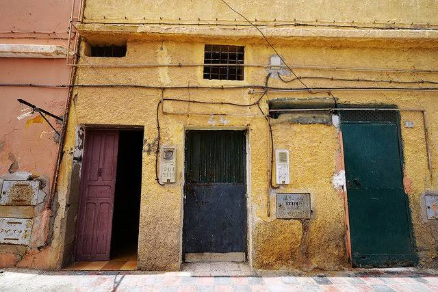

# 三毛

<!-- 专属定制：极简暗黑毛玻璃 APlayer -->

<!-- 播放器容器 -->

<!-- 播放器初始化脚本 -->

三毛与荷西的故事，是现代华语文学中最动人、也最令人唏嘘的爱情传奇。它不仅是一段跨国之恋，更是一种灵魂层面的深度契合。

---

在这段关系中，荷西的质朴、包容与纯粹，完美接住了三毛那颗极度敏感又向往极致自由的心。

---

他们的故事可以分为四个命运般交织的阶段：

### 1. 马德里的六年之约（初识与等待）

1967年，三毛在西班牙马德里大学求学时，结识了比她小8岁的西班牙男孩荷西（José María Quero y Ruíz）。当时的荷西还是个高三学生，经常逃课来看三毛。
有一天，荷西认真地对三毛说：“Echo（三毛的英文名），你等我六年。我有四年大学要念，还有两年兵役要服。六年一过，我就娶你。”
当时的三毛觉得这不过是小男孩的戏言，加上自己已有男友，便拒绝了他，两人随后断了联系。在接下来的几年里，三毛经历了初恋无果、未婚夫猝死等巨大打击，心灰意冷，几经流转后再次回到了西班牙。
冥冥之中，刚好六年过去，荷西真的回来找她了。那时的荷西已经长成了一个留着大胡子、高大沉稳的男人。当三毛看到荷西房间的墙上贴满了他偷偷放大的自己的照片时，她被彻底打动，决定将一生托付给这个执着爱她的男人。

### 2. 奔赴撒哈拉（白手起家的沙漠婚姻）

1973年，三毛偶然在一本《国家地理》杂志上看到了广袤的撒哈拉沙漠，心中升起了一种难以名状的“前世乡愁”，决定要去沙漠生活。
所有人都觉得她疯了，唯独荷西。他没有一句废话，默默收拾行李，提前在西属撒哈拉的阿雍小镇（El Aaiún）找到了一份磷矿公司的工作，在那里等她。

---

就是在这座今天看来依然简陋的黄色平房里，他们于1973年结为夫妻。荷西送给三毛的结婚礼物，不是鲜花或钻戒，而是一个他在沙漠里顶着烈日找到的完整骆驼头骨，三毛对此爱不释手。

---

### 3. 沙漠里的“神仙眷侣”（最辉煌的创作期）

在撒哈拉的生活异常艰苦。他们的家最初是在坟场区附近租来的一间破旧平房，屋顶会掉土，水资源极度匮乏，气温极端。
但三毛和荷西硬是靠着双手，把这片荒芜变成了最浪漫的家：

* **拾荒建家：** 他们去垃圾场捡来别人丢弃的废木材自己做家具，用装化工原料的废铁桶做座椅，买来便宜的石灰自己粉刷墙壁，用旧汽车外胎做成美丽的坐垫。
* **沙漠日常：** 荷西在矿场做潜水员和机械师，三毛则在家里写作、用极度匮乏的食材做“中国菜”（把粉丝说成是“春雨”，把猪肉干说是“治喉咙痛的药”骗荷西吃）。三毛还在当地做起了义务的“赤脚医生”，甚至开起了“沙漠驾校”。

正是在这段时期，三毛写下了脍炙人口的《撒哈拉的故事》《哭泣的骆驼》等散文。书里的荷西木讷、质朴却对三毛无限纵容，两人在苍茫大漠中骑着摩托车狂飙、在夜里看星星、在海边打鱼，成为了那个年代无数青年对自由和爱情的终极幻想。

### 4. 心碎深海（戛然而止的童话）

由于西属撒哈拉爆发战乱，1975年他们被迫离开沙漠，定居于风景如画的西班牙加那利群岛（Canary Islands）。
然而，命运没有眷顾这对爱人。1979年中秋节期间，荷西在拉帕尔马岛（La Palma）进行水下工程作业时意外溺水身亡，年仅28岁。
荷西的死彻底摧毁了三毛。在埋葬荷西时，三毛几近疯狂，甚至要挖开泥土陪他一起死。她在父母的日夜守候与扶持下才勉强活了下来，随后写下了令人心碎的《梦里花落知多少》。

三毛与荷西的爱情之所以打动人，是因为他们把世俗眼中最艰苦、最荒凉的生活，过成了诗意与极致浪漫的传说。正如三毛在书中写到的那样：“每想你一次，天上飘落一粒沙，从此形成了撒哈拉。”