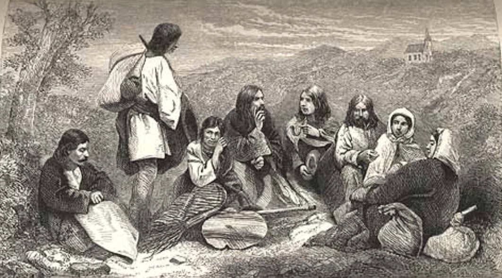
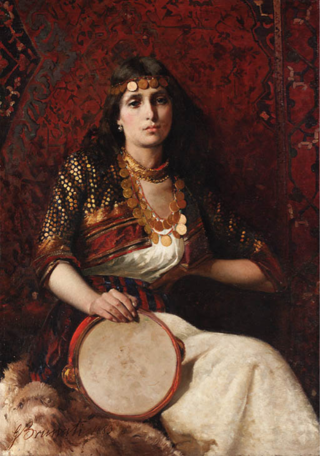

# 什么是吉普赛人？

“吉普赛人”（Gypsies）是外界对一个传统游牧民族的俗称，而他们真正的自称和官方称呼是**罗姆人（Romani / Roma）**。

  

当这个民族在14至15世纪大量出现在欧洲时，由于他们深色的皮肤、异域的穿着和独特的生活方式，当时的欧洲人误以为他们来自埃及（Egypt），因此将其称作“Gypsies”（由 Egyptian 演变而来）。今天，“吉普赛”一词在某些语境下常带有“流浪、算命、小偷”等刻板印象，因此国际上更倾向于使用他们自己的称呼“罗姆人”。

  

关于罗姆人，有几个核心的历史与文化事实：

  

- **真正的起源**：历史学、基因学和语言学研究都已证实，罗姆人并非来自埃及，而是起源于**印度北部**。大约在公元 500 年至 1000 年间，他们可能因战乱或饥荒离开印度次大陆，途经波斯、中东、小亚细亚（今土耳其），最终分散到了欧洲及世界各地。
    
      
    
- **语言与文化**：罗姆人拥有自己的语言——罗姆语（Romani），这是一种源自古印度梵语的印欧语系语言。他们以重视大家庭、口述传统以及极高的艺术天赋著称。西班牙享誉世界的弗拉明戈（Flamenco）音乐和舞蹈，很大程度上就是由定居在安达卢西亚地区的罗姆人创造并发展起来的。
    
     
    

- **游牧传统与职业**：历史上，由于不被当地主流社会接纳，且常被禁止拥有土地，罗姆人多以大篷车为家，靠打铁、马匹交易、修补铜器、占卜（如塔罗牌、水晶球）和街头卖艺为生。这种生存方式逐渐演变成了独特的游牧文化。不过在今天，绝大多数罗姆人已经定居，不再过流浪生活。
    
      
    
- **深重的苦难史**：罗姆人是欧洲历史上受迫害最深重的民族之一。几个世纪以来，他们面临过驱逐、奴役和强制同化。在第二次世界大战期间，纳粹德国不仅屠杀犹太人，也对罗姆人进行了残酷的种族灭绝（罗姆语称这场大屠杀为 Porajmos，意为“吞噬”），导致数十万罗姆人遇难。
    
      
    
- **现代现状**：目前全球罗姆人数量估计在 1000 万到 2000 万之间，主要集中在欧洲（尤其是罗马尼亚、保加利亚、匈牙利等东欧国家）。至今，许多罗姆人社区依然面临着较高的贫困率、教育资源匮乏以及根深蒂固的社会歧视问题。