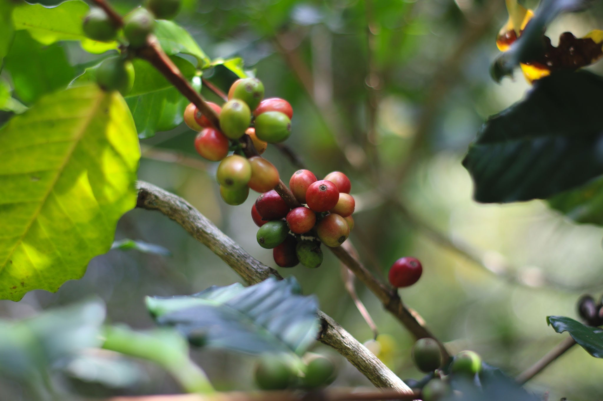
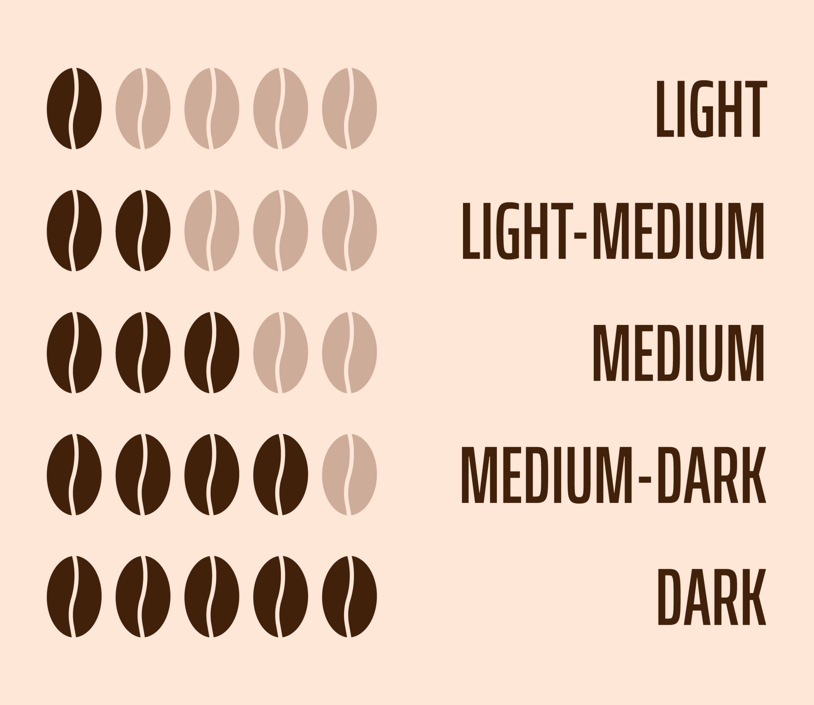
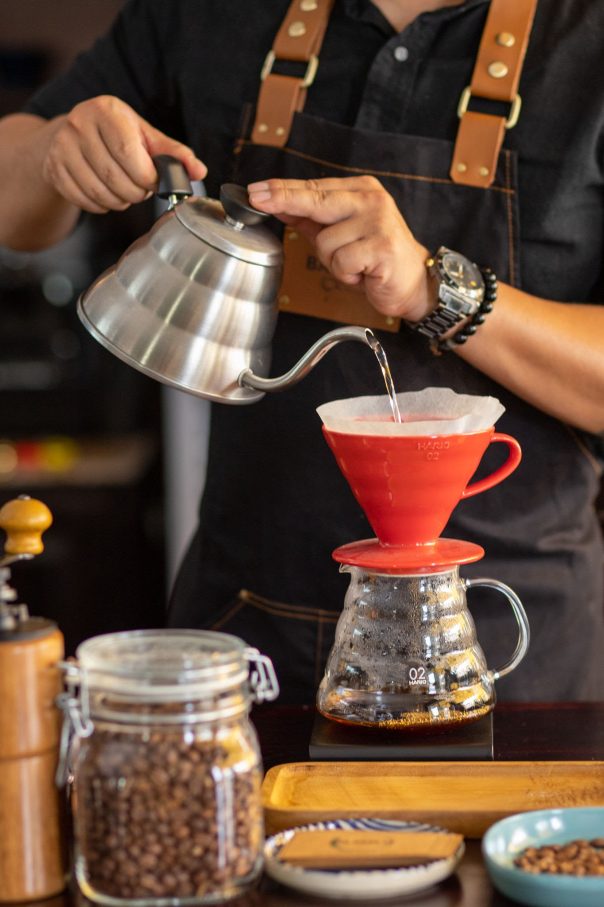
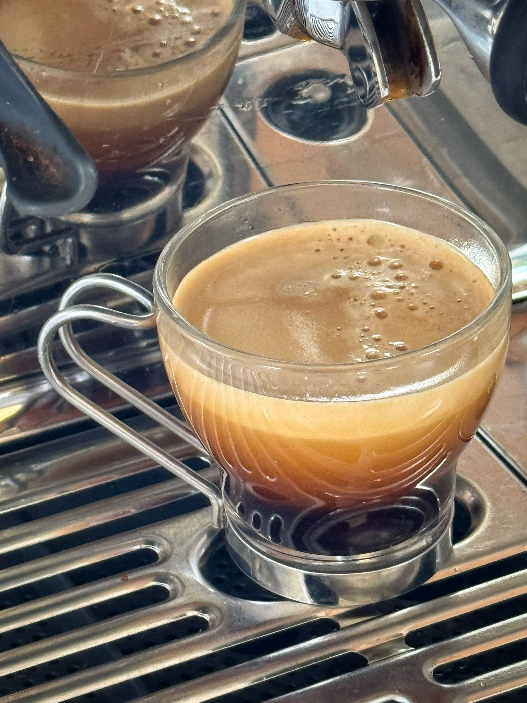

# 咖啡的起源和学问

咖啡不仅是一种饮品，更是一部跨越千年的全球化发展史。从非洲的一颗野生红色浆果，到如今风靡全球、充满科学与艺术底蕴的现代饮品，咖啡的演变极其精彩。

我们将从**历史起源**与**现代咖啡的学问**两个维度为你进行详尽解析。

## 一、 咖啡的漫长历史：从神奇浆果到全球饮品

在成为我们熟悉的深棕色熟豆之前，咖啡其实是长在树上的红色果实，被称为“咖啡樱桃”（Coffee Cherry）。我们用来磨粉冲煮的，其实是果实内部的**种子**。

关于咖啡的起源，最著名的传说是“牧羊人卡尔迪”。相传在公元9世纪的埃塞俄比亚，卡尔迪发现他的羊群吃了一种红色的野果后，变得异常兴奋、整夜不睡。随后，这种果实被修道院的僧侣用来熬制提神汤药，这就是咖啡最早的雏形。

为了让你更直观地了解咖啡是如何从埃塞俄比亚走向全世界的，你可以查看下方的时间轴：

  
咖啡全球传播史

  

    

    

      
<h3 class="vibe-year">公元9世纪 (传说)</h3>埃塞俄比亚

      
牧羊人卡尔迪发现羊群食用红色野果后异常兴奋，提神特性首次被发现。

    

  

  

    

    

      
<h3 class="vibe-year">15世纪</h3>阿拉伯半岛

      
传播至也门，苏菲派僧侣饮用以保持清醒。摩卡港成为早期贸易中心。

    

  

  

    

    

      
<h3 class="vibe-year">16世纪中叶</h3>奥斯曼帝国

      
首批真正意义上的咖啡馆在君士坦丁堡开业，成为社交与思想交流中心。

    

  

  

    

    

      
<h3 class="vibe-year">1600年</h3>意大利威尼斯

      
教皇克莱门特八世为咖啡“洗礼”，打消宗教顾虑，开始风靡欧洲。

    

  

  

    

    

      
<h3 class="vibe-year">17世纪末</h3>印尼爪哇

      
荷兰人走私树苗出阿拉伯并成功大规模种植，打破了长期的贸易垄断。

    

  

  

    

    

      
<h3 class="vibe-year">1723年</h3>美洲加勒比海

      
法国军官携树苗横跨大洋至马提尼克岛，成为中南美洲绝大多数咖啡树的祖先。

    

  

## 二、 现代咖啡的学问：从种子到杯中的科学

现代咖啡（特别是强调风味与产地的“精品咖啡 / Specialty Coffee”浪潮）已经变成了一门极其严谨的学问。这门学问主要体现在以下四个环节：

### 1. 咖啡豆的品种与处理法 (Processing)

市面上99%的咖啡豆分为两大品种：

- **阿拉比卡 (Arabica)：** 种在海拔较高的地方，抗病虫害能力弱，但**风味极其丰富**（花香、果酸、焦糖感），是精品咖啡的绝对主力。

- **罗布斯塔 (Robusta)：** 种在低海拔，抗虫害强，咖啡因含量几乎是阿拉比卡的两倍。风味较粗糙，常带有木质、麦茶或橡胶味，多用于速溶咖啡或用来增加意式浓缩的油脂。

咖啡果实采摘后，需要将果肉剥离取出种子（生豆），这就涉及**处理法**：

- **日晒法 (Natural)：** 连着果皮果肉一起晒干。风味狂野，甜度高，常有浓郁的发酵酒香和莓果味。

- **水洗法 (Washed)：** 用水流洗去果肉和黏液再干燥。风味干净、明亮，酸质清晰。

- **蜜处理 (Honey)：** 剥去果皮，但保留部分富含糖分的果胶黏液进行日晒。风味介于日晒的甜和水洗的干净之间。

### 2. 烘焙的魔法：赋予咖啡灵魂

咖啡生豆本身只有淡淡的青草味，所有的香气（超过800种芳香物质）都是在烘焙机中通过**美拉德反应**和**焦糖化反应**高温催化出来的。

烘焙度决定了你喝到的咖啡是“酸”还是“苦”：

- **浅度烘焙 (Light Roast)：** 颜色偏浅棕，表面无油脂。**保留了咖啡最多的原始产地风味**，酸度最高，花香和水果风味极其明显。

- **中度烘焙 (Medium Roast)：** 栗子色。酸甜苦达到了平衡，常带有坚果、焦糖、巧克力的香气，受众最广。

- **深度烘焙 (Dark Roast)：** 颜色深褐甚至泛黑，表面常出油。果酸味几乎消失，取而代之的是浓烈的醇厚度（Body）、黑巧克力味以及焦苦味。

### 3. 第三波咖啡浪潮的代表：手冲咖啡

在现代咖啡馆里，手冲咖啡（Pour-over）是品鉴优质浅烘焙单品豆（Single Origin）的最佳方式。

手冲咖啡利用重力让热水自然滤过咖啡粉。它的学问在于**参数的精确控制**：咖啡师需要像做实验一样，精确控制水温（通常在 88℃-93℃）、粉水比（如 1:15）、研磨粗细以及注水的手法与时间。这种方式萃取出的咖啡液清澈明亮，口感类似于品茶，能清晰地喝出豆子里的草莓、柑橘或茉莉花香。

### 4. 现代咖啡馆的基石：意式浓缩 (Espresso)

如果你在咖啡馆点的是拿铁、美式或卡布奇诺，它们的核心基底都是**意式浓缩（Espresso）**。

意式浓缩的原理完全不同于手冲：它是利用机器产生的高压（通常为 9 Bar），迫使接近沸腾的水在 20-30 秒内迅速穿过极细的咖啡粉饼。

- **Crema（油脂）：** 高压萃取会产生一层金黄色的泡沫状油脂，它锁住了咖啡最浓郁的香气，是评判一杯 Espresso 质量的重要标准。

- **饮品演变：** 在 Espresso 中加入大量热水，就是**美式（Americano）**；加入打发的细腻热牛奶和奶泡，就变成了**拿铁（Latte）**或**卡布奇诺（Cappuccino）**。