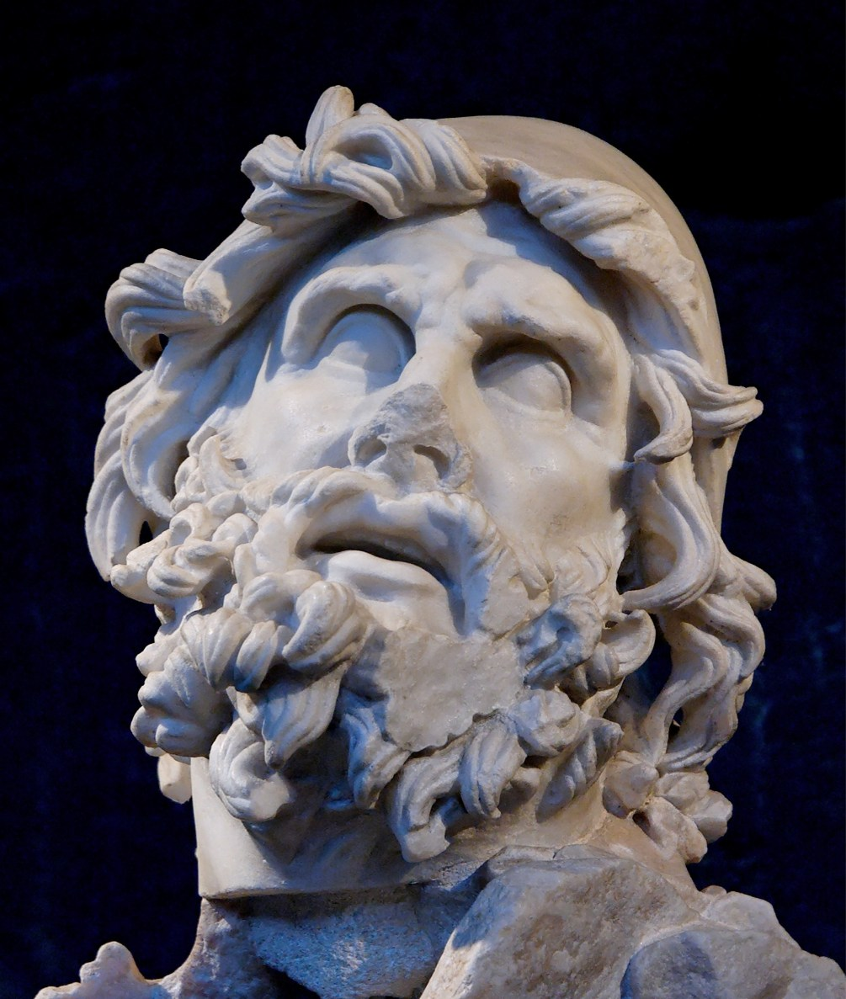

# 奥德修斯

奥德修斯（Odysseus，罗马神话中称为尤利西斯 Ulysses）是古希腊神话中伊萨卡岛（Ithaca）的国王，也是特洛伊战争中的核心英雄之一，更是荷马史诗《奥德赛》（Odyssey）的绝对主角。

  

与忒修斯（Theseus）那种凭借武力直面迷宫怪物的半神英雄不同，奥德修斯在希腊神话中是个异类。他是一个纯粹的凡人，最强大的武器不是长矛，而是**极致的智慧、狡黠和忍耐力**。荷马在史诗中称他为“足智多谋的”（Polytropos）。正是他想出了著名的“特洛伊木马计”，帮助希腊联军攻破了坚守十年的特洛伊城墙，终结了战争。

## 奥德修斯完整的归乡之旅（基于《奥德赛》原著）

特洛伊战争结束后，奥德修斯率领由12艘战船组成的舰队起航返乡。他的归途并非一开始就被诅咒，而是在一系列的人性贪婪、神明意志与无情天灾中，逐渐演变成一场长达十年的绝境求生：

* **1. 劫掠喀孔涅斯人 (Cicones)：贪婪的代价**
  刚离开特洛伊，奥德修斯的舰队洗劫了喀孔涅斯人的城池。由于船员贪恋战利品不肯及时撤退，遭到了当地人的猛烈反击，每艘船都损失了六名精锐水手。

* **2. 食莲人岛 (Lotus-Eaters)：遗忘故乡的果实**
  风暴将船队吹到了食莲人岛。被派去侦查的船员吃下了当地的莲花后，瞬间忘却了故乡与妻儿，只想永远留在岛上。奥德修斯只得用强力将他们绑回船上，锁在底舱才得以起航。

* **3. 独眼巨人的诅咒 (Cyclops)：傲慢与机智**
  船队误入食人独眼巨人波吕斐摩斯（海神波塞冬之子）的洞穴，被吃掉数人。奥德修斯用葡萄酒将巨人灌醉，刺瞎其独眼，并机智地自称“没有人(Nobody)”，随后藏在羊腹下逃脱。但他逃离时因傲慢报上了真名，导致巨人向父亲海神祈祷，降下了长达十年的恶毒诅咒。

* **4. 风神岛 (Aeolia)：功亏一篑的猜忌**
  风神埃俄罗斯热情接待了他，并送给他一个装满世间所有逆风的牛皮袋，只留下顺风吹向故乡。就在伊萨卡的海岸线已肉眼可见时，连日掌舵的奥德修斯疲惫睡去。水手们猜忌袋子里装满财宝，偷偷解开袋口，狂风瞬间呼啸而出，将他们直接吹回了原点。

* **5. 食人族巨灾 (Laestrygonians)：舰队的毁灭**
  船队随后误入了莱斯特律戈涅斯食人族巨人的海港。除了奥德修斯自己那艘停在港湾外的旗舰，其余11艘船全部被巨人用巨石砸碎，落水的水手被像串鱼一样叉起吃掉。至此，奥德修斯仅剩一艘船。

* **6. 女巫喀耳刻的魔药 (Circe)：法术与温柔乡**
  仅存的一艘船来到艾尤岛，先遣队员被女巫喀耳刻施法变成了猪。奥德修斯在神使赫尔墨斯的指导下免疫了魔法，拔剑逼迫女巫解除法术。随后，他们在这个温柔乡里休整沉沦了整整一年，直到船员提醒才再度启程。

* **7. 冥界求索 (Underworld)：直面死亡**
  听从女巫指引，奥德修斯航向世界边缘下到冥界。他在那里用鲜血献祭，唤醒了盲人先知特瑞西阿斯，获取了归航的预言。他还见到了因思念自己而死去的母亲，以及阿喀琉斯等曾在特洛伊并肩作战的英雄亡魂。

* **8. 塞壬海妖 (Sirens)：致命的歌声**
  为了听闻海妖足以让水手发狂投海的曼妙歌声，他让水手用蜂蜡堵住耳朵，并命令将自己死死绑在桅杆上，强行穿越了这片死亡海域。

* **9. 斯库拉与卡律布狄斯 (Scylla & Charybdis)：两难的死局**
  船只必须穿过一条狭窄的海峡，一侧是吞噬一切的巨大漩涡卡律布狄斯，另一侧是六头十二足的岩壁海怪斯库拉。奥德修斯权衡后选择靠近海怪，眼睁睁看着六名最强壮的水手被怪物叼走撕碎，才保全了船只。

* **10. 触怒太阳神 (Cattle of the Sun God)：全军覆没**
  船队被逆风困在特里纳基亚岛。水手们在极度饥饿的驱使下，趁奥德修斯熟睡时违背警告，宰杀了太阳神赫利俄斯的神牛。为惩罚他们，宙斯在船只出海时降下神雷劈碎了孤船。**所有水手全部淹死，仅剩奥德修斯一人**抱着断木在海上漂流。

* **11. 仙女岛的七年囚禁 (Calypso)：最长的停滞**
  奥德修斯漂流到奥杰吉亚岛，被爱慕他的仙女卡吕普索软禁了七年。仙女许诺给他永生和青春，但他依然日夜坐在礁石上望着故乡流泪。最终雅典娜求情，宙斯下令放人，他才得以自己扎木筏离开。

* **12. 淮阿喀亚人的救赎 (Phaeacians)：史诗的倒叙点**
  木筏再次被波塞冬摧毁，九死一生的奥德修斯漂泊到淮阿喀亚。国王阿尔基努斯和公主娜乌西卡热情款待了他。在宴会上，奥德修斯含泪讲述了上述长达十年的冒险（此处是《奥德赛》原著极其精妙的大倒叙）。国王深受感动，派出了神奇的无舵黑船，连夜将沉睡的奥德修斯送回了故乡。

* **13. 终极复仇与和平 (Ithaca)：血洗与和解**
  历经二十年，奥德修斯终于回到伊萨卡。他在雅典娜的掩护下伪装成老乞丐，在妻子珀涅罗珀设立的“射箭招亲”比试中拉开旧神弓。随后他与儿子特勒马科斯联手，将上百名求婚者全部诛杀。原著的结局并未停在杀戮——死者的家属前来寻仇，最终在雅典娜的下凡调停下，双方缔结盟约，伊萨卡终于迎来了永久的和平。

奥德修斯的故事奠定了西方文学中“英雄历险”与“漫长归乡”的原型。他并非完美无瑕——他会撒谎、会恐惧、也曾对婚姻不忠，但他对故乡的执念，以及在绝境中展现出的人类智慧与生命韧性，使他成为了整个希腊神话中最具现代感与人性深度的角色。

---

  
  
<!-- 顶级播放器外框：深空毛玻璃 + 翠绿环境呼吸光 -->  
  

  
  

  
  

  
  

  
  
    
