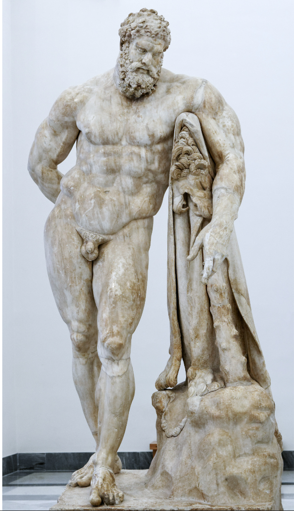

# 赫拉克勒斯（Heracles）是谁？

赫拉克勒斯（Heracles）是希腊神话中最伟大的半神英雄，也是力量与勇气的化身。需要厘清的一个常见误区是：赫拉克勒斯（Heracles）**是他的希腊语原名，意思是“赫拉的荣耀”；而**海格力斯 / 赫丘利（Hercules）是后来罗马神话中对他名字的拼写。

   

在经典的艺术表现中，他通常被描绘为一个肌肉极其发达的成年男子，手里拿着一根巨大的木棒，并披着狮子皮（这是他在神话中获取的战利品）。你可以通过这尊著名的《法尔内塞的赫拉克勒斯》雕像，直观地感受到古希腊罗马时期对这位力量之神的体态刻画。

  

## 身世与诅咒

他是众神之王**宙斯（Zeus）**与人类女子**阿尔克墨涅（Alcmene）**的私生子。这激怒了天后**赫拉（Hera）**，使她对这个孩子恨之入骨。赫拉的迫害贯穿了赫拉克勒斯的一生：

  

- **婴儿时期的暗杀：** 赫拉曾派两条毒蛇爬进他的摇篮，但还在襁褓中的赫拉克勒斯展现了惊人的神力，一手一条将毒蛇直接捏死。
    
      
    
- **疯狂的诅咒：** 在他成年并拥有幸福的家庭后，赫拉降下诅咒让他陷入疯狂的幻觉，导致他亲手杀死了自己的妻子和孩子们。清醒后的赫拉克勒斯痛不欲生，为了洗刷这项罪孽，他踏上了赎罪之旅。
    
      
    

## 著名的“十二项伟业”

为了赎罪，他听从神谕，被迫为怯懦的迈锡尼国王效劳十二年，并完成了著名的“十二项伟业”（The Twelve Labors）。这些看似不可能完成的任务最终使他名垂千古。其中最著名的几项包括：

  

- **剥下涅墨亚狮子的皮：** 这头狮子刀枪不入，任何武器都无法伤它分毫。赫拉克勒斯硬生生将其勒死，并用狮子自己的爪子剥下狮皮，从此这件狮皮成了他最著名的防具。
    
      
    
- **斩杀九头蛇海德拉（Hydra）：** 剧毒的九头蛇每被砍掉一个头，就会立刻长出两个。赫拉克勒斯最终与侄子合作，砍掉一个头就用火烧结伤口，成功将其击杀，并用海德拉的毒血淬炼了自己的弓箭。
    
      
    
- **活捉地狱犬刻耳柏洛斯（Cerberus）：** 他下到冥界，在不使用任何武器的情况下，徒手制服了守卫冥界大门的三头犬，并将其带回人间交差。
    
      
    

## 悲剧的死亡与封神

赫拉克勒斯一生战无不胜，但他最终的死亡却是一场被欺骗的悲剧。

  

他的第二任妻子得伊阿尼拉听信了半人马涅索斯死前的谎言，将沾有涅索斯血液（其实内部混有海德拉毒血）的贴身衣物交给了赫拉克勒斯，以为这能挽回丈夫的心。当赫拉克勒斯穿上这件衣服时，毒血腐蚀了他的血肉，让他痛不欲生且无法脱下。

  

为了结束这种非人的折磨，他恳求别人为他点燃火柴，将自己活活烧死。但在火葬的烈焰中，他身为凡人的肉体被燃尽，而属于神明的那部分让他升入了奥林匹斯山。最终，他正式成为了神明，与赫拉达成了和解，并迎娶了青春女神赫柏（Hebe）。

---

  <!-- 顶级播放器外框：深空毛玻璃 + 翠绿环境呼吸光 -->  
  

  

  
    

  