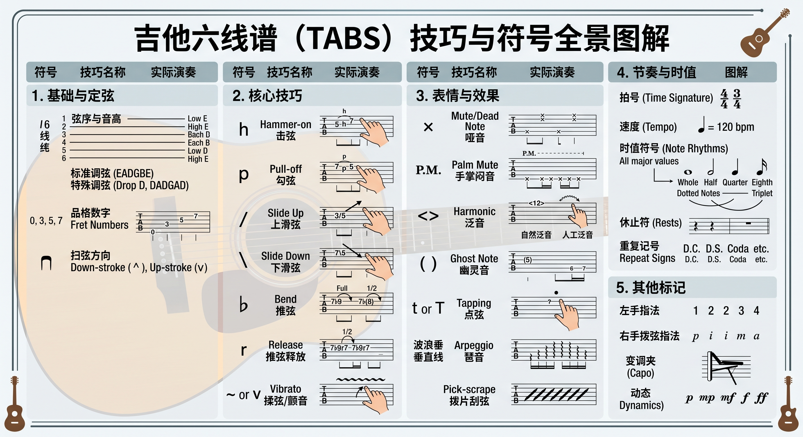

# TABS六线谱

  

吉他六线谱（Tablature）是世界通用的吉他“说明书”。它不要求你死记硬背五线谱的音高，而是直接指示你的双手在吉他指板上该如何操作。

  

## 一、 六线谱的“视觉地图”

六线谱的六根线，完美对应吉他的六根琴弦。当你把吉他平放在大腿上，低头看琴弦时，你看到的画面就和六线谱一模一样：

  

- **第一线（最上面）：** 第 1 弦（最细，高音 E，最靠近地板）
    
      
    
- **第六线（最下面）：** 第 6 弦（最粗，低音 E，最靠近你的眼睛）
    
      
    
- **线上的数字：** 代表左手需要按住的**品格数**（Fret）。
    
      
    - `0` = 弹奏空弦（左手什么都不按，右手直接拨弦）。
        
          
        
    - `3` = 左手按住第 3 品，右手拨响对应的弦。
        
          
        
- **垂直对齐的数字：** 如果多个数字在同一条垂直线上，意味着你需要**同时**拨响这几根琴弦（通常是弹奏和弦）。
    
      
    

## 二、 六线谱技巧符号全景图解 (TABS Cheat Sheet)

以下是你在各种吉他谱中会遇到的所有主要符号。你可以将这个表格作为你的“六线谱字典”随时查阅：

  

|**符号 / 缩写**|**英文全称**|**中文名称**|**实际演奏动作说明**|
|---|---|---|---|
|**h**|Hammer-on|**击弦**|弹响较低的音后，左手手指像锤子一样**用力敲击**同一根弦上更高的品格发声。（例：`5h7`）|
|**p**|Pull-off|**勾弦**|弹响较高的音后，按弦的手指顺势向手心方向**拨动琴弦并离开**，带出较低品格的音。（例：`7p5`）|
|**/**|Slide Up|**上滑弦**|弹响第一个音，按弦手指不松开，紧贴指板**滑向音箱方向**的目标品格。（例：`3/5`）|
|*_*_|Slide Down|**下滑弦**|与上滑弦相反，手指紧贴指板**滑向琴头方向**的目标品格。（例：`7\5`）|
|**~ / v**|Vibrato|**揉弦 / 颤音**|左手按住弦，手指或手腕快速、微小地**来回推拉琴弦**，让声音产生波浪般的余音。|
|**b**|Bend|**推弦**|弹响后，左手手指**将琴弦向上推或向下拉**，增加张力使音高上升（常标有推高半音 `1/2` 或全音 `Full`）。|
|**r**|Release|**推弦释放**|推弦到达指定音高后，手指控制琴弦**缓慢退回**到原来的位置。（例：`7b9r7`）|
|**x**|Mute / Dead Note|**闷音 / 哑音**|左手手指轻轻**虚按在琴弦上**（不碰到品丝），右手拨弦发出短促的“咔咔”打击声。|
|**P.M.**|Palm Mute|**手掌闷音**|右手手掌外侧边缘**轻压在琴桥处**的琴弦根部，拨弦发出沉闷、厚实的声音。|
|**<> / Harm.**|Harmonic|**泛音**|左手手指轻轻**触碰**特定品丝（如第12、7品）正上方的琴弦，右手拨弦瞬间左手立即离开，发出空灵清脆的钟鸣声。|
|**t / T**|Tap|**点弦**|直接用**右手手指**（食指/中指）在指板上用力敲击特定品格发声。|
|**( )**|Ghost Note|**幽灵音 / 延音**|括起来的音符表示**音量极弱**地弹奏，或者代表前面音符的自然延音（不需要再次拨弦）。|
|**波浪垂直线**|Arpeggio / Roll|**琶音**|出现在和弦旁边，表示不要同时齐拨所有弦，而是**从低音到高音（或反向）快速顺次拨响**。|

## 三、 核心技巧详解与实战应用

在实际演奏中，这些符号不仅仅是技术动作，更是赋予音乐情感的灵魂。

  

### 1. 连音技巧：击弦 (h) 与 勾弦 (p)

这是让旋律变得丝滑、连贯的核心。在弹奏注重旋律线条的指弹吉他曲目（如《风之诗》或《太阳花》）时，频繁使用击弦和勾弦可以营造出一种如人声歌唱般、不间断的流畅感。因为只在第一个音时右手拨弦，后续的音完全靠左手的力量发声，音色会更加柔和。

  

- **发力细节：** 击弦时指尖必须垂直且果断；勾弦时，离开的那根手指需要有一个向侧下方“拨”的微小动作，而不仅仅是抬起来。
    
      
    

### 2. 滑动的美感：滑弦 (/ 与 )

滑弦可以极其平滑地连接两个距离较远的音符。在民谣弹唱（如《理想三旬》）的伴奏中，经常会遇到从低品位滑向高品位和弦的编配，这种不经意的滑动能给原本平淡的节奏增加极强的层次感和情绪的推动力。

  

- **发力细节：** 保持左手按弦的压力，在滑动过程中不要松劲，确保滑到目标品位时声音依然饱满。
    
      
    

### 3. 空灵的钟鸣：泛音 (<> 或 Harm.)

泛音是指弹吉他中极具魅力的高级技巧。自然泛音通常出现在第 12、7、5 品。那些如同风铃般清脆、空灵的高音（比如在《花》这样的氛围感曲目中常常作为点睛之笔出现），就是通过泛音技巧实现的。

  

- **发力细节：** 左手手指绝对不能按下琴弦，只是“沾”在金属品丝正上方的琴弦上。右手拨弦的零点几秒内，左手必须像触电一样迅速离开。
    
      
    

### 4. 节奏的律动：哑音 (x) 与 拍弦

在具有强烈节奏驱动感的歌曲中（如《安河桥》的前奏或间奏），你会在谱面上看到大量的 `x`。在原声吉他上，这通常意味着“拍弦”或“打弦”（用右手大拇指侧面击打低音弦，或用多根手指扫击并顺势用手掌捂住琴弦），这种技巧能将吉他变成一面打击乐器，直接在琴体上制造出类似架子鼓底鼓和军鼓的强烈律动（Groove）。

  

## 四、 读谱的进阶建议 (右手交替指法)

在很多专业的指弹六线谱下方或上方，你还会看到几个英文字母：**p, i, m, a**。它们代表了古典吉他和指弹中规范的右手拨弦指法，遵循这些指法能让你的右手在复杂的节奏中保持稳定：

  

- **p (Pulgar):** 大拇指（通常负责 6、5、4 弦的低音）
    
      
    
- **i (Indice):** 食指（通常负责 3 弦）
    
      
    
- **m (Medio):** 中指（通常负责 2 弦）
    
      
    
- **a (Anular):** 无名指（通常负责 1 弦）
    
      
    

掌握了六线谱的规律和符号，你就拥有了还原绝大多数吉他作品的能力。结合原曲的音频去感受音符的时长和强弱，你的读谱能力会突飞猛进。

  

