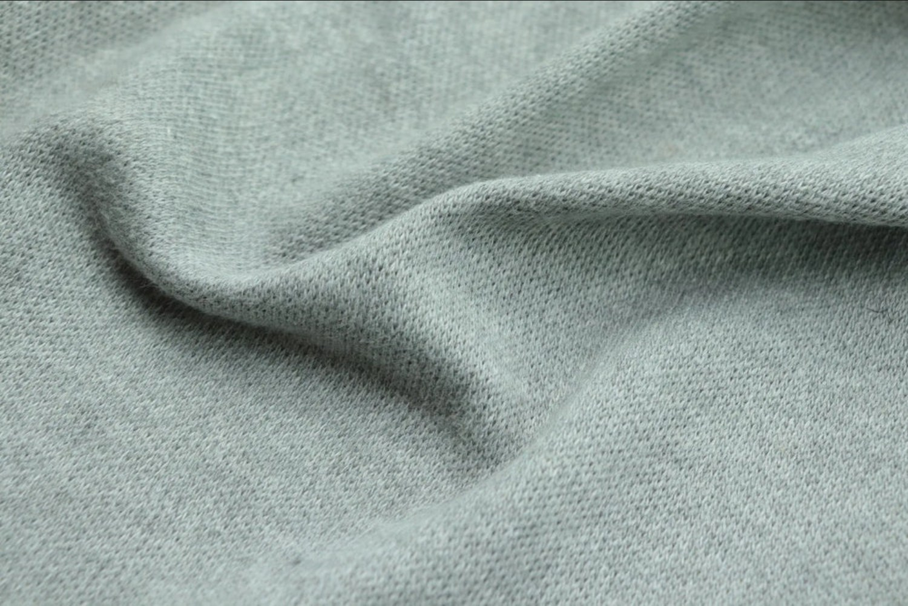

# 什么衣服材质very的good？

能同时完美满足“吸汗”、“永远舒适”且“冬暖夏凉”这三个苛刻条件的材质，自然界的终极答案是**美丽诺羊毛（Merino Wool）**，其次是**真丝（Silk）**。

  

### 首选：美丽诺羊毛（Merino Wool）

很多人对羊毛的印象停留在“冬天穿的厚毛衣”、“扎人”，但高品质的美丽诺羊毛可以直接贴身穿着，是目前户外和贴身衣物领域的顶级材质。

  

- **真正的冬暖夏凉：** 它的纤维结构中含有大量卷曲的天然气室。冬天，这些气室能锁住体表温度形成隔热层；夏天，它能主动吸收皮肤表面的汗气，并在水分蒸发时带走热量，实现物理降温。
    
      
    
- **吸湿不黏腻：** 它可以吸收自身重量30%的水分而不让人觉得潮湿。出汗后，它不仅能快速排汗，即使在微湿状态下依然能保持保暖性，不会像棉质衣服一样冷冰冰地贴在身上。
    
      
    
- **永远舒适（不扎人）：** 美丽诺羊毛的纤维极细（通常在18微米以下，远细于人类头发），触感极其柔软顺滑，完全没有传统羊毛的刺痒感。
    
      
    
- **天然防臭：** 富含天然角蛋白，能有效抑制细菌滋生，即便出汗后连穿几天也不容易产生异味。
    
      
    

### 备选：真丝（Silk）

如果更偏好极其顺滑的冰凉触感，真丝是另一个优秀选择。

  

- **微气候调节：** 真丝是多孔结构的动物蛋白纤维，夏天清凉透气；冬天作为贴身内搭时，其多孔结构也能起到一定的恒温保暖作用（尽管保暖上限不如羊毛）。
    
      
    
- **吸汗透气：** 它的吸湿性是纯棉的1.5倍，且能迅速向空气中散发水分，保持皮肤干爽。
    
      
    
- **极致亲肤：** 含有18种对人体有益的氨基酸，摩擦系数极低，被称为“人体的第二层肌肤”。
    
      
    

### 为什么不推荐其他常见材质？

- **纯棉（Cotton）：** 吸汗能力极强，但**排汗极差**。冬天出汗后风一吹透心凉，夏天出汗后死死贴在身上，完全无法做到“永远舒适”。
    
      
    
- **普通聚酯纤维（Polyester）：** 运动服常用，排汗快，但**不吸汗**。冬天不保暖，且容易发臭、产生静电，日常穿着体感不佳。
    
      
    

如果预算充足，推荐在贴身衣物（如T恤、内衣、袜子）上优先选择100%或高比例的美丽诺羊毛材质。