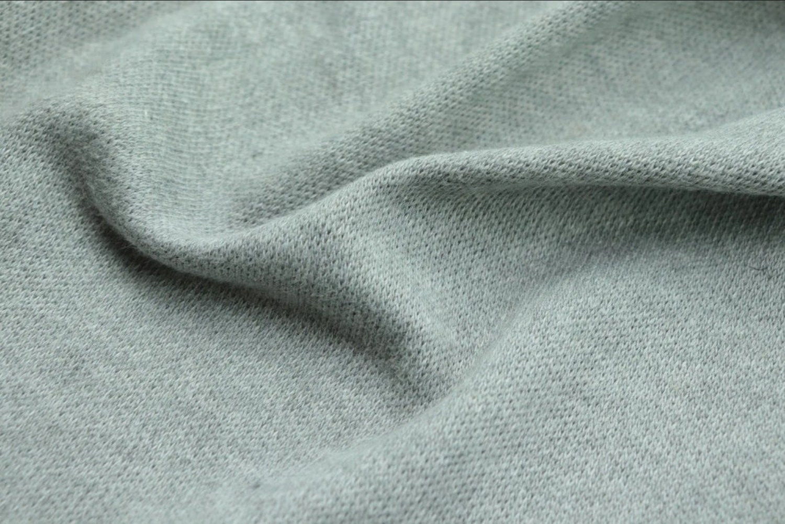

# 什么衣服材质very的good？

能同时完美满足“吸汗”、“永远舒适”且“冬暖夏凉”这三个苛刻条件的材质，自然界的终极答案是**美丽诺羊毛（Merino Wool）**，其次是**真丝（Silk）**。

  

### 首选：美丽诺羊毛（Merino Wool）

很多人对羊毛的印象停留在“冬天穿的厚毛衣”、“扎人”，但高品质的美丽诺羊毛可以直接贴身穿着，是目前户外和贴身衣物领域的顶级材质。

  

- **真正的冬暖夏凉：** 它的纤维结构中含有大量卷曲的天然气室。冬天，这些气室能锁住体表温度形成隔热层；夏天，它能主动吸收皮肤表面的汗气，并在水分蒸发时带走热量，实现物理降温。
    
      
    
- **吸湿不黏腻：** 它可以吸收自身重量30%的水分而不让人觉得潮湿。出汗后，它不仅能快速排汗，即使在微湿状态下依然能保持保暖性，不会像棉质衣服一样冷冰冰地贴在身上。
    
      
    
- **永远舒适（不扎人）：** 美丽诺羊毛的纤维极细（通常在18微米以下，远细于人类头发），触感极其柔软顺滑，完全没有传统羊毛的刺痒感。
    
      
    
- **天然防臭：** 富含天然角蛋白，能有效抑制细菌滋生，即便出汗后连穿几天也不容易产生异味。
    
      
    

### 备选：真丝（Silk）

如果更偏好极其顺滑的冰凉触感，真丝是另一个优秀选择。

  

- **微气候调节：** 真丝是多孔结构的动物蛋白纤维，夏天清凉透气；冬天作为贴身内搭时，其多孔结构也能起到一定的恒温保暖作用（尽管保暖上限不如羊毛）。
    
      
    
- **吸汗透气：** 它的吸湿性是纯棉的1.5倍，且能迅速向空气中散发水分，保持皮肤干爽。
    
      
    
- **极致亲肤：** 含有18种对人体有益的氨基酸，摩擦系数极低，被称为“人体的第二层肌肤”。
    
      
    

### 为什么不推荐其他常见材质？

- **纯棉（Cotton）：** 吸汗能力极强，但**排汗极差**。冬天出汗后风一吹透心凉，夏天出汗后死死贴在身上，完全无法做到“永远舒适”。
    
      
    
- **普通聚酯纤维（Polyester）：** 运动服常用，排汗快，但**不吸汗**。冬天不保暖，且容易发臭、产生静电，日常穿着体感不佳。
    
      
    

如果预算充足，推荐在贴身衣物（如T恤、内衣、袜子）上优先选择100%或高比例的美丽诺羊毛材质。

夏天穿美丽诺羊毛（Merino Wool）不仅不会“热死”，反而是多汗体质的绝对“救星”。

  

你脑海中觉得会“热死”的，是那种扎人、厚重的传统粗羊毛毛衣。而美丽诺羊毛的纤维极细（通常在 17-19 微米以下），把它做成夏季的短袖 T 恤，体验会完全颠覆你的认知。

  

### 为什么夏天穿不热，还特别适合多汗体型？

1. **拒绝“湿身贴肉”：** 在南京七八月那种像蒸笼一样闷热潮湿的天气里，穿纯棉 T 恤一旦出大汗，衣服就会像一块湿冷的抹布一样死死贴在背上，风一吹还容易感冒。而美丽诺羊毛能吸收自身重量 30% 的水分而不让你觉得“湿”，它会在汗液变成液滴前，就以蒸汽的形式排散到空气中。
    
      
    
2. **神级的“抑菌防臭”：** 这是它对多汗体质最大的馈赠。羊毛富含角蛋白，天然抑制制造异味的细菌滋生。哪怕你出了一身透汗，甚至连穿两三天不洗，衣服干了之后也**几乎闻不到任何汗臭味**（甚至还有淡淡的羊毛干爽气息）。
    
      
    

### 多汗体型应该怎么选？

既然出汗量大，**千万不要买 100% 的纯美丽诺羊毛 T 恤**。纯羊毛虽然防臭，但吸满大汗后干透的速度比不上合成纤维，而且打理不当容易破洞。

  

你选购时只需盯准两个指标：

  

- **看克重（GSM）：** 夏天只能买 **120g 到 150g** 之间的超薄款（150 Ultralight / Lightweight）。超过 200g 的那是春秋保暖用的，夏天穿真的会热。
    
      
    
- **看面料成分：** 认准 **美丽诺羊毛 + 尼龙（锦纶）/ 天丝** 的混纺（包芯纱技术）。这种工艺既有羊毛的防臭透气，又有尼龙的耐磨和速干，是最完美的夏季解药。
    
      
    

### 哪个牌子好？

**1. Icebreaker（破冰者）—— 业界天花板，盲买不出错**

美丽诺羊毛运动装的鼻祖。如果你怕热又多汗，直接看他家夏天的 **Cool-Lite™ 系列**（通常是美丽诺羊毛 + Tencel天丝混纺）。天丝的加入让布料自带一种冰凉的垂坠感，速干性极强，夏天穿去办公室敲一天代码或者通勤都极度舒适。缺点是单价较高。

  

**2. Smartwool（聪明羊）—— 耐造实用派**

和 Icebreaker 齐名的第一梯队。推荐看他的 **Merino 150 系列** 短袖。他们很擅长把尼龙包裹在羊毛骨架里，所以衣服在保持轻薄透气的同时，比普通的纯羊毛结实耐造很多，非常适合日常高频穿着。

  

**3. Zealwood（赛乐）—— 国产性价比首选**

如果你不想一开始就花大几百块去试水，赛乐是最好的平替。作为国内做美丽诺羊毛非常成熟的品牌，他家的 150g 夏季薄款短袖通常只要百元出头，虽然剪裁和混纺技术比起国外大牌稍显基础，但在“吸汗不贴身”和“防臭”的核心体验上依然非常能打。

  

建议可以先从混纺的 150g 薄款入手一件，体验一下大汗淋漓后衣服依然干爽不臭的快乐。