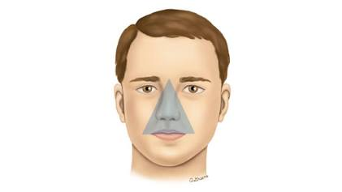

医学上所谓的“面部危险三角区”（通常指从鼻根到两侧嘴角连线形成的三角形区域），之所以被反复警告“非诚勿扰”，**底层逻辑在于这里的血管结构缺少了一道极其关键的“物理防火墙”。**

  

我们可以从生理机制上把这背后的风险拆解开来看：

  

## 1. 致命的硬件缺陷：缺少“单向阀”

在人体的其他绝大多数部位，静脉血管里都有一种叫“静脉瓣”**的结构。你可以把它理解为水管里的单向阀，它能保证血液只能朝着心脏的方向单行前进，绝不允许倒流。 然而，唯独面部三角区的静脉**没有静脉瓣。这意味着这里的血液流向是可以“双向”的——一旦局部的压力发生变化（比如你用力去按压、挤弄这个区域），血液随时可能发生倒流。

  

## 2. 直通大脑的“高速公路”

没有单向阀就算了，更要命的是这里的网络拓扑结构。三角区的静脉血管网与颅内的一处核心枢纽——**海绵窦**（位于大脑底部的静脉池）是直接相通的。

  

- **危险的链路：** 你的手每天接触键盘、鼠标（这些地方的细菌密度极高）。如果在这个区域乱摸，甚至强行挤破了痘痘，细菌（如金黄色葡萄球菌）就会进入血管。
    
      
    
- **直击核心：** 伴随着挤压带来的血液倒流，这些细菌会绕过身体的常规防御，顺着静脉直接“飙车”进入大脑内的海绵窦，可能引发**海绵窦血栓、脑膜炎甚至脑脓肿**。在抗生素不发达的年代，这甚至是致命的。
    
      
    

## 3. 制造炎症的死循环

即使不去挤破皮肤，仅仅是“经常触摸”本身也是在给皮肤增加负担。三角区（特别是鼻翼和嘴唇周围）本就是皮脂腺分泌旺盛的地方。无意识地频繁抚摸，不仅会将手上的污垢和油脂强行揉进毛孔，还会破坏皮肤表面的微生态平衡，导致黑头、毛囊炎和红肿痘痘反复发作，让你更忍不住想去摸。

  

**总结来说：**

面部危险三角区就像是直接连着系统内核（大脑）的一个裸露端口，而且没有防火墙。不要用充满细菌的手去疯狂试探它的底线。