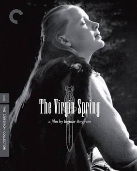

# 处女泉

  

## 核心创作者与背景 (The Auteur & Context)

《处女泉》是英格玛·伯格曼在完成《第七封印》与《野草莓》之后，对人类信仰进行更深层剖析的力作。影片改编自13世纪的瑞典民谣《温格家族的女儿们》（Töres döttrar i Wänge），由女作家乌拉·伊萨克松（Ulla Isaksson）操刀剧本。这种罕见的“非伯格曼原创剧本”赋予了影片一种极度客观、冷峻甚至近乎法医学般的叙事质感。

  

在幕后团队中，**本片标志着伯格曼与传奇摄影指导斯文·尼科维斯特（Sven Nykvist）确立了长期且深度的合作关系**。尼科维斯特对自然光的敏锐捕捉，彻底重塑了伯格曼的视觉语言。此外，伯格曼的御用男主马克斯·冯·叙多（Max von Sydow）在片中贡献了极具压迫感与神性光辉的表演，完美具象化了一个在狂怒与信仰间被撕裂的父亲形象。

  

## 历史地位与深远影响 (Historical Legacy)

在影史坐标中，《处女泉》为伯格曼赢得了**首座奥斯卡最佳外语片奖**（及1961年金球奖最佳外语片），这极大确立了他在北美主流评论界的崇高地位。

  

然而，本片最奇特的深远影响在于它**意外开启了现代恐怖片/剥削电影中的“强暴与复仇”（Rape and Revenge）亚类型**。1972年，美国恐怖大师韦斯·克雷文（Wes Craven）的处女作《左边最后那栋房子》（The Last House on the Left）正是对《处女泉》的直接翻拍。伯格曼用极高的艺术规格探讨了暴力的虚无，却也因为其对暴力赤裸裸的展示，启发了后世无数类型片的感官刺激手法。伯格曼晚年曾对本片有过自我怀疑，认为其带有黑泽明（尤其是《罗生门》与《七武士》）的模仿痕迹，但这无法掩盖本片在电影暴力美学与道德探讨上的先驱地位。

  

## 视听语言与叙事手法 (Cinematic Techniques)

在工业与视听层面，影片展现了极度克制却又触目惊心的古典主义美学：

  

- **自然主义的高反差光影：** 尼科维斯特在黑白摄影上建立了一套严密的视觉隐喻。代表纯洁的卡琳始终沐浴在高调的柔光与白昼中；而代表异教、嫉妒的英格丽以及三名牧羊人，则总是被置于逼仄的阴影、粗粝的黑土与暗夜之中。光影的物理切割，直接映射了神圣与罪恶的对立。
    
      
    
- **极简的仪式化动作剪辑：** 父亲图雷在复仇前的“净身”长镜头是影史经典的非语言叙事。伯格曼通过大量的中景与特写，记录他折断桦树枝、抽打肉体、在蒸汽中洗涤的每一个动作。剪辑在此刻放缓，将暴力的蓄力过程赋予了一种宗教献祭般的仪式感。
    
      
    
- **绝对安静的声景建构（Soundscape）：** 影片在核心的暴行与复仇段落中，**完全摒弃了配乐的情感引导**。观众只能听到水流的潺潺声、树枝的断裂声、衣物的撕扯声以及风声。这种白噪音的放大，剥夺了观众在戏剧冲突中寻找安全感的可能，使得罪恶的发生显得极度日常且冰冷。
    
      
    

## 核心主旨与哲学探讨 (Thematic Depth)

《处女泉》是一个披着复仇外衣的宗教与哲学拷问，其探讨的内核极为深邃：

  

- **异教与基督教的文明阵痛：** 故事设定在瑞典基督教刚刚兴起、北欧原始异教（奥丁崇拜）尚未消亡的过渡期。影片表面是善恶之争，实则是两种信仰体系的碰撞。英格丽对奥丁的暗中祈求，成为了引爆悲剧的暗线，隐喻了人类文明在信仰交替时的血腥阵痛。
    
      
    
- **“上帝的沉默”（The Silence of God）：** 这是伯格曼终其一生都在纠缠的母题。当纯洁的处女遭遇至暗的恶时，上帝在哪里？图雷在复仇后对天空的愤怒诘问（“你看到了这一切，却为何允许它发生？”），直指神义论（Theodicy）的终极困境——在一个全知全能的神的注视下，为何恶会肆虐？
    
      
    
- **暴力带来的虚无与神迹的悖论：** 父亲的复仇虽然在世俗道德上大快人心，但在精神层面却让他陷入了与施暴者同样的罪恶泥潭。片尾那股从死者头颅下涌出的“处女泉”，不仅没有带来廉价的救赎感，反而充满了一种令人战栗的荒诞感：神迹只在一切无可挽回之后才显现，这是神恩的宽恕，还是上帝对人类残酷命运的嘲弄？
    
      
    

## 专业评分与综合口碑 (Critical Reception)

在全球主流平台的严苛审视下，《处女泉》依然保持着极高的艺术口碑：

  

|**平台**|**评分数据**|**评价参考**|
|---|---|---|
|**IMDb**|8.1/10|在全球影迷评价中位列伯格曼最高分的几部代表作之一，被誉为不可多得的冷酷寓言。|
|**烂番茄 (Rotten Tomatoes)**|91% 认证新鲜|影评人共识认为，该片用令人痛苦的克制镜头审视了人类的罪恶与信仰的裂痕。|
|**Metacritic**|-|_(注：早期电影无现代化加权均分，但经典影评库将其列为“影史百大外语片”必入名单)_|
|**豆瓣 (Douban)**|8.5/10|国内迷影圈极度推崇的伯格曼入门作，以其清晰的叙事和震撼的视听广受好评。|

**业界媒体综评：**

《纽约时报》（The New York Times）当年曾盛赞其为“一部残酷、原始，却闪耀着惊人美感的中世纪传说”。现代影评界（如Criterion Collection的评论学者）则更倾向于将其视为伯格曼创作心理的转折点，它以一种近乎暴力的坦诚，彻底撕开了人类在面对命运与上帝时那份无处安放的恐惧。