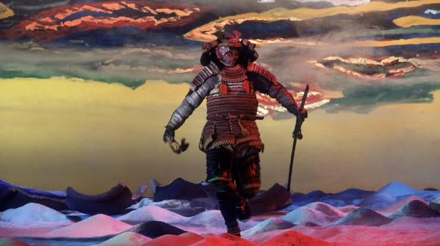

# 影武者
  

## 核心创作者与背景 (The Auteur & Context)

1970年代是黑泽明导演生涯的至暗时刻，经历了前作的票房惨败与个人的自杀未遂，这部《影武者》的诞生堪称奇迹。在好莱坞两位“超级迷弟”——弗朗西斯·福特·科波拉（Francis Ford Coppola）与乔治·卢卡斯（George Lucas）的极力斡旋和担保下，20世纪福克斯（20th Century Fox）才同意参与该片的国际发行与投资。这部电影不仅是黑泽明王者归来的证明，也彻底确立了他晚年极度宏大、冷峻且带有强烈宿命悲哀的作者特质。

  

核心幕后团队中，男主角仲代达矢（Tatsuya Nakadai）奉献了影史顶级的双重人格表演——他既是那个威震天下的战国枭雄武田信玄，也是那个怯懦却在潜移默化中被“魂穿”的底层窃贼。而摄影指导斋藤孝雄与上田正治，则完美地将黑泽明脑海中的狂暴色彩与静态美学转译到了胶片之上。

  

## 历史地位与深远影响 (Historical Legacy)

《影武者》在1980年第33届戛纳电影节上大放异彩，与《爵士春秋》并列斩获最高荣誉金棕榈奖，随后又获得了奥斯卡最佳外语片及最佳艺术指导提名。在商业上，它以55亿日元的惊人成绩登顶1980年日本本土票房冠军。

  

它的深远影响在于**重新定义了东方历史战争巨制（Jidaigeki，时代剧）的审美格局**。黑泽明摒弃了早年《七武士》中那股狂热的个体英雄主义，转向了一种极度宏观的史诗凝视。本片不仅在声誉上挽救了黑泽明的职业生涯，更为他五年后那部被奉为世界影史巅峰的集大成之作《乱》（Ran）进行了完美的工业测试与美学演练。

  

## 视听语言与叙事手法 (Cinematic Techniques)

从工业与视听层面来看，本片是一场用胶片作画的极致表现主义实验：

  

- **“绘画电影”与表现主义色彩：** 因为前期筹资极度困难，黑泽明亲手绘制了数百幅分镜油画。这些画作浓烈的质感被直接搬上银幕，色彩成为了核心的叙事符号——武田军的“风、林、火、山”四军被赋予了极具侵略性的青、黑、红、绿视觉阵列。梦境序列中的高反差光影，更是直接打破了现实主义的边界。
    
      
    
- **冷峻的“上帝视角”摄影：** 面对千军万马的调度，摄影机常常被置于极远、极高的地方。黑泽明大量使用近乎静止的远景和全景长镜头（Tableau Shot），刻意剥离了战争中局部的热血与刺激，强迫观众以一种“天道不仁”的疏离视角，注视着人类如同蝼蚁般被历史的巨轮碾碎。
    
      
    
- **反高潮的声画对立（Contrapuntal Sound）：** 影片最高潮的长筱之战堪称影史经典。黑泽明罕见地消解了战场上真实的火枪轰鸣与砍杀声，取而代之的是配乐师池边晋一郎（Shin'ichirō Ikebe）那深沉、缓慢、极具悲剧感的管弦乐。慢镜头的哀嚎、倒毙的战马与静谧的交响乐交织，将屠杀升华为一首震慑人心的末日挽歌。
    
      
    

## 核心主旨与哲学探讨 (Thematic Depth)

《影武者》表层是战国大名的权力更迭，其内里却深挖了极为悲怆的哲学命题：

  

- **自我身份的异化与虚无（Identity & Illusion）：** “影武者”（替身）本是一个免于十字架死刑的窃贼，却在日复一日的模仿中，逐渐将武田信玄的灵魂内化。当他彻底融入这个虚幻的帝王身份时，谎言却被戳穿，他被无情地扫地出门。他不再是原来的自己，也无法成为真正的信玄，最终沦为一个被历史抹除身份的游魂。
    
      
    
- **时代更迭的无情绞杀：** 织田信长的三段击火枪队，在长筱之战中排队枪毙了武田家曾经战无不胜的冷兵器骑兵。这不仅是一场战役的胜负，更是历史唯物主义的残酷体现——代表着机械、现代与冷酷的新时代工业逻辑，对传统武士道精神与古典荣誉体系的全面降维打击。
    
      
    
- **禅宗的“空”与宿命论：** 影子依附于实体而存，实体消亡，影子亦归于虚无。影片结尾，影武者的尸体在海水中沉浮，镜头最后定格在武田家那面沉入水底的“风林火山”军旗上。一切王权霸业、挣扎与不甘，最终都被时间的洪流洗刷殆尽，留下的是东方哲学中深邃的“空”与虚无。
    
      
    

## 专业评分与综合口碑 (Critical Reception)

在全球主流权威平台上，《影武者》被视为一部不可多得的殿堂级艺术长片：

  

|**平台**|**评分数据**|**评价参考**|
|---|---|---|
|**IMDb**|8.0/10|超过数万名影迷打分，是黑泽明在西方认知度最高的彩色史诗巨作之一。|
|**烂番茄 (Rotten Tomatoes)**|89% 认证新鲜|基于27篇专业影评，观众爆米花指数高达92%。影评人共识称赞其：“视野宏大，色彩惊艳，标志着黑泽明向武士史诗的成功回归”。|
|**Metacritic**|84/100 (Must-See)|基于15位顶级独立影评人的评价，获得了象征“普遍赞誉”的学术背书。|
|**豆瓣 (Douban)**|9.0/10|国内迷影圈极度推崇的神作，被奉为东方悲剧美学、大场面调度与电影构图的教科书。|

**媒体综评：**

《华盛顿邮报》（The Washington Post）等欧美权威媒体指出，尽管本片在叙事节奏上比黑泽明早期的动感作品更加“克制与仪式化”，但其展现出的史诗级电影制作技艺和视觉上的威严感，令任何微小的瑕疵都显得微不足道。这是一部需要屏息凝神去仰望的电影纪念碑。