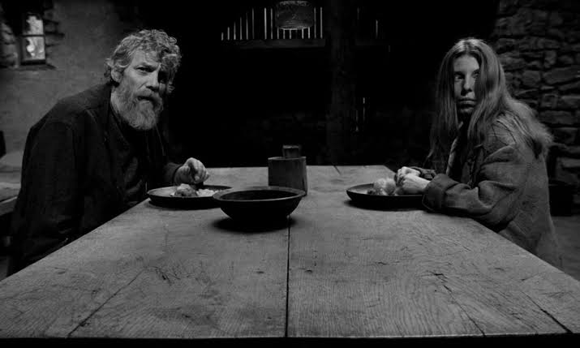

# 都灵之马

## 核心创作者与背景 (The Auteur & Context)

《都灵之马》由匈牙利电影大师贝拉·塔尔（Béla Tarr）与他的妻子兼长期剪辑师阿尼亚斯·赫拉尼茨基（Ágnes Hranitzky）联合执导。作为塔尔对外宣布的“封镜之作”，这部影片不仅是其作者电影特质的极致浓缩，也是其漫长导演生涯的终极句号。

  

幕后团队的铁三角是这部作品的灵魂支柱：匈牙利小说家拉斯洛·克拉斯纳霍尔卡伊（László Krasznahorkai）提供了一如既往的末日启示录文本底色；顶尖摄影指导弗雷德·科莱曼（Fred Kelemen）用粗粝又沉重的黑白胶片赋予了画面雕塑般的质感；而配乐大师米哈伊·维格（Mihály Víg）则谱写了那首如挽歌般无限循环的核心旋律。在这群核心创作者的默契配合下，影片剥离了几乎所有的商业叙事讨好感，彻底走向了纯粹的电影本体与哲学表达。

  

## 历史地位与深远影响 (Historical Legacy)

在21世纪的世界电影版图中，《都灵之马》被视作“缓慢电影”（Slow Cinema）流派的一座不可逾越的丰碑。该片在2011年第61届柏林国际电影节上斩获了评审团大奖银熊奖及费比西影评人奖。这不仅是对影片艺术成就的肯定，更像是欧洲艺术院线对一个古典、冷峻的电影时代逝去的崇高致敬。

  

它的深远影响在于，它向全世界的创作者证明了：极简主义与物理时间的绝对延展，能够爆发出何种惊人的感官压迫力。它摒弃了现代影视工业对快节奏剪辑的依赖，将电影对时间的雕刻推向了罗伯特·布列松（Robert Bresson）与安德烈·塔可夫斯基（Andrei Tarkovsky）式形而上学探讨的终极彼岸。在后世众多探讨末日绝望、存在主义困境的文艺电影中，我们总能看到《都灵之马》那深邃而苍凉的倒影。

  

## 视听语言与叙事手法 (Cinematic Techniques)

从工业与视听层面来看，本片是一场挑战观众生理与心理耐受度的硬核实验：

  

- **极致的长镜头美学：** 全片长达155分钟，却仅由30个左右的超长镜头构成。摄影机如同一个冷酷的旁观者，通过极其缓慢的推拉摇移，强迫观众与剧中人物共同体验时间的“物理流逝”。传统交叉蒙太奇在这里彻底缺席，取而代之的是绝对的纪实压迫感。
    
      
    
- **高反差黑白色彩设计：** 摄影指导科莱曼的35mm黑白胶片剔除了世俗的绚丽，呈现出一种铅灰色、粗粝的光影肌理。画面中几乎没有自然光的生机，室内如牢笼般的幽暗与室外漫天狂沙形成了一种幽闭恐惧式的空间对立。
    
      
    
- **音效与配乐的包裹：** 贯穿全片的并非人物对白，而是自然界无孔不入、咆哮着的呼啸狂风。伴随着维格那段阴郁、单调、由弦乐与手风琴交织的循环配乐，音画同步制造出一种如同深渊般无法逃脱的窒息氛围。
    
      
    

## 核心主旨与哲学探讨 (Thematic Depth)

影片的文本起点源于1889年哲学家尼采在意大利都灵街头抱住一匹受鞭打的马痛哭，随后彻底陷入疯狂的历史轶事。但塔尔并未将镜头对准尼采，而是转向了那匹马、赶马人及其女儿，叩问事件遗留的余波。

  

- **反向《创世记》：** 影片按六天划分结构，展现了一场“创世记的倒放”。第一天马拒绝拉车，第二天马拒绝进食，随后木头的蛀虫停止了啃噬，赖以生存的井水彻底干涸，油灯的火焰无法点燃，直到最后一天，世界归于绝对的黑暗与死寂。这是一种循序渐进的“去生命化”与万物熵增过程。
    
      
    
- **存在主义的虚无与西西弗斯隐喻：** 父亲与女儿每天重复着穿衣、打水、套马、煮土豆、用手剥食土豆的机械劳作。正如塔尔本人所言，这部电影探讨的是“人类存在的沉重感”。它刨去了关于人类文明和希望的虚妄伪装，将生命降维至最原始、最苍白的躯壳存续，直视了在末日降临前，底层个体那种无声的绝望、荒诞与生命力的剥夺。
    
      
    

## 专业评分与综合口碑 (Critical Reception)

《都灵之马》在全球主流权威平台上维持着极高的学术地位与影迷口碑，是公认的21世纪杰出电影范本：

  

|**平台**|**评分数据**|**评价参考**|
|---|---|---|
|**IMDb**|7.7/10|在超过两万名资深影迷的打分下，保持着艺术片中极其稳固的高分。|
|**烂番茄 (Rotten Tomatoes)**|87% 认证新鲜|影评人共识将其视为一场严峻但必看的“耐力测试”，是塔尔对悲悯最直白、最深刻的表达。|
|**Metacritic**|80/100 (Must-See)|核心媒体给出高度赞誉，称其沉浸式的时间呈现精准捕捉到了生命本质的沉疴与苦难。|
|**豆瓣 (Douban)**|8.4/10|国内迷影圈的现象级神作，常年位居文艺片、长镜头教学及影史必看榜单前列。|

**媒体综评：**

主流影视媒体（如《视与听》及《Slant》杂志等）普遍认为，该片观影门槛极高，考验着观众的定力与心智。但其令人敬畏的严酷美学与不可逆转的宿命感，最终会剥离日常的喧嚣，赋予观众一种涤荡灵魂的悲剧性释然。