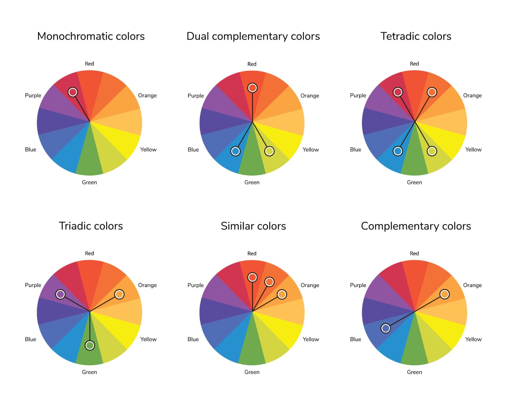

# 什么是颜色？

从物理学和生物学的角度来说，颜色在客观世界中其实是不存在的。它本质上是**光（特定波长的电磁波）**与**人类大脑**共同合作产生的一种“翻译结果”或“视觉错觉”。

  

- **光的波长**：太阳光或白光包含了各种波长的电磁波。人类肉眼能看见的“可见光”，只是整个电磁波谱中极窄的一小段（波长约在 380 到 750 纳米之间）。
    
      
    
- **物体的反射**：物体本身并没有颜色。当我们看到一个“红色的苹果”时，是因为苹果表面的材质吸收了白光中的蓝光、绿光等其他波长的光，**只把红光（较长波长的光）反射了出来**。
    
      
    
- **大脑的翻译**：这束反射的红光进入人眼，刺激了视网膜上的“视锥细胞”。细胞将化学信号转化为电信号传给大脑，大脑经过处理后，在你的意识中生成了“红色”这个概念。
    
      
    

**色环（Color Wheel）是怎么来的？**

  

既然光的光谱是线性的（就像彩虹一样，从红一直平铺到紫），那它是怎么变成一个“环”的呢？

  

这是物理学家牛顿（Isaac Newton）的杰作。他在 17 世纪用三棱镜将白光色散成可见光谱后，敏锐地发现光谱两端的红色和紫色在视觉上有一种隐秘的联系。于是，他**把线性的光谱首尾相连，弯曲成了一个圆**，发明了人类历史上第一个色相环。

  

色环不仅是一个环，它更像是一个严密的数学逻辑盘，通常由12种颜色按以下层级推演构成：

  

1. **三原色（Primary Colors）**：色环的核心基石。它们是绝对纯粹的颜色，无法由其他任何颜色混合而成。
    
      
    
2. **间色 / 二次色（Secondary Colors）**：由任意两种原色等量混合得到的颜色。
    
      
    
3. **复色 / 三次色（Tertiary Colors）**：由一种原色与它相邻的间色混合得到的过渡色。
    
      
    

**三套不同的“色环世界”**

  

你可能会发现，有时候人们说的“三原色”不一样，这是因为根据应用媒介的不同，存在不同的色环体系：

  

- **传统美术色环（RYB体系）**：
    
      
    - **三原色**：红（Red）、黄（Yellow）、蓝（Blue）。
        
          
        
    - **原理**：这是**颜料**的混合规则（减色法）。因为颜料是吸收光的，所以颜色越混合，吸收的光越多，整体看起来就越暗、越浑浊（混在一起偏黑）。
        
          
        
- **光学/数字色环（RGB体系）**：
    
      
    - **三原色**：红（Red）、绿（Green）、蓝（Blue）。
        
          
        
    - **原理**：这是**光线**的混合规则（加色法），是你面前的手机屏幕和电脑显示器正在使用的原理。光线越叠加越亮，这三种颜色的光等量相加，就会变成纯白光。
        
          
        
- **印刷色环（CMYK体系）**：
    
      
    - **三原色**：青（Cyan）、品红（Magenta）、黄（Yellow），外加定位用的黑（Key）。
        
          
        
    - **原理**：这是**油墨印刷**的规则。
        
          
        

色环的伟大之处在于，它把虚无缥缈的光波段、人脑的主观感受，转化为了一套可见、可量化、可计算的几何图形。你发的那张包含6种色彩搭配图的规则，正是建立在这个环形逻辑之上的数学规律。

一共有多少种颜色，取决于你从生物学、计算机科学还是物理学的维度去定义“颜色”。

  

- **生物学维度（人类视觉的极限）：约 1000 万种**
    
    人类视网膜上有三种分别对红、绿、蓝光敏感的视锥细胞。研究表明，每一种视锥细胞大约能分辨 100 个层级的明暗和色度变化。这三种细胞相互配合，将信号交由大脑进行复杂的神经运算后，普通人类肉眼大约能分辨出 1000 万种不同的颜色。这也是为什么人类能在极其细腻的印象派画布上，或是现实的自然光影中，捕捉到极其丰富的色彩过渡。
    
      
    
- **计算机维度（数字世界的刻度）：16,777,216 种**
    
    在 Web 前端 UI 开发或桌面软件界面设计中，屏幕发色依赖于 RGB 光学模型。目前的标准显示器普遍采用 24 位真彩色（True Color），即红、绿、蓝三个通道各分配 8 个比特，每个通道有 0 到 255 共计 256 个亮度级别。将它们相乘：256 × 256 × 256 = 16,777,216。因此，我们在代码中通过十六进制（如 `#FFFFFF`）能精准调用的颜色总数是 1670 万种。
    
    当然，如果回到复古的 8-bit 像素游戏环境，受限于当时的图形内存，系统能同时处理和显示的色彩库通常只有 256 种、64 种甚至更少。
    
      
    
- **物理学维度（宇宙的真实状态）：无穷无尽**
    
    在客观物理世界中，颜色是光波的波长。可见光谱是一个完全连续的物理区间（大约 380 到 750 纳米），就像数学中任意两个数字之间都存在无数个小数一样。在 500 纳米和 501 纳米之间，波长还可以被无限细分。这意味着宇宙中客观存在的光的种类是无限的，只是我们这双由碳水化合物构成的眼睛精度有限，大脑自动将那些极其微小的波长差异“模糊合并”成了同一种颜色。
    
      
    

如果论宇宙的客观存在，颜色是无限的；如果论人类肉眼能体验的世界，是 1000 万种；如果论你在代码里能精确调用的色彩字典，则是 1677 万种。

不用被那些千万乃至无穷尽的物理数字吓到。回到现实的画板前，一套最主流、最核心的基础“颜料启动包”，其实只需要这几支最纯粹的颜色：

  

- **三原色（红、黄、蓝）**：这是色彩世界的“造物主”。世界上任何其他颜料都混合不出纯正的红、黄、蓝，但只要有了它们三个，你就能像变魔术一样调配出绝大多数的色彩。
    
      
    
- **三间色（橙、绿、紫）**：由两两原色混合而生。红加黄变橙色，黄加蓝变绿色，红加蓝变紫色。
    
      
    
- **明暗调节剂（白与黑）**：它们被称为“无彩色”，但在绘画中不可或缺。加白色能让颜色变得明亮、轻盈（比如让红色变成浅粉色）；加黑色能让颜色变得深沉、厚重（比如让蓝色变成藏青色）。
    
      
    

不管是梵高笔下极具视觉张力的向日葵，还是莫奈画布上波光粼粼的日出，最初挤在他们调色板上的，也不过就是这几种最基础的原色和间色。靠着对比例和明暗的把控，手里握着这几支颜料，就足够画出整个世界了。

理论上确实如此，但在实际操作中，如果只靠“红黄蓝+黑白”这 5 支颜料起步，大概率会被调色折磨到崩溃。

  

现实中的化学颜料并没有物理光谱那么“完美”。市面上的红颜料往往偏一点黄或偏一点紫，蓝色也可能偏绿。当你试图用偏黄的红（暖红）和偏绿的蓝（冷蓝）去调和纯正的紫色时，等同于把红、黄、蓝三种成分都混在了一起，最终得到的一定是一坨浑浊发灰的“脏泥”。

  

为了保证调色的纯度，同时也为了避免每次作画都像做精密化学实验一样费时，画家在购买颜料时通常会遵循“冷暖双色+大地色”的实用配置。梵高画《海滩上的渔船》和莫奈画《印象·日出》时，能让画面产生那种极具张力的互补色对比和非凡的光感，很大程度上也依赖于直接使用纯度极高的现成管装颜料，而不是靠三原色死磕。

  

一套最经典、容错率最高的油画起步颜料，通常包含以下 9 支：

  

- **白色**：钛白（Titanium White）。油画里用量最大的颜料，用来提亮和覆盖，建议直接买大管。
    
      
    
- **黄色系**：镉黄（暖黄，阳光的颜色） + 柠檬黄（冷黄，带点绿意） + 土黄（Yellow Ochre，自然界极其常见的温和黄，调和肤色和风景的百搭神器）。
    
      
    
- **红色系**：镉红（暖红，纯正的大红） + 茜素深红（冷红，偏暗紫，用它调出的紫色才够鲜艳）。
    
      
    
- **蓝色系**：群青（暖蓝，画深邃天空的绝对主力） + 钴蓝（冷蓝，纯净通透）。
    
      
    
- **暗部/大地色**：熟褐（Burnt Umber）。画树干、泥土和所有暗部边缘的万能打底色。
    
      
    

至于黑色（如象牙黑），在真正的油画创作中反而并非绝对刚需。很多画家更喜欢用“群青 + 熟褐”等比例混合，这样调配出的“黑”比直接挤出来的黑颜料更生动、更透气。拿着这套 9 色组合，你能调出自然界绝大多数不发脏的色彩。

网页使用的是**发光的光学加色法（RGB）**，而现实中的颜料混合是**吸收光线的减色法（Subtractive Mixing）**。

现代色彩科学（计算机图形学）中最优雅、最主流的解决方案是**库贝尔卡-蒙克理论（Kubelka-Munk Theory, 简称 K-M 理论）**。

它的原理非常符合直觉：

1. **吸收系数 ($K$) 与散射系数 ($S$)**：每一种颜料对不同波长的光有不同的吸收能力 ($K$) 和散射能力 ($S$)。
    
2. **转换**：我们在网页里选取的 RGB 颜色，可以通过公式近似转换为代表其物理特性的光吸收率比例（$K/S$ 值）。
    
3. **多色混合**：当两个或三个颜色（比如色块 $A$、 $B$、 $C$）按不同比例混合时，它们的 $K/S$ 值会根据各自的浓度比例进行加权平均：
    
    $$\left(\frac{K}{S}\right)_{mix} = \frac{w_1(K/S)_1 + w_2(K/S)_2 + w_3(K/S)_3}{w_1 + w_2 + w_3}$$
    
4. **还原**：把混合后的整体 $K/S$ 值再通过数学逆运算还原成屏幕看得懂的 RGB 色彩。

目前前端开源界有一个非常轻量、专门用来模拟真实颜料混合的轻量级库——**`Spectral.js`**（基于 K-M 理论封装）。

  

    🎨 经典油画颜料库：
    

    点击色块，将其应用到当前选中的通道
  

  

    

      

      <button id="umAddBtn" class="um-add-btn">＋ 添加颜料通道</button>
    

    

      

        

          

          
点击复制

        

      

      

        
#------

        
多维动态 RGB 混合计算

      

    

  

这张图完整展示了基于色相环的6种经典**色彩搭配原理（Color Harmonies）**：

  

- **Monochromatic colors（单色/同色系搭配）**：只选取色相环上的单一颜色。在实际应用中，通常依靠改变这一个颜色的明暗、深浅来拉开视觉层次，整体风格高度统一且不易出错。
    
      
    
- **Dual complementary colors（分裂互补色搭配）**：图示选择了一个主色（红色），并搭配了其正对互补色（绿色）两侧的相邻颜色（偏蓝绿和黄绿）。它比直接的互补色对比要稍微柔和一些，既保留了视觉张力，又不至于对比过于生硬。
    
      
    
- **Tetradic colors（四方/矩形配色）**：由两组互补色构成，四个颜色在色相环上连线呈一个矩形（如图中的红、橙、绿、蓝）。这种配色极为丰富多元，但在设计时通常需要让其中一个颜色作为主导，其余作为点缀，以防画面失去重点。
    
      
    
- **Triadic colors（三色/正三角形配色）**：选取色相环上距离相等的三个颜色，连线构成正三角形（如图中的紫、橙、绿）。这种搭配能保持强烈的视觉对比，同时三者相互制约达到平衡，显得非常有活力。
    
      
    
- **Similar colors（类似色/相邻色搭配）**：选取色相环上紧挨着的几个颜色（如图中的红、红橙、橙）。由于它们含有共通的色彩基因，过渡非常平滑，能带来高度和谐、舒适且自然的视觉体验。
    
      
    
- **Complementary colors（互补色搭配）**：即我们在色相环上看到呈180度完全对立的两种颜色（如图中偏蓝紫色与偏黄橙色的连线）。能产生最强烈的视觉冲击，常用于突出核心焦点。