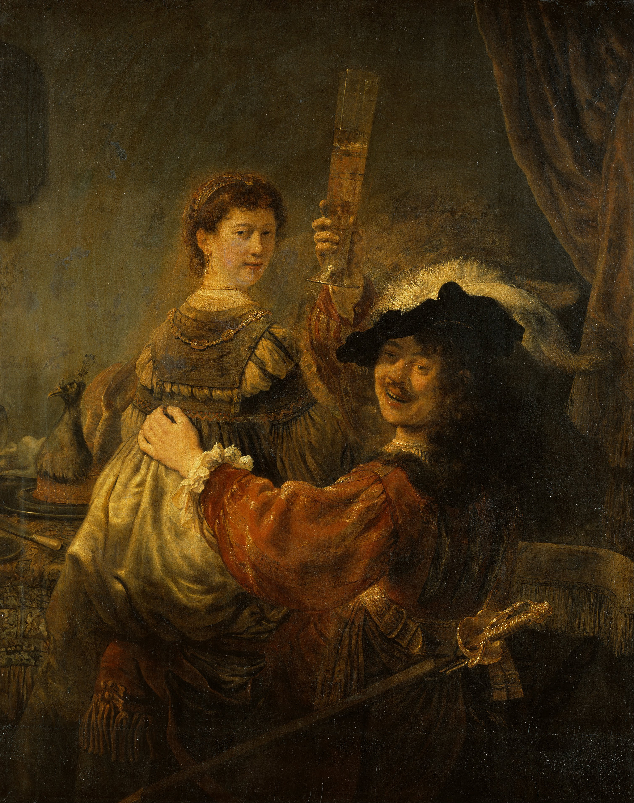
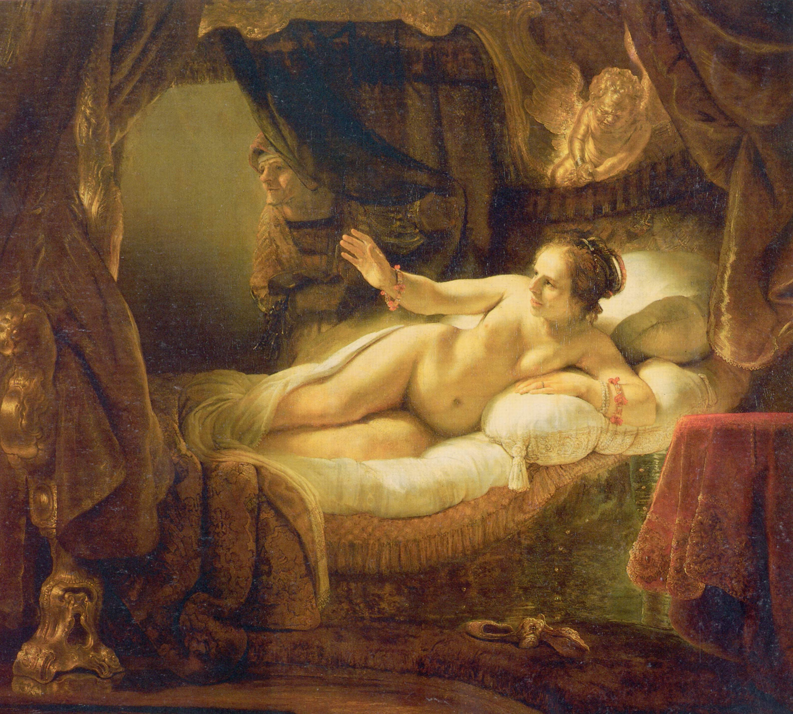
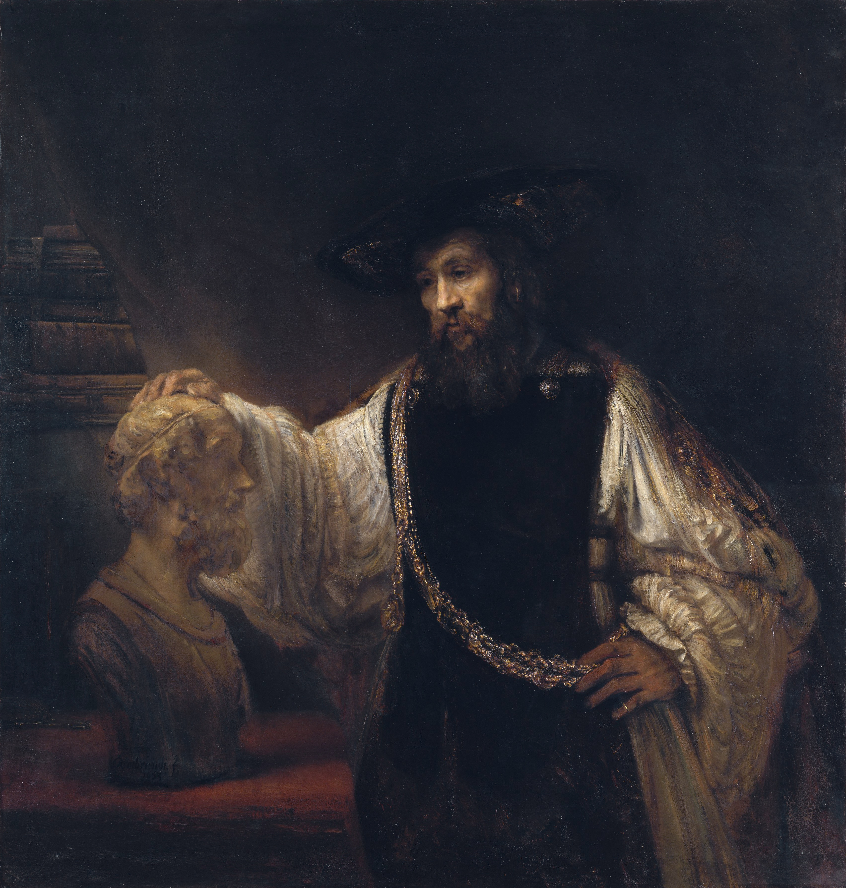
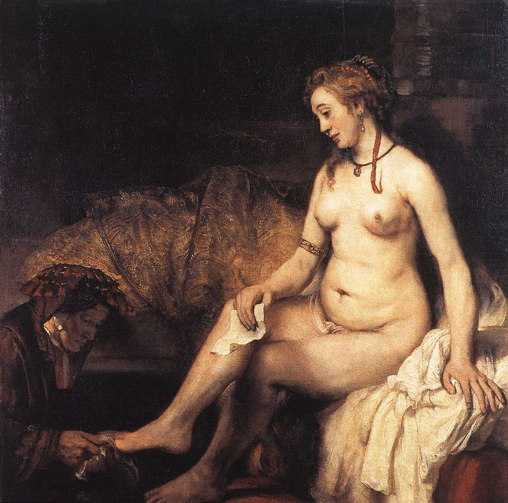
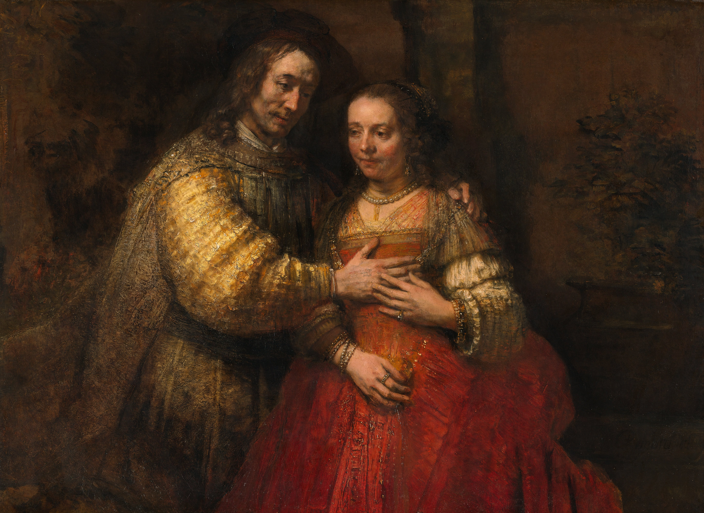
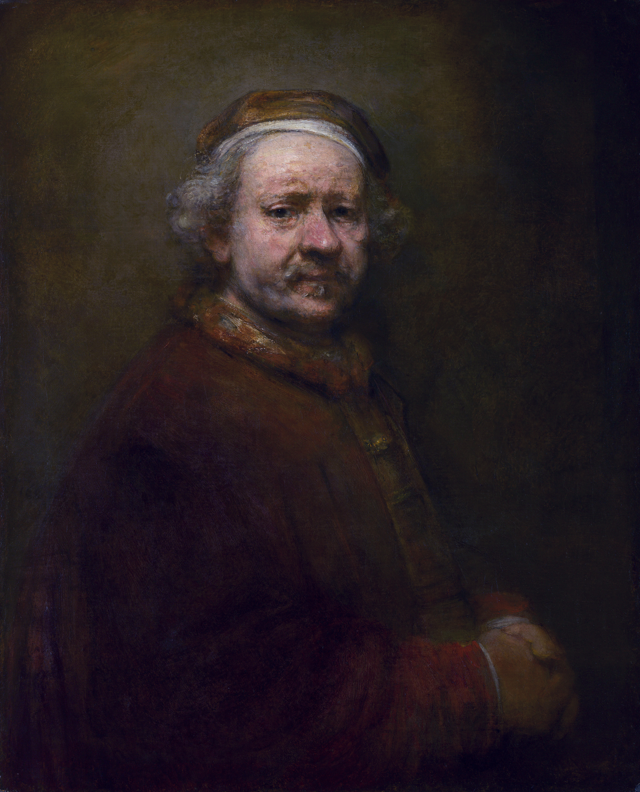

# 伦勃朗·梵·莱茵

欢迎来到这场跨越三百多年的时空特展。今天，我们将穿透历史的尘埃，走进荷兰黄金时代最伟大的灵魂——伦勃朗·梵·莱茵（Rembrandt van Rijn）的内心世界。

  

### 序言：光影魔术师与人类灵魂的解剖者

在步入展厅之前，我们需要先认识这位屹立于西方艺术史巅峰的巨匠。伦勃朗被誉为“荷兰黄金时代最伟大的画家”**，也是欧洲艺术史上最伟大的视觉艺术家之一。他的艺术地位之所以崇高，不仅在于他出神入化的“伦勃朗光”（Chiaroscuro，强烈的明暗对比法），更在于他用画笔**“解剖了人类的灵魂”。

  

他的一生，是一出莎士比亚式的悲剧。从名满天下、挥金如土的阿姆斯特丹新星，到破产清算、痛失所有挚爱的孤老。他的画风也完成了从炫技般的华丽、精准，到晚年用粗粝厚涂法（Impasto）直击灵魂的蜕变。

  

现在，请随我步入展厅，透过这10幅杰作，重走他大起大落的传奇一生。

  

### 第一展区：晨曦与荣光（1632 - 1635）

_这里的画作色彩明丽，充满不可一世的才华与对世俗幸福的狂热。_

  

**1. 《杜尔普医生的解剖课》 (1632)**

  

- **创作背景：** 26岁的伦勃朗初到阿姆斯特丹，接到了外科医生行会的重磅委托。当时的群像画通常是呆板的“排排坐”，雇主们按交钱多少露脸。
    
      
    
- **创作心情与心境：** 年少成名，意气风发。伦勃朗充满了打破常规的野心与自信。他创造性地将人物安排在解剖台周围，通过每个人的眼神和动作构建出极强的戏剧张力。这幅画让他一战成名，拿到了通往阿姆斯特丹上流社会的入场券。
    
      
    

**2. 《扮作花神的萨斯基亚》 (1634)**

  

- **创作背景：** 伦勃朗迎娶了名门望族之女萨斯基亚，不仅获得了丰厚的嫁妆，更收获了一生中最热烈的爱情。
    
      
    
- **创作心情与心境：** 这是他人生中最甜蜜、最无忧无虑的时光。画笔下流淌着无尽的深情，他将新婚妻子装扮成掌管春天的花神。繁复华丽的丝绸质感和盛开的花朵，折射出他对未来生活的美好期盼，以及想要把世界上最美好的一切都献给爱人的骄傲。
    
      
    

**3. 《酒馆里的浪子》 (1635)**

  

- **创作背景：** 伦勃朗与萨斯基亚的双人自画像。此时他订单不断，处于财富与名望的绝对顶峰，但也开始养成挥霍无度、购买大量奇珍异宝的习惯。
    
      
    
- **创作心情与心境：** 极度的狂喜与傲慢。画中的伦勃朗举起酒杯，让妻子坐在自己腿上，转头看向画外，仿佛在向全世界炫耀他的成功、财富与娇妻。此时的他，是阿姆斯特丹最受宠爱的天之骄子。
    
      
    

### 第二展区：巅峰与骤雨（1636 - 1643）

_命运的转折点。荣耀的极点，也是悲剧的起点。_

  

**4. 《夜巡》 (1642) —— 艺术与命运的双重转折**

  

- **创作背景：** 接到阿姆斯特丹火枪手公会的巨额委托。然而就在同年，他最爱的妻子萨斯基亚因结核病奄奄一息。
    
      
    
- **创作心情与心境：** 艺术的野心与内心的悲痛交织。伦勃朗不愿再画千篇一律的呆板群像，他将画作处理成士兵们即将出巡的宏大动态瞬间。但这种天才的创新激怒了那些付了同等费用却被画在暗处的雇主。《夜巡》成为了他艺术生涯的最高峰，却也导致他此后订单锐减，名声一落千丈。同年妻子离世，他的人生被拦腰折断。
    
      
    

**5. 《达娜厄》 (1636-1643)**

  

- **创作背景：** 这幅画历时7年才完成。起初是以妻子萨斯基亚为模特，但在她死后，伦勃朗修改了画作，融入了新情人海尔吉的面容。
    
      
    
- **创作心情与心境：** 痛苦的挣扎与对新生的渴望。这是一张覆盖着两任爱人容颜的画布，他在悲痛的追忆中试图寻找新的情感寄托。画作中那束倾泻而下的金光，既是神话中宙斯的化身，也是画室中伦勃朗绝望中渴求的温暖。
    
      
    

### 第三展区：幽暗与深思（1653 - 1654）

_跌入谷底。在世俗的指责与财务的重压下，他的画笔开始向人类灵魂的深处探寻。_

  

**6. 《凝视荷马半身像的亚里士多德》 (1653)**

  

- **创作背景：** 意大利贵族的委托。此时伦勃朗早已入不敷出，债台高筑，面临着即将被清算破产的命运。
    
      
    
- **创作心情与心境：** 沉重的哲思与自我审视。尽管陷入极度缺钱的困境，画作却没有任何谄媚。他借亚里士多德之手，一端抚摸着象征不朽艺术的荷马盲眼雕像，身上佩戴着象征世俗荣华的沉重金链。这是破产前夕的伦勃朗在叩问自己的灵魂：到底是追逐世俗的财富，还是坚守艺术的永恒？
    
      
    

**7. 《沐浴的拔示巴》 (1654)**

  

- **创作背景：** 画中模特是陪伴他晚年的伴侣亨德里治。当时伦勃朗即将宣告破产，而怀有身孕的亨德里治更被教会以“未婚同居、生活作风败坏”为由严厉传唤并当众羞辱。
    
      
    
- **创作心情与心境：** 极度的无奈、心疼与深沉的悲悯。他没有将拔示巴画成充满诱惑的尤物，而是描绘了她手握国王信件时，那充满忧郁、无奈和沉重的眼神。拔示巴的命运受制于强权，这正是现实中伦勃朗与亨德里治面对社会打压时的绝佳写照。
    
      
    

### 第四展区：悲悯与不朽（1665 - 1669）

_繁华落尽，亲人尽丧。剥离了一切炫技，只剩下对苦难的包容与灵魂的安息。_

  

**8. 《犹太新娘》 (1665-1667)**

  

- **创作背景：** 晚年的伦勃朗已经彻底穷困潦倒，连珍爱的画作和收藏都被拍卖抵债。此时，一直照顾他的伴侣亨德里治也已离他而去。
    
      
    
- **创作心情与心境：** 历尽沧桑后的极致温情。他彻底放弃了早年对丝绸质感的精准描摹，转而使用极厚重的颜料（厚涂法），如同用泥土在画布上雕塑。画中男人将手轻抚在女人胸前，女人指尖轻轻回应。在经历了世间一切背叛、死亡与夺取后，他用粗糙的笔触画出了人类最温柔、最坚定的爱与守护。
    
      
    

**9. 《浪子回头》 (1668-1669)**

  

- **创作背景：** 萨斯基亚留下的唯一血脉，他最疼爱的独子提图斯在27岁时英年早逝。白发人送黑发人，给了他最后的致命一击。
    
      
    
- **创作心情与心境：** 彻底的宽恕、心碎与灵魂的救赎。在生命的尽头，他画下了这幅西方艺术史上的不朽丰碑。画面中没有任何戏剧性的冲突，只有瞎眼的老父亲用布满沧桑的双手，抚摸着跪在地上、衣衫褴褛、连鞋底都磨破的儿子。这是伦勃朗对命运的最终和解，也是他疲惫不堪的灵魂对安息的最后渴望。
    
      
    

**10. 《63岁自画像》 (1669)**

  

- **创作背景：** 这是他去世那年的绝笔自画像。几周后，这位曾经的阿姆斯特丹之王，在贫民区的一间破屋中孤单离世，被草草埋葬在无名墓地中。
    
      
    
- **创作心情与心境：** 终局的坦然。画中的他满脸褶皱，皮肤松弛，粗粝的笔触毫不留情地记录下衰老与贫穷。但他没有绝望，也没有愤怒。他双手交叠，犹如一位看破红尘的老僧，眼神透出洞穿一切悲喜的平静与从容。他失去了世俗的一切，却赢得了不朽。
    
      
    

### 结语

展览到此结束。从《解剖课》的年少锐气，到《浪子回头》的深沉悲悯，伦勃朗用一生的眼泪与苦难，为人类调配出了最深邃的色彩。他曾被时代的洪流抛弃，但他画笔下的光，却穿越了三百多年的黑暗，至今仍在照耀每一个驻足凝视的灵魂。