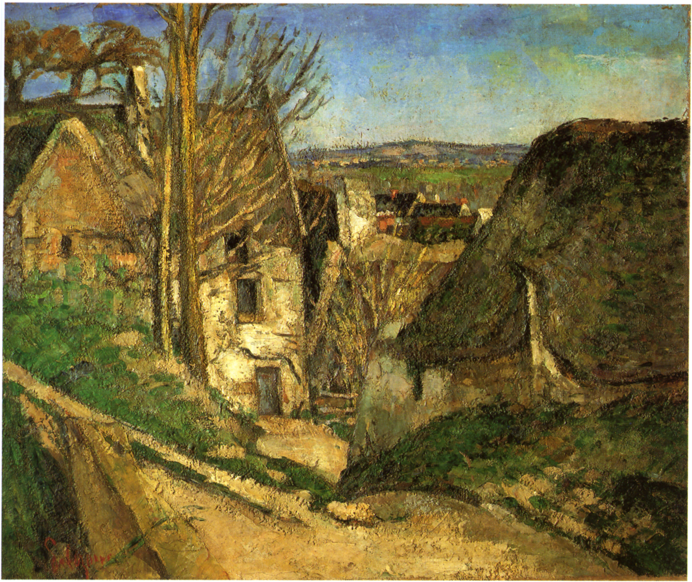
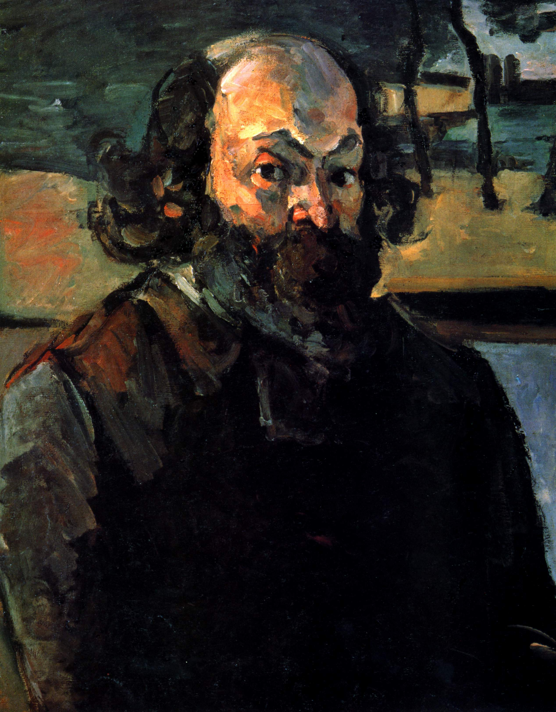
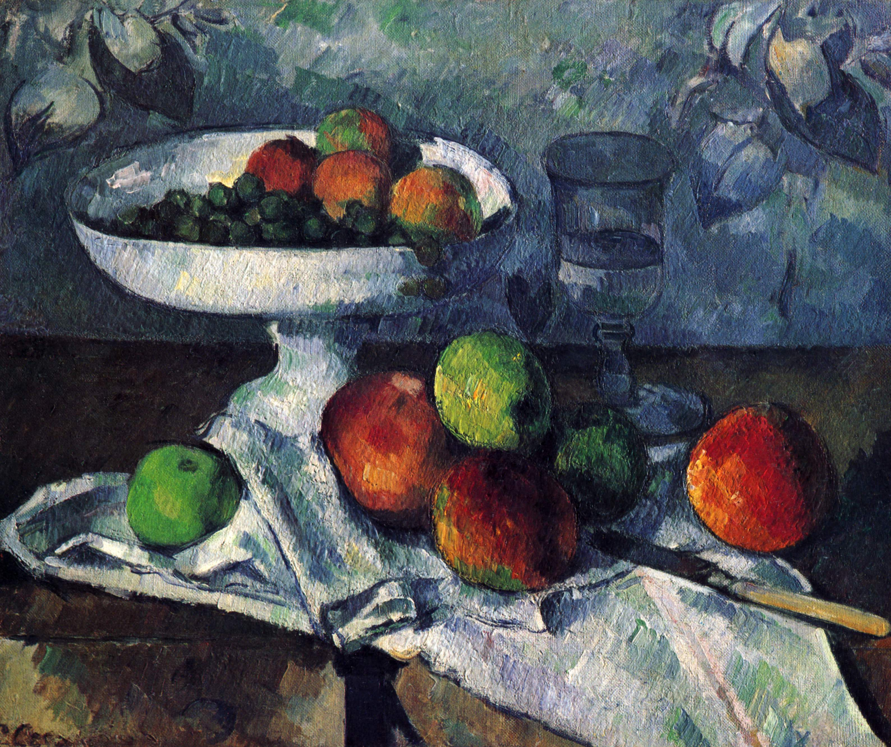
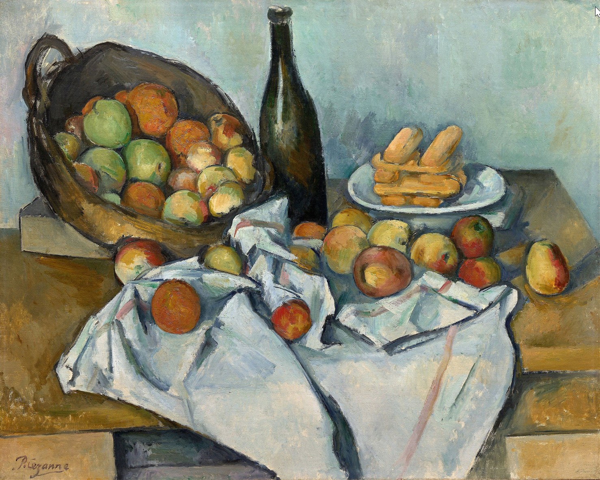
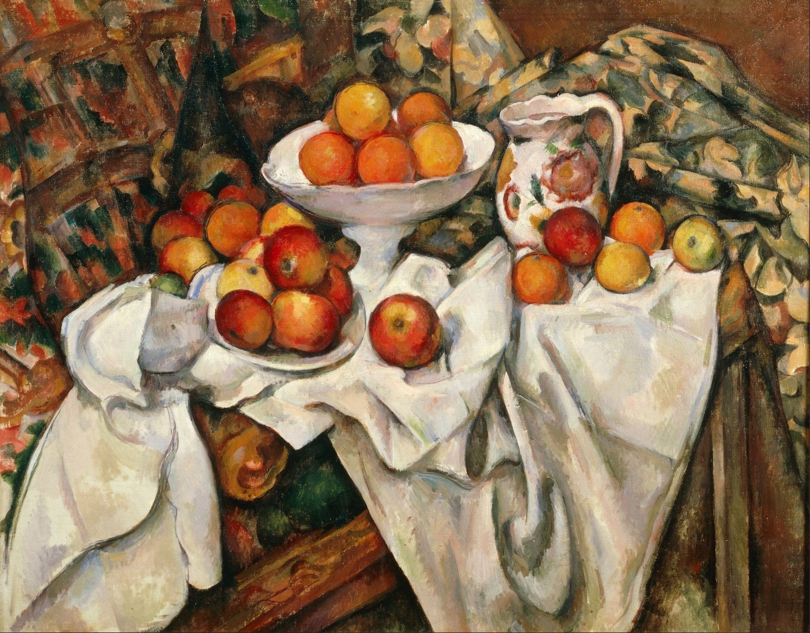
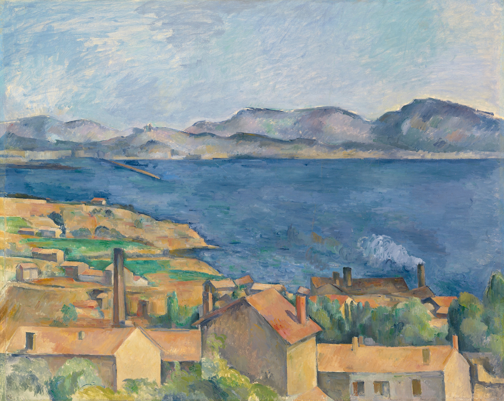
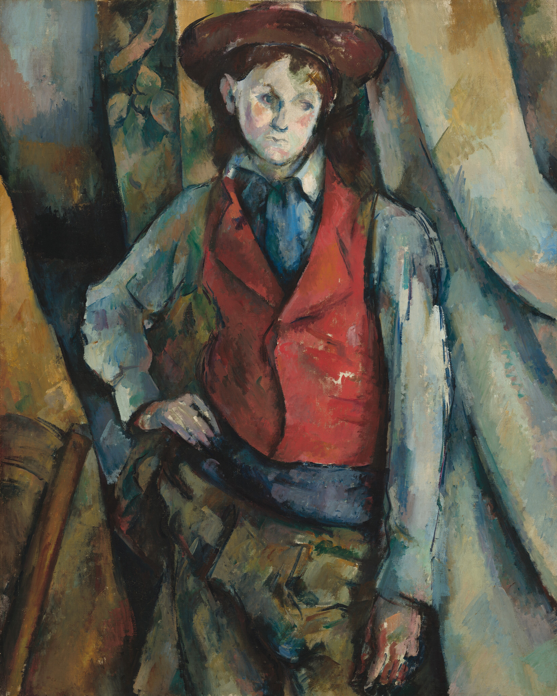
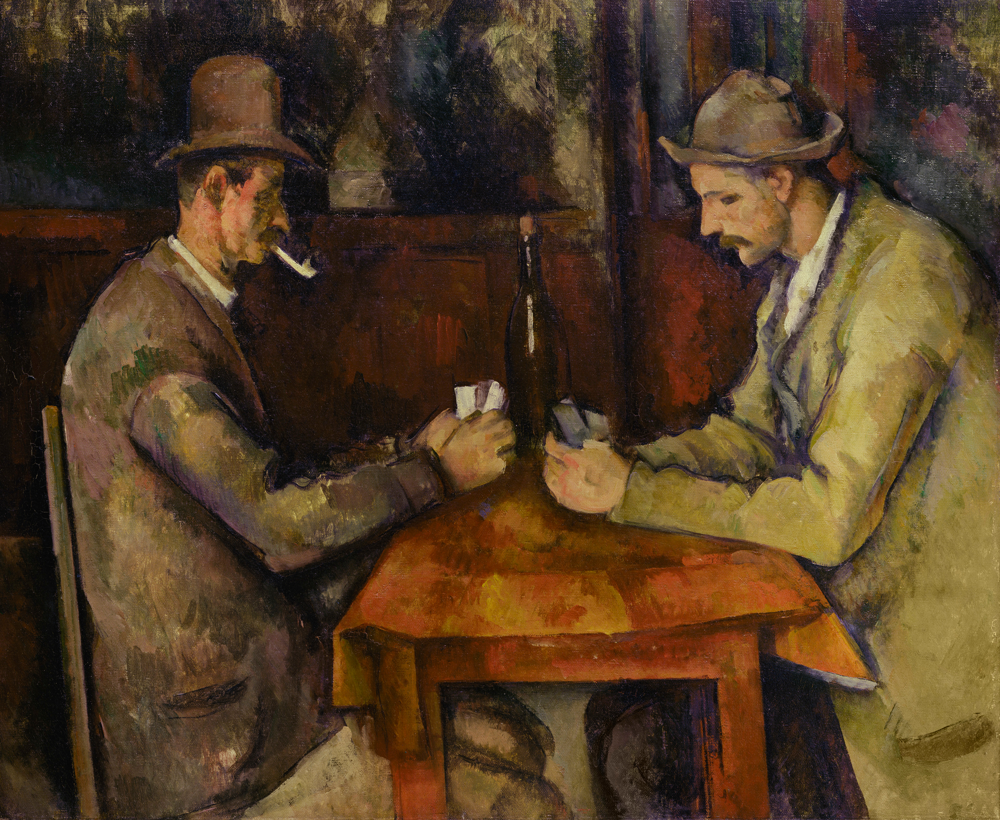
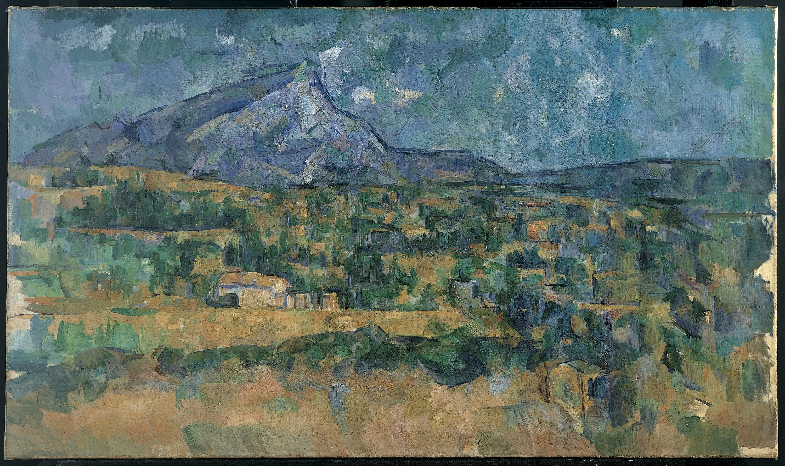
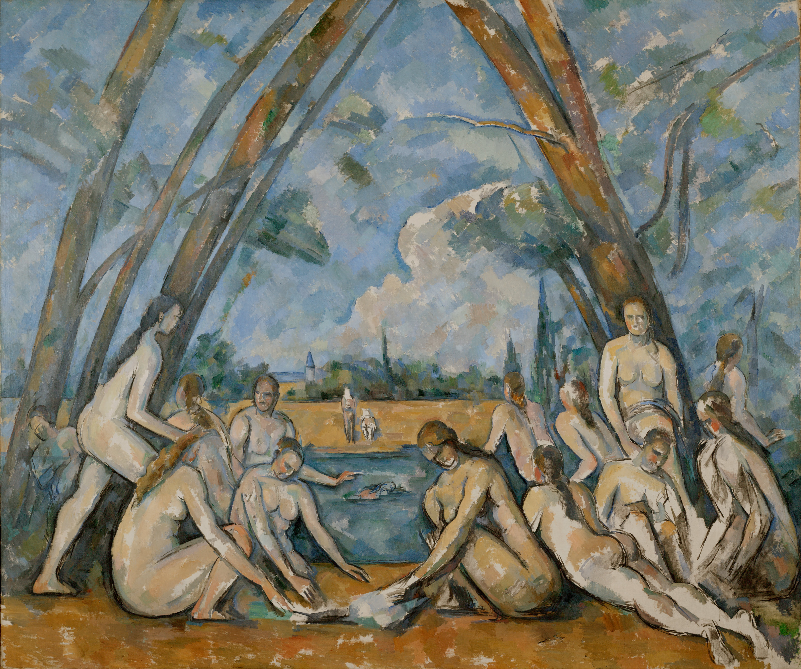

# 保罗·塞尚

保罗·塞尚（Paul Cézanne，1839—1906）被称为“现代艺术之父”。他的一生是一场孤独而执着的视觉革命，不仅终结了自文艺复兴以来的传统透视法则，也成为了连接印象派与20世纪立体主义（如毕加索）和野兽派（如马蒂斯）的桥梁。

塞尚的创作生涯并非一帆风顺，他的艺术轨迹与他从迷茫、挣扎到最终在故乡普罗旺斯寻得内心秩序的生平紧密相连。

## 迷茫与启蒙：巴黎的洗礼与印象派时期 (1860s - 1870s)

塞尚出生于法国南部普罗旺斯地区艾克斯的一个富裕家庭。父亲希望他继承家业或成为律师，但他在童年挚友、后来成为著名作家的爱弥尔·左拉（Émile Zola）的鼓励下，于1861年毅然前往巴黎学习艺术。初到巴黎的塞尚性格孤僻、屡遭官方沙龙拒绝，直到他结识了印象派大师毕沙罗，才开始走向户外，学习用光影和色彩作画。

**1. 《自缢者之家》（The House of the Hanged Man）**

- **创作时间**：1873年

- **创作心情**：初到巴黎受挫后的他，在结识印象派大师毕沙罗后走向户外。此时的他内心仍带有几分南法青年的固执与沉郁，对巴黎精致沙龙文化感到格格不入，试图在自然中寻找一种能够安放自我灵魂的厚重感。

- **绘画手法**：虽然他采纳了印象派在户外捕捉自然光线的理念，但与莫奈等人追求转瞬即逝的光影截然不同。塞尚在这幅画中使用了极其厚重的颜料和坚实的笔触，将急剧下降的道路和交错的屋脊刻画得犹如雕塑般沉稳。这隐隐透出他一生都在死死追求的“体积感”与“稳定结构”。

**2. 《自画像》（Self-Portrait）**

- **创作时间**：约1875年

- **创作心情**：充满防备、焦虑与强烈的自我意识。作为屡遭官方沙龙拒绝的“局外人”，他以一种近乎执拗的姿态，记录下自己最真实的模样，向整个巴黎精致的主流艺术圈发出无声的对抗。

- **绘画手法**：画面没有丝毫精细的打磨与美化。画中的他相貌平平、胡须浓密、衣着毫不讲究。粗粝且直接的笔触，不仅剥离了传统肖像画的虚饰，更将人物内在那种压抑、孤独而倔强的精神力量直接暴露在画布之上。

## 打破透视：静物画中的视觉革命 (1880s - 1890s)

1886年是塞尚人生的转折点。相伴四十年的挚友左拉发表了小说《杰作》，书中以塞尚为原型塑造了一个才华横溢却终生失败、最终自杀的画家。塞尚深受打击，与左拉断交，并彻底离开巴黎，隐居故乡艾克斯。他继承了父亲的遗产，不再为生计发愁，开始在画室里对着苹果和桌布，进行极其孤独而伟大的几何学实验。

**3. 《高脚果盘、玻璃杯和苹果》（Still Life with Compotier, Glass and Apples）**

- **创作时间**：1879-1882年

- **创作心情**：在挚友左拉的小说事件爆发前后，塞尚已经开始在孤独中默默展开伟大的空间实验。他心无旁骛，宛如一位严谨的物理学家，在画室的方寸之间，试图重新确立万事万物在空间中的绝对秩序。

- **绘画手法**：他正式向文艺复兴以来的传统单一焦点透视发起挑战。仔细观察高脚果盘的边缘，会发现左侧和右侧并不在同一水平线上；桌子的边缘也被一块白布截断，左右无法连成直线。这是因为塞尚在作画时不断移动身体，将不同视角、不同高度观察到的图像碎片，强行拼接、“缝合”在了同一张二维画布上。

**4. 《静物苹果篮子》（The Basket of Apples）**

- **创作时间**：1890-1894年

- **创作心情**：与左拉决裂并退隐普罗旺斯后，他彻底放弃了世俗的成功，进入了一种极其纯粹、甚至带有些许偏执的专注状态。每一颗苹果，都是他与这个虚幻世界抗争、重塑真实法则的武器。

- **绘画手法**：这幅被奉为经典的静物画进一步放大了“散点透视”的理念。倾斜的苹果篮子仿佛随时会倒下，桌子前后的水平线完全错开，散落的苹果如同山峰般构筑在桌布上。塞尚不再描绘“真实存在”的桌子，而是创造了一个由色彩和几何色块支撑起的纯粹绘画空间。

**5. 《苹果和橘子》（Apples and Oranges）**

- **创作时间**：1899年

- **创作心情**：晚年的他充满自信与霸气，曾扬言“要用一个苹果震惊巴黎”。此时的他，已经彻底掌握了视觉逻辑的真理，用近乎造物主般的视角赋予了画室里的死物以永恒的生命。

- **绘画手法**：这是塞尚晚期最复杂的静物画之一。粗陋的木桌、厚重起伏的白色桌布与鲜艳的橘子、苹果形成了极其强烈的冷暖色彩对比。他画的不再是水果柔软多汁的质感，而是通过紧密的色彩块面，赋予了它们坚如磐石的体积与永恒存在的结构。

## 秩序的重构：自然风景与人物肖像 (1880s - 1890s)

塞尚有一句名言：“要用圆柱体、球体和圆锥体来处理自然。”在隐居普罗旺斯的日子里，他将这种几何化的观察方式应用到了风景和人物写生中。他剥离了事物的表象，去寻找大自然底层的骨架。

**6. 《从埃斯泰克欣赏马赛湾》（The Bay of Marseille, Seen from L'Estaque）**

- **创作时间**：1886年

- **创作心情**：回到了烈日灼烧的南法故乡，他对大自然的敬畏转化为一种寻找极致秩序的渴望。他试图剥离风景表面繁杂的虚饰，去揭示天地间最稳固、最永恒的本质法则。

- **绘画手法**：在这幅风景画中，塞尚将复杂的自然风光高度概括化。前景的建筑物和树木被简化为方形和圆柱形的色块。画面摒弃了传统风景画逐渐模糊的空气景深感，通过冷硬的蓝色海水与温暖的土黄色调相互挤压，让远景与近景紧紧贴合，呈现出一种极其强烈的平面化张力。

**7. 《穿红马甲的男孩》（The Boy in the Red Vest）**

- **创作时间**：1888-1890年

- **创作心情**：在冷静理智的几何观察中，他将人物也视作构建宇宙视觉秩序的一部分。没有多余的情感泛滥，只有对画面空间平衡的极致苛求。

- **绘画手法**：在人物画方面，塞尚毫不犹豫地放弃了解剖学上的精准，而是服从于画面的整体和谐。画中男孩穿着醒目的红马甲，为了让画面构图达到一种向下的连贯与稳定，塞尚刻意拉长了男孩垂下的右臂。这种为了艺术表现而主动扭曲形体的手法，直接启发了后来的野兽派。

**8. 《玩牌者》（The Card Players）**

- **创作时间**：1892-1896年

- **创作心情**：沉浸在普罗旺斯乡间的宁静中，他对世俗的喧嚣感到厌倦。他从这些淳朴的老农身上看到了某种与大地同在的坚毅与永恒，试图在平凡的生活片段中寻找一种绝对的物理均衡与宗教般的静谧。

- **绘画手法**：在多次创作的版本中，画中的农民完全没有生动的表情或戏剧性的动作。他们被描绘得像静物一样沉稳、僵硬且充满分量感。塞尚精准地利用桌子、手臂形成的几何直角和三角形，剥离了时间的流动，构筑了一种近乎神圣的永恒感。

## 终极的融合：普罗旺斯的最后岁月 (1890s - 1906)

晚年的塞尚患有糖尿病，性格更加乖僻，几乎与世隔绝。他每天背着画架前往荒野，面对着家乡的圣维克多山一遍遍作画。此时，他的技法已经达到了随心所欲的境界，轮廓线彻底消失，世界在他的笔下化为纯粹的色彩马赛克。

**9. 《圣维克多山》（Mont Sainte-Victoire）**

- **创作时间**：约1904-1906年

- **创作心情**：这座山是他一生的精神图腾。那是他生命最后的光辉，是在无尽的孤独与病痛中，用如苦行僧般的虔诚与天地万物达成的终极和解。

- **绘画手法**：在这幅晚期的代表作中，技法已臻化境，传统的轮廓线彻底消失。山体、天空、麦田不再有明确的界限，一切都被解构为并列的、跳跃的方形笔触（即“建构性色块”）。这些色块在视网膜上重新交织，形成了一座比真实更具压迫感和力量感的山峰。这就是立体主义破晓的黎明。

**10. 《大浴女》（The Large Bathers）**

- **创作时间**：1899-1906年

- **创作心情**：这是他倾注了人生最后七年心血的巅峰巨制与绝唱。他渴望在死神降临之前，完成一次对古典伟大传统的现代性重构，将人与自然完美地安放在一种绝对的神圣秩序之中。

- **绘画手法**：画中的裸女并非为了展现世俗的肉欲美，而是作为构建画面的“建筑材料”。两侧倾斜的树干与姿态各异的浴女共同构成了一个巨大的拱形稳定结构。没有多余的叙事，只有色彩与几何块面交织出的超脱世俗的宁静与神圣感。

1906年10月的一天，67岁的塞尚在野外画画时遭遇暴雨，他在雨中坚持工作了几个小时后昏倒，被送回家后死于肺炎。他用一生的孤独和执拗，将绘画从“模仿自然”的传统枷锁中彻底解放出来。几个月后，巴黎为他举办了大型回顾展，年轻的毕加索在展厅中深受震撼，现代艺术的大幕由此正式拉开。