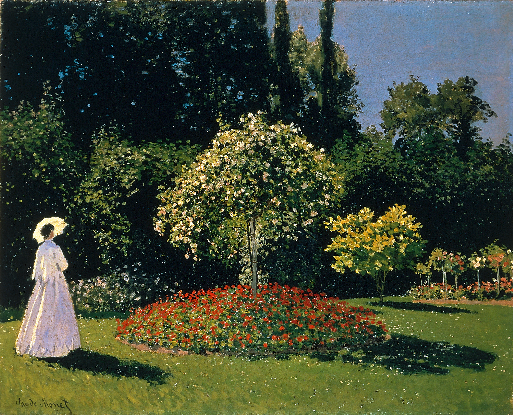
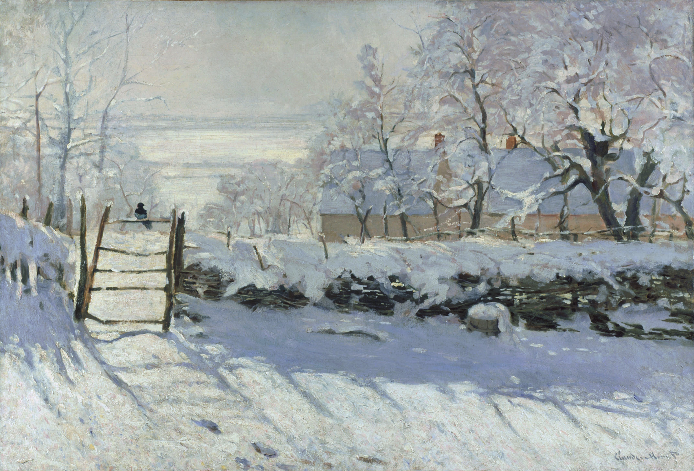
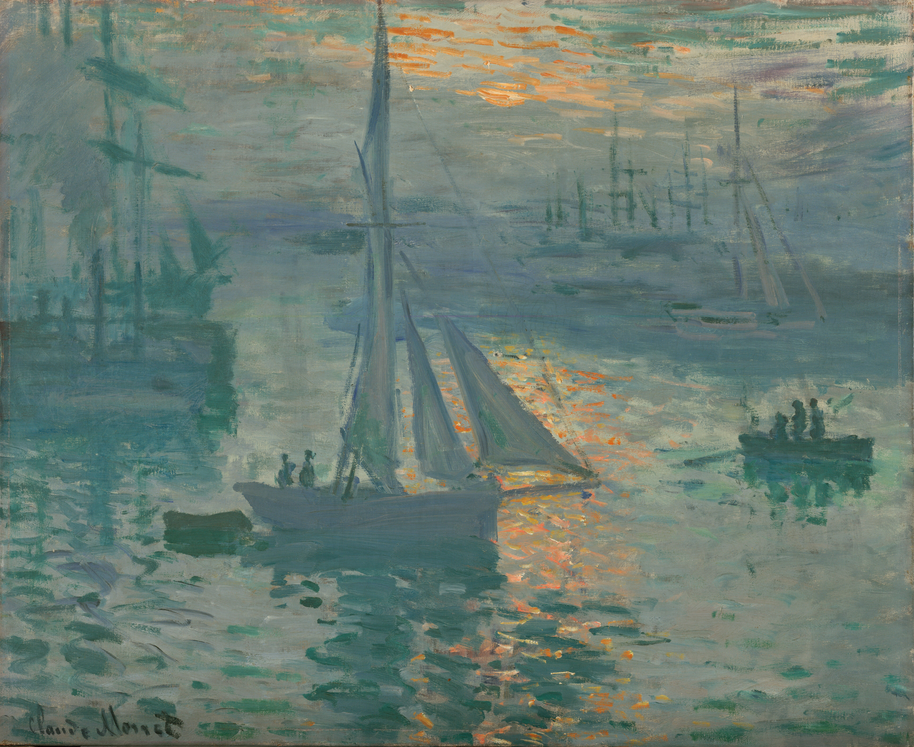
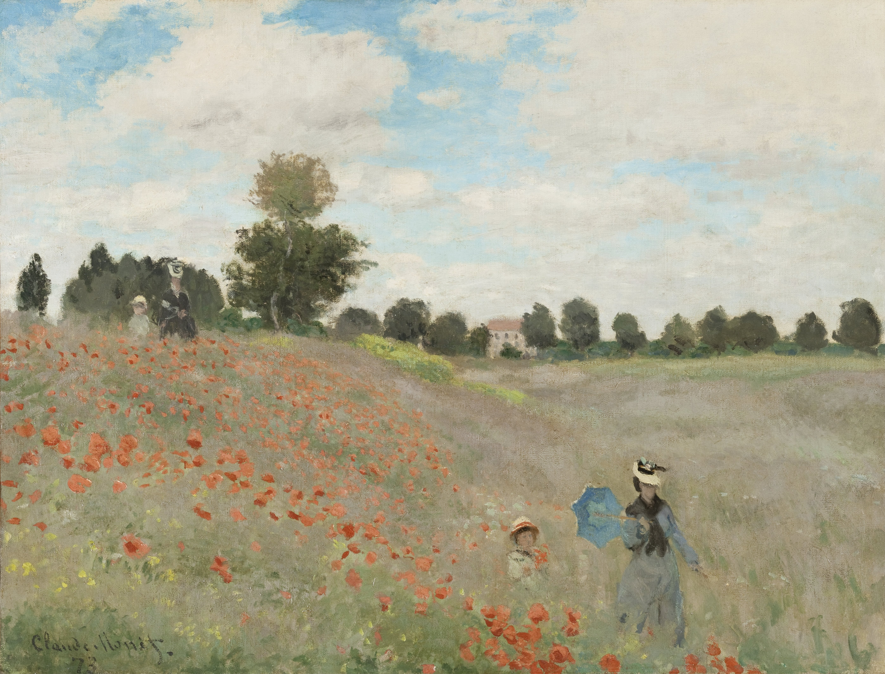
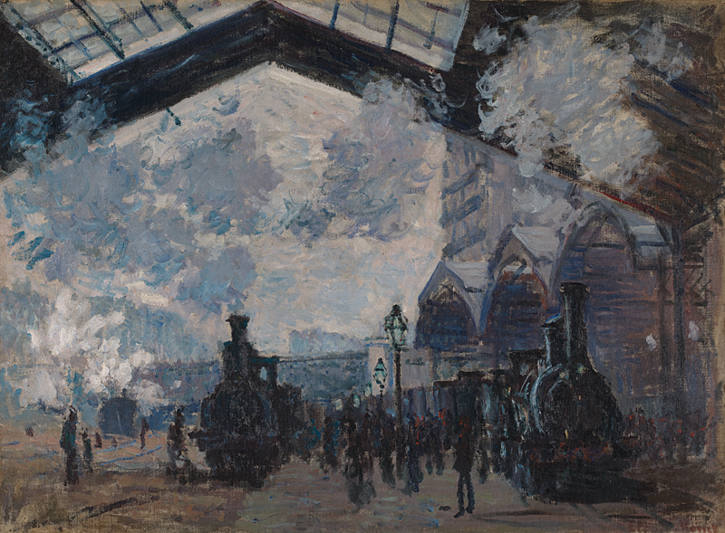
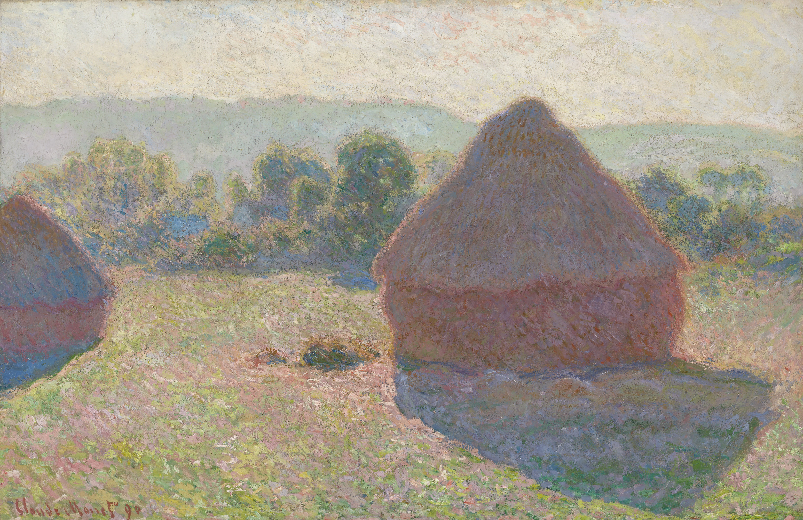
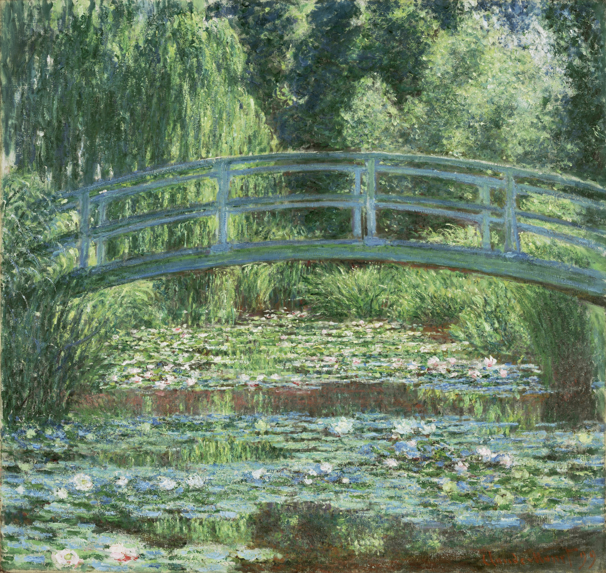

# 克劳德·莫奈

克劳德·莫奈（Claude Monet）的一生，是一场对光与色近乎疯狂的追逐。他将油画从室内严谨的透视与素描中解放出来，凭借对色彩特性的极致理解，重塑了人类观看世界的方式。

他对色彩有一种痴迷，甚至对死去的爱人也是优先关注到色彩，这也是身为一个天才最深沉的痛，一个场景，不同的光影它可以画很多年，但是我只取系列的一副来串联他的一生。

### 一、《花园里的女人们》（Women in the Garden, 1866）

* **深度创作背景**
  这是莫奈早期的野心之作。当时26岁的莫奈渴望在官方沙龙展露头角，为此他挑战了在户外直接绘制巨幅油画（高达2.5米）。为了能在自然光下画到画布的上半部分，他甚至在花园里挖了一道深沟，把画布降下去。画中的四位女性，其实都是由他当时的贫困女友（后来的妻子）卡米尔一人充当模特换装摆拍的。
* **深层情感分析**
  画中充满了年轻画家的傲气与对美好资产阶级生活的向往。此时的莫奈虽然穷困潦倒，但画面却阳光明媚、优雅华丽。卡米尔无怨无悔地为他充当所有模特，两人在逆境中相互扶持的爱意跃然纸上。
* **绘画手法进阶解析（色彩的初步觉醒）**
* **平涂与光斑的冲突**：此时莫奈的技法还带有传统的痕迹，人物衣裙的轮廓相对清晰。但他已经开始尝试用**未调和的亮色块**直接点缀在树叶和裙摆上，用来表现穿透树冠的斑驳阳光。
* **放弃棕色打底**：传统学院派画树阴会使用棕色或黑色，而莫奈开始尝试用深绿色混合蓝色来处理暗部，这标志着他开始脱离传统的色彩体系。

### 二、《喜鹊》（The Magpie, 1868–1869）

* **深度创作背景**
  因为画作屡次被沙龙拒绝，莫奈债台高筑，甚至一度跳河轻生未遂。1868年冬，他带着刚出生的长子和卡米尔逃往诺曼底的乡村躲债。在那段连取暖煤炭都买不起的极寒日子里，他创作了这幅欧洲艺术史上最著名的雪景画之一。
* **深层情感分析**
  在极端穷困与绝望中，莫奈没有画出悲惨的世界，反而画出了一种万籁俱寂、洗尽铅华的极致宁静。停在栅栏上的那只孤零零的黑喜鹊，宛如五线谱上的音符，也是莫奈自身孤独境遇的写照。
* **绘画手法进阶解析（“色彩阴影”的革命）**
* **阴影不是黑色的**：这是印象派色彩理论的第一次伟大胜利。莫奈在雪地的阴影中**完全摒弃了黑色**，而是使用了**淡蓝色、紫色和灰色**。他敏锐地察觉到，白雪作为反光体，其阴影必然会反射天空的蓝色。
* **厚涂法（Impasto）**：他使用大量的铅白颜料，以粗犷的笔触厚涂在画布上，质感逼真地再现了积雪的重量与松软感。

### 三、《印象·日出》（Impression, Sunrise, 1872）

* **深度创作背景**
  普法战争后，莫奈回到法国勒阿弗尔港口。1874年，因为长期被官方沙龙排斥，莫奈与雷诺阿、德加等人自己办了一场独立画展。这幅画遭到了当时评论家路易·勒鲁瓦的疯狂嘲讽，称其不过是“草图的印象”，“印象派”之名因此诞生。
* **深层情感分析**
  画作展现了工业时代清晨港口的勃勃生机与混沌美感。这不仅是对自然风光的捕捉，更是莫奈对传统艺术条条框框的宣战——他不画物体本身的结构，只画“光”在物体上留下的情绪。
* **绘画手法进阶解析（补色与视错觉）**
* **色彩的相对性（对比色叠加）**：画中那轮耀眼的红日，如果你将其转化为黑白照片，会发现它的明度与周围的灰色天空完全一致。莫奈利用了**橙红色（暖）与蓝灰色（冷）的强烈互补色对比**，欺骗了人类的视觉神经，让太阳仿佛在画面中发光、跳跃。
* **零碎的“逗号笔触”**：水面上的倒影不再是平滑的过渡，而是由一道道短促、清晰的橙色和蓝色笔触并列组成，直接让观众的眼睛在视网膜上进行“光学混合”。

### 四、《阿让特伊的罂粟田》（Poppy Field at Argenteuil, 1873）

* **深度创作背景**
  受画商赞助，莫奈迎来了生活最宽裕、最幸福的“阿让特伊时期”。他在乡间漫步，画下了卡米尔和儿子让（Jean）在齐腰深的草丛中散步的场景。
* **深层情感分析**
  这是莫奈一生中最田园牧歌的阶段。画面左侧和右侧各有一对母子（其实都是卡米尔和让），这种巧妙的构图仿佛是时间的推移，记录了妻儿在花海中向他缓缓走来的美好瞬间。
* **绘画手法进阶解析（色彩的节奏与呼吸）**
* **色彩引导视觉**：满山坡的红色罂粟花并不是随意点缀的。莫奈利用极其纯粹的**朱红色斑块**，形成了一条从左上角斜向右下角的视觉引导线，迫使观众的视线跟随着那抹鲜红，最终落到前景的卡米尔身上。
* **省略细节的整体感**：卡米尔的面部几乎没有刻画五官，甚至连草地也是用大块的翠绿、黄绿和浅蓝横扫而成。莫奈舍弃了“形”，完全用色彩的斑块来构建空间的纵深。

### 五、《撑阳伞的女人》（Woman with a Parasol - Madame Monet and Her Son, 1875）

* **深度创作背景**
  延续了阿让特伊时期的幸福时光，这幅画是典型的“外光派”（En plein air）作品，莫奈完全在户外完成，旨在捕捉大自然中最真实、最转瞬即逝的光线。
* **深层情感分析**
  此时的莫奈是对生活充满确幸的。画作不仅是对妻儿的爱，更是他对“当下”这种易逝美好的拼命挽留。卡米尔头纱下的面容略带朦胧，她正转头看向画外，这种极具私密感的眼神交流，让画面充满了一种“你在看风景，而我在看你”的极致温柔。
* **绘画手法进阶解析（光学混合与逆光）**
* **低视角与纪念碑式构图**：莫奈采用了仰视视角，卡米尔的身躯挡住了部分阳光，形成了强烈的逆光效果，使她宛如一尊融合在自然光晕中的女神雕像。
* **纯粹的“环境色”**：阴影完全抛弃了黑色，用了大量的紫罗兰色、深蓝色和绿色。卡米尔白色的裙摆上，反射着草地的绿、天空的蓝和阳伞的黄，画面仿佛在呼吸。

### 六、《圣拉扎尔火车站》（The Gare Saint-Lazare, 1877）

* **深度创作背景**
  随着工业革命的发展，莫奈将目光从乡村转向了现代都会。为了画好这组画，他特意在火车站附近租了房子，甚至说服站长在火车进站时狂烧煤炭，以制造出遮天蔽日的蒸汽效果。
* **深层情感分析**
  莫奈对现代工业的机械力量充满了敬畏与好奇。他不在乎火车的钢铁结构，他痴迷的是那种坚硬的钢铁被虚无缥缈的蒸汽和阳光所吞噬、溶解的魔幻场景。
* **绘画手法进阶解析（对“非实体”的描绘）**
* **画空气与烟雾**：莫奈的笔触在这里变得极度松散和旋转。他用粉蓝、灰紫和淡黄色混合在一起，表现阳光穿透浓厚蒸汽时的散射效应。
* **轮廓的消解**：背景中的高楼大厦和铁轨，在烟雾中完全失去了硬朗的边界，这是莫奈中期开始将“实体结构”完全让位于“光影氛围”的重要转折。

### 七、《临终的卡米尔》（Camille on Her Deathbed, 1879）

* **深度创作背景**
  搬到偏僻的维特伊后，莫奈再次陷入赤贫。在极度的贫困、疾病和绝望中，32岁的卡米尔走向了生命的终点。这幅画是莫奈在破败的房间里，借着微弱的光线完成的。
* **深层情感分析（画家与丈夫的心理撕裂）**
  这是艺术史上最残忍也最深情的告别。莫奈的痛苦在于他发现自己**对光色的痴迷竟然超越了失去爱人的悲痛**。他机械地观察着死亡在妻子脸上留下的色彩变化，这种被艺术本能裹挟的无奈与愧疚，成为了他一生的痛楚。
* **绘画手法进阶解析（表现主义的绝望）**
* **走向抽象的崩溃笔触**：这里的笔触像是暴风雪一般砸在画布上。斜向的、密集的、如乱麻般的线条将卡米尔的面容完全切割、淹没，带有高度的抽象与表现主义意味。
* **死亡的色彩学**：画面极其敏锐地捕捉了肉体在死后呈现的特有冷色。苍白的白、淤滞的紫、冰冷的灰蓝，不仅是尸体的颜色，更是莫奈内心世界彻底结冰的具象化。

### 八、《干草垛》系列（Haystacks, 1890–1891）

* **深度创作背景**
  卡米尔去世后，莫奈最终定居吉维尼（Giverny）。为了彻底研究同一物体在不同光线下的变化，他开启了西方艺术史上前所未有的“系列画”创作。他每天带着十几块画布跑到田野里，随着阳光的推移，每半小时就换一块画布作画。
* **深层情感分析**
  走过半生波折，莫奈此时的情感变得极其宏大而哲学。他不再关注具体的人或物，而是通过平凡的草垛，去叩问时间的流逝、季节的轮回以及大自然的永恒规律。
* **绘画手法进阶解析（色彩的“干擦”与叠加）**
* **色彩包裹（Envelope of Light）**：莫奈不再去画草垛本身，而是画“草垛周围的空气”。他通过极度丰富的细碎色彩，让草垛看起来像是在发光。
* **干擦技法（Scumbling）**：为了表现光线的厚度，他等底层颜料干透后，用几乎没有调和油的干画笔，蘸取高纯度的颜料（如粉红、明黄）轻轻扫过画布表面。这种粗糙的肌理让不同图层的颜色在视觉上混合，产生了惊人的震颤感。

### 九、《鲁昂大教堂》系列（Rouen Cathedral, 1892–1894）

* **深度创作背景**
  莫奈在大教堂对面租下了一间破旧的公寓，透过小窗户，顶着极度的视力疲劳和精神折磨，连续画了30多幅同一视角的大教堂。
* **深层情感分析**
  这组画堪称莫奈的“色彩受难记”。他在信中抱怨自己每天做噩梦，梦见教堂倒下来压碎自己。他试图用凡人的画笔去定格每一秒都在瞬息万变的神圣光线，这是一种近乎狂热的、与造物主争夺时间控制权的艺术野心。
* **绘画手法进阶解析（建筑的消融与极度厚涂）**
* **实体物质的溶解**：坚硬的哥特式石头建筑在莫奈的笔下完全失去了重量。早晨是银蓝色，正午是耀眼的纯白与金黄，傍晚则变成燃烧的橘红与紫色。
* **“结壳”般的肌理**：这是莫奈油画技法的一个极端。他反复在画布上堆砌颜料，使得画面的肌理像石头或干涸的泥浆一样厚重。这种立体的颜料涂层本身就会在展厅的灯光下产生真实的阴影，极大增强了画面的呼吸感。

### 十、《睡莲》系列（Water Lilies, 1896–1926）

* **深度创作背景**
  晚年的莫奈名利双收，他在吉维尼买下土地，挖了池塘，种满了睡莲。在人生的最后30年，特别是晚年饱受白内障折磨、视力严重衰退的情况下，他几乎未出庭院，创作了近250幅《睡莲》。
* **深层情感分析**
  经历了战争、丧妻、丧子（长子让于1914年去世），老年的莫奈将整个宇宙浓缩进了这方小小的水池。水面既是镜子也是深渊，《睡莲》是他对内心宁静的最终归宿，也是一位垂暮老人对生命、死亡与永恒的终极冥想。
* **绘画手法进阶解析（走向无物之境的抽象）**
* **取消地平线**：在晚期的巨幅《睡莲》中，莫奈彻底去掉了天空、河岸和地平线。观众的视线被迫直视水面，天空的倒影与水下的水草交织在一起，打破了传统绘画的空间透视，让人产生一种漂浮在虚空中的沉浸感。
* **视力衰退带来的狂放色彩**：因为白内障，莫奈眼中的世界偏黄泛红。他晚期的笔触变得极其狂放、粗犷，颜料如同狂舞般在画布上涂抹，深红、暗紫与深绿交织。这已经不再是客观的印象派，而是直接启发了20世纪中叶的**抽象表现主义**（如波洛克的滴画），标志着色彩终于彻底摆脱了物体的束缚，获得了绝对的自由。