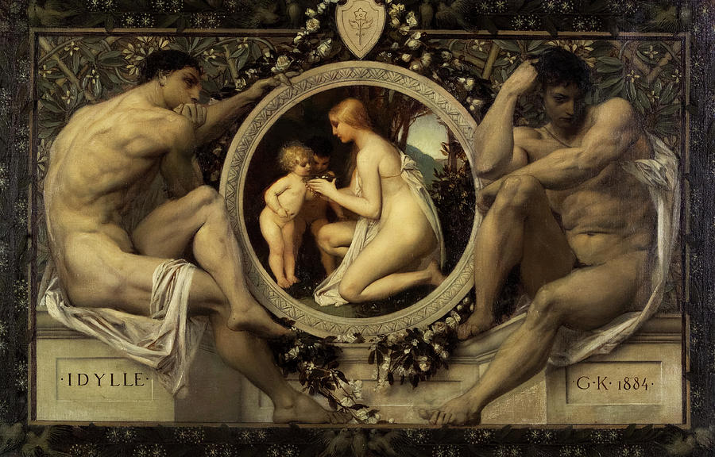
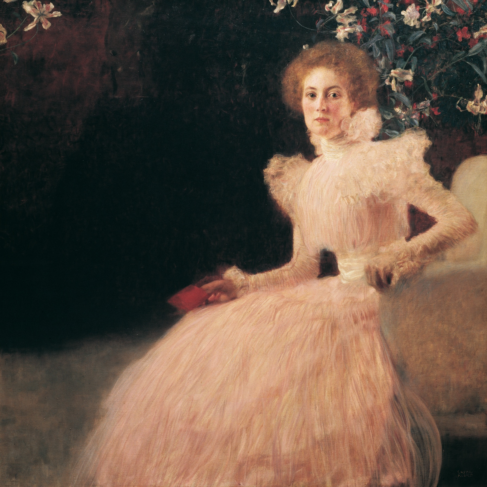
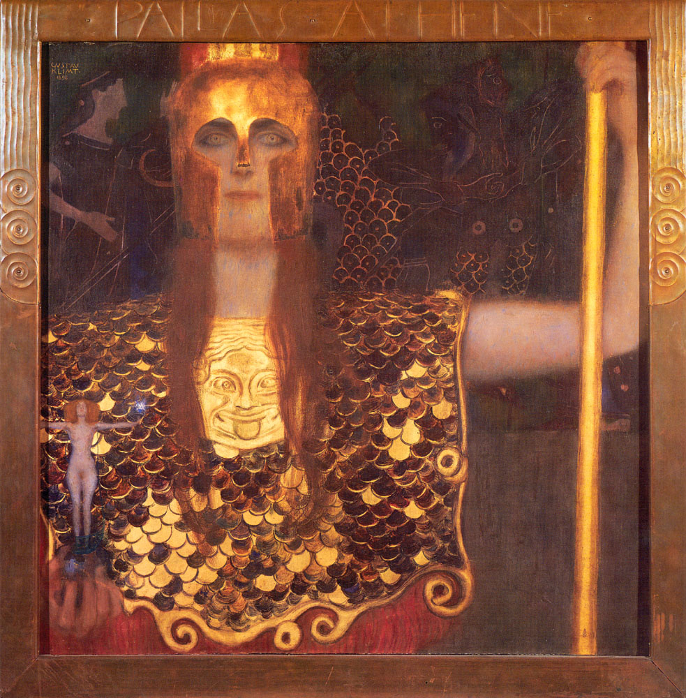
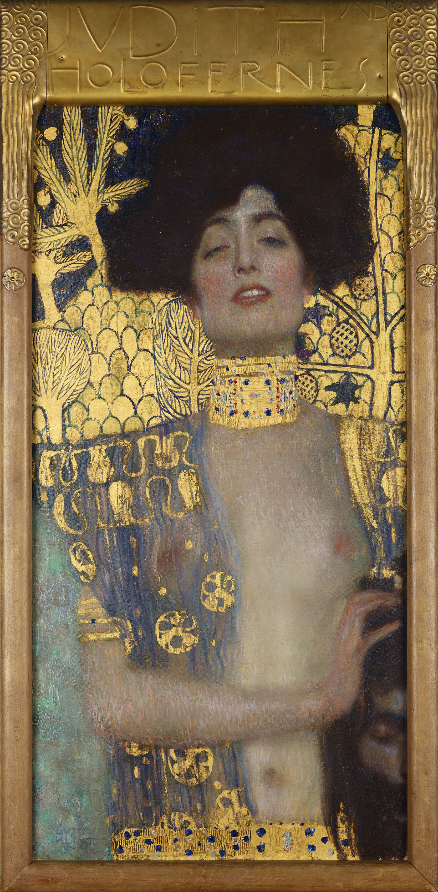
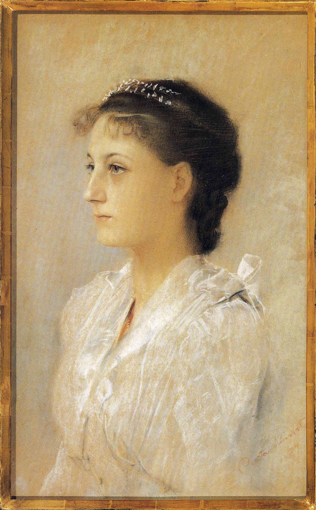
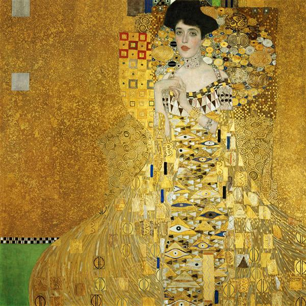
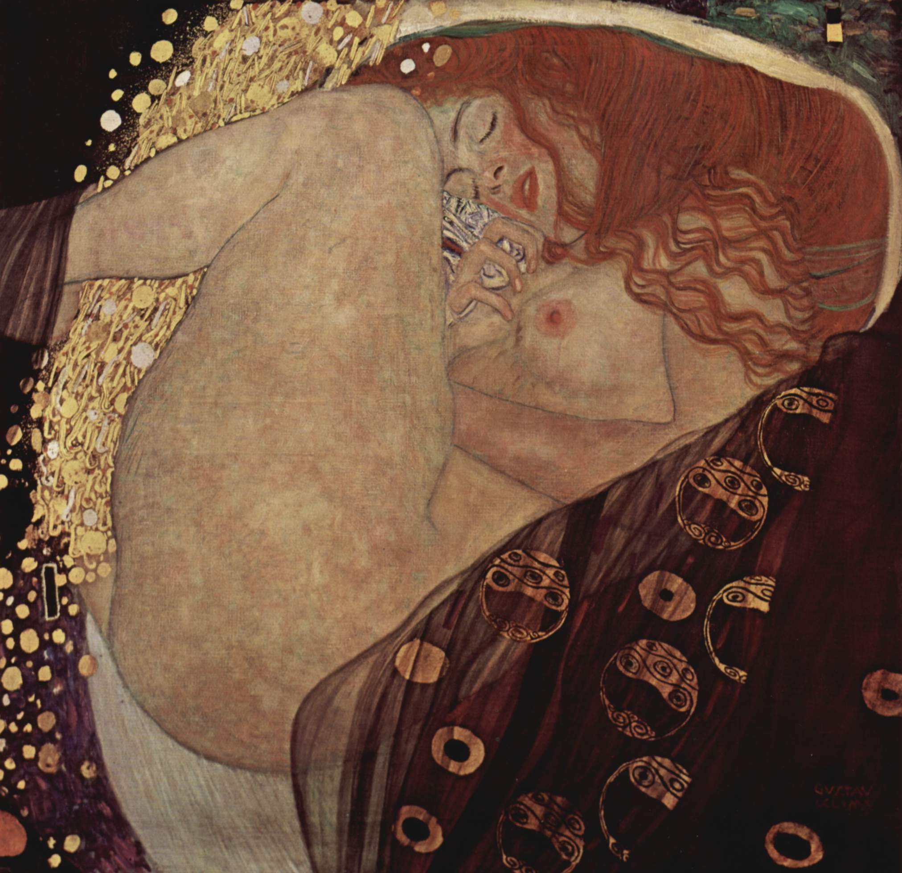
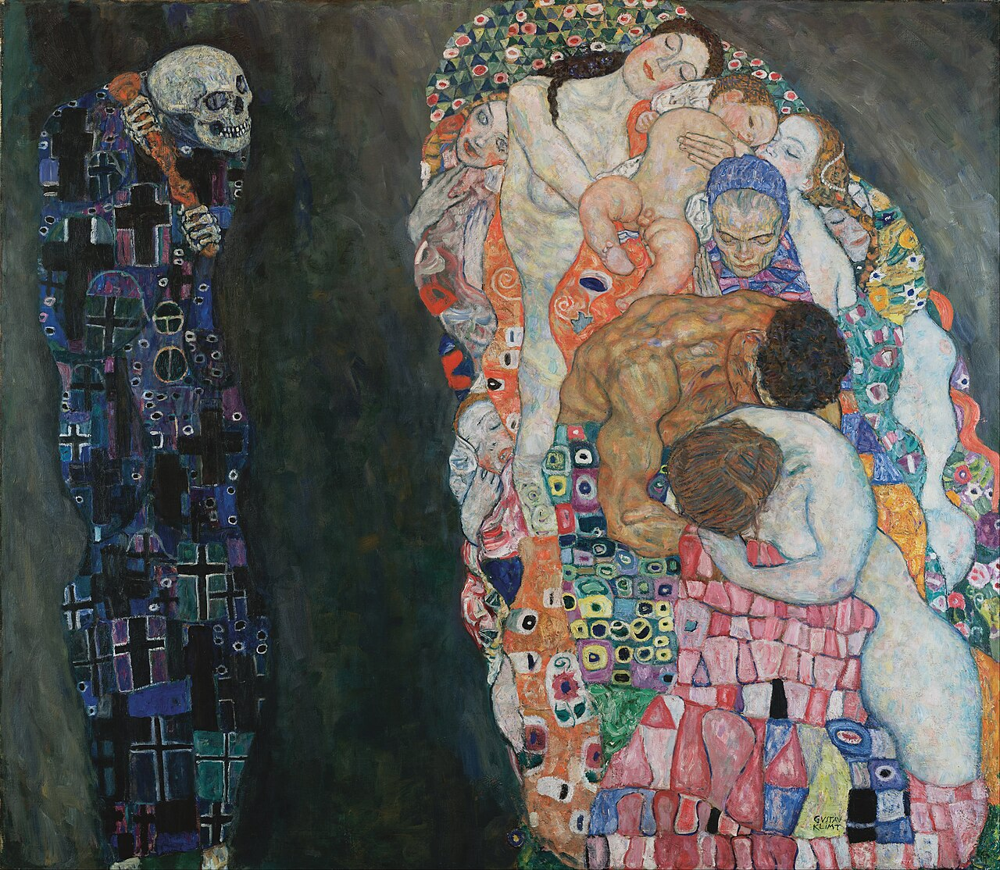
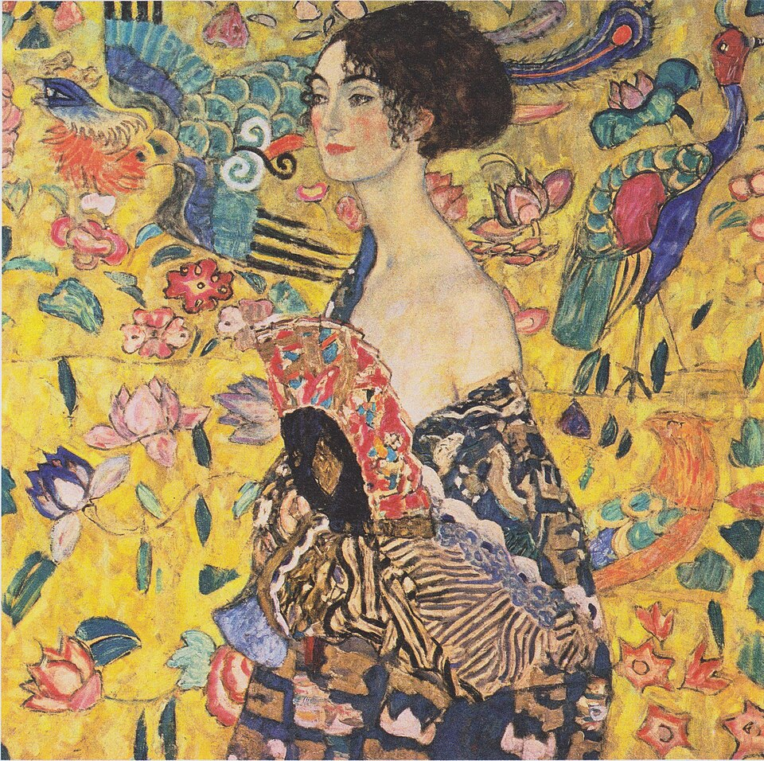

# 古斯塔夫·克里姆特

要真正读懂克里姆特的画，就必须潜入他那充满撕裂、背叛、情欲与抗争的内心世界。他的一生，是从一个贫寒的“金匠之子”走向官方艺术界顶流，却又在巅峰时亲手砸碎自己的王冠，最终在金光灿灿的孤独中走向生命终点的过程。

  

让我们重新沿着他的生命脉络，走过这10个决定性的瞬间：

  

### 第一阶段：贫寒天才与帝国宠儿的妥协 (1862-1896)

克里姆特出生于维也纳郊区的一个贫苦家庭，父亲是一位雕刻金箔的工匠——这个出身在他灵魂深处埋下了对“黄金”的执念。早年的他是个极其听话的“好学生”，凭借着惊为天人的古典素描功底，他很快成为了维也纳上流社会和帝国官方最青睐的壁画大师。那时的他，是为了生存和阶级跃升而画。

  

**1. 《牧歌》 (Idylle, 1884)**

这幅画是克里姆特早年迎合官方审美的缩影。极为扎实的古典主义技法、文艺复兴式的构图、宁静而理想化的人体。此时的他，手里握着的是通往维也纳艺术界最高权力的钥匙。

  

### 第二阶段：亲人离世与分离派的狂飙 (1897-1900)

1892年，克里姆特的父亲和最亲密的弟弟恩斯特相继去世。面对死亡的冲击，他对僵死、粉饰太平的维也纳学院派艺术彻底幻灭。1897年，他带头造反，创立了“维也纳分离派”，并喊出了那句著名的口号：“为每个时代赋予它的艺术，为每种艺术赋予它的自由。”

  

**2. 《索尼娅·克尼普斯肖像》 (Portrait of Sonja Knips, 1898)**

这是克里姆特风格突变的第一声号角。他不再追求古典的绝对对称与清晰，而是引入了惠斯勒式的朦胧与不对称构图。画中的索尼娅虽然是贵妇，却带着一种现代女性的忧郁与疏离，克里姆特开始透过表皮去画人物的神经质。

  

**3. 《雅典娜》 (Pallas Athene, 1898)**

面对外界对他“离经叛道”的攻击，克里姆特画下了这幅宣言式的作品。他没有把雅典娜画成传统的静谧女神，而是画成了一个目光带有挑衅意味的战士。更重要的是，他第一次在画布上大面积使用了父亲最熟悉的材料——金箔。这也预示着他体内沉睡的“金匠基因”彻底苏醒。

  

### 第三阶段：丑闻、情欲与“致命女人” (1901-1905)

1900年前后，克里姆特为维也纳大学创作的三幅天顶画引发了举国哗然，公众大骂他的作品“色情、丑陋、亵渎”。面对举国封杀，克里姆特的性格变得更加孤傲和内倾，他发誓再也不接受官方委托，转而彻底拥抱自己内心最真实的欲望：对女性肉体、生殖与情欲的迷恋。

  

**4. 《朱迪斯一世》 (Judith I, 1901)**

在圣经中，朱迪斯是割下敌将首级的女英雄；但在克里姆特笔下，她变成了半裸着身体、眼神迷离、因嗜血和欲望而陷入极度快感的“致命女人”。他用华丽的黄金装饰她，将情色与死亡的主题推向了令当时社会咋舌的极致。

  

**5. 《埃米莉·弗洛格肖像》 (Portrait of Emilie Flöge, 1902)**

在众多令他迷恋的女性中，埃米莉是他一生的精神伴侣。克里姆特终身未婚，却在临终前呼唤着她的名字。在这幅画中，他将埃米莉画得极具威严，并将她的身体消融在无数前卫的几何装饰图案中。这是他将人物面部极度写实，而身体极度平面化的标志性成熟风格。

  

### 第四阶段：拜占庭的启示与“金色巅峰” (1906-1909)

经历了社会舆论的围剿后，克里姆特前往意大利拉文纳旅行。在那里，他被拜占庭教堂里金碧辉煌的马赛克镶嵌画彻底震撼。他将东方拜占庭艺术、日本浮世绘以及父亲的金箔工艺完美融合，迎来了他一生中最璀璨、最广为人知的“金色时期”。

  

**6. 《阿黛尔·布洛赫-鲍尔一世》 (Portrait of Adele Bloch-Bauer I, 1907)**

克里姆特将这位维也纳犹太富商的妻子，画成了现代社会不可侵犯的世俗女王。除了面部和双手，阿黛尔的身体完全被一片如梦似幻、镶嵌着无数古埃及“荷鲁斯之眼”等神秘符号的金箔海洋所吞没。现实的血肉之躯在黄金中得到了永恒。

  

**7. 《吻》 (The Kiss, 1907-1908)**

这是克里姆特一生对爱与欲探索的终极答案。在开满鲜花的悬崖边缘（象征着爱情的危险与狂喜），男人（由坚硬的黑白矩形构成）与女人（由柔和的彩色圆形构成）在金色的光罩中融为一体。外界的非议与喧嚣在此刻荡然无存，只剩下宇宙般静谧的爱。

  

**8. 《达娜厄》 (Danaë, 1907-1908)**

抛开了贵妇肖像的拘束，克里姆特在神话题材中彻底释放了自我。宙斯化作黄金雨降临在被囚禁的达娜厄腿间。克里姆特极其大胆地将达娜厄蜷缩成一个类似子宫的椭圆形，用金币和肉体的对比，画出了人类对本能欲望最纯粹的赞美。

  

### 第五阶段：褪去黄金，直面生死的晚年 (1910-1918)

随着席勒等新一代表现主义画家的崛起，克里姆特意识到“金色时期”已经走到尽头。晚年的他主动剥去了那些昂贵、冰冷的金箔，开始重新审视梵高与莫奈等人的色彩。他的画笔不再追求神圣感，而是多了一份对生命流逝的无奈与通透。

  

**9. 《死与生》 (Death and Life, 1910-1915)**

第一次世界大战的阴云笼罩着欧洲。克里姆特在这幅画中不再使用金色，而是用深沉的色调刻画了左侧挥舞着大棒的死神。然而在画面的右侧，婴儿、母亲、老人交织在一起，像一股绚烂的生命洪流。这是晚年克里姆特的生死观：死亡虽不可避免，但生命本身的光芒足以与之抗衡。

  

**10. 《持扇的女人》 (Lady with a Fan, 1917-1918)**

1918年，克里姆特死于肆虐欧洲的西班牙大流感，这幅画永远留在了他的画架上。画中的女人随意地敞开衣襟，背后是明黄色的底调，画满了中国式的凤凰、莲花与日本浮世绘风格的飞鸟。没有了早年的金碧辉煌，也没有了对死亡的恐惧，他的一生，在这份色彩斑斓、自由松弛的东方意境中画上了句号。