# 巴勃罗·毕加索（Pablo Picasso）

巴勃罗·毕加索（Pablo Picasso）长达七十余年的创作生涯，是一场不断解构与自我推翻的视觉革命。相较于梵高对生命力的燃烧或莫奈对瞬息光影的追逐，他选择用极具破坏力与重塑性的风格剧变，来回应自身的贫穷、爱情、战火与死亡。

  

《老吉他手》 (The Old Guitarist)

1903 | 蓝色时期

**背景：** 挚友卡萨吉马斯自杀，20岁出头的毕加索在巴黎陷入极度贫困与抑郁。

**轨迹：** 开启了忧郁的“蓝色时期”。画中佝偻盲眼的底层老人和冷酷的蓝绿色调，抛弃了传统审美的愉悦感，透出刺骨的饥饿、孤独与悲悯。

  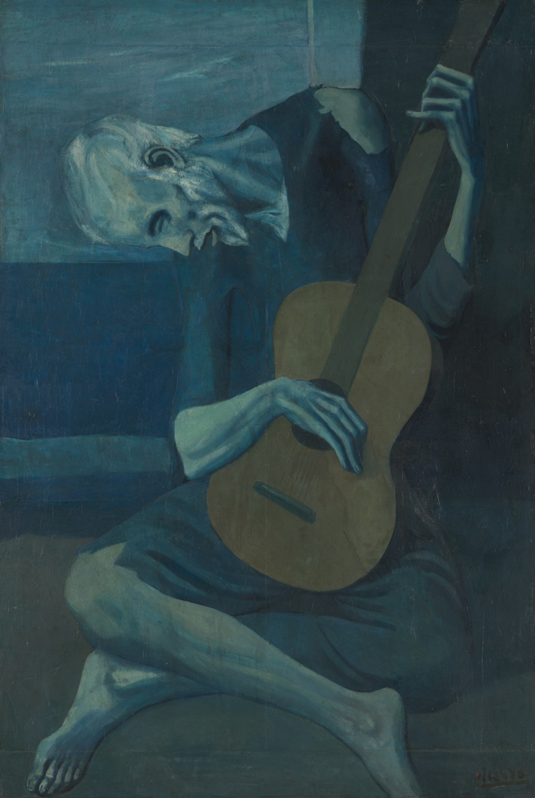

《拿烟斗的男孩》 (Boy with a Pipe)

1905 | 粉色时期

**背景：** 搬入巴黎蒙马特高地，与费尔南德·奥利维耶坠入爱河，生活逐渐明朗。

**轨迹：** 色彩从冰冷的蓝色转向温暖的红粉色。他开始将目光投向马戏团演员和流浪艺人，少年的眼神中虽然仍带有一丝迷惘，但画面已经有了柔和而诗意的温度。

  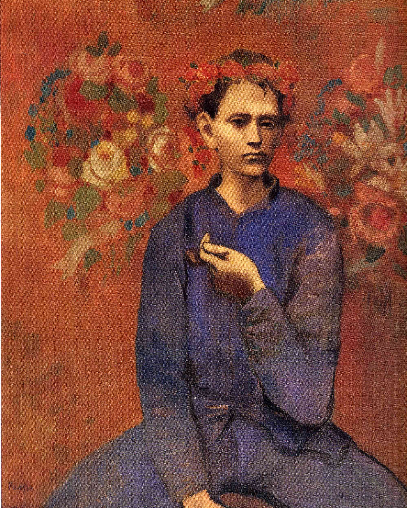

《亚威农少女》 (Les Demoiselles d'Avignon)

1907 | 非洲时期与立体主义先声

**背景：** 受到非洲原始面具艺术和保罗·塞尚的强烈启发。

**轨迹：** 这是现代艺术史上的“核爆”时刻。他将五个女人的身体残暴地分解成锋利的几何碎块，正面与侧面在同一个二维平面上重叠。西方延续了五百年的古典透视法在此被彻底终结。

  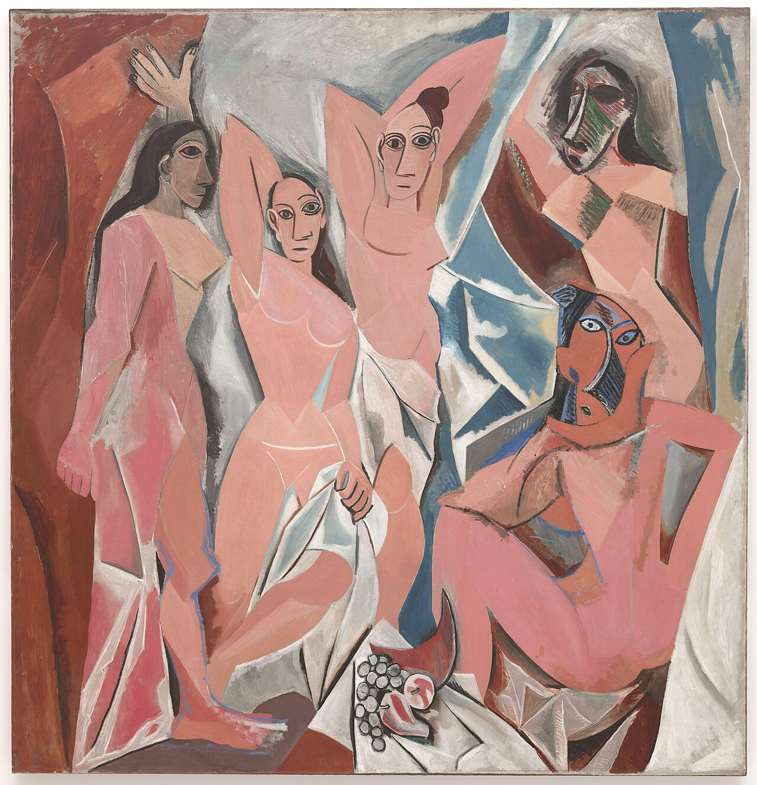
  

《卡恩韦勒肖像》 (Portrait of Daniel-Henry Kahnweiler)

1910 | 分析立体主义

**背景：** 与乔治·布拉克（Georges Braque）共同隐居创作，试图将三维物质彻底拆解。

**轨迹：** 画商好友卡恩韦勒的形象被完全打碎，化为无数交错的切面和沉闷灰色调的几何网格。观众不再是被动地观看，而是必须在脑海中主动“拼凑”出人物的轮廓。

  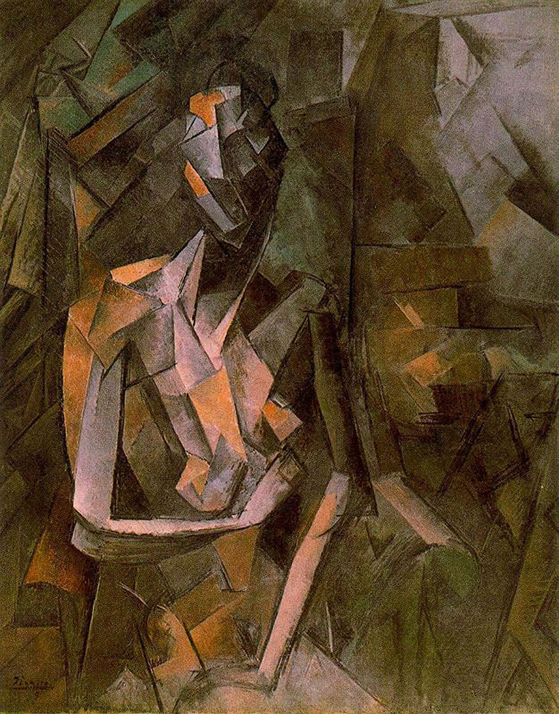

《三个音乐家》 (Three Musicians)

1921 | 综合立体主义

**背景：** 一战后，毕加索已功成名就，不仅生活优渥，还参与了芭蕾舞团的舞台设计。

**轨迹：** 与早期晦涩的分析立体主义不同，他像做剪贴画一样，用大块鲜艳、扁平的色块拼凑出三个吹奏乐器的人。画面充满了装饰性与欢快的戏剧张力。

  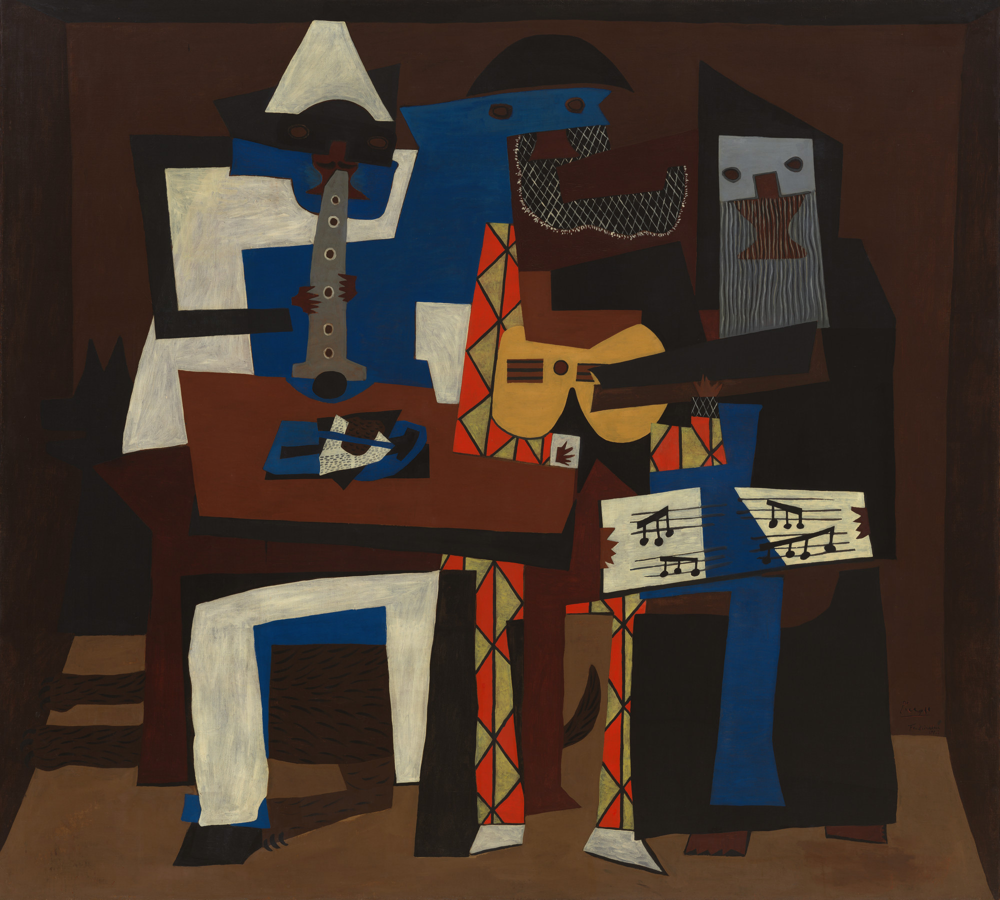

《镜前少女》 (Girl Before a Mirror)

1932 | 超现实主义与情欲

**背景：** 与年轻活泼的玛丽-泰蕾兹·沃尔特展开秘密恋情，这是他创作力极其旺盛的时期。

**轨迹：** 结合了立体主义的空间感与超现实主义的心理暗示。明艳的色彩和圆润的线条充满了情欲，而镜外青春丰满的肉体与镜中暗淡、苍老的倒影，构成了关于时间与生死的哲学隐喻。

  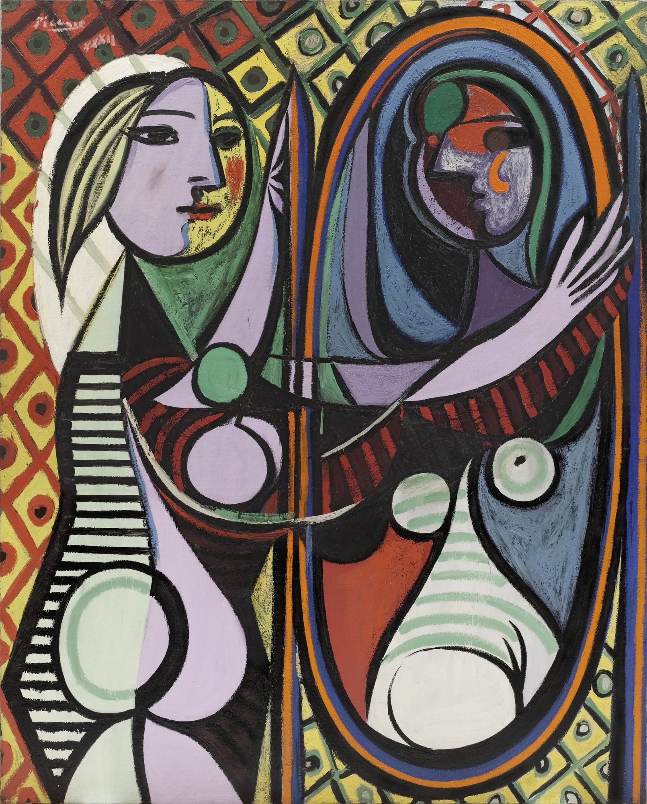

《格尔尼卡》 (Guernica)

1937 | 战争与政治

**背景：** 西班牙内战期间，纳粹德国的飞机对西班牙小镇格尔尼卡进行了惨绝人寰的无差别轰炸。

**轨迹：** 毕加索毕生最著名的反战史诗。他放弃了色彩，仅用黑、白、灰的压抑色调，嘶鸣的马、手举青灯的女人、怀抱死婴仰天痛哭的母亲，将人类在暴力下的痛苦撕裂感推向了巅峰。

  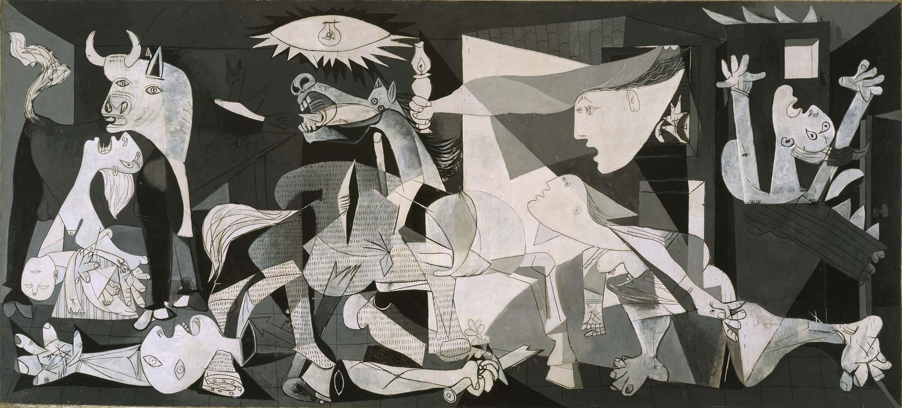

《哭泣的女人》 (The Weeping Woman)

1937 | 撕裂与神经质

**背景：** 《格尔尼卡》的余波，画中原型是当时的情人、摄影师朵拉·玛尔（Dora Maar）。

**轨迹：** 朵拉是《格尔尼卡》创作全过程的记录者。毕加索用极度扭曲的面部、如玻璃碎片般锐利的眼泪和极具冲突感的红绿色调，将朵拉的神经质与整个欧洲大陆的创伤融为一体。

  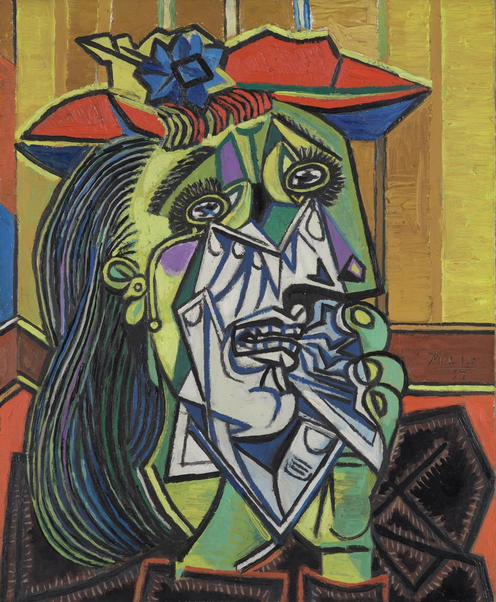

《宫娥》 (Las Meninas, After Velázquez)

1957 | 致敬与重构

**背景：** 晚年隐居法国南部，开始与艺术史上的大师进行跨越时空的“对话”。

**轨迹：** 他以自己的立体主义语言，强行解构并重绘了17世纪西班牙大师委拉斯开兹的同名杰作，共创作了58幅变体画。这证明了他即使步入晚年，依然拥有狂妄的破坏欲与旺盛的创造力。

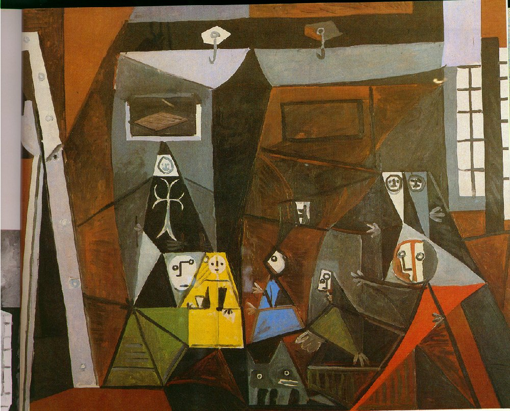
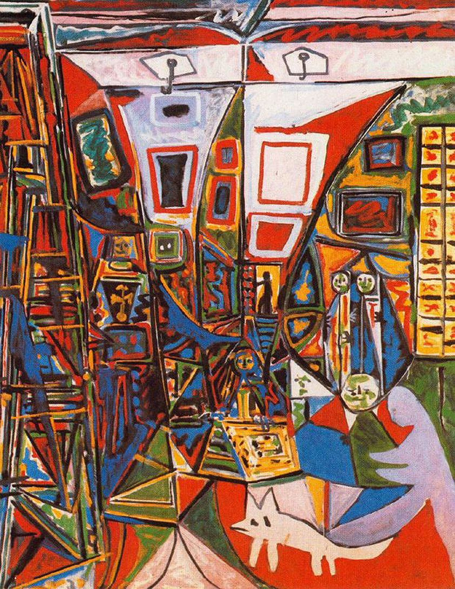
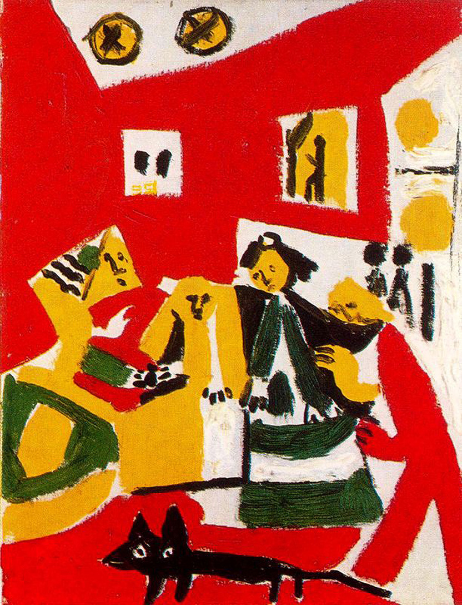

《面对死亡的自画像》 (Self-Portrait Facing Death)

1972 | 晚年归途

**背景：** 90岁高龄，步入生命的最后阶段。

**轨迹：** 放弃了所有令人眼花缭乱的技巧，仅用蜡笔勾勒出一个骷髅般惊恐、双眼圆睁、线条颤抖的头像。少侠，面对不可逆转的死亡，这位一生骄傲、不可一世的艺术狂徒，在这里留下了最赤裸的直白与脆弱。

  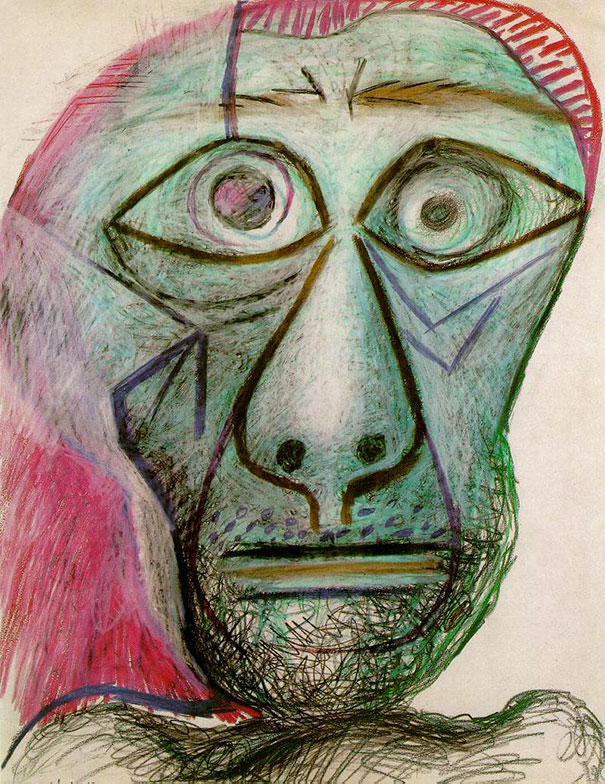