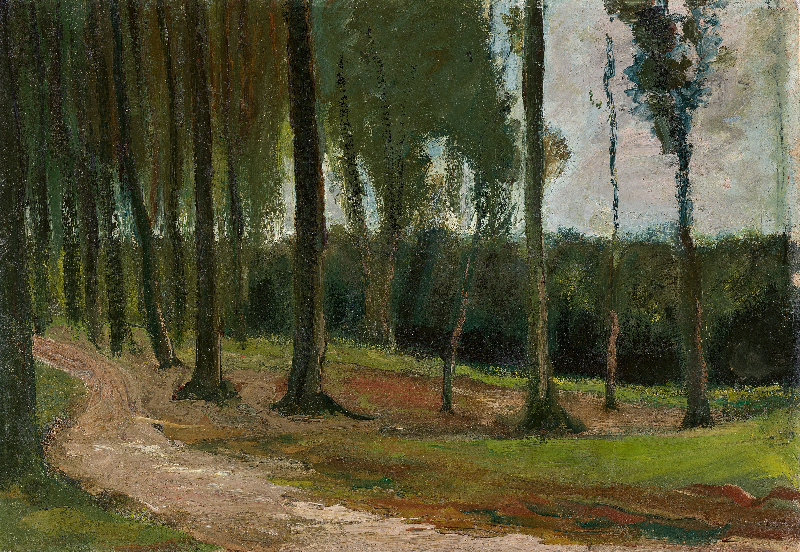
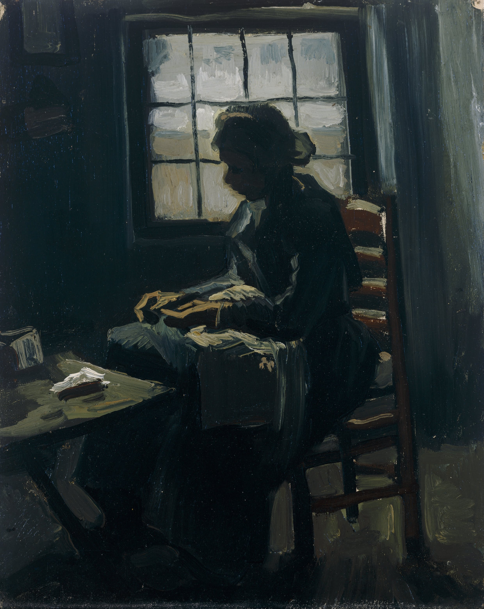
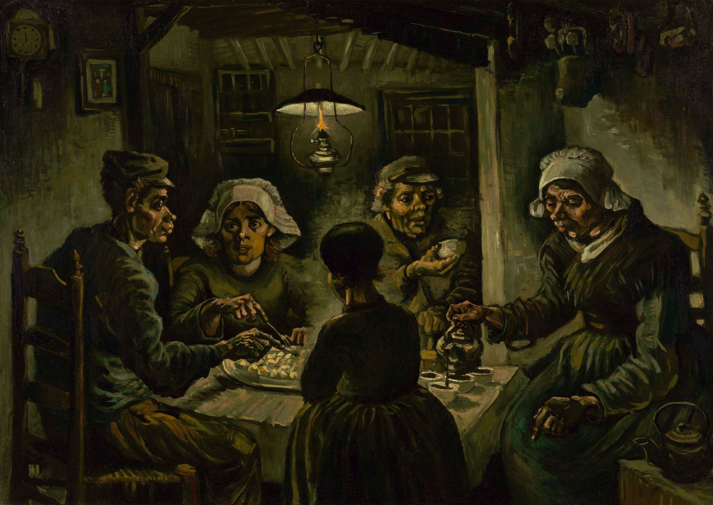
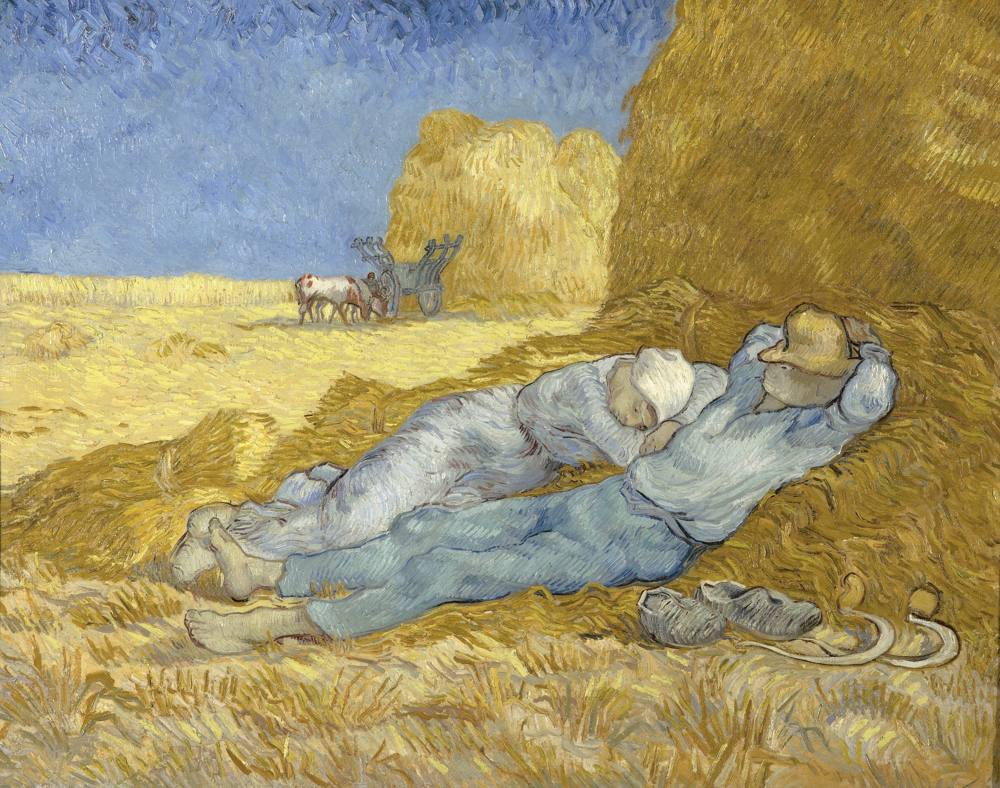
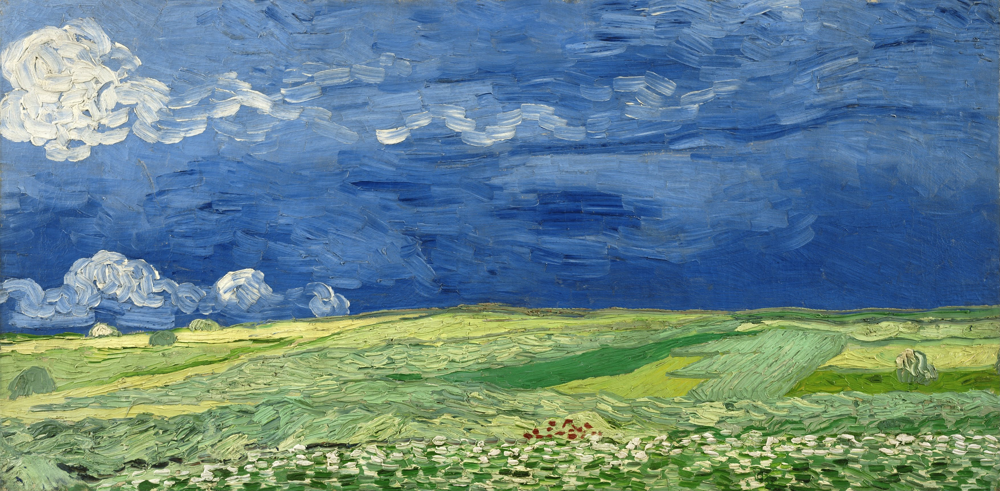
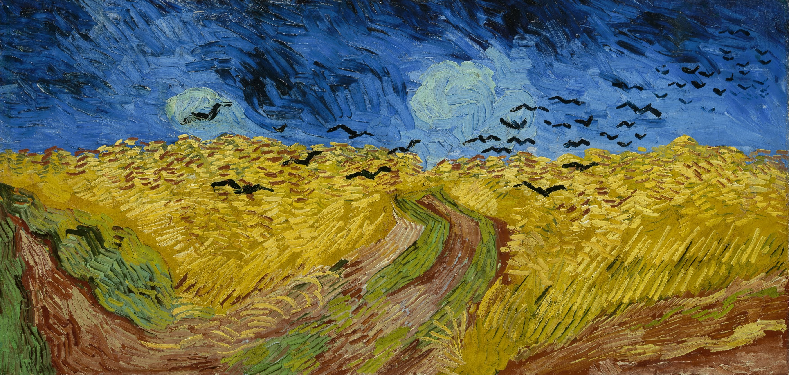

# 文森特·梵高

他的一生充满了被世俗拒之门外的悲剧色彩：生前只卖出过一幅画，饱受精神疾病的无情折磨，在极度的孤独与贫困中苦苦挣扎。然而，即使世界报之以痛，他依然对大自然、对底层劳苦大众、对浩瀚的宇宙，报以最炽热、最纯粹的爱。他的艺术生涯犹如一颗流星，虽然只有短短十年的燃烧，却经历了从沉重暗淡到绚烂狂热的惊人蜕变。

### 第一章：扎根泥土的悲悯 (1881 - 1885，荷兰时期)

在早期的创作中，梵高的调色盘里还没有后来标志性的明亮色彩。他深受米勒等现实主义画家的影响，将充满悲悯的目光投向了最底层的劳苦大众和泥泞的土地。这一时期的画作色调暗沉，却充满了大地厚重的气息。

**1. 《树林》（Edge of a Wood）**

- **创作时间**：1882年
    
- **画面详述**：这是梵高早期的风景习作，画面没有后来的明艳色彩，而是被厚重的褐、绿、灰色笼罩。他将视角压得很低，重点刻画了树木粗壮的根部和交错的枝干。大地的肌理显得泥泞而沉重，树木仿佛在拼命抓住土壤，展现出一种在困境中顽强求生的力量感。
    
- **画家的心声**：在海牙时期，梵高并不想把大自然画成供人消遣的田园牧歌。他在给弟弟提奥的信中写道：“**我想在画中传达的，不是感伤的忧郁，而是深沉的悲哀。我想画出那种如同扎根于大地般的悲伤。**”
    

**2. 《窗前缝纫的农妇》（Woman Sewing）**

- **创作时间**：约1885年
    
- **画面详述**：画面极其昏暗，唯一的冷光源来自农妇背后的方格窗户。梵高运用了强烈的逆光剪影手法，隐去了农妇的面容，却将她佝偻的脊背、粗壮的手臂和专注低头的姿态刻画得入木三分。衣服的暗沉与窗外灰白的光线形成强烈对比，营造出一种压抑却又充满神圣劳作气息的氛围。
    
- **画家的心声**：梵高极其排斥将农民画得细皮嫩肉、衣着光鲜。他坚定地认为：“**画一个穿着粗布衣服的农民，比画一个穿着华丽裙子的贵妇要美得多。如果一幅农民的画闻起来有培根、烟雾和土豆泥的味道，那很好，那才是健康的。**”
    

**3. 《吃土豆的人》（The Potato Eaters）**

- **创作时间**：1885年
    
- **画面详述**：这是梵高早期的巅峰之作。昏暗狭窄的农舍里，一盏微弱的煤气灯悬挂在餐桌上方，光线极其吝啬地洒在五个农民布满沟壑的脸和骨节粗大的手上。画面的主色调是未剥皮的、沾满泥土的土豆色。人物的面部比例被刻意夸张甚至扭曲，显得粗犷而原始。
    
- **画家的心声**：梵高对这幅画倾注了极大的心血：“**我试图极力强调一点：这些在昏暗灯光下吃土豆的人，正是用他们伸向盘子的那双粗糙的手挖掘了土地。这幅画是对体力劳动的赞美，绝不希望任何人觉得它‘很美’，它必须是真实的。**”
    

### 第二章：星空的呼唤与精神的涅槃 (1889 - 1890，圣雷米时期)

经历了巴黎色彩的洗礼和阿尔勒（Arles）炽热的阳光后，梵高的精神崩溃了。他自愿进入圣雷米的精神疗养院。然而，在孤独的高墙内，他的画笔却爆发出前所未有的宇宙级能量。色彩变得极其浓烈，笔触化作了燃烧的火焰和旋转的星系。

**4. 《星月夜》（The Starry Night）**

- **创作时间**：1889年6月
    
- **画面详述**：在疗养院的铁窗后，梵高画出了这幅震撼艺术史的杰作。天空化作了奔涌的深蓝色巨浪和狂暴的星系漩涡。星星和月亮被巨大的、发光的黄色光晕包裹，仿佛要燃烧殆尽。左侧的柏树如同黑色的火焰，从大地上扭曲着直插云霄，将人间与狂暴的宇宙连接起来。
    
- **画家的心声**：面对星空，梵高总能感到一种超越现实的宁静：“**对我来说，我一无所知，但看着星星总能让我做梦。也许，正如我们乘坐火车去塔拉斯孔或鲁昂一样，我们是在拥抱死亡，去走向一颗星星。**”
    

**5. 《午休》（Noon - Rest from Work）**

- **创作时间**：1890年1月
    
- **画面详述**：这是梵高向他最崇敬的画家米勒致敬的临摹之作，但他完全用自己的色彩法则重塑了画面。大面积高纯度的金黄色麦垛与上方深邃的天蓝色形成了强烈的互补色对比。阳光仿佛有了实体，炙烤着大地。两位农民脱下鞋子，蜷缩在麦草的阴影中酣睡，展现出一种质朴、疲惫却又极度安详的生命状态。
    
- **画家的心声**：在疗养院中，色彩成了他唯一的救赎：“**我想用色彩来任意表达我自己。我渴望用两种对比色的结合、混合与碰撞，来表达两个恋人之间的爱，表达生命的慰藉。**”
    

### 第三章：奥维尔的孤独与绝唱 (1890年7月)

1890年5月，梵高离开疗养院来到巴黎近郊的奥维尔。在他生命的最后两个月里，他以每天一幅画的惊人速度疯狂创作。这一时期，他使用了特殊的“双正方形”宽幅画布，画作中充满了极度的空旷、孤独和不祥的预兆。

**6. 《雷雨云下的麦田》（Wheatfield under Thunderclouds）**

- **创作时间**：1890年7月
    
- **画面详述**：画面结构被极度简化：下半部分是无边无际、随风翻滚的绿色与黄色交织的麦田；上半部分则是极其沉重、深蓝到发黑的巨大雷雨云。天与地的横向线条在极度的拉扯中形成对抗，没有任何视觉中心可以聚焦，营造出一种暴风雨来临前令人窒息的空旷与压抑。
    
- **画家的心声**：生命的最后几周，梵高的内心被绝望吞噬：“**那是一望无际的麦田，在阴沉的天空之下。我不需要费任何力气去掩饰，就能在画中表达出那种极度的悲伤和极致的孤独。**”
    

**7. 《麦田群鸦》（Wheatfield with Crows）**

- **创作时间**：1890年7月
    
- **画面详述**：这被视为梵高生命终结的预言画。狂暴的短促笔触如同鞭子抽打在画布上，金黄色的麦田在风暴中如同惊涛骇浪。三条泥泞的红褐色小路如同撕裂大地的伤口，它们通向麦田深处，却都是死胡同。黑压压的乌鸦群如同死神的信使，从地平线深处向观看者直扑而来。整个画面充斥着恐慌、狂躁和无法逃避的宿命感。
    
- **画家的心声**：在生命走向终点时，他写下了那句最著名的、令人心碎的话：“**说到我的事业，我是拿自己的生命去冒险的，而我的理智也在这场冒险中几乎崩溃了。**”
    

在这幅《麦田群鸦》完成不久后的1890年7月27日，37岁的梵高走进了奥维尔的一片麦田，开枪击中了自己，并于两天后在弟弟提奥的怀中离世。他一生都在渴望爱、渴望被理解，却始终被世界拒之门外。但他把所有的痛苦都吞了下去，并在画布上吐出了最璀璨的星空与最耀眼的麦田。