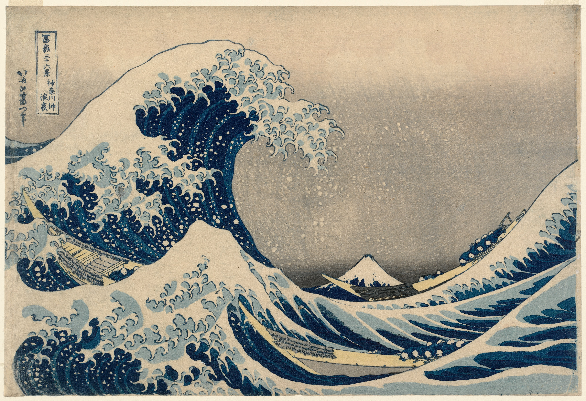
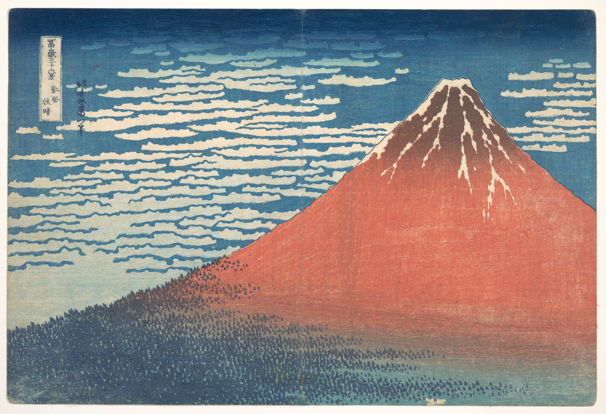
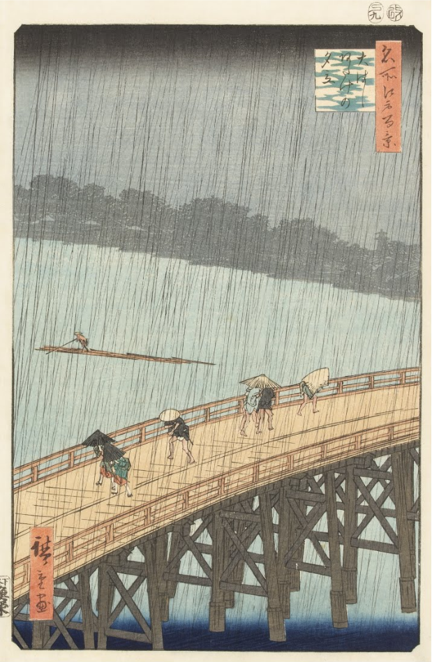
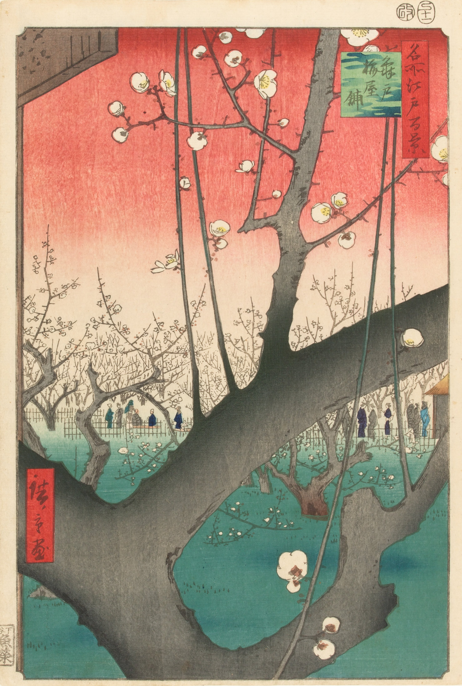
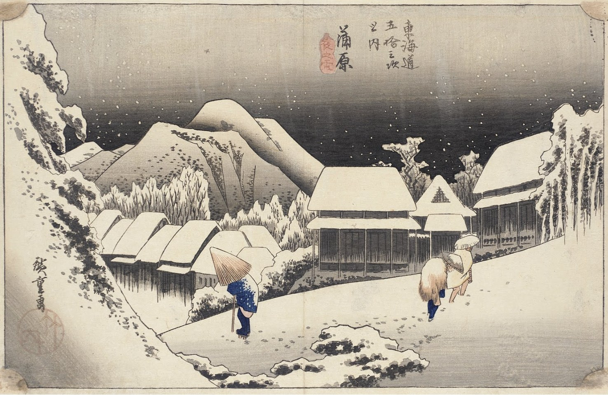
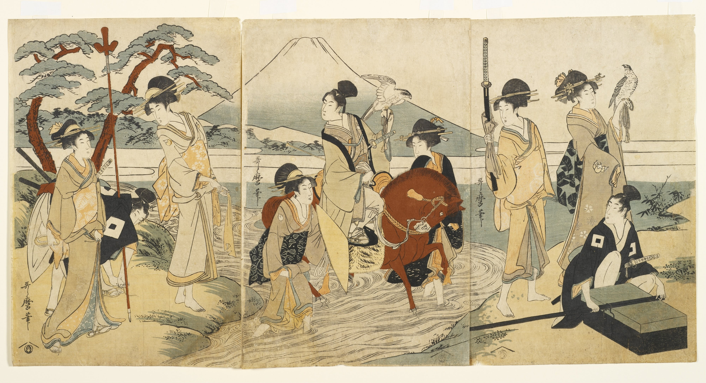
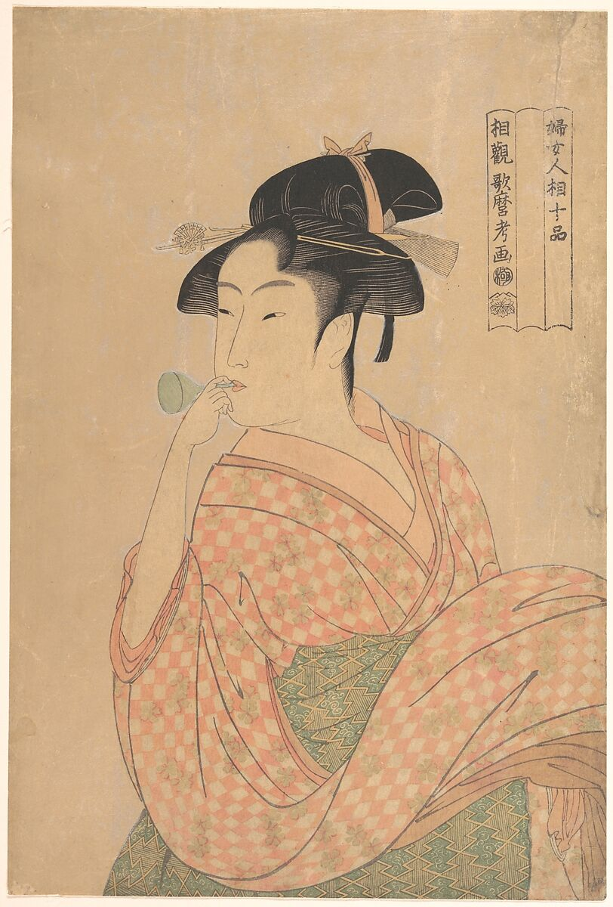
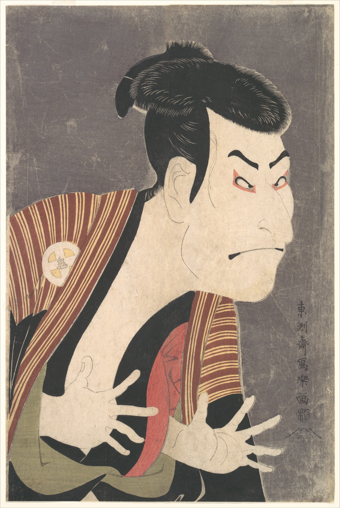
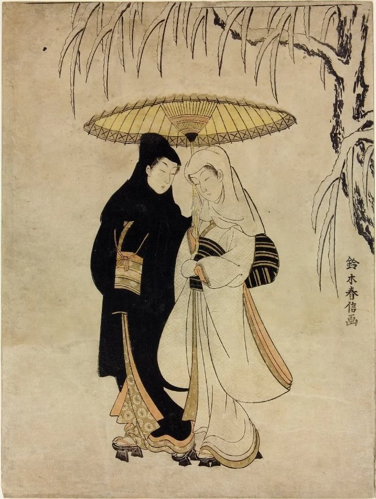
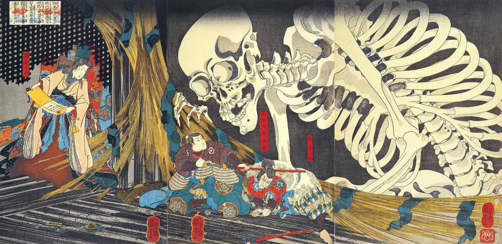

# 浮世绘

浮世绘（Ukiyo-e）本质上是日本江户时代（17-19世纪）的“大众流行文化海报”。

  

“浮世”一词源自佛教，原本指代虚无缥缈、充满苦难的尘世。但到了商业繁荣的江户时代，有钱有闲的市民阶层（町人）将其内涵彻底反转，变成了“既然人生苦短，不如及时行乐”的现世享乐主义。因此，“浮世绘”画的正是当时人们最喜闻乐见的事物：当红的歌舞伎明星（相当于电影海报）、花街柳巷的顶级花魁（相当于时尚杂志）、以及旅行打卡的名山大川（相当于旅游明信片）。

  

它绝大多数是木版画，采用流水线作业：画师起稿，雕版师刻木板，拓印师上色，出版商发行。因为成本低廉，当时老百姓买一张浮世绘的价格，大约就相当于买一碗荞麦面。

  

以下是浮世绘历史上最具代表性的10幅名作，以及它们的创作背景：

  

### 一、 顶级风景大片（名所绘）

**1. 《神奈川冲浪里》 —— 葛饰北斋**

  

- **创作时间：** 约1831年（江户时代后期）
    
      
    
- **创作背景：** 出自系列画集《富岳三十六景》。当时日本解除了部分旅行限制，平民中掀起了去各地参拜、旅游的热潮。北斋敏锐地抓住了这个商机，利用当时刚刚从西方引进、价格昂贵的化学颜料“普鲁士蓝”，创作了这幅极具视觉张力的作品。画面中鹰爪般的巨浪与远方安然不动的富士山形成了极致的动静对比，是日本在世界上最著名的视觉符号。
    
      
    

**2. 《凯风快晴》（赤富士） —— 葛饰北斋**

  

- **创作时间：** 约1831年（江户时代后期）
    
      
    
- **创作背景：** 同样出自《富岳三十六景》。北斋描绘了晚夏至初秋的早晨，在南风（凯风）吹拂下，富士山体被朝阳染成赤红色的瞬间。这种气象现象在现实中极为罕见，北斋用极其纯粹的几何线条和大胆的色块将这一刻永恒化，体现了日本人对富士山的信仰与敬畏。
    
      
    

**3. 《大桥骤雨》 —— 歌川广重**

  

- **创作时间：** 1857年
    
      
    
- **创作背景：** 出自《名所江户百景》，是广重晚年的巅峰之作。广重极度擅长捕捉天气与光影的微妙变化。这幅画记录了夏季午后江户城突降暴雨的瞬间，行人们在桥上仓皇避雨。画中用交错的直线刻画雨丝的手法极具现代感，后来深深震撼了梵高，梵高甚至用油画一比一临摹了这幅作品。
    
      
    

**4. 《龟户梅屋铺》 —— 歌川广重**

  

- **创作时间：** 1857年
    
      
    
- **创作背景：** 同属《名所江户百景》。这幅画最大的颠覆在于构图：广重将一棵粗壮的梅树枝干直接推到观众眼前，占据了画面的绝对主体，而赏花的人群全被推到了极远的背景中。这种极其大胆的“前景放大”透视法，彻底打破了西方传统风景画的平稳构图，后来直接启发了印象派和后印象派的构图革命。
    
      
    

**5. 《蒲原夜之雪》 —— 歌川广重**

  

- **创作时间：** 约1833-1834年
    
      
    
- **创作背景：** 出自《东海道五十三次》。东海道是连接江户（东京）与京都的交通大动脉。有趣的是，蒲原这个地方气候温暖，现实中极少下这样的大雪。这其实是广重为了营造凄冷、静谧的诗意氛围而进行的一种艺术虚构，将路人在雪夜跋涉的沉重感表现得淋漓尽致。
    
      
    

### 二、 江户时代的时尚与偶像（美人画/役者绘）

**6. 《当时三美人》 —— 喜多川歌麿**

  

- **创作时间：** 约1793年
    
      
    
- **创作背景：** 喜多川歌麿是浮世绘的“美人画之神”。这幅画描绘的是当时江户城里真实存在的三位“顶级流量”美女：富本丰雏、难波屋阿北和高岛屋阿久。歌麿首创了“大首绘”（特写半身像），去掉了背景的干扰，用极其细腻的线条描绘女性的肌肤、发丝以及微妙的心理活动，相当于当时的顶奢美妆海报。
    
      
    

**7. 《吹玻璃喇叭的女子》 —— 喜多川歌麿**

  

- **创作时间：** 约1792-1793年
    
      
    
- **创作背景：** 出自《妇人相学十体》系列。画中的少女身穿市井流行的市松纹（格子图案）和服，正在吹奏当时刚从海外传入的玻璃玩具“波平”。这幅画敏锐地捕捉到了江户时代商人阶层对西洋新奇事物的好奇心，以及年轻女子生动活泼的生活瞬间。
    
      
    

**8. 《三代目大谷鬼次的奴江户兵卫》 —— 东洲斋写乐**

  

- **创作时间：** 1794年
    
      
    
- **创作背景：** 写乐是艺术史上的神秘天才，横空出世工作了10个月后便彻底消失。这幅画是歌舞伎演员（役者绘）的肖像。与当时同行喜欢把演员画得唯美不同，写乐直接抓住了演员扮演反派时最狰狞、最神经质的瞬间——高高挑起的眉毛、突出的眼白、紧绷的手指。这种不讨好粉丝的“极度写实与夸张”，在当时销量惨淡，但在现代却被奉为表现主义的先驱。
    
      
    

**9. 《雪中相合伞》 —— 铃木春信**

  

- **创作时间：** 约1767年
    
      
    
- **创作背景：** 铃木春信是“锦绘”（多色套印版画）的创始人，让浮世绘从单调的红绿双色变成了全彩。画中描绘了一对年轻男女在雪中共撑一把伞的场景。“相合伞”在日本文化中是情侣的象征。画面色彩柔和，雪花的留白与黑色的伞面形成对比，充满了古典浪漫与梦幻的抒情气质。
    
      
    

### 三、 猎奇与暗黑的奇想（武者绘/妖怪画）

**10. 《相马之古内里》（泷夜叉姬与巨大骷髅） —— 歌川国芳**

  

- **创作时间：** 约1844年
    
      
    
- **创作背景：** 歌川国芳被称为“画鬼”。当时幕府推行“天保改革”，生活作风被严厉打击，浮世绘不准画奢华的艺伎和政治讽刺。国芳便另辟蹊径，开始画神话传说和妖怪。在这幅画中，他打破了传统的传说文本，将原本的一大群普通小骷髅，极具想象力地改造成了一个占据画面大半个画幅的“巨大骸骨”。这种充满压迫感和哥特风格的视觉创意，直接影响了后世日本的动漫和游戏怪物设计。