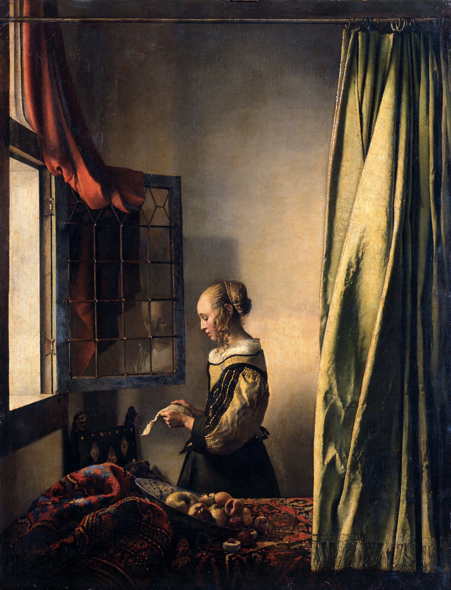
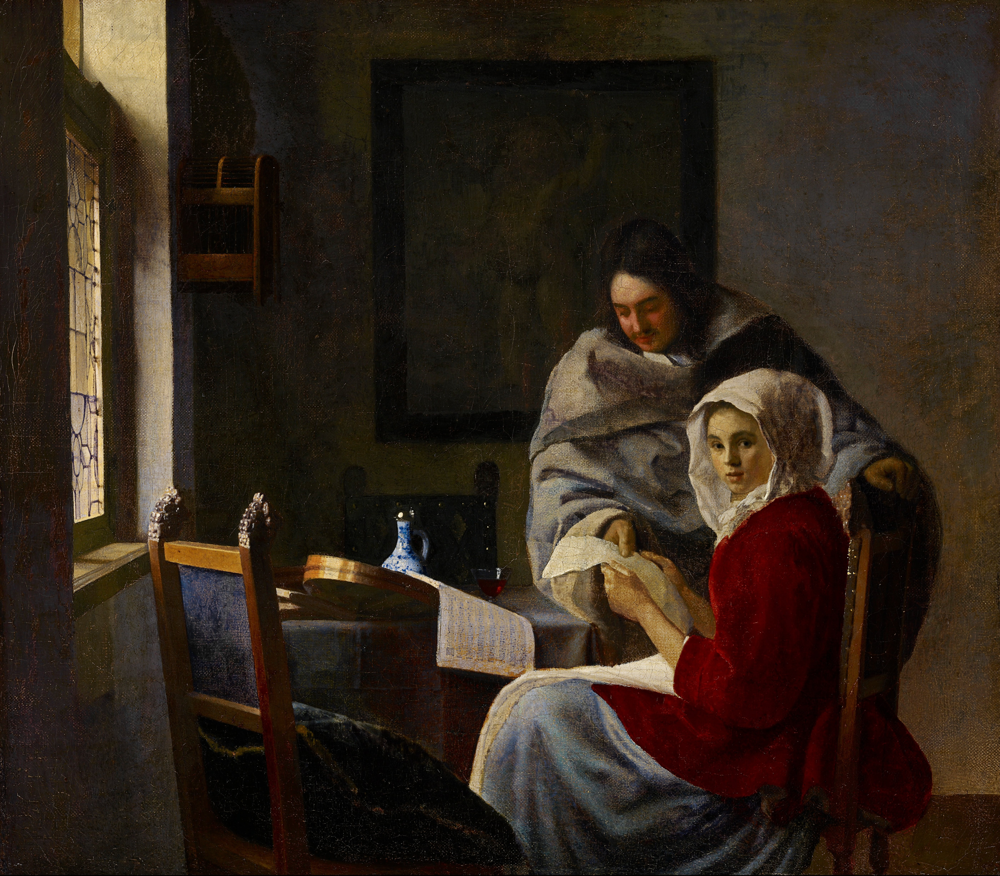
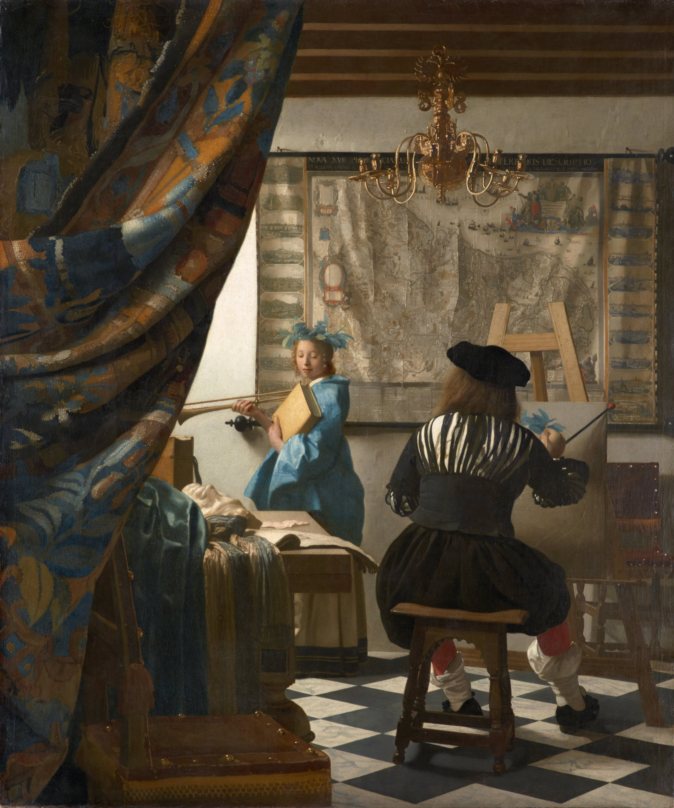
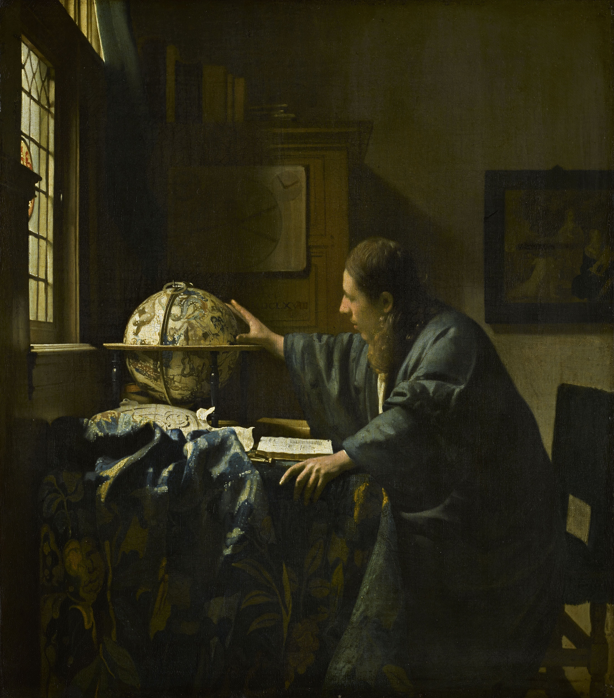
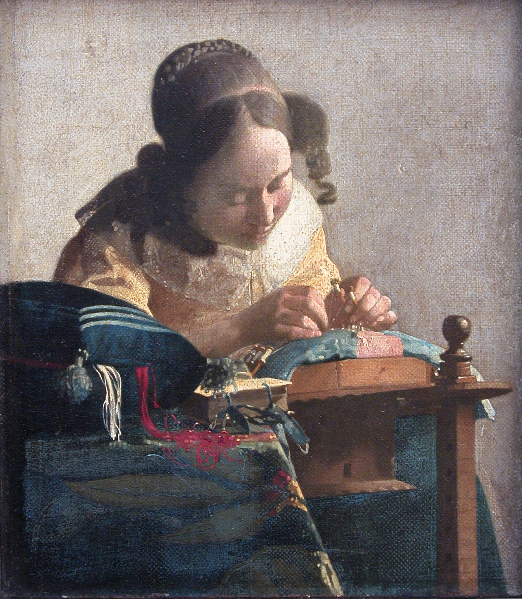

# 翰内斯·维米尔

如果你曾被莫奈笔下外光闪烁的印象派瞬间所打动，那么约翰内斯·维米尔（Johannes Vermeer）则走向了截然相反的极致——他像一位在暗室中修行的炼金术士，将荷兰市民阶层最平淡无奇的室内生活，凝固成了永恒的神圣。他的一生未曾经历惊心动魄的历史剧变，但在他那间代尔夫特的画室里，光线就是最伟大的叙事者。

下面，就让我们沿着时间轴，走进“代尔夫特斯芬克斯”的一生。

---

### 第一展厅：1650年代末——日常的诗意启蒙

17世纪的荷兰正处于黄金时代，新兴资产阶级不再需要宏大的宗教壁画，而是将目光投向了自家的客厅与厨房。维米尔早期的创作，正是从这种世俗的烟火气中提炼出了崇高感。

* **《倒牛奶的女仆》 (约1657-1658)**

步入展厅的第一幅画，描绘了荷兰家庭最基础的劳作。晨光透过左侧的窗户，洒在粗糙的面包、陶罐和女仆的围裙上。维米尔此时的心境**极度平静且充满崇敬**。他没有将劳动者画成粗鄙的素描，而是用如古典雕塑般的体量感，赋予了底层人民不可撼动的尊严与厚重。
* **《窗前读信的女孩》 (约1657-1659)**

在此作中，维米尔确立了他标志性的“左侧窗户高光”与平行构图。这不仅仅是在画一个读信的人，而是在营造一个**高度私密的情感空间**。他的创作状态克制而充满悬念，画中人波澜起伏的内心戏完全被掩藏在静谧的表象之下，留给观者无尽的画外音去想象。

### 第二展厅：1660年代初——故乡、哲思与空间的拉扯

随着技法的成熟，维米尔开始像早期电影摄影师那样，借助“暗箱”技术（Camera Obscura）来观察世界。他不仅画所见，更在画空间背后的心理隐喻。

* **《代尔夫特风景》 (约1660-1661)**

这是维米尔一生极少见的户外风景画，也是他对故乡最深情的一封情书。画面如同电影长镜头，记录了雨后初晴的代尔夫特。创作时他心中满含着**对家乡的深情眷恋**，通过近乎光学仪器般精准的观察，定格了这座城市静谧的呼吸声。
* **《持天平的女人》 (约1662-1664)**

维米尔在宁静的日常中注入了深刻的哲思。女子手持天平，而背后的墙上悬挂着《最后的审判》。这不仅是一次对光影的炫技，更是他**超然且带有警醒意味**的内心独白——在世俗的财富（珠宝）与精神的道德之间，人类应当如何寻找平衡。
* **《音乐课》 (约1662-1665)**

在17世纪，音乐常常是爱情与诱惑的隐喻。维米尔在此化身为一位**冷静、客观的旁观者**。通过画面深处镜子中的反射，以及极其严谨的透视学几何布局，他不动声色地拉扯着男女之间那种微妙、试探的心理张力。

### 第三展厅：1665-1668年——惊鸿一瞥与不朽的隐喻

这一时期，维米尔迎来了他艺术生涯的巅峰。他的笔触更加细腻，对光学的理解达到了出神入化的境地。

* **《戴珍珠耳环的少女》 (约1665)**

这并非任何人的肖像，而是一幅纯粹的面部表情习作（Tronie）。在全黑的背景中，少女回眸的惊鸿一瞥成为绝唱。维米尔在创作这幅画时，心中充满了一种**神秘、亲昵且转瞬即逝的敏锐感**，他迷恋于光线在圆润的珍珠和少女微启的湿润嘴唇上跳跃的轨迹，这是他对美的极致捕捉。
* **《绘画艺术》 (约1666-1668)**

这幅画一直被维米尔珍藏在自己的工作室里，直到去世都未曾出售。画中描绘了画家本人的背影正在描绘象征历史的缪斯女神。这是他对艺术本身的最高致敬。作画时，他怀着**作为画家的巨大自豪感**，将自己对历史、对灵感、对艺术不朽力量的深刻思考，全部倾注于这方寸画布之中。

### 第四展厅：1660年代末——星辰大海与极致微观

晚年的维米尔，视野在宏大的世界探索与极致的微观专注之间跳跃，折射出大航海时代荷兰人的精神面貌。

* **《天文学家》 (约1668) 与 《地理学家》 (约1668-1669)**

这两幅姊妹篇呼应了当时荷兰航海与科学探索的黄金时代。维米尔展现出了**对科学理性的极大好奇与赞美**。《地理学家》中手持圆规望向窗外光线的人，正是维米尔内心求知欲的共鸣——他向往着冲破狭小的画室，去探索窗外的广阔世界；而《天文学家》则展现了处于沉思边缘的学者，对浩瀚星空与未知世界的深深敬畏。
* **《花边女工》 (约1669-1670)**

历经了星辰大海的向往后，维米尔在人生晚期又回到了尺寸最小的画作上。他的创作状态**极度聚焦**，甚至像现代摄影一样，将画面前方的红白线做了失焦的模糊处理，以突出女工编织时的焦点。这是他对极致专注和手工艺最纯粹的欣赏。

---

**尾声：**
1675年，长期的战争导致荷兰经济崩溃，维米尔陷入了严重的财务危机，年仅43岁便在贫病交加中去世，留下妻子和庞大的债务。在漫长的一两个世纪里，他的名字甚至被历史遗忘。但他画作里的光，却在他去世后，永远停在了代尔夫特那个静谧的下午。