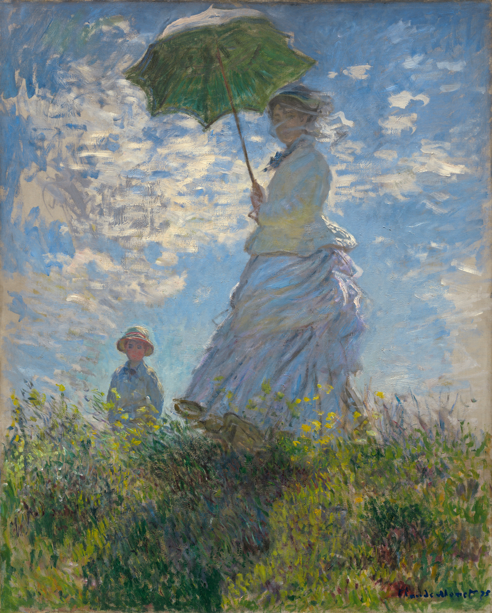
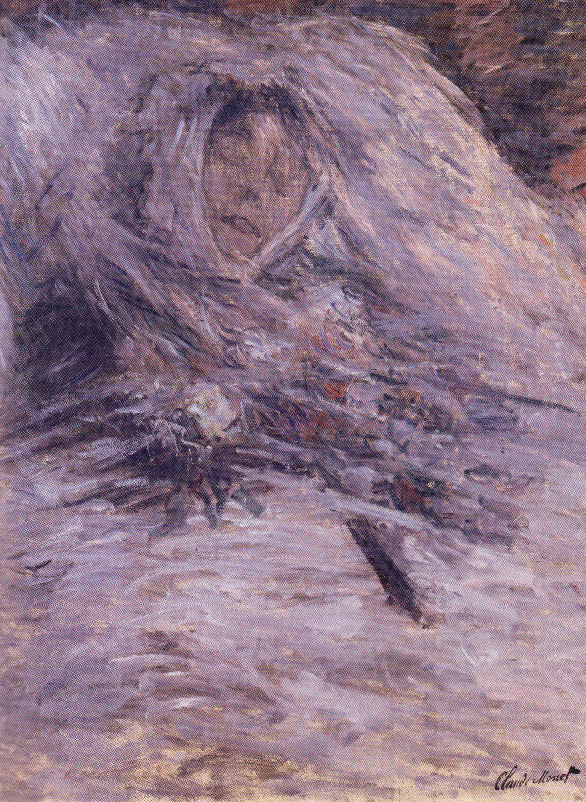

# 莫奈和卡米尔

### 一、《撑阳伞的女人》（Woman with a Parasol - Madame Monet and Her Son, 1875）

- **深度创作背景**
    
    1870年代中期是莫奈一生中难得的“黄金时代”。当时莫奈一家居住在塞纳河畔的阿让特伊（Argenteuil），这里不仅风景如画，而且得益于画商保罗·丢朗-吕厄的赞助，莫奈暂时摆脱了极度贫困。这幅画是典型的“外光派”（En plein air）作品，莫奈完全在户外完成，旨在捕捉大自然中最真实、最转瞬即逝的光线。
    
- **深层情感分析**
    
    此时的莫奈是对生活充满确幸的。画作不仅是对妻儿的爱，更是他对“当下”这种易逝美好的拼命挽留。卡米尔头纱下的面容略带朦胧，她正转头看向画外（即莫奈本人的位置），这种极具私密感的眼神交流，让画面充满了一种“你在看风景，而我在看你”的极致温柔。
    
- **绘画手法进阶解析**
    
    - **低视角与纪念碑式构图**：莫奈采用了仰视视角，这种通常用于画英雄人物的构图，被他用在了妻子身上。卡米尔的身躯挡住了部分阳光，形成了强烈的逆光效果，使她宛如一尊融合在自然光晕中的女神雕像。
        
    - **色彩的“光学混合”**：如果你放大看，画中几乎没有使用黑色的颜料（这是印象派的核心反叛）。阴影不是黑色的，而是用了大量的紫罗兰色、深蓝色和绿色。卡米尔白色的裙摆上，反射着草地的绿、天空的蓝和阳伞的黄，这种丰富的“环境色”让整个画面仿佛在呼吸。
        
    - **笔触的动静结合**：草地和云彩的笔触是狂乱且迅速的，完美再现了夏日微风的动感；而人物的躯干相对稳定，形成了一动一静的完美张力。
        

### 二、《临终的卡米尔》（Camille on Her Deathbed, 1879）

- **深度创作背景**
    
    到了1879年，莫奈一家已经搬到了偏僻的维特伊（Vétheuil）。由于资助人破产，莫奈再次陷入赤贫。卡米尔在生下第二个儿子米歇尔后，健康状况急剧恶化。这个冬天异常寒冷，在极度的贫困、疾病和绝望中，32岁的卡米尔走向了生命的终点。这幅画是莫奈在破败的房间里，借着微弱的光线完成的。
    
- **深层情感分析（画家与丈夫的心理撕裂）**
    
    这是艺术史上最残忍也最深情的告别。莫奈后来在给朋友克列孟梭的信中进行过痛苦的自我剖析：“我发现自己正下意识地看着她那悲剧性的面容，机械地观察着死亡在她脸上留下的色彩变化……蓝色的、黄色的、灰色的色调……我的本能驱使我记录下这离我而去的光。”
    
    少侠，莫奈的痛苦在于他发现自己**对光色的痴迷竟然超越了失去爱人的悲痛**。他无法控制自己作为一个画家的眼睛，这种被艺术本能裹挟的无奈与愧疚，成为了他一生的痛楚。
    
- **绘画手法进阶解析**
    
    - **走向抽象的崩溃笔触**：与《撑阳伞的女人》中用来表现风的轻快笔触不同，这里的笔触像是暴风雪一般砸在画布上。斜向的、密集的、如乱麻般的线条将卡米尔的面容完全切割、淹没。这种技法已经脱离了印象派对客观光影的记录，直接走向了后期的表现主义，甚至带有高度的抽象意味。
        
    - **死亡的色彩学**：画面中找不到一丝暖意。莫奈极其敏锐且残忍地捕捉了血液停止流动后，肉体在光线下呈现出的特有冷色。苍白的白、淤滞的紫、冰冷的灰蓝，这些颜色交织在一起，不仅是尸体的颜色，更是莫奈内心世界彻底结冰的具象化。
        

