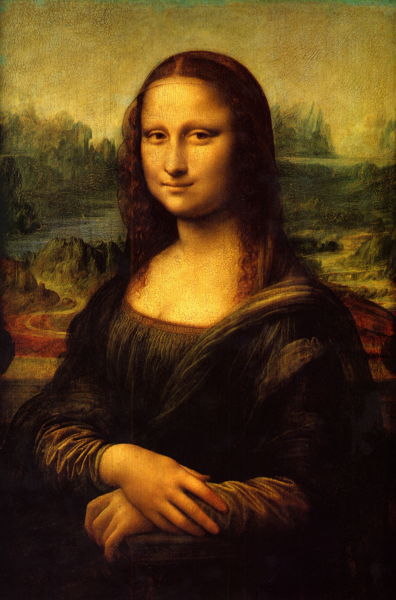
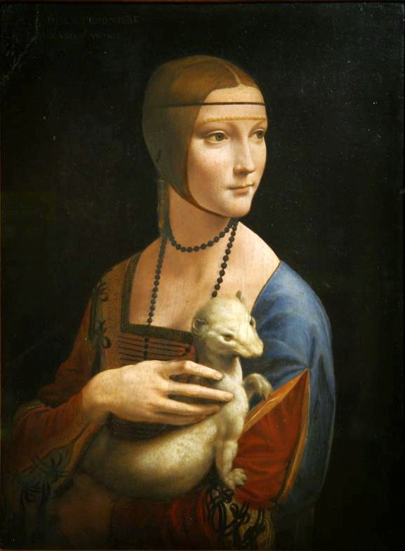
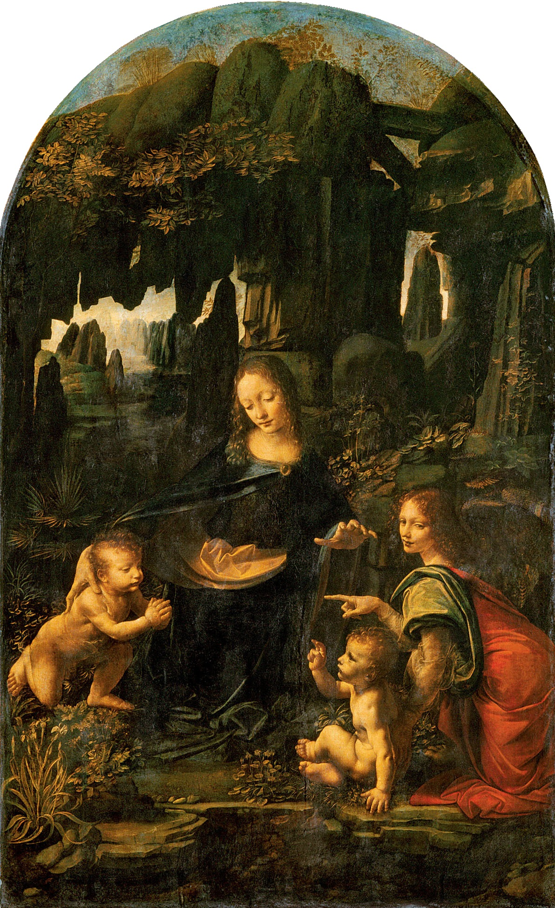

# 莱昂纳多·达·芬奇

## 导言：跨越时代的旷世天才与艺术革新

在人类浩瀚的艺术与科学史中，莱昂纳多·达·芬奇（Leonardo da Vinci, 1452–1519）的地位犹如一颗孤绝而璀璨的恒星。他不仅仅是一位文艺复兴时期的顶级画家，更是一位将解剖学、光学、植物学、流体力学与几何透视学完美熔铸于画笔之下的“全能天才”（Universal Genius）。

达芬奇之所以被历史隆重推崇，根本原因在于他颠覆了中世纪以来艺术作为“宗教图解”的附庸地位，将绘画提升至一门**“探讨自然真理的科学”**。他的艺术创新与突破主要体现在以下几个维度：
1. **晕涂法（Sfumato）**：摒弃了生硬的轮廓线，利用多达几十层的透明油彩罩染，创造出如烟雾般过渡的明暗交界线，赋予了人物呼吸般的生命力。
2. **空气透视法（Atmospheric Perspective）**：通过物理光学原理，精准再现了远景因空气介质影响而呈现的模糊感与冷蓝色调，极大地拓展了二维画面的空间纵深。
3. **明暗对照法（Chiaroscuro）**：以极具戏剧性的光影对比塑造三维体积感，为后世巴洛克艺术奠定了基石。
4. **科学实证主义的美学转化**：他笔下的人物骨骼肌肉、水流漩涡与岩层肌理，无一不是基于严苛的实地考察与解剖实验。

以下，我们将深入剖析达芬奇四幅被誉为“完美”的传世名作，探寻其隐藏在画布背后的科学密码与美学极致。

---

## 1. 永恒的神秘：《蒙娜丽莎》(Mona Lisa)

### 艺术特色与技术突破
《蒙娜丽莎》是西方艺术史上最具辨识度的肖像画，其完美程度在于达芬奇对人物心理状态的极致捕捉与画技的登峰造极。
* **构图的革命**：在当时，大多数肖像画采用死板的纯侧面构图。达芬奇首创了“四分之三侧面”及金字塔式半身构图。画中人物从椅子上微微转身，目光直接与观者交汇，这种动态的姿势打破了画面的静止感，建立起一种跨越时空的心理互动。
* **晕涂法的巅峰**：这幅画是“晕涂法”最完美的注脚。达芬奇在眼角和嘴角处没有使用任何明确的线条，而是用极薄的颜料（有些甚至不足2微米厚）层层叠加，让笑容隐匿在阴影中。正是这种视觉上的不确定性，造就了那抹“神秘的微笑”——当观者注视她的眼睛时，余光会觉得她在微笑；而当直视她的嘴唇时，笑容又似乎消散了。
* **宏观与微观的呼应**：背景中荒凉、原始的冰川与河流（宏观世界）与蒙娜丽莎宁静的面庞、起伏的衣褶（微观人体）形成了一种哲学层面上的宇宙共鸣，体现了达芬奇“人体是世界缩影”的核心理念。

---

## 2. 凝固的瞬间：《最后的晚餐》(The Last Supper)

### 艺术特色与技术突破
这幅绘制在米兰圣玛利亚感恩教堂食堂墙壁上的巨作，展现了达芬奇作为“心理戏剧大师”和“空间几何大师”的绝世才华。
* **叙事的爆发力**：区别于传统描绘圣餐仪式的平静画面，达芬奇选择了最具戏剧冲突的一瞬间——耶稣说出“你们中有一个人要出卖我”的刹那。十二门徒的震惊、愤怒、否认与恐惧，通过极其生动的肢体语言和面部表情展露无遗，宛如一幕凝固的舞台剧。
* **完美的数学与透视**：画面采用了严丝合缝的单点透视法（一尺透视）。餐厅两侧的挂毯、天花板的方格，所有的透视汇聚点（消失点）精准地落在耶稣的右太阳穴上。这不仅在视觉上构建了极强的三维空间错觉，更在精神层面上确立了耶稣作为宇宙中心的绝对地位。
* **门徒的分组与韵律**：十二门徒被巧妙地分为四个三人小组，分布在耶稣两侧。这种基于数字“3”（象征三位一体）和波浪形的人体动态组合，在混乱的情感爆发中维持了古典主义的完美平衡与韵律。
* **材料的悲剧式创新**：为了追求油画般的丰富色彩和充足的修改时间，达芬奇拒绝了传统的湿壁画技法（Fresco），而是发明了一种在干墙上使用蛋彩与油画混合颜料的新工艺。虽然这种创新导致了壁画后来的严重剥落，但其留下的斑驳光影依然拥有震撼人心的力量。

---

## 3. 灵魂的悸动：《抱银鼠的女子》(Lady with an Ermine)

### 艺术特色与技术突破
这幅描绘米兰大公情妇塞西莉亚·加莱拉尼（Cecilia Gallerani）的肖像画，被公认为西方肖像画史上的第一幅“现代”主义作品。
* **螺旋式动态（Contrapposto）**：达芬奇赋予了画面极强的生命律动。女子的身体朝向左侧，而头部和视线却突然转向右侧，仿佛画外有人刚刚唤了她的名字。这种肩膀与头部反向扭曲的“对偶姿态”，极大地增强了画面的叙事悬念与三维立体感。
* **解剖学的光辉**：画面中那只银鼠（Ermine）不仅是米兰大公卢多维科·斯福尔扎的象征（其绰号为“白银鼠”），更是达芬奇解剖学功底的展现。银鼠紧绷的前爪、骨骼的起伏与女子修长、富有力量感的手部结构相互呼应，极具写实震撼力。
* **光影如刻刀**：达芬奇利用一种类似舞台聚光灯的强烈侧光，从右上方打在女子白皙的面庞和银鼠的皮毛上，背景则被处理成深邃的暗色。这种明暗对照法（Chiaroscuro）将人物从画布中“雕刻”出来，立体感无与伦比。

---

## 4. 幽暗中的神圣：《岩间圣母》(Virgin of the Rocks - Louvre Version)

### 艺术特色与技术突破
现藏于卢浮宫的《岩间圣母》，是达芬奇在米兰时期的巅峰之作，也是他将自然科学考察与宗教神圣性结合得最为完美的画作。
* **金字塔构图的奠基**：画面的四个主要人物——圣母、圣婴（右下）、小施洗者约翰（左侧）与天使乌列尔（右侧），构成了一个极其稳定且富有内在张力的完美金字塔结构。这种构图成为了整个文艺复兴全盛期的美学标准。
* **地质学与植物学的精准再现**：作为一名自然科学家，达芬奇对背景岩洞的描绘绝非凭空想象。画中的石灰岩、砂岩的断层结构极其符合地质学规律；而前景中生长的水生植物（如鸢尾花、报春花），其叶片的脉络、生长的姿态都精确到了植物学图鉴的级别。
* **光与空气的魔术**：画中人物深处幽暗的岩洞之中，但远处的缝隙却透出冷冽的天光。这种复杂的光源环境为达芬奇施展“空气透视法”提供了绝佳的舞台。人物边缘的轮廓在微弱的反射光中柔和地消融。
* **去符号化的创新**：在这幅原始版本中，达芬奇大胆地去掉了传统宗教画中人物头顶的神圣光环（Halo）和天使的翅膀。他坚信，真正的神圣不需要外在的符号来标榜，而是通过人物完美的人性、悲悯的眼神、以及光影交错中宁静深远的气氛来自然流露。这一突破，展现了他极具独立性与前卫性的艺术思想。

---

**结语**：
达芬奇的艺术，是一场理智与感官的完美联姻。他用解剖刀去理解肌肉的律动，用几何尺去丈量空间的深度，用物理学去捕捉光线的流转。他将这些冰冷的科学规律，化作了蒙娜丽莎的微笑、圣母的悲悯与门徒的悸动。这种近乎神迹的完美，正是他在人类历史上被永远铭记、隆重推崇的原因。

