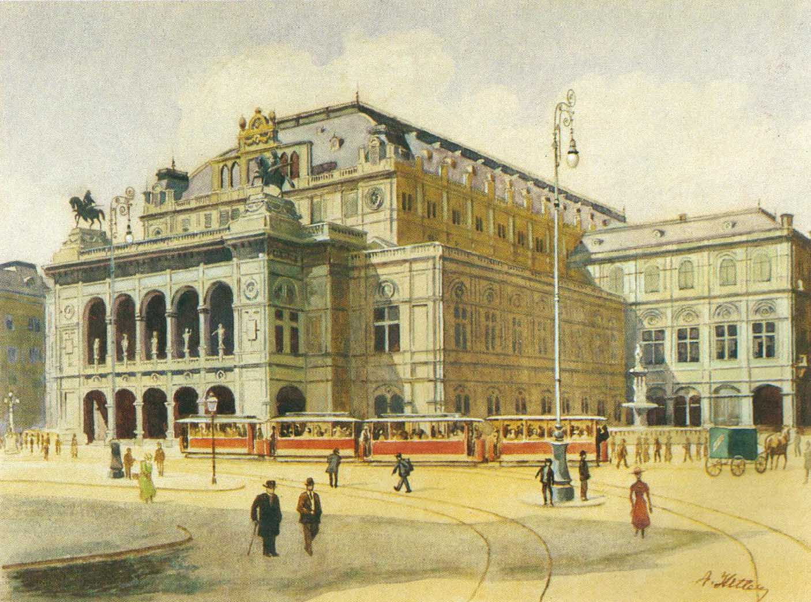
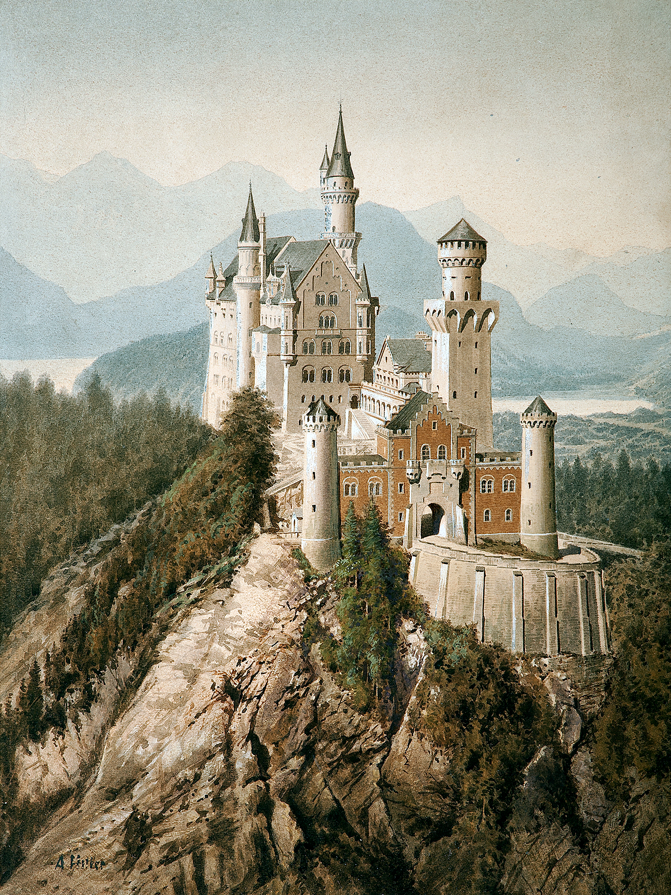
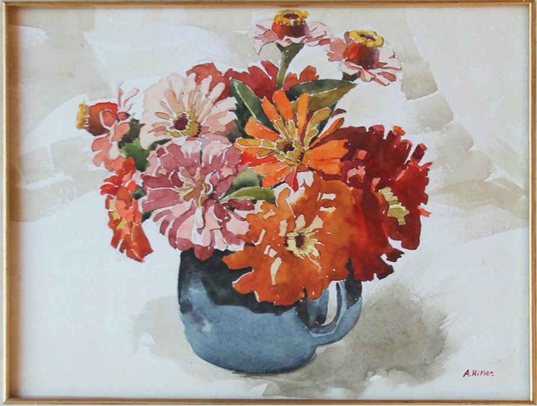
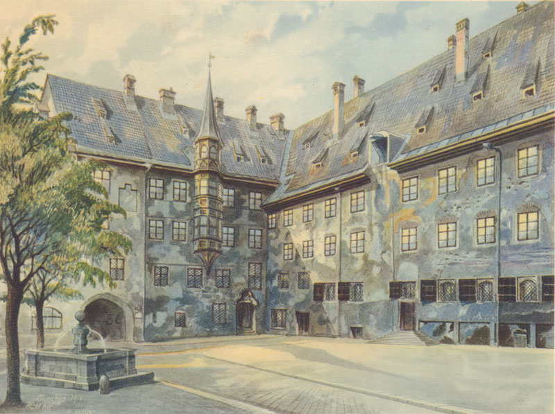

# 阿道夫·希特勒

与其他艺术家不同的是，这位是一个大恶魔，但是他确实又是一位杰出的政治家，艺术家，演说家，军事家，设计师。我想一个人都有正反两面，虽然他给世界带来了灾厄与伤害，但是我们仍可以从他的正面获取一些超越常人的不同的收获。

我们可以通过《我的奋斗》中的两个核心叙事阶段，将这四幅作品串联起来：

### 一、“维也纳的苦难与幻灭”时期（对应1910-1913年）

**串联画作：《维也纳国家歌剧院》（1912年）、《新天鹅堡》、《三色堇》**

在这三幅画创作的时期，希特勒在维也纳处于社会最底层。两次报考艺术学院落榜后，他成了流浪汉，住在平民窟和收容所里。

- **书中的叙事重构：** 在《我的奋斗》中，他将维也纳描述为“我生命中最悲哀、最艰难的时期”。他声称自己在这里不得不靠画明信片和风景画（即《维也纳国家歌剧院》、《新天鹅堡》这类迎合游客的画作）来勉强糊口。

- **作品与思想的关联：** 画着代表德意志文化辉煌的建筑（歌剧院、城堡）或静物（三色堇），现实中却忍饥挨饿。在书中，他把这种“怀才不遇”的挫败感没有归结为自己艺术才华的平庸，而是归咎于体制。他正是在这一时期，看着维也纳街头多元的民族，开始在书中大肆宣扬对马克思主义和犹太人的仇恨，将其描绘成他极端思想萌芽的温床。这几幅流水线水彩画，就是他口中“底层挣扎”的最直接产物。

### 二、“精神故乡与战争前夜”时期（对应1913-1914年）

**串联画作：《慕尼黑老城居所庭院》（1914年）**

1913年，为了逃避奥匈帝国的兵役（他极度厌恶多民族的奥匈帝国），同时也是出于对“纯正德意志文化”的向往，他搬到了德国慕尼黑，并继续靠卖画为生。

- **书中的叙事重构：** 在《我的奋斗》中，他用极其热烈的笔触赞美慕尼黑，称其为“一座真正的德国城市”，并表示自己在慕尼黑找到了归属感。《慕尼黑老城居所庭院》这幅画细腻、宁静的笔触，正是他到达慕尼黑后生活状态的一种记录。

- **命运的转折：** 这幅画创作的1914年，正是第一次世界大战爆发的年份。在《我的奋斗》中，他把1914年描述为将他从平庸、苦闷的卖画生活中拯救出来的神圣时刻。他写道，当听到开战的消息时，他“跪在地上感谢上苍”。从这一年起，他放下了水彩笔，加入了巴伐利亚步兵团，正式从一个平庸的街头画匠变成了狂热的政治和战争机器。

**总结：**

这四幅画是希特勒青年时期平庸、穷困、依靠临摹勉强谋生的真实写照；就是他书中那段充满怨恨与偏执的青年时代的注脚。

---

  <!-- 顶级播放器外框：深空毛玻璃 + 翠绿环境呼吸光 -->  
  

  

  
    

  

这场演讲是**1933年**的希特勒总理就任演说

**历史的最终答卷：** 客观评价一个政治人物的“成就”，不能只看他执政前几年的短期数据，而必须看他给这个国家和世界留下的最终遗产。

希特勒的“成就”是以牺牲上千万无辜生命为代价的。他给德国承诺的是“千年帝国”，但他执政的12年，最终导致了德国被彻底炸成废墟、国家分裂长达半个世纪、欧洲文明遭遇毁灭性打击。当所谓的基础建设和短期复苏是建立在极权、掠夺和有组织的屠杀之上，并最终以玉石俱焚收场时，历史将其定性为人类文明的灾难，这就是最客观的结论。