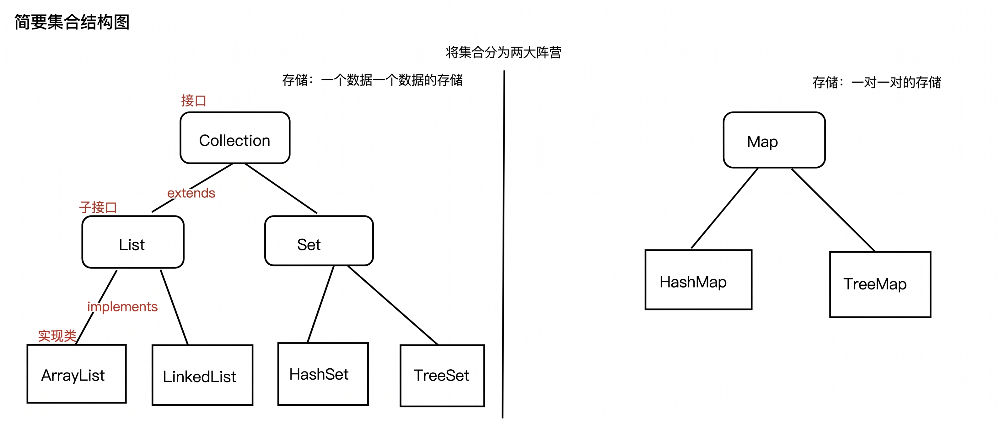

首先要明确一个概念：图里的 `Collection`、`List`、`Set` 和 `Map` 都是**接口（Interface）**。接口只是定义了“规矩”（比如能不能重复、有没有顺序），**接口本身是没有数据结构的**。

  

真正有数据结构、负责在内存里干活的，是下面那一排**实现类**。咱们分两大阵营来解析：

  

### 第一大阵营：Collection（单列集合，一个一个存）

这个阵营分为两个流派：`List` 流派（排队，允许重复）和 `Set` 流派（不排队，且绝对不重复）。

  

#### 1. ArrayList

- **底层数据结构：动态数组 (Dynamic Array)**
    
      
    
- **解析：** 它在内存中是一长条**连续**的空间。你可以把它想象成一排连续编号的储物柜。当你加数据时，它就按顺序往后放；如果柜子满了，它会重新找一块更大的连续空间（默认扩容 1.5 倍），把旧东西全搬过去。
    
      
    
- **核心特点：**
    
      
    - **查改极快** $O(1)$：直接通过索引（编号）就能算出物理地址，一步到位。
        
          
        
    - **增删极慢** $O(n)$：如果在中间插队或者删掉一个元素，它后面的所有元素都得被迫往前或往后挪动。
        
          
        

#### 2. LinkedList

- **底层数据结构：双向链表 (Doubly Linked List)**
    
      
    
- **解析：** 它在内存里是**分散**的。每一个数据单元（节点 Node）不仅存了数据，还存了“上一个数据在哪”和“下一个数据在哪”的内存地址（指针）。就像是一群人手拉手，每个人只知道左手和右手拉的是谁。
    
      
    
- **核心特点：**
    
      
    - **增删极快** $O(1)$：中间插个人，只需要把左右两边人的手松开，重新牵上新人就行，不需要别人挪位置。
        
          
        
    - **查改极慢** $O(n)$：想找第 50 个人，必须从第 1 个人开始，顺着手一个一个往下摸才能找到。
        
          
        

#### 3. HashSet

- **底层数据结构：哈希表 (Hash Table)**
    
      
    
- **解析：** 有意思的是，`HashSet` 自己其实是个“甩手掌柜”，你扒开它的源码会发现，它的底层直接**包了一个 `HashMap`**。你存进 `HashSet` 的数据，全都变成了 `HashMap` 的 Key（而 Value 则统一填了一个固定的假数据）。
    
      
    
- **核心特点：**
    
      
    - 天生**去重**、数据**无序**。
        
          
        
    - 插入和查询速度极快，时间复杂度接近 $O(1)$。
        
          
        

#### 4. TreeSet

- **底层数据结构：红黑树 (Red-Black Tree)**
    
      
    
- **解析：** 同理，`TreeSet` 的底层其实包了一个 `TreeMap`。红黑树是一种极其精妙的自平衡二叉查找树。数据存进去的时候，会自动根据大小左拐右拐地挂在树枝上（左边小、右边大）。
    
      
    
- **核心特点：**
    
      
    - 天生**自带排序**（自然排序或自定义排序）。
        
          
        
    - 时间复杂度为 $O(\log n)$，比哈希表稍慢，但赢在有序。
        
          
        

### 第二大阵营：Map（双列集合，一对一对存）

这个阵营存的都是“键值对（Key-Value）”，就像“身份证号 - 姓名”的映射关系。

  

#### 5. HashMap

- **底层数据结构：数组 + 单向链表 + 红黑树**（JDK 1.8 之后的终极形态）
    
      
    
- **解析：** 这是整个集合框架里最核心的数据结构。
    
      
    - 它的骨架是一个**数组**（像一排大水缸）。
        
          
        
    - 存数据时，通过 Hash 算法计算出 Key 应该放在哪个水缸里。
        
          
        
    - 如果两个不同的 Key 算出了同一个水缸（哈希冲突），它们就会在这个水缸里串成一串**单向链表**。
        
          
        
    - 如果某个水缸里的链表太长（节点数大于 8），且总水缸数够多（大于等于 64），这条链表就会变形成为一棵**红黑树**，防止查询速度被拖慢。
        
          
        
- **核心特点：** 结合了数组寻址快、链表增删快的优点，是日常开发中最高效的 Key-Value 存储结构。
    
      
    

#### 6. TreeMap

- **底层数据结构：红黑树 (Red-Black Tree)**
    
      
    
- **解析：** 纯纯的树状结构。它完全不在乎 Hash 冲突那一套，而是要求你存进去的 Key 必须能够“比大小”。所有的 Key-Value 节点都严格按照 Key 的大小顺序排列在树上。
    
      
    
- **核心特点：** 如果你需要一个**时刻保持按 Key 排序**的字典，用它准没错，查询时间复杂度非常稳定在 $O(\log n)$。
    
      
    

**总结一下怎么记这批数据结构：**

  

- 带 `Array` 的，底层就是连续的**数组**（寻址快、插队慢）。
    
      
    
- 带 `Linked` 的，底层就是打散的**链表**（插队快、寻址慢）。
    
      
    
- 带 `Hash` 的，底层就是**哈希表**（无序、神速、去重）。
    
      
    
- 带 `Tree` 的，底层就是**红黑树**（有序、稍慢、去重）。