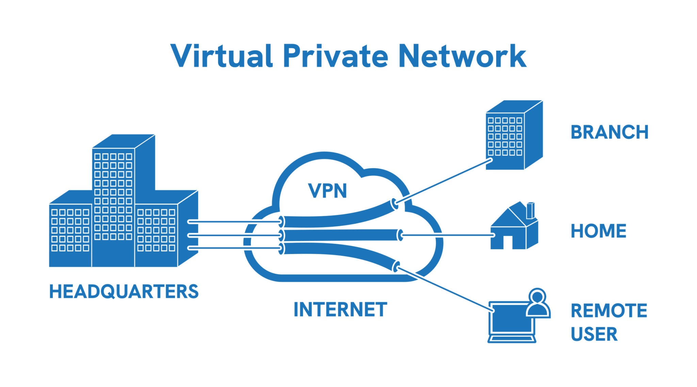

# VPN技术是什么？

## VPN 的诞生背景

VPN（Virtual Private Network，虚拟专用网络）最初并非为了普通网民“翻墙”或保护个人隐私而设计，而是源于**企业级安全需求**。

  

1996 年，微软员工 Gurdeep Singh-Pall 发明了 **PPTP（点对点隧道协议）**，这被认为是现代 VPN 技术的雏形。随着互联网的普及，跨国公司和大型企业面临一个严峻问题：如何让出差在外的员工或异地分公司，安全、低成本地访问公司内部的局域网（Intranet）？

  

如果拉物理专线，成本极其昂贵且无法满足移动办公需求；如果直接通过公共互联网传输商业机密，又极易被窃听。VPN 的诞生正是为了解决这个痛点：**在不安全的公共互联网上，建立一条加密的“虚拟”专用通道。**

  

## VPN 的三大核心功能

VPN 之所以能实现安全传输，主要依靠以下三个技术层面的功能：

  

1. **隧道技术（Tunneling）**
    
    VPN 会在你的设备和目标服务器之间建立一条逻辑上的“隧道”。你的所有网络数据包不再直接暴露在公网中，而是被额外封装在这个隧道内进行路由和传输。
    
      
    
2. **数据加密（Encryption）**
    
    进入隧道的数据会被高级加密算法（如 AES-256）打乱。即使黑客或网络运营商在传输途中拦截了这些数据，他们看到的也只是一堆毫无意义的乱码，无法解析出你的真实密码、聊天记录或业务内容。
    
      
    
3. **IP 地址伪装（IP Masking）**
    
    当你的数据通过 VPN 隧道到达 VPN 服务器后，由该服务器代替你向最终网站发起请求。因此，外界（包括你访问的网站）只能看到 VPN 服务器的 IP 地址，从而隐藏了你真实的物理位置和设备 IP。
    
      
    

## VPN 在实际应用中的作用

随着技术发展，VPN 的应用场景已经从单一的企业内网扩展到了个人隐私保护和网络自由：

  

- **企业远程办公（内网互联）：** 这是 VPN 最核心的本职工作。员工无论在家里还是咖啡厅，连接企业 VPN 后，设备就如同直接插在公司办公室的内部网络上，可以安全调取内部 OA 系统和机密文件。
    
      
    
- **保护公共 Wi-Fi 安全：** 机场、咖啡厅的免费公共 Wi-Fi 极易被黑客利用进行“中间人攻击”。VPN 的强制全局加密可以防止你的个人银行账户和密码在这些开放网络下被窃取。
    
      
    
- **突破地域限制与网络审查：** 由于 VPN 可以改变你的虚拟 IP 地理位置，它常被普通用户用来跨区观看受版权地理限制的流媒体内容（例如跨区订阅和观看 Netflix），或者突破特定国家、机构的防火墙封锁。
    
      
    
- **防止网络运营商（ISP）追踪与限速：** 宽带运营商通常能看到你的浏览历史，或对特定流量（如 P2P 下载、视频流媒体）进行降速。VPN 让运营商只能看到你连接了一个未知服务器，无法知晓你在访问什么具体内容，从而避免被针对性限速和隐私收集。