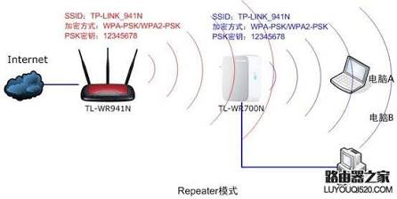

# cloudflare tunnels和Repeater Mode是一个东西吗？

它们**完全不是一个东西**。虽然都带有“连接”和“中转”的意味，但它们作用的网络层级和解决的核心问题截然不同。

  

简单来说：**中继模式是“修路”**（解决家里物理 Wi-Fi 信号到不了的问题），而 **Cloudflare Tunnels 是“开专线”**（解决外网怎么安全访问你本地局域网服务的问题）。

  

## 核心区别对比

|**维度**|**Cloudflare Tunnels (内网穿透)**|**中继模式 (Wi-Fi Repeater)**|
|---|---|---|
|**核心目的**|**打破内外网隔离**：让公网上的用户能安全访问你局域网内的服务。|**消除物理盲区**：扩大局域网内的 Wi-Fi 物理覆盖范围。|
|**工作层面**|软件与网络层（依赖互联网和 Cloudflare 的全球骨干网）。|硬件与物理层（依赖无线电波）。|
|**依赖条件**|机器本身已经连上互联网（不需要公网 IP）。|需要能接收到主路由器的 Wi-Fi 信号。|
|**典型场景**|在本地电脑开发了一个网站想发给别人看，或在外网远程管理家里的软路由/NAS。|路由器在客厅，卫生间关门后没信号，在中间插个设备放大信号。|

## Cloudflare Tunnels 到底是什么？

平时你在配置个人域名的 DNS 解析并套上 Cloudflare CDN 时，通常是指向一个有公网 IP 的服务器，或是部署在 GitHub Pages / Vercel 上的静态页面。

  

但如果你在本地电脑（比如在 WSL2 Ubuntu 环境下）跑了一套前后端分离的 Java + Vue.js 办公系统，地址是 `127.0.0.1:8080`，此时互联网上的任何人（包括不在同一局域网下的你自己）是无法直接访问这台电脑的。过去，为了实现访问，你需要去路由器里折腾“端口映射”（Port Forwarding）并打电话给运营商要公网 IP，不仅麻烦还极易遭受黑客扫描和攻击。

  

**Cloudflare Tunnels 彻底改变了这个玩法：**

  

1. 你在本地电脑上运行一个轻量级的守护进程（`cloudflared`）。
    
      
    
2. 这个进程会**主动向外**连接到 Cloudflare 的边缘节点，建立一条长连接的加密“隧道”。
    
      
    
3. 当外部用户访问你绑定的域名时，Cloudflare 会接收请求，并顺着这条早已建好的隧道，把数据“塞”回你本地机器的 `8080` 端口。
    
      
    

因为是你的电脑**主动拨号**连出去的，所以你的网络防火墙不会阻拦，你也**完全不需要公网 IP**。你的本地服务就像穿上了一层隐身衣，被极其安全、优雅地暴露到了公网上。

中继模式（Repeater Mode）主要用于**扩展现有无线网络（Wi-Fi）的信号覆盖范围**。

  

当你家里的主路由器信号无法覆盖到所有房间，或者某些角落信号极弱（存在信号盲区）时，就可以利用路由器的中继模式来解决这个问题。

  

### 它的工作原理

简单来说，工作在中继模式的路由器就像是一个“传球手”：

  

- **接收**：它放置在主路由器的信号边缘（但仍有稳定信号的地方），通过无线方式连接到主路由器的 Wi-Fi。
    
      
    
- **放大与转发**：它将接收到的信号进行放大和重新生成，然后再作为一个新的中心向周围发射出去，从而把网络“接力”到更远的地方。
    
      
    
- **统一网络**：通常情况下，中继后的 Wi-Fi 名称（SSID）和密码可以设置得与主路由器完全一致，你的设备只需连接一次。
    
      
    

下面这个视频直观地展示了无线信号是如何通过中继进行传输和扩展的：

  

生成视频概览这可能需要几分钟的时间

### 常见的应用场景

- **大户型或多层住宅**：主路由器在一楼客厅，二楼卧室信号很差。在楼梯口插一个中继器，就能让二楼的网络满血复活。
    
      
    
- **承重墙导致的死角**：洗手间或次卧因为有多道承重墙阻挡导致断流，利用中继器绕过物理障碍延伸信号。
    
      
    
- **免布线扩展**：没有预埋网线，又不想在家里拉明线影响美观，只能纯靠无线方式扩大覆盖面。
    
      
    

> **关键局限性**：由于 Wi-Fi 本质上是半双工通信（不能同时接收和发送），中继路由器在与主路由通信的同时还要与你的手机通信，这会导致中继后的**网络带宽（网速）通常会减半**，且网络延迟会有所增加。