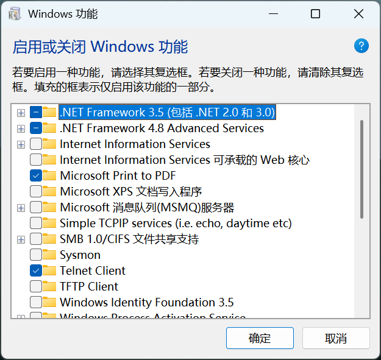

# ping 和 telnet是干什么的？


`ping` 和 `telnet` 是计算机网络中最常用、最基础的两个命令行排障工具。它们就像是网络世界里的“探路者”，但两者的探测方式和目的完全不同。

  

## Ping：网络连通性的“声纳”

**Ping**（Packet Internet Groper）主要用来测试两台计算机之间的网络**是否连通**，以及连接的延迟（网速）情况。

  

- **工作原理：** 它使用的是网络层的 ICMP（互联网控制消息协议）。当你执行 ping 命令时，你的电脑会向目标服务器发送一个小数据包（Echo Request），然后等待对方返回应答包（Echo Reply），并记录下这一来一回所消耗的时间。
    
      
    
- **通俗比喻：** 就像你在山谷里大喊一声“喂！”，然后计算听到回音需要几秒。如果有回音，说明路是通的；如果没有回音，说明网络不通（或者对方开启了防火墙，刻意“假装没听见”）。
    
      
    
- **常用场景：**
    
      
    - 测试自己能不能连上网（例如：`ping [www.baidu.com](https://www.baidu.com)`）。
        
          
        
    - 检查局域网内的某台设备是否开机在线。
        
          
        
    - 查看网络质量是否稳定（有没有丢包、延迟高不高）。
        
          
        

## Telnet：特定服务端口的“敲门砖”

**Telnet** 最早是一种用于远程登录服务器的协议，但现在开发者和运维人员主要用它来测试**目标服务器的某个特定端口是否开放**。

  

- **工作原理：** 它使用的是传输层的 TCP 协议。它会尝试与目标主机的特定网络端口建立一条 TCP 通信连接。
    
      
    
- **通俗比喻：** 如果说 `ping` 是确认“这栋大楼存不存在”，那么 `telnet` 就是走近这栋大楼，去推一推“80号房间”或“3306号房间”的门，看看门有没有锁、能不能进去。
    
      
    
- **安全现状：** 作为远程登录工具，Telnet 因为所有数据（包括密码）都是**明文传输**的，极易被黑客截获，现在已经被加密的 SSH 完全淘汰。但作为“端口测试工具”，它依然是开发排障的利器。
    
      
    
- **常用场景：**
    
      
    - 测试数据库端口是否对外开放（例如：`telnet 192.168.1.100 3306`）。
        
          
        
    - 排查防火墙是否拦截了你的网站端口或某个服务的通信流量。
        

## 核心区别对比

|**特性**|**Ping**|**Telnet**|
|---|---|---|
|**主要目的**|测试主机是否在线、网络延迟与丢包率。|测试主机的某个特定服务端口是否开放且可访问。|
|**底层协议**|ICMP（网络层协议）|TCP（传输层协议）|
|**能否指定端口**|**不能**。只能 Ping IP地址或域名。|**能**。必须指定 IP地址/域名 和 端口号。|
|**防火墙影响**|经常被服务器的安全策略（禁 Ping）拦截，导致 Ping 不通但服务可用。|只要该端口的服务正常运行且防火墙放行，就能通。|


在 Windows 11 系统中，出于安全考虑，默认是关闭 Telnet 客户端的，因此在终端直接输入会提示该错误。

你可以通过以下两种方式快速开启它：

### 方法一：图形界面开启

1. **打开 Windows 功能:** 也可以在控制面板的“程序”中找到.
按下 `Win + S` 键打开系统搜索，输入 **启用或关闭 Windows 功能** 并回车打开。


2. **勾选 Telnet 客户端:**
在弹出的功能列表中，向下滚动找到 **Telnet 客户端**（Telnet Client），将其勾选并点击“确定”。


3. **重启终端:**
等待系统自动应用更改（通常需要几秒钟）。完成后，**必须关闭并重新打开**你的 CMD 或 PowerShell 窗口，命令才会生效。





### 方法二：命令行一键开启

如果你习惯纯命令行操作，可以通过管理员权限运行指令：

1. 右键点击任务栏的 Windows 开始图标，选择 **终端 (管理员)** 或 **Windows PowerShell (管理员)**。
2. 粘贴并运行以下命令：
```powershell
dism /online /Enable-Feature /FeatureName:TelnetClient

```


```
> **测试命令：** 重新打开命令行窗口，输入 `telnet` 并回车。如果界面跳转到 `欢迎使用 Microsoft Telnet Client`，说明开启成功。输入 `quit` 即可退回普通终端。
```

