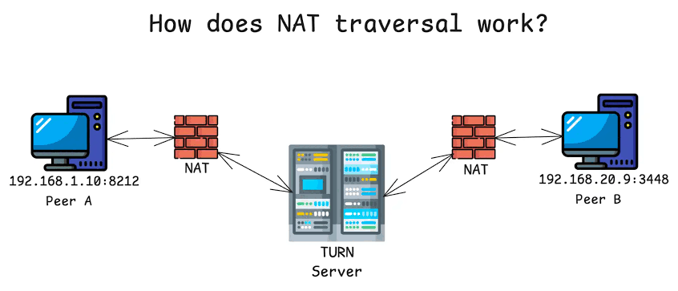

# 什么是内网穿透和反向代理？

少侠，简单来说，内网穿透（Intranet Penetration / NAT Traversal）是一种**让外网（互联网）能够直接连通内网（局域网）中特定设备或服务**的技术。内网穿透和反向代理这两者确实经常被混在一起讨论，因为**市面上最主流的内网穿透工具（比如 Frp、Ngrok），其底层核心机制就是“反向代理”**。Frp 的全称甚至就叫 Fast Reverse Proxy。但严格从计算机网络的概念来区分，它们不能画等号。简单来说：**内网穿透是一个特定的“业务目的”，而反向代理是实现这个目的的其中一种“技术手段”。**

在我们日常的网络环境中，家用设备通常只拥有一个局域网私有 IP（例如 `192.168.1.x`）。由于 IPv4 地址资源的枯竭，路由器会使用 NAT（网络地址转换）技术，让家里的所有设备共享同一个公网 IP 上网。这带来的结果是：**内网设备可以主动访问外网，但外网设备无法穿过路由器的防火墙，主动找到你的内网设备。**

  

内网穿透就是为了打破这堵“墙”而诞生的。

## 它是如何工作的？

既然外网进不来，内网穿透通常会借助一个拥有**固定公网 IP 的中转服务器**来“牵线搭桥”：

  

1. **主动建连（打洞）**：你在本地电脑上运行一个穿透客户端，它主动向公网服务器发起连接。因为是“内网主动访问外网”，路由器会放行，并在两者之间建立起一条长期的通信“隧道”。
    
      
    
2. **外部访问**：当外网用户想要访问你的本地服务时，他们实际上访问的是这台公网服务器的特定端口（或域名）。
    
      
    
3. **数据转发**：公网服务器收到外部请求后，会顺着刚才建立好的那条“隧道”，把请求原封不动地转发到你的本地电脑上。
    
      
    

## 典型应用场景

在实际开发和娱乐中，这项技术非常适合解决以下几类需求：

  

- **本地开发与联调**：如果你在本地用 Vue.js 写了一个前端界面，或者用 Java 跑了一个后端 API，需要给外部协作者演示时，可以直接用内网穿透生成一个公网 URL 映射到本地的 `localhost` 端口，无需把半成品特意部署到服务器。
    
      
    
- **游戏私服联机**：如果是和朋友联机《我的世界》或《RUST》，又不想租用昂贵的云服务器，完全可以在本地这台性能强劲的 R9000P 上开服。把游戏端口穿透出去后，朋友们就能直接输入公网地址加入游戏。
    
      
    
- **远程控制与移动办公**：出门在外时，使用 iPad 远程桌面连回本地电脑查阅文件，或者在外网直接访问本地部署的数据库进行管理。
    
      
    

## 常见的内网穿透方案

- **Frp (Fast Reverse Proxy)**：极客最爱，开源且免费。需要自己准备一台云服务器作为中转站，配置灵活，速度完全取决于你云服务器的带宽。
    
      
    
- **Ngrok / 花生壳**：老牌的开箱即用型服务商，不需要自己有服务器，下载客户端就能直接映射，适合临时对外展示一个 Web 页面。
    
      
    
- **Tailscale / ZeroTier**：严格来说属于异地虚拟局域网（SD-WAN）组网工具。它们会在你的各个设备上安装虚拟网卡，把它们拉进同一个巨大的“虚拟内网”里。采用 P2P 直连，速度极快，非常适合个人多设备的私密远程访问。
    
      
    
- **Cloudflare Tunnels**：对于习惯使用 Cloudflare 托管 DNS 的开发者来说，这是一个极佳的零成本方案。它可以把本地服务安全地挂载到你自己的域名（如 `土块.art` 或 `xn--udsye.art`）上，不仅自带 HTTPS，还能免去配置公网 IP 和防火墙的麻烦。