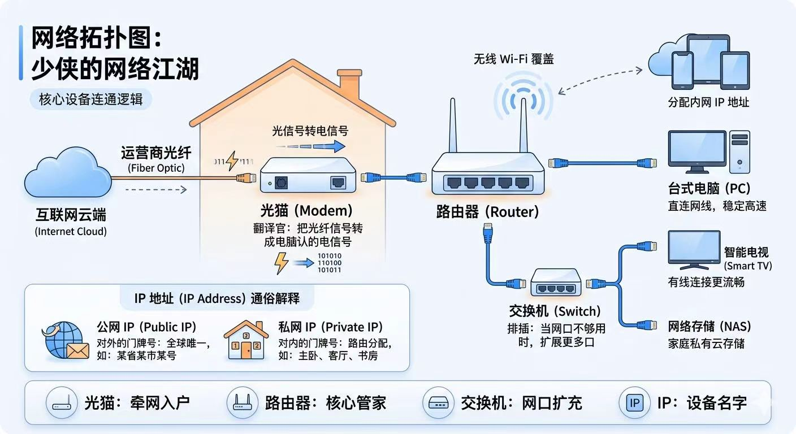

今天，我们不念枯燥的定义。我们将把整个“计算机网络”拆解开来，看一看在这个看不见、摸不着的数字世界里，千军万马的数据是如何在你敲击回车键的瞬间，跨越千山万水完成交流的。

准备好了吗？我们将从最基本的元素开始，一步步构建出庞大的互联网帝国。

### 第一章：网络的本质——一场永不停歇的“快递物流”

你可以把计算机网络直接理解为“全球最庞大、最极速的快递物流系统”。

在现实中，你要给远方的朋友寄一封信，你需要：信件内容、对方的地址、邮局、快递车和公路。

在网络中，这几样东西一一对应：

- **信件内容** = **数据（Data）**。比如你发的一条微信、看的一段视频。
    
- **对方的地址** = **IP 地址（IP Address）**。
    
- **邮局和分拨中心** = **交换机（Switch）和 路由器（Router）**。
    
- **公路** = **网线、光纤、Wi-Fi 信号**。
    

当你的电脑或手机接入网络时，它就像是在这套全球物流系统中注册了一个门牌号。网络存在的唯一目的，就是把“数据包”（信件）从一个门牌号，准确无误、以光速送到另一个门牌号。

### 第二章：核心基建——交换机与路由器

如果世界上只有两台电脑，我们拉一根网线把它们连起来，这就是最简单的网络。但全世界有几十亿台设备，怎么连？这就需要“网络集线枢纽”。

**1. 交换机（Switch）：同一个小区里的居委会大妈**

假设你的家里有电脑、手机、电视，它们都连在同一个局域网（LAN）里。交换机的作用就是在**同一个网络内部**传递数据。它记住了你家里所有设备的“物理身份证号”（MAC 地址）。

当你的手机想把照片传给电脑时，交换机看一眼照片的收件人，直接在内部完成投递，根本不需要出门。

**2. 路由器（Router）：跨省跨国的超级分拨中心**

当你想要访问远在几千公里外的服务器（比如微信的服务器）时，交换机就不管用了，因为数据需要“出省”。这时候就需要路由器。

路由器懂得阅读“IP 地址”（网络门牌号），它手里有一张极其复杂的**路由表**（全球物流地图）。当你的数据包到达路由器时，它会瞬间计算出：“哦，这个包要去北京，走哪条光缆最快？”然后把它接力抛给下一个城市的路由器，直到抵达终点。

### 第三章：沟通的语言——网络协议（TCP/IP）

网络中连接着千奇百怪的设备：有苹果手机、有 Windows 电脑、有 Linux 服务器。它们本来说着不同的“方言”，为了让大家能听懂彼此，网络世界制定了一套铁律般的“普通话”——**网络协议**。最著名的就是 **TCP/IP 协议族**。

为了方便管理，工程师们把网络通信分成了几个层级，我们挑最核心的说：

**1. IP 层（网络层）：负责定位**

IP（Internet Protocol）协议只干一件事：贴地址。每一个发出去的数据包，都会被贴上“源 IP”（我是谁）和“目标 IP”（我要去哪）。目前最常见的是 IPv4（比如 192.168.1.1），但因为全球设备太多，地址快用光了，现在正在普及更长的 IPv6。

**2. TCP 与 UDP（传输层）：负责运送方式**

有了地址，接下来怎么送？你有两种选择：

- **TCP（传输控制协议）——“靠谱的老黄牛”**：
    
    TCP 追求的是**绝对可靠**。在发送真正的数据前，TCP 会先和对方“打电话”确认。这就是著名的“三次握手”：
    
    - _你：_ “喂，你在吗？我准备给你发东西了。”（SYN）
        
    - _服务器：_ “我在的，我准备好接收了，你也准备好了吗？”（SYN-ACK）
        
    - _你：_ “我也准备好了，马上发！”（ACK）
        
        确认完毕后，数据才开始传输。如果中间丢了一个包，TCP 会要求对方重传。虽然慢一点，但绝不出错。平时我们浏览网页、发送文件，用的都是 TCP。
        
- **UDP（用户数据报协议）——“狂野的机关枪”**：
    
    UDP 完全相反，它追求的是**极致的速度**。它不握手，不确认，端起枪就是“突突突”把数据包全打出去。丢包了？不管！顺序乱了？不管！
    
    为什么会有这么莽撞的协议？因为在某些场景下，速度大于一切。比如你在玩即时对战游戏、或者看赛事直播时，稍微卡顿一下丢了几帧画面根本无所谓，但绝不能忍受几秒钟的延迟重传。这就是 UDP 的主战场。
    

### 第四章：化繁为简的魔法——DNS 与 NAT

**1. 互联网的电话本：DNS（域名系统）**

我们人类的脑子记不住 114.114.114.114 这种一连串的 IP 地址，我们只记得住 `taobao.com` 或 `bilibili.com`。

怎么把域名变成 IP 地址呢？这就要靠 **DNS 服务器**。

当你在浏览器输入网址时，你的电脑会先去问 DNS 服务器：“请问 bilibili 的 IP 是多少？”DNS 查一下电话本，告诉你：“是 123.45.67.89。”拿到这个地址，你的电脑才真正开始发送网络请求。

**2. 局域网的隐身衣：NAT（网络地址转换）**

你可能会发现，你在公司或家里的电脑，IP 地址往往都是 `192.168.x.x`。你的同事、甚至隔壁老王的电脑也是这个地址。为什么不会冲突？

因为这只是“局域网内部的分机号”！

世界上没有那么多真实的“公网 IP”分给每一个人。所以路由器使用了一种叫 **NAT** 的魔法。整个公司只有一个对外公开的“公网 IP”（总机号），公司里所有电脑（分机号）上网时，路由器会在门口把你们的“内部地址”偷偷抹掉，换成“公网地址”发出去；等数据回来时，路由器再根据之前的记录，把包裹分发给对应的内部电脑。

### 第五章：一趟完整的奇妙漂流

现在，让我们把所有知识串起来。当你在浏览器输入一个网页网址并按下回车时，在这电光火石的零点几秒内，发生了什么？

1. **查电话本：** 你的浏览器暗中向 DNS 服务器发送请求，将网址解析成一段冰冷的 IP 地址。
    
2. **准备包裹：** 浏览器按照 **HTTP/HTTPS** 协议，把你“想看网页”的请求打包成一个数据包。
    
3. **三次握手：** 你的电脑通过 **TCP** 协议，跨越千山万水，与远方的服务器完成了三次握手，建立连接。
    
4. **快递出发：** 数据包从你的网卡出发，通过家里的光猫，进入街区的**交换机**，汇入城市的**路由器**骨干网。
    
5. **光速旅行：** 数据包化作光信号，在海底光缆和地下深处的玻璃纤维中以接近光速狂奔，经过十几个路由器的接力，抵达目标服务器。
    
6. **原路返回：** 服务器收到请求后，将网页的 HTML 代码、图片拆分成千上万个小数据包，按原路轰炸回你的电脑。
    
7. **拼图重组：** 你的浏览器接住这些包，重新拼好，渲染出画面。
    

这一切，都发生在你眨眼的一瞬间。这并非魔法，而是无数条深埋地下的光缆、
无数台日夜嗡鸣的路由器，以及一套极其精妙、严密的数学协议共同构筑的现代奇迹。
这，就是网络。

