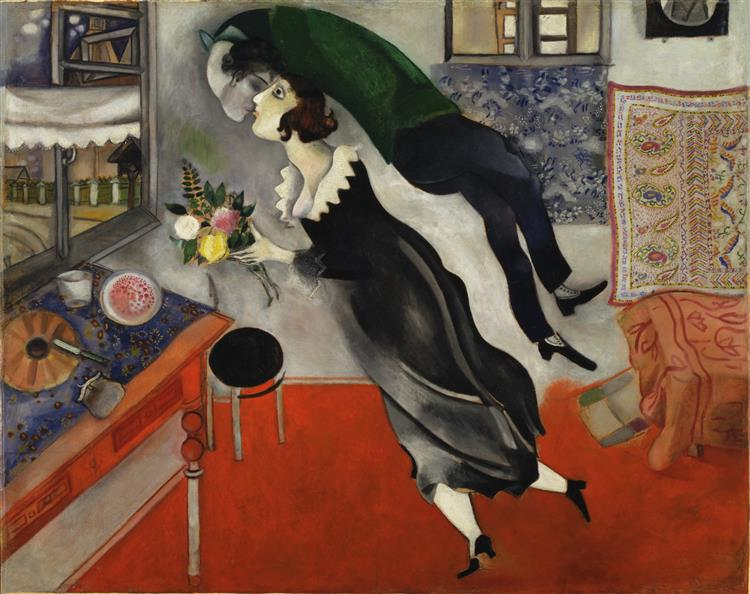
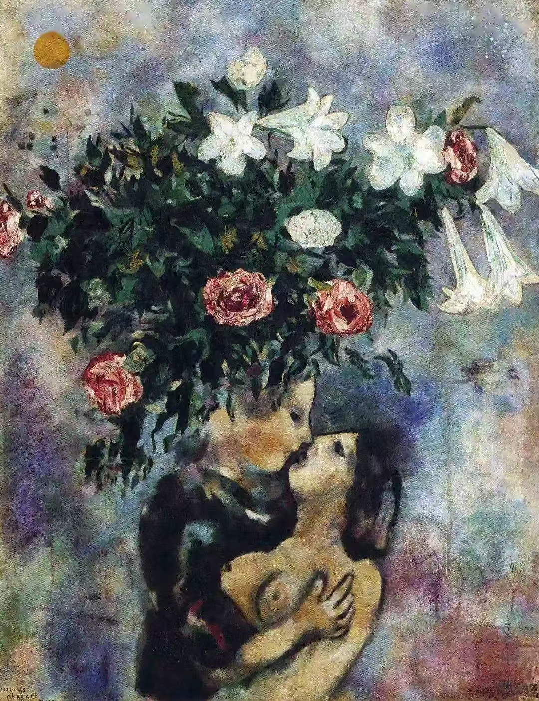
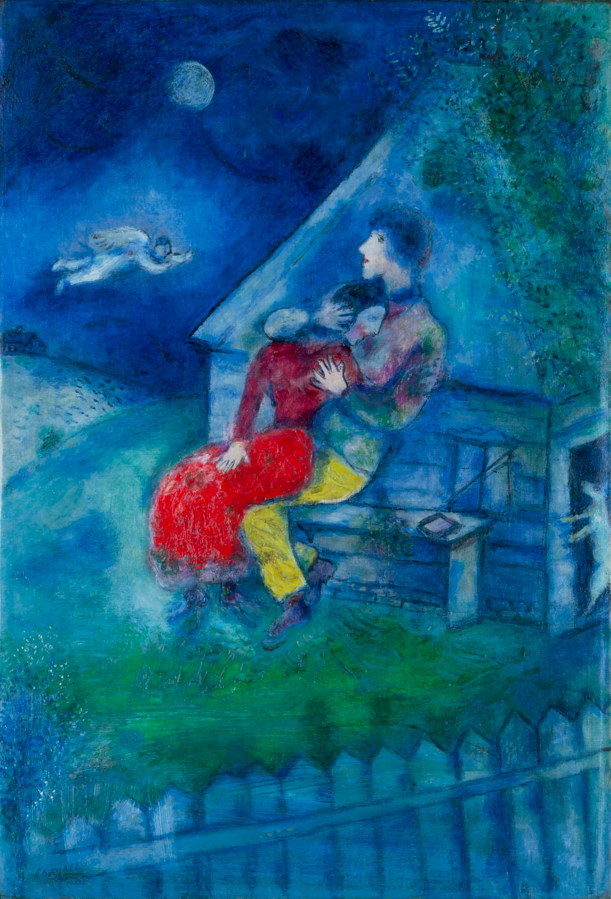
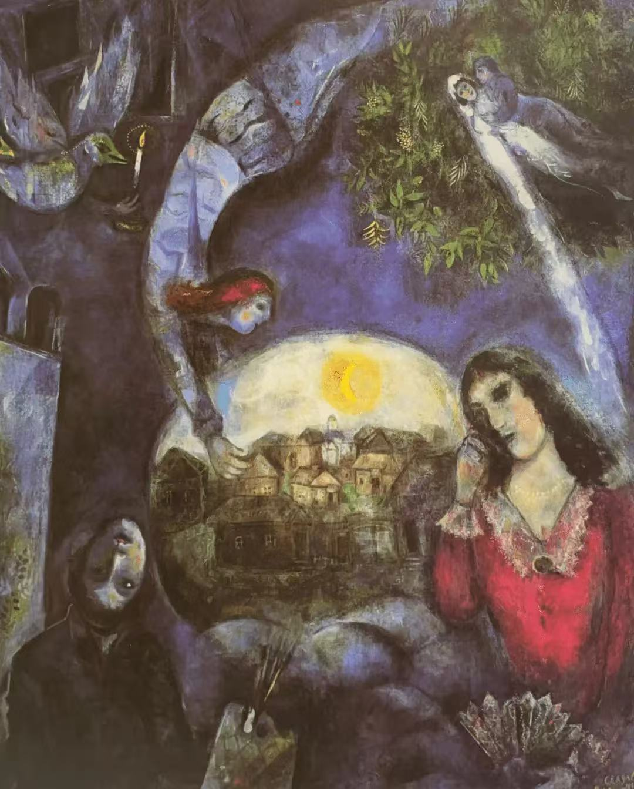
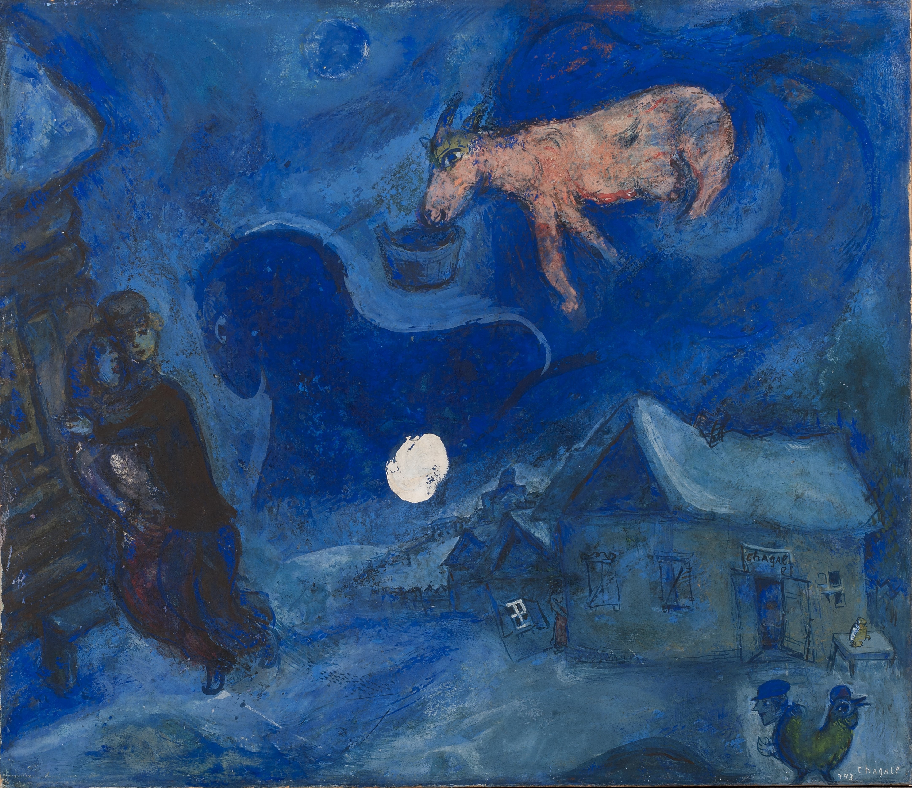
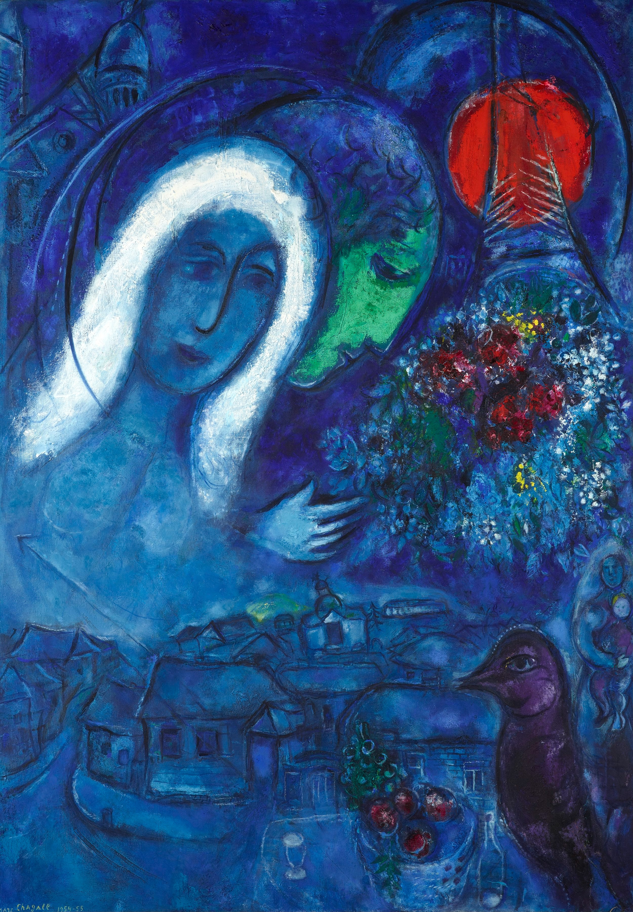
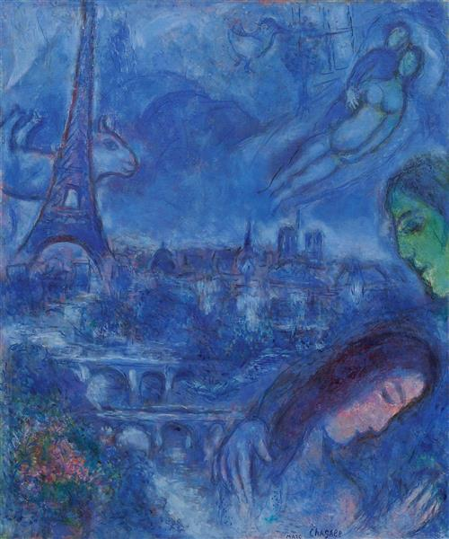
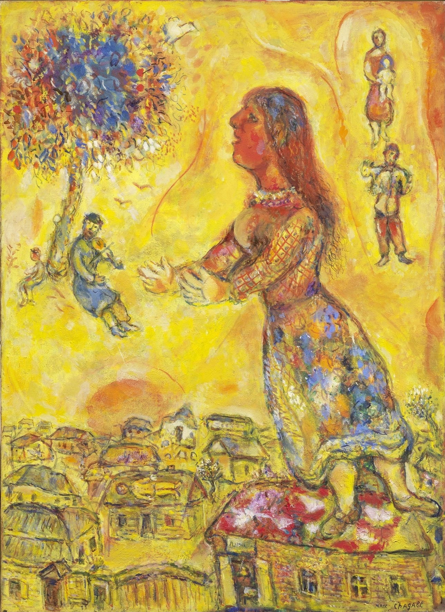

# 马克·夏加尔

马克·夏加尔的一生，是一部用色彩写就的抗争史——他用画笔抵抗地心引力，抵抗战争的残酷，抵抗死亡的剥夺。在他的世界里，**爱是唯一的原动力，而自由则是爱插上的翅膀。**

借由你提供的这八幅珍贵画作，让我们沿着时间的长河，走进夏加尔那充满梦幻、乡愁与极致浪漫的艺术人生。

### 第一章：爱情的失重与狂喜 (1915 - 1925)

早年的夏加尔，生活虽然贫困，但爱情的降临让他彻底摆脱了现实的重力。

**1. 《生日》（The Birthday）**

- **创作时间**：1915年
    
- **创作心情**：这是他与挚爱贝拉结婚前夕的作品。面对带着鲜花来庆祝他生日的贝拉，夏加尔感到了极度的狂喜与幸福，爱情让他灵魂出窍，轻盈得飞上了半空。
    
- **绘画手法**：画面带有明显的早期立体主义几何切割感。夏加尔用极其夸张的超现实物理扭曲（人物悬浮、颈部不可思议地向后弯折）来表现情感的冲动，红色的地板与黑白的人物服饰形成了极具张力的色彩对比。
    

**2. 《百合花下的恋人》（Lovers under Lilies）**

- **创作时间**：1922-1925年
    
- **创作心情**：经历了初期的动荡，夏加尔重返巴黎。此时的他沉浸在婚姻的甜蜜与温情中，生命力如同盛开的鲜花般不可阻挡。
    
- **绘画手法**：融合了原始主义与天真艺术的风格。他刻意弱化了背景的空间纵深，将巨大的百合花束夸张放大，压顶般庇护着恋人，柔和的笔触让整个画面聚焦于两人无视世俗的亲密亲吻。
    

### 第二章：蓝色的庇护与守望 (约1930年代)

随着欧洲局势逐渐紧张，夏加尔的画风开始沉淀。爱情不再仅仅是飞翔的狂喜，更成了乱世中抵御寒冷的庇护所。

**3. 《长凳上的恋人》（The Lovers on a Bench）**

- **创作时间**：约1930年
    
- **创作心情**：宁静、深沉，带有一种寻求灵魂庇护的神圣感。即使在幽冷的夜里，只要有彼此的拥抱和天使的注视，内心便是安宁的。
    
- **绘画手法**：标志性的“夏加尔蓝”开始主导画面。色彩的涂抹变得更加厚重和梦幻。他在冷冽的蓝色夜景中，大胆地使用了高饱和的鲜红色画出女子的裙摆，这抹红色成为了画中最为温暖的视觉锚点。
    

### 第三章：死亡的剥夺与记忆的封存 (1945 - 1949)

二战爆发，夏加尔被迫流亡。1944年，爱妻贝拉骤然病逝，这给了他毁灭性的打击。他的画笔一度停滞，再提起时，已满是哀思。

**4. 《在她周围》（Around Her）**

- **创作时间**：1945年
    
- **创作心情**：极度悲痛、孤独与缅怀。妻子离世后，他仿佛失去了在这个世界上的锚点，只能在记忆的碎片中寻找她的身影。
    
- **绘画手法**：采用了非线性的漩涡状构图，色调深沉压抑。他巧妙地利用了一个透明的球体（如同画中画）将故乡维捷布斯克的记忆封存起来。悲伤的画家、漂浮的新娘、倒立的飞鸟，所有意象都被打碎后重新拼凑在悲伤的夜空里。
    

**5. 《蓝色风景》（The Blue Landscape）**

- **创作时间**：1949年
    
- **创作心情**：在深沉的忧郁中带着温柔的守望，这是对逝去岁月和故土的漫长追忆。
    
- **绘画手法**：极具神秘感的大面积单色调晕染。夏加尔将具象的白雪村落与半抽象的巨大深蓝色侧脸融为一体，打破了物质与精神的界限，营造出一种时空交错的梦幻感。
    

### 第四章：心灵的治愈与时空的交响 (1952 - 1954)

战后，夏加尔回到法国定居。时间的流逝治愈了他的创伤，他的色彩再次复苏，开始在画中调和过去与现在、故乡与巴黎。

**6. 《星期日》（The Sunday）**

- **创作时间**：1952-1954年
    
- **创作心情**：心灵重获平静，充满了对过去与现在的包容与和解。
    
- **绘画手法**：经典地运用了“双面人”的隐喻——一侧蓝色的脸回望故乡维捷布斯克的木屋，一侧绿色的脸注视着巴黎的埃菲尔铁塔。他将不同的地理空间和平行的时光，像蒙太奇一样平铺在同一个二维平面上。
    

**7. 《塞纳河上的桥》（Bridges of the Seine / Blue Paris）**

- **创作时间**：1954年
    
- **创作心情**：对第二故乡巴黎的浪漫赞美，心灵再次获得了在空中自由飞翔的力量。
    
- **绘画手法**：蓝色的层次渐变极其细腻入微。意象的拼接完全抛弃了现实的逻辑：埃菲尔铁塔、漂浮的牛、飞翔的恋人交织在一起，将现实的城市风景化作了一首空灵的视觉诗歌。
    

### 第五章：生命与爱的终极礼赞 (1958 - 1960)

到了晚年，夏加尔的艺术彻底走向了超脱。他不再局限于个人的悲欢，而是将爱升华为了一种普世的、宗教般的神圣信仰。

**8. 《雅歌》（Song of Songs）**

- **创作时间**：约1958-1960年
    
- **创作心情**：绝对的狂喜、神圣感，以及对生命和爱情的终极礼赞。他彻底走出了阴霾，迎来了精神上的完全自由。
    
- **绘画手法**：画面爆发出了极其强烈的暖色调（金黄、明黄、橙红），笔触奔放而自由。人物的大小比例完全服从于情感的张力——女主角如同女神般巨大地屹立在村庄之上，沐浴在阳光与繁花之中，带有一种史诗般的壮丽感。
    

夏加尔曾说：“**如果在我的画作里，有什么东西是违背自然规律的，那不是因为我缺乏技巧，而是因为我想描绘出另一种更为真实的逻辑——爱的逻辑。**” 从他青年时的《生日》到晚年的《雅歌》，这八幅画，就是他用一生践行这句话的最好证明。