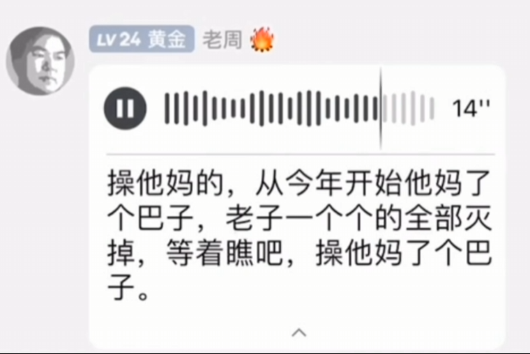

# 周哥传奇
  

<!-- 播放器容器 -->  

  

<!-- 播放器初始化脚本 -->  

不是骁龙掌机买不起，而是两百多的35XX更有性价比。

这个男人叫老周，虽然他喜欢骂人、牛脾气，但他只需略微出手，便能缔造出开源掌机传奇。

小到1.5寸的Rgnano，大到6英寸的win600掌机，在其他商家还在疯狂割韭菜的时候，周哥坚持推出自己的好尿掌机。

如果没有周哥，众多玩家至今也不会买到便宜的掌机。

对此网友感叹到：周哥确实是掌机界最富有工匠精神的人，为掌机的进步做出了巨大贡献。

美国五星上将麦克阿瑟对此做出评价：没有周哥的推动，掌机界不可能有现在的发展。当我看到周哥又推出了新机时，我就知道一切都来不及了。

